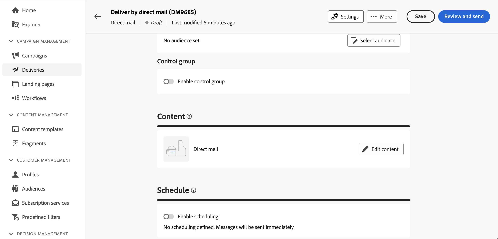

# Een levering voor direct mail maken {#create-direct-mail}

U kunt een standalone directe postlevering tot stand brengen, of een directe postlevering in de context van een campagnewerkschema tot stand brengen. In de onderstaande stappen wordt de procedure beschreven voor een zelfstandige (one-shot) direct-maillevering. Als u in de context van een campagnewerkschema werkt, zijn de aanmaakstappen gedetailleerd in [&#x200B; deze sectie &#x200B;](../workflows/activities/channels.md#create-a-delivery-in-a-campaign-workflow).

Voer de volgende stappen uit om een nieuwe, zelfstandige levering via e-mail te maken:

1. Blader naar het menu **[!UICONTROL Deliveries]** op de linkertrack en klik op de knop **[!UICONTROL Create delivery]** .

1. Kies onder de sectie **[!UICONTROL Channel]** **[!UICONTROL Direct mail]** als het kanaal en selecteer een sjabloon. [&#x200B; Leer meer over malplaatjes &#x200B;](../msg/delivery-template.md)

1. Klik op de knop **[!UICONTROL Create delivery]** ter bevestiging.

   {zoomable="yes"}

1. Voer een **[!UICONTROL Label]** in voor de levering en open de vervolgkeuzelijst **[!UICONTROL Additional options]** . Als uw levering op een uitgebreid schema gebaseerd is, zijn de specifieke **opties van de Douane** gebieden beschikbaar.

   {zoomable="yes"}

   +++Configureer de volgende instellingen op basis van uw vereisten.
   * **[!UICONTROL Internal name]**: wijs een unieke id toe aan de levering.
   * **[!UICONTROL Folder]**: Sla de levering op in een specifieke map.
   * **[!UICONTROL Delivery code]**: organiseer uw leveringen met behulp van uw eigen naamgevingsconventie.
   * **[!UICONTROL Description]**: geef een beschrijving voor de levering.
   * **[!UICONTROL Nature]**: geef de aard van de levering op voor classificatiedoeleinden.

   +++

1. Klik op de knop **[!UICONTROL Select audience]** om een bestaand publiek als doel in te stellen of uw eigen publiek te maken.

   * [Leer hoe u een bestaand publiek kunt selecteren](../audience/add-audience.md)
   * [Leer hoe u een nieuw publiek kunt maken](../audience/one-time-audience.md)

   {zoomable="yes"}

   >[!NOTE]
   >
   >Ontvangers van direct mail moeten ten minste hun naam en postadres bevatten. Een adres wordt als volledig beschouwd als de naam, het gebied van de code van ZIP/Postal, en stad/stad gebieden niet leeg zijn. Ontvangers met onvolledige adressen worden uitgesloten van directe mailleveringen.

1. Schakel de optie **[!UICONTROL Enable control group]** in om een besturingsgroep in te stellen om de impact van de levering te meten. De berichten worden niet verzonden naar die controlegroep, zodat kunt u het gedrag van de bevolking vergelijken die het bericht met het gedrag van contacten ontving die niet. [&#x200B; leer hoe te met controlegroepen &#x200B;](../audience/control-group.md) werken

1. Klik op **[!UICONTROL Edit content]** om de informatie (kolommen) te definiëren die naar het extractiebestand moet worden geëxporteerd. [Meer informatie](content-direct-mail.md)

   {zoomable="yes"} tonen

1. Schakel de optie **[!UICONTROL Enable scheduling]** in om de levering naar een bepaalde datum en tijd te plannen. Nadat u de levering hebt gestart, wordt het extractiebestand automatisch gegenereerd op de exacte datum en tijd die u definieert. [&#x200B; Leer hoe te om leveringen &#x200B;](../msg/gs-deliveries.md#gs-schedule) te plannen.

   >[!NOTE]
   >
   >Wanneer een levering in de context van een werkschema wordt verzonden, moet u de **Planner** activiteit gebruiken. Leer meer over [&#x200B; deze pagina &#x200B;](../workflows/activities/scheduler.md).

1. Klik op **[!UICONTROL Settings]** voor toegang tot geavanceerde opties met betrekking tot de leveringssjabloon. [Meer informatie](../advanced-settings/delivery-settings.md)

   {zoomable="yes"}

1. Zodra u klaar bent met direct mail, klikt u op de knop **[!UICONTROL Review and send]** om de levering te valideren en te verzenden en het extractiebestand te genereren. [&#x200B; leer hoe te om een directe postlevering te voorproef en te verzenden &#x200B;](send-direct-mail.md)