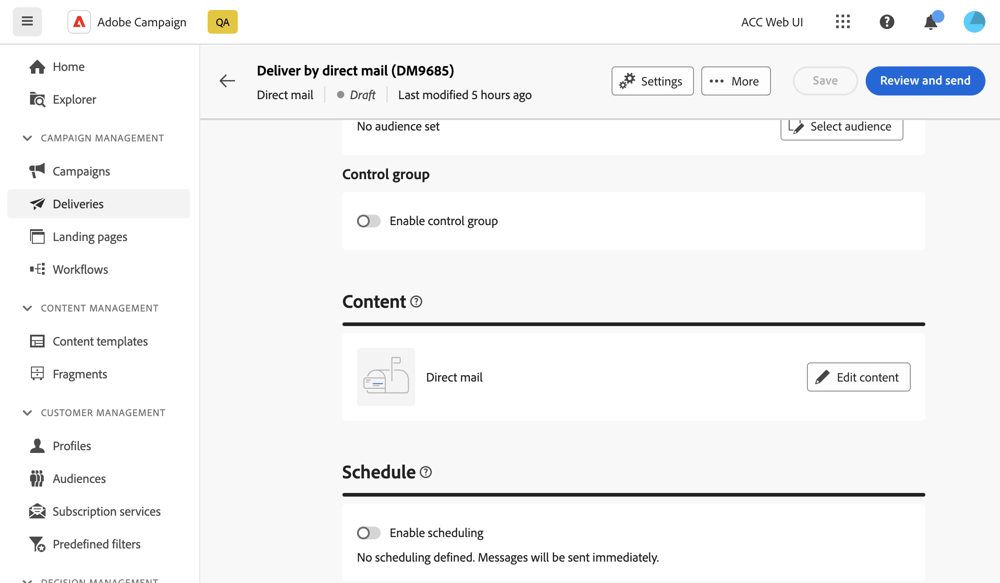

# Een voorbeeld bekijken en een direct mailbericht verzenden {#send-direct-mail}

Nadat u het extractiebestand hebt geconfigureerd voor directe verzending via e-mail, kunt u testprofielen gebruiken om een voorvertoning van het bestand weer te geven. Als u gepersonaliseerde inhoud hebt opgenomen, kunt u onderzoeken hoe deze inhoud in de kolommen wordt getoond door de gegevens van het testprofiel te gebruiken. Op deze manier kunt u ervoor zorgen dat de bestandsinhoud correct wordt gerenderd en dat de gepersonaliseerde elementen op de juiste wijze worden opgenomen.

Wanneer het extractiebestand gereed is, kunt u de directe-maillevering verzenden om het bestand te genereren en het te delen met uw directe-mailprovider. [Meer informatie over het verzenden van direct mail](#dm-send)

## Een voorbeeld van het extractiebestand bekijken {#preview-dm}

De belangrijkste stappen voor een voorvertoning van het extractiebestand zijn als volgt. Meer informatie over het bekijken van voorvertoningen vindt u in [deze sectie](../preview-test/preview-content.md).

1. Vanaf de pagina met inhoud voor levering gebruiken **[!UICONTROL Simulate content]** om een voorvertoning van uw persoonlijke inhoud weer te geven.

   {zoomable=&quot;yes&quot;}

1. Klikken **[!UICONTROL Add test profile(s)]** om een of meerdere profielen te selecteren om een voorvertoning van de gegevens weer te geven in de inhoud van het extractiebestand.

1. In het rechterdeelvenster vindt u een voorvertoning van het extractiebestand, waarin gepersonaliseerde elementen dynamisch worden vervangen door gegevens uit het geselecteerde profiel.

   {zoomable=&quot;yes&quot;}

## Proefdrukken verzenden {#test-dm}

Gebruiken **Adobe Campaign**, kunt u proefdrukken verzenden voordat u deze naar het grote publiek stuurt. Deze stap is belangrijk voor het valideren van uw levering en het identificeren van eventuele problemen. De ontvangers van de test kunnen elementen zoals verpersoonlijkingsmontages herzien, die optimale prestaties verzekeren en om het even welke fouten ontdekken. Met dit proces kunt u het extractiebestand verfijnen en optimaliseren voordat u het grote publiek bereikt.

Voor direct-mailleveringen wordt bij het verzenden van proefdrukken een voorbeeld van het extractiebestand gegenereerd op basis van gegevens uit de geselecteerde testprofielen. Ga als volgt te werk om het bestand te openen:

1. Klik in het scherm Inhoud simuleren op de knop **[!UICONTROL Send proof]** en volgt dezelfde stappen als voor elk type levering om een bewijs te verzenden. [Meer informatie over het verzenden van proefdrukken](../preview-test/test-deliveries.md)

1. Zodra de proef is verzonden, kunt u tot het van **[!UICONTROL View proofs]** of uit de lijst met leveringen. [Meer informatie over toegang tot verzonden proefdrukken](../preview-test/test-deliveries.md#access-test-deliveries)

1. Klik in het dashboard voor de proefaflevering op de knop **[!UICONTROL Preview file]** om een voorvertoning van het extractiebestand te openen.

   {zoomable=&quot;yes&quot;}

   >[!NOTE]
   >
   >Alleen de eerste 100 regels worden weergegeven in het voorvertoningsbestand.

## Verzend uw direct-maillevering {#send-dm}

Zodra u direct-mail klaar is om naar uw klanten te worden verzonden, kunt u de levering verzenden om de gegevensextractie in het gespecificeerde extractiedossier te beginnen. Ga als volgt te werk om dit te doen:

1. Nadat u de inhoud van het extractiebestand hebt ontworpen, klikt u op **[!UICONTROL Review & send]** van uw **[!UICONTROL Delivery]** pagina.

   {zoomable=&quot;yes&quot;}

1. Klikken **[!UICONTROL Prepare]** en toezicht te houden op de geboekte vooruitgang en de verstrekte statistieken.

   Als er fouten optreden, raadpleegt u de **[!UICONTROL Logs]** voor gedetailleerde informatie over de fout.

   {zoomable=&quot;yes&quot;}

1. Verzend de berichten door op te klikken **[!UICONTROL Send]** om door te gaan met het definitieve verzendingsproces.

1. Bevestig de verzendactie door op de knop **[!UICONTROL Send]**.

   Als de directe postlevering gepland is, klik **[!UICONTROL Send as scheduled]** knop. Meer informatie over de planning van de levering in [deze sectie](../msg/gs-messages.md#schedule-the-delivery-sending).

Nadat de levering is verzonden, wordt het extractiebestand automatisch gegenereerd en geëxporteerd naar de locatie die is opgegeven in het dialoogvenster **[!UICONTROL Routing]** externe rekening geselecteerd in de leveringstemplate [geavanceerde instellingen](../advanced-settings/delivery-settings.md).

U kunt uw KPIs (Zeer belangrijke Indicator van Prestaties) gegevens van uw leveringspagina en gegevens van volgen **[!UICONTROL Logs]** -menu.

U kunt ook beginnen de impact van uw bericht te meten met ingebouwde rapporten. [Meer informatie](../reporting/direct-mail.md)