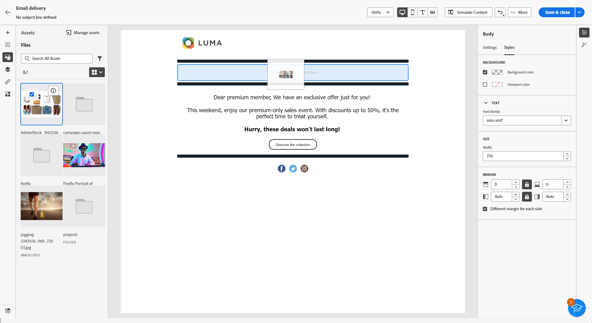

# Elementen beheren met [!DNL Adobe Experience Manager Assets as a Cloud Service]{#aem-assets}

## Aan de slag met [!DNL Adobe Experience Manager Assets as a Cloud Service] {#get-started-assets-essentials}

[!DNL Adobe Experience Manager Assets as a Cloud Service] is een geïntegreerd, op samenwerking gericht platform dat is ontworpen om uw creatieve workflow te stroomlijnen en digitale middelen te centraliseren voor een naadloze beleving. Het vereenvoudigt de organisatie, het etiketteren, en het terugwinnen van goedgekeurde productiemiddelen, die merkconsistentie tussen teams verzekeren. Met zijn gebruikersvriendelijke interface, [!DNL Assets as Cloud Service] kunt u direct toegang krijgen tot middelen en deze delen binnen uw Adobe Creative Cloud- en Experience Cloud-toepassingen.

Meer informatie in [as a Cloud Service Adobe Experience Manager Assets-documentatie](https://experienceleague.adobe.com/docs/experience-manager-cloud-service/content/assets/home.html){target="_blank"}.

## Elementen uploaden en invoegen{#add-asset}

Bestanden importeren naar [!DNL Assets as Cloud Service], moet u eerst bladeren of de omslag creëren het zal worden opgeslagen in. U kunt deze vervolgens invoegen in uw e-mailinhoud.

Voor meer informatie over het uploaden van elementen raadpleegt u [as a Cloud Service Adobe Experience Manager Assets-documentatie](https://experienceleague.adobe.com/docs/experience-manager-cloud-service/content/assets/assets-view/add-delete-assets-view.html){target="_blank"}.

1. Open vanaf uw startpagina het geavanceerde menu en selecteer [!DNL Experience Manager Assets].

   

1. Onder **Elementbeheer**, klikt u op **Activa** en kiest u de opslagplaats voor uw middelen in Adobe Campaign.

1. Klik op een map in de centrale sectie of in de structuurweergave om deze te openen.

   U kunt ook op **[!UICONTROL Create folder]** om een nieuwe map te maken.

1. Klik eenmaal in de geselecteerde of gemaakte map op **[!UICONTROL Add Assets]** om nieuwe middelen naar uw omslag te uploaden.

   

1. Van de **[!UICONTROL Upload files]**, klikt u op **[!UICONTROL Browse]** en kies als u wilt **[!UICONTROL Browse files]** of **[!UICONTROL Browse folders]**.

1. Selecteer het bestand dat u wilt uploaden. Klik op **[!UICONTROL Upload]** als u klaar bent.

   

1. Selecteer het element dat u net hebt geüpload om het menu voor geavanceerd middelenbeheer te openen.

   Raadpleeg deze voor meer informatie over het beheren van uw elementen [page](https://experienceleague.adobe.com/docs/experience-manager-cloud-service/content/assets/assets-view/manage-organize-assets-view.html).

   

1. Dubbelklik op de elementen om uw elementen verder te bewerken met Adobe Photoshop Express. Selecteer vervolgens in het rechtermenu de optie **[!UICONTROL Edit mode]** pictogram. [Meer informatie](https://experienceleague.adobe.com/docs/experience-manager-cloud-service/content/assets/assets-view/edit-images-assets-view.html#edit-using-express){target="_blank"}.

1. Van [!DNL Adobe Campaign], selecteert u de **[!UICONTROL Asset picker]** in het linkerdeelvenster van de e-mailontwerper.

   

1. Selecteer uw eerder gemaakte **[!UICONTROL Assets]** map. U kunt ook op de zoekbalk zoeken naar uw middelen of map.

   Klik indien nodig op  **[!UICONTROL Manage assets]** om rechtstreeks toegang te krijgen tot uw [!DNL Adobe Experience Manager Assets] werkruimte.

1. Sleep uw middel naar uw e-mailinhoud en zet het neer.

   

1. U kunt uw elementen verder aanpassen, zoals het toevoegen van een externe koppeling of een tekst met de opdracht **[!UICONTROL Settings]** en **[!UICONTROL Styles]** tabs. [Meer informatie over componentinstellingen](../email/content-components.md)

   
