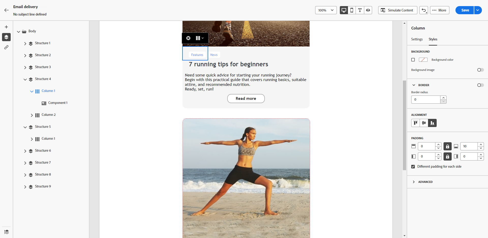

# Verticale uitlijning en opvulling aanpassen {#alignment-and-padding}

In dit voorbeeld past u opvulling en verticale uitlijning aan binnen een structuurcomponent die uit drie kolommen bestaat.

1. Selecteer de structuurcomponent rechtstreeks in de e-mail of gebruik de **[!UICONTROL Navigation tree]** -component die beschikbaar is in het linkerdeelvenster.

   {zoomable="yes"}

1. Klik op de contextafhankelijke werkbalk op **[!UICONTROL Select a column]** en kies de kolom die u wilt bewerken. U kunt het ook selecteren in de boomstructuur aan de linkerkant.

   {zoomable="yes"}

1. De bewerkbare parameters voor de geselecteerde kolom worden weergegeven op het tabblad **[!UICONTROL Styles]** . Pas de **[!UICONTROL Alignment]** aan met behulp van de toegewezen sectie.

   {zoomable="yes"}

   Selecteer bijvoorbeeld **[!UICONTROL Bottom]** . De inhoudscomponent wordt naar de onderkant van de kolom verplaatst.

1. Definieer onder **[!UICONTROL Padding]** de opvulling boven in de kolom en stel de opvulling links en rechts in voor die kolom.

   >[!NOTE]
   >
   >Klik op het vergrendelingspictogram om de synchronisatie tussen de boven- en onderkant of tussen de opvulling aan de linker- en rechterkant te verbreken.

   {zoomable="yes"}

1. Pas de uitlijning en opvulling voor de andere kolommen op dezelfde manier aan.

1. Sla de wijzigingen op.