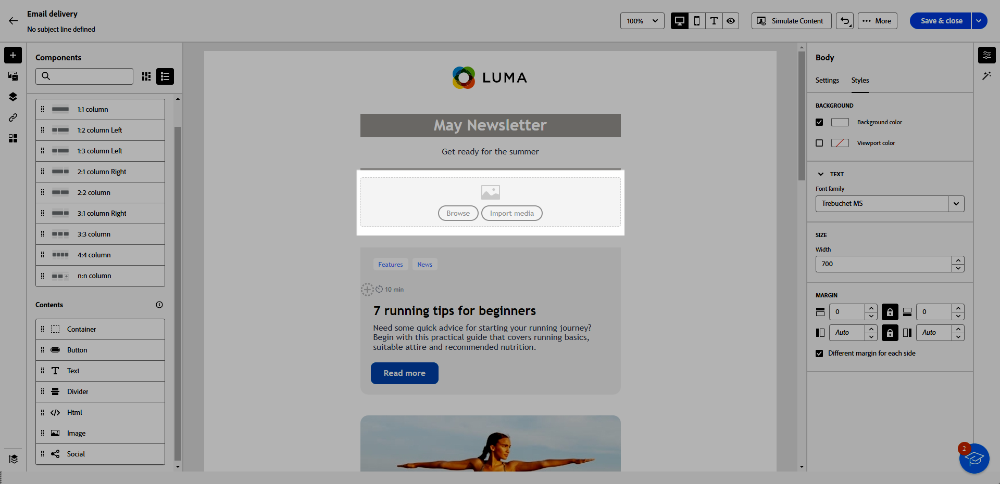

# Inhoudscomponenten gebruiken {#content-components}

>[!CONTEXTUALHELP]
>id="ac_content_components_email"
>title="Informatie over inhoud"
>abstract="Inhoudscomponenten zijn lege plaatsaanduidingen voor inhoud die u kunt gebruiken om de lay-out van een e-mail te maken."

>[!CONTEXTUALHELP]
>id="ac_content_components_landing_page"
>title="Informatie over inhoud"
>abstract="Inhoudscomponenten zijn lege plaatsaanduidingen voor inhoud die u kunt gebruiken om de lay-out van een bestemmingspagina te maken."

>[!CONTEXTUALHELP]
>id="ac_content_components_fragment"
>title="Informatie over inhoud"
>abstract="Inhoudscomponenten zijn lege plaatsaanduidingen voor inhoud die u kunt gebruiken om de lay-out van een inhoudsfragment te maken."

>[!CONTEXTUALHELP]
>id="ac_content_components_template"
>title="Informatie over inhoud"
>abstract="Inhoudscomponenten zijn lege plaatsaanduidingen voor inhoud die u kunt gebruiken om de lay-out van een sjabloon te maken."

Wanneer u uw e-mailinhoud maakt, kunt u met **[!UICONTROL Content]** -componenten uw e-mail personaliseren met onbewerkte, lege componenten die u kunt gebruiken als u eenmaal in een e-mail hebt geplaatst.

U kunt zo veel **[!UICONTROL Contents]** toevoegen als nodig is in een **[!UICONTROL Structure]** , die de indeling van uw e-mail definieert.

## Inhoud toevoegen, componenten {#add-content-components}

Voer de onderstaande stappen uit om inhoudcomponenten aan uw e-mail toe te voegen en deze aan uw wensen aan te passen.

1. In E-mail Designer, gebruik [ bestaande inhoud ](existing-content.md) of sleep en laat vallen a **[!UICONTROL Structure]** in uw lege inhoud om de lay-out van uw e-mail te bepalen. [ leer hoe ](create-email-content.md)

1. Sleep de **[!UICONTROL Content]** van uw keuze naar de desbetreffende structuren.

   {zoomable="yes"}

   >[!NOTE]
   >
   >U kunt meerdere componenten toevoegen aan één structuur en aan elke kolom van een structuur.

1. Pas de opties voor elke component aan met het contextafhankelijke tabblad **[!UICONTROL Settings]** . Kies bijvoorbeeld of u de presentatie alleen wilt weergeven op het bureaublad of op mobiele apparaten of op beide. U kunt koppelingsopties ook beheren vanuit dit tabblad. [ leer meer over het beheren van verbindingen ](message-tracking.md)

1. Pas de opmaakkenmerken voor elke component aan met het tabblad **[!UICONTROL Style]** . Wijzig bijvoorbeeld de tekststijl, opvulling of marge van elke component. [ leer meer over groepering en het opvullen ](alignment-and-padding.md)

   {zoomable="yes"}

1. Verwijder of dupliceer een inhoudscomponent in het geavanceerde menu van de **[!UICONTROL Content]** -component in het rechterdeelvenster.

## Container {#container}

U kunt een eenvoudige container toevoegen waarin u een andere inhoudscomponent toevoegt. Op deze manier kunt u specifieke opmaak toepassen op de container, die anders is dan de component die binnen wordt gebruikt.

Bijvoorbeeld, voeg een **[!UICONTROL Container]** component toe en voeg dan a [ Button ](#button) component binnen die container toe. Gebruik een specifieke achtergrond voor de container en een andere voor de knop.

{zoomable="yes"}

## Knop {#buttons}

Gebruik de component **[!UICONTROL Button]** om een of meerdere knoppen in te voegen in uw e-mail en uw e-mailpubliek om te leiden naar een andere pagina.

1. Sleep de component **[!UICONTROL Button]** vanuit de lijst **[!UICONTROL Contents]** naar een component **[!UICONTROL Structure]** .

   {zoomable="yes"}

1. Klik op de knop die u net hebt toegevoegd om de tekst aan te passen en de tabbladen **[!UICONTROL Settings]** en **[!UICONTROL Styles]** te openen.

   {zoomable="yes"}

1. Voeg op het tabblad **[!UICONTROL Settings]** in het veld **[!UICONTROL URL]** de URL toe waarnaar u wilt omleiden wanneer u op de knop klikt.

1. Kies hoe de inhoud wordt weergegeven in de vervolgkeuzelijst **[!UICONTROL Target]** :

   * **[!UICONTROL None]** : hiermee wordt de koppeling geopend in hetzelfde frame als waarop is geklikt (standaard).
   * **[!UICONTROL Blank]** : hiermee opent u de koppeling in een nieuw venster of op een nieuw tabblad.
   * **[!UICONTROL Self]** : hiermee opent u de koppeling in hetzelfde frame als waarop u hebt geklikt.
   * **[!UICONTROL Parent]** : hiermee opent u de koppeling in het bovenliggende frame.
   * **[!UICONTROL Top]** : hiermee opent u de koppeling in de volledige tekst van het venster.

   {zoomable="yes"}

1. Pas de knop verder aan door opmaakkenmerken zoals **[!UICONTROL Border]** , **[!UICONTROL Size]** , **[!UICONTROL Margin]** en andere op het tabblad **[!UICONTROL Styles]** te wijzigen.

## Tekst {#text}

Gebruik de component **[!UICONTROL Text]** om tekst in te voegen in uw e-mail en pas de stijl (rand, grootte, opvulling, enz.) aan met de tabbladen **[!UICONTROL Settings]** en **[!UICONTROL Styles]** .

1. Sleep vanuit het menu **[!UICONTROL Contents]** **[!UICONTROL Text]** naar een component **[!UICONTROL Structure]** .

   {zoomable="yes"}

1. Klik op de zojuist toegevoegde component om de tekst aan te passen en de tabbladen **[!UICONTROL Settings]** en **[!UICONTROL Styles]** te openen.

1. Wijzig de tekst met de volgende opties beschikbaar op de contextafhankelijke werkbalk:

   {zoomable="yes"}

   * **[!UICONTROL Change text style]**: pas vet, cursief, onderstrepen of doorhalen toe op uw tekst.
   * **de groepering van de Verandering**: kies tussen links, recht, centrum, of gerechtvaardigde groepering voor uw tekst.
   * **[!UICONTROL Create list]**: voeg opsommingstekens of nummerlijsten toe aan uw tekst.
   * **[!UICONTROL Set heading]**: voeg maximaal zes koptekstniveaus toe aan uw tekst.
   * **de grootte van het Doopvont**: selecteer de doopvontgrootte van uw tekst in pixel.
   * **[!UICONTROL Edit image]**: voeg een afbeelding of een element toe aan uw tekstcomponent.
   * **[!UICONTROL Show the source code]** : geef de broncode van de tekst weer. Het kan niet worden gewijzigd.
   * **[!UICONTROL Duplicate]** : voeg een kopie van de tekstcomponent toe.
   * **[!UICONTROL Delete]**: verwijder de geselecteerde tekstcomponent uit uw e-mail.
   * **[!UICONTROL Add personalization]**: voeg verpersoonlijkingsgebieden toe om de inhoud van uw profielgegevens aan te passen.
   * **[!UICONTROL Enable conditional content]**: voeg voorwaardelijke inhoud toe om de inhoud van de component aan de doelprofielen aan te passen.

1. Pas andere opmaakkenmerken, zoals tekstkleur, lettertypefamilie, rand, opvulling, marge en andere aanpassen op het tabblad **[!UICONTROL Styles]** .

   {zoomable="yes"}

## Scheidingslijn {#divider}

Gebruik de component **[!UICONTROL Divider]** om een scheidingslijn in te voegen om de lay-out en inhoud van uw e-mail te ordenen.

U kunt opmaakkenmerken zoals lijnkleur, -stijl en -hoogte aanpassen op het tabblad **[!UICONTROL Styles]** .

{zoomable="yes"}

## HTML {#HTML}

Gebruik de component **[!UICONTROL HTML]** om delen van uw bestaande HTML te kopiëren en te plakken. Zo kunt u gratis modulaire HTML-componenten maken die externe inhoud opnieuw kunnen gebruiken.

1. Sleep de component **[!UICONTROL HTML]** vanuit **[!UICONTROL Components]** naar een component **[!UICONTROL Structure]** .

   {zoomable="yes"}

1. Klik op de zojuist toegevoegde component en selecteer vervolgens **[!UICONTROL Show the source code]** op de contextafhankelijke werkbalk om uw HTML toe te voegen.

   {zoomable="yes"}

>[!NOTE]
>
>Om externe inhoud volgzaam met E-mail Designer te maken, adviseert Adobe [ creërend een bericht van kras ](create-email-content.md) en het kopiëren van de inhoud van uw bestaande e-mail in componenten.

## Afbeelding {#image}

>[!IMPORTANT]
>
>Toegang tot het menu Assets is beperkt tot gebruikers met een actieve Adobe Experience Manager as a Cloud Service-licentie. Als u deze licentie niet hebt, is het menu Assets niet beschikbaar.

Gebruik de component **[!UICONTROL Image]** om een afbeeldingsbestand van uw computer in te voegen in uw e-mail.

1. Sleep vanuit het menu **[!UICONTROL Content]** **[!UICONTROL Image]** naar een component **[!UICONTROL Structure]** .

   {zoomable="yes"}

1. Klik op **[!UICONTROL Browse]** om een afbeeldingsbestand uit uw elementen te kiezen. U kunt ook kiezen voor **[!UICONTROL Import your media]** .

   Meer over het uploaden van en het toevoegen van activa in Adobe Experience Manager leren, verwijs naar [ documentatie van Adobe Experience Manager as a Cloud Service ](https://experienceleague.adobe.com/docs/experience-manager-cloud-service/content/assets/manage/add-assets.html?lang=nl-NL).

   {zoomable="yes"}

1. Navigeer door uw mappen naar het specifieke element dat u nodig hebt of zoek het efficiënt met de zoekbalk.

   Klik op **[!UICONTROL Select]** als u het element hebt gevonden dat u zoekt.

   {zoomable="yes"}

1. Klik op de nieuwe component die u hebt toegevoegd en stel de afbeeldingseigenschappen in via het tabblad **[!UICONTROL Settings]** :

   * Met **[!UICONTROL Image title]** kunt u een titel voor de afbeelding definiëren.
   * Met **[!UICONTROL Alt text]** kunt u het bijschrift definiëren dat aan de afbeelding is gekoppeld. Dit komt overeen met het alt HTML-kenmerk.

   {zoomable="yes"}

1. Voeg een koppeling toe om uw publiek om te leiden naar andere inhoud. [Meer informatie](message-tracking.md)

1. Pas andere opmaakkenmerken, zoals marge, rand en andere met het tabblad **[!UICONTROL Styles]** aan.

## Sociaal {#social}

Gebruik de component **[!UICONTROL Social]** om koppelingen naar pagina&#39;s met sociale media in te voegen in uw e-mailinhoud.

1. Sleep de component **[!UICONTROL Social]** vanuit het menu **[!UICONTROL Components]** naar een component **[!UICONTROL Structure]** .

1. Klik op de nieuwe component.

1. Kies in het veld **[!UICONTROL Social]** van het tabblad **[!UICONTROL Settings]** welke sociale media u wilt toevoegen of verwijderen.

   {zoomable="yes"}

1. Kies de grootte van de pictogrammen in het veld **[!UICONTROL Size of images]** .

1. Klik op elk van uw pictogrammen voor sociale media om de **[!UICONTROL URL]** te configureren waarnaar uw publiek wordt omgeleid.

   {zoomable="yes"}

1. Wijzig indien nodig de pictogrammen van elk van uw sociale media in het veld **[!UICONTROL Source]** .

1. Pas andere opmaakkenmerken, zoals stijl, marge, rand en andere kenmerken, aan vanaf het tabblad **[!UICONTROL Styles]** .