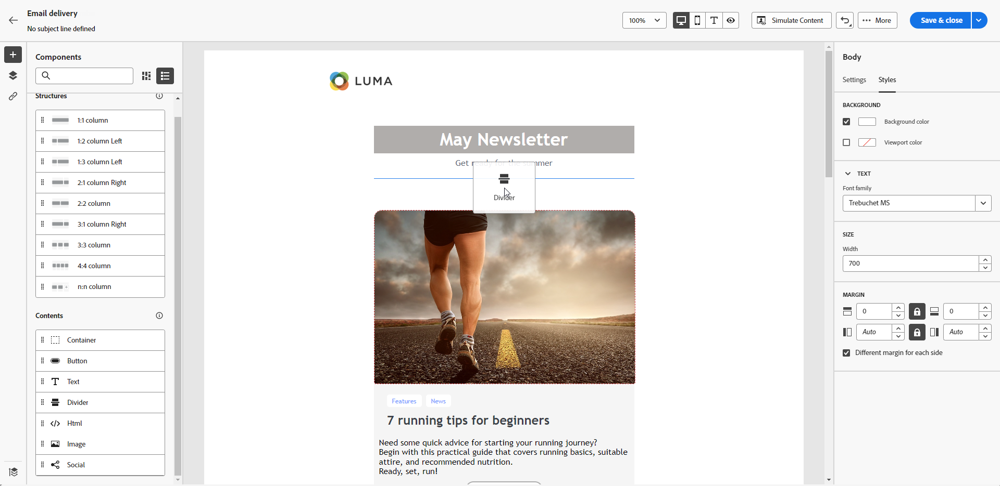

# De inhoud van de e-mailontwerper gebruiken {#content-components}

>[!CONTEXTUALHELP]
>id="ac_content_components_email"
>title="Informatie over inhoud"
>abstract="Inhoudscomponenten zijn lege plaatsaanduidingen voor inhoud die u kunt gebruiken om de lay-out van een e-mail te maken."

>[!CONTEXTUALHELP]
>id="ac_content_components_landing_page"
>title="Informatie over inhoud"
>abstract="Inhoudscomponenten zijn lege plaatsaanduidingen voor inhoud die u kunt gebruiken om de lay-out van een bestemmingspagina te maken."

>[!CONTEXTUALHELP]
>id="ac_content_components_fragment"
>title="Informatie over inhoud"
>abstract="Inhoudscomponenten zijn lege plaatsaanduidingen voor inhoud die u kunt gebruiken om de lay-out van een fragment te maken."

>[!CONTEXTUALHELP]
>id="ac_content_components_template"
>title="Informatie over inhoud"
>abstract="Inhoudscomponenten zijn lege plaatsaanduidingen voor inhoud die u kunt gebruiken om de lay-out van een sjabloon te maken."

Wanneer u uw e-mailinhoud maakt, **[!UICONTROL Content]** kunt u uw e-mail verder aanpassen met onbewerkte, lege componenten die u kunt gebruiken als u eenmaal in een e-mail hebt geplaatst.

U kunt maximaal **[!UICONTROL Contents]** zoals u nodig hebt in een **[!UICONTROL Structure]**, die de indeling van uw e-mail definieert.

## Inhoud toevoegen, componenten {#add-content-components}

Voer de onderstaande stappen uit om inhoudcomponenten aan uw e-mail toe te voegen en deze aan uw wensen aan te passen.

1. Gebruik in de e-mailontwerper een [bestaande inhoud](existing-content.md) of sleep een **[!UICONTROL Structure]** in uw lege inhoud om de lay-out van uw e-mail te bepalen. [Meer informatie](create-email-content.md)

1. Sleep de **[!UICONTROL Content]** van uw keuze binnen de relevante structuren.

   

   >[!NOTE]
   >
   >U kunt meerdere componenten toevoegen aan één structuur en aan elke kolom van een structuur.

1. Pas de opties voor elke component aan met de contextafhankelijke **[!UICONTROL Settings]** tab. U kunt er bijvoorbeeld voor kiezen om de presentatie alleen of alleen op mobiele of desktopapparaten weer te geven. U kunt koppelingsopties ook beheren vanuit dit tabblad. [Meer informatie over het beheren van koppelingen](message-tracking.md)

1. Pas de opmaakkenmerken voor elke component aan met de opdracht **[!UICONTROL Style]** tab. U kunt bijvoorbeeld de tekststijl, opvulling of marge van elke component wijzigen. [Meer informatie over uitlijning en opvulling](alignment-and-padding.md)

   

1. Via het geavanceerde menu van uw **[!UICONTROL Content]** in het rechterdeelvenster kunt u zo nodig alle inhoudscomponenten verwijderen of dupliceren.

## Container {#container}

U kunt een eenvoudige container toevoegen waarin u een andere inhoudscomponent toevoegt. Op deze manier kunt u een specifieke stijl op de container toepassen, die anders is dan de component die binnen wordt gebruikt.

Voeg bijvoorbeeld een **[!UICONTROL Container]** en voegt vervolgens een [Knop](#button) in die container. U kunt een specifieke achtergrond voor de container, en een andere voor de knoop gebruiken.

## Knop {#buttons}

Gebruik de **[!UICONTROL Button]** om een of meerdere knoppen in te voegen in uw e-mail en uw e-mailpubliek om te leiden naar een andere pagina.

1. Van de **[!UICONTROL Contents]** de lijst, slepen en neerzetten **[!UICONTROL Button]** in een **[!UICONTROL Structure]** component.

   

1. Klik op de knop die u net hebt toegevoegd om de tekst aan te passen en toegang te krijgen tot de knop **[!UICONTROL Settings]** en **[!UICONTROL Styles]** tabs.

   

1. Van de **[!UICONTROL Settings]** tabs, in de **[!UICONTROL URL]** , voegt u de URL toe waarnaar u wilt omleiden wanneer u op de knop klikt.

1. Kies hoe de inhoud wordt weergegeven met de **[!UICONTROL Target]** vervolgkeuzelijst:

   * **[!UICONTROL None]**: hiermee wordt de koppeling geopend in hetzelfde frame als waarop is geklikt (standaard).
   * **[!UICONTROL Blank]**: hiermee opent u de koppeling in een nieuw venster of op een nieuw tabblad.
   * **[!UICONTROL Self]**: hiermee opent u de koppeling in hetzelfde frame als waarop u hebt geklikt.
   * **[!UICONTROL Parent]**: hiermee opent u de koppeling in het bovenliggende frame.
   * **[!UICONTROL Top]**: hiermee opent u de koppeling in de volledige tekst van het venster.

   

1. U kunt de knop verder aanpassen door opmaakkenmerken zoals **[!UICONTROL Border]**, **[!UICONTROL Size]**, **[!UICONTROL Margin]**, enz. van de **[!UICONTROL Styles]** tab.

## Tekst {#text}

Gebruik de **[!UICONTROL Text]** om tekst in te voegen in uw e-mail, en de stijl (rand, grootte, opvulling, enz.) aan te passen met de **[!UICONTROL Settings]** en **[!UICONTROL Styles]** tabs.

1. Van de **[!UICONTROL Contents]** menu, slepen en neerzetten **[!UICONTROL Text]** in een **[!UICONTROL Structure]** component.

   

1. Klik op de nieuwe component om de tekst aan te passen en toegang te krijgen tot de component **[!UICONTROL Settings]** en **[!UICONTROL Styles]** tabs.

1. Wijzig de tekst met de volgende opties beschikbaar op de contextafhankelijke werkbalk:

   

   * **[!UICONTROL Change text style]**: pas de tekst vet, cursief, onderstrepen of doorhalen.
   * **Uitlijning wijzigen**: kies tussen de uitlijning Links, Rechts, Centreren of Uitvullen voor de tekst.
   * **[!UICONTROL Create list]**: voeg een lijst met opsommingstekens of nummers toe aan uw tekst.
   * **[!UICONTROL Set heading]**: Voeg maximaal zes koptekstniveaus toe aan uw tekst.
   * **Fontgrootte**: selecteer de tekengrootte van de tekst in pixels.
   * **[!UICONTROL Edit image]**: voeg een afbeelding of een element toe aan uw tekstcomponent.
   * **[!UICONTROL Show the source code]**: geef de broncode van de tekst weer. Het kan niet worden gewijzigd.
   * **[!UICONTROL Duplicate]**: voeg een kopie van de tekstcomponent toe.
   * **[!UICONTROL Delete]**: verwijder de geselecteerde tekstcomponent uit uw e-mail.
   * **[!UICONTROL Add personalization]**: voeg aanpassingsvelden toe om de inhoud van de profielgegevens aan te passen.
   * **[!UICONTROL Enable conditional content]**: voeg voorwaardelijke inhoud toe om de inhoud van de component aan de doelprofielen aan te passen.

1. Pas de andere opmaakkenmerken aan, zoals tekstkleur, lettertypefamilie, rand, opvulling, marge, enzovoort. van de **[!UICONTROL Styles]** tab.

   

## Scheidingslijn {#divider}

Gebruik de **[!UICONTROL Divider]** om een scheidingslijn in te voegen om de lay-out en inhoud van uw e-mail te ordenen.

U kunt opmaakkenmerken zoals lijnkleur, -stijl en -hoogte aanpassen vanuit het dialoogvenster **[!UICONTROL Styles]** tab.

## HTML {#HTML}

Gebruik de **[!UICONTROL HTML]** om de verschillende onderdelen van uw bestaande HTML te kopiëren en te plakken. Hierdoor kunt u gratis modulaire HTML-componenten maken om externe inhoud opnieuw te gebruiken.

1. Van **[!UICONTROL Components]**, slepen en neerzetten **[!UICONTROL HTML]** in een **[!UICONTROL Structure]** component.

   

1. Klik op de zojuist toegevoegde component en selecteer vervolgens **[!UICONTROL Show the source code]** van de contextafhankelijke werkbalk om uw HTML toe te voegen.

   

>[!NOTE]
>
>Om een externe inhoud eenvoudig compatibel te maken met de e-mailontwerper, raadt de Adobe aan [een geheel nieuw bericht maken](create-email-content.md) en kopieer de inhoud van uw bestaande e-mail naar componenten.

## Afbeelding {#image}

Gebruik de **[!UICONTROL Image]** om een afbeeldingsbestand van uw computer in te voegen in uw e-mail.

1. Van de **[!UICONTROL Content]** menu, slepen en neerzetten **[!UICONTROL Image]** in een **[!UICONTROL Structure]** component.

   

1. Klikken **[!UICONTROL Browse]** om een afbeeldingsbestand te kiezen uit uw elementen. U kunt ook **[!UICONTROL Import your media]**.

   Raadpleeg voor meer informatie over het uploaden en toevoegen van middelen in Adobe Experience Manager de [Adobe Experience Manager as a Cloud Service-documentatie](https://experienceleague.adobe.com/docs/experience-manager-cloud-service/content/assets/manage/add-assets.html).

   

1. Navigeer door uw mappen naar het specifieke element dat u nodig hebt of zoek het efficiënt met de zoekbalk.

   Nadat u het gewenste element hebt gevonden, klikt u op **[!UICONTROL Select]**.

   

1. Klik op de nieuwe component en stel de afbeeldingseigenschappen in met de opdracht **[!UICONTROL Settings]** tab:

   * **[!UICONTROL Image title]** Hiermee kunt u een titel voor de afbeelding definiëren.
   * **[!UICONTROL Alt text]** Hiermee kunt u het bijschrift definiëren dat aan de afbeelding is gekoppeld. Dit komt overeen met het kenmerk alt HTML.

   

1. U kunt een koppeling toevoegen om de doelgroep om te leiden naar andere inhoud. [Meer informatie](message-tracking.md)

1. Pas de andere opmaakkenmerken aan, zoals marge, rand, enz. met de **[!UICONTROL Styles]** tab.

## Sociaal {#social}

Gebruik de **[!UICONTROL Social]** om koppelingen naar pagina&#39;s met sociale media in te voegen in uw e-mailinhoud.

1. Van de **[!UICONTROL Components]** menu, slepen en neerzetten **[!UICONTROL Social]** in een **[!UICONTROL Structure]** component.

1. Klik op de nieuwe component.

1. In de **[!UICONTROL Social]** van het **[!UICONTROL Settings]** kiest u welke sociale media u wilt toevoegen of verwijderen.

   

1. Kies de grootte van de pictogrammen in het dialoogvenster **[!UICONTROL Size of images]** veld.

1. Klik op elk van uw pictogrammen voor sociale media om de **[!UICONTROL URL]** waarnaar uw publiek wordt omgeleid.

   

1. U kunt de pictogrammen van elk van uw sociale media desgewenst ook wijzigen in het dialoogvenster **[!UICONTROL Source]** veld.

1. Pas de andere opmaakkenmerken aan, zoals stijl, marge, rand, enzovoort. van de **[!UICONTROL Styles]** tab.
