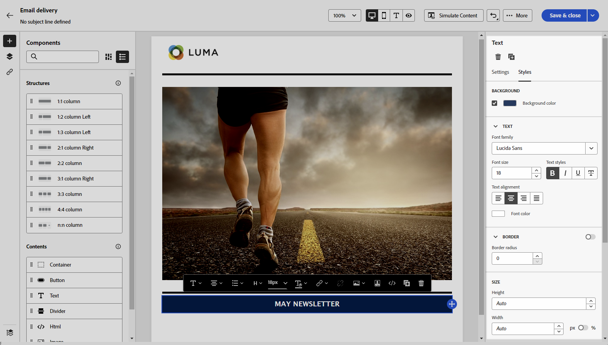

# Uw e-mailinhoud helemaal opnieuw starten {#create-email-content}

>[!CONTEXTUALHELP]
>id="ac_structure_components_email"
>title="Structuren toevoegen"
>abstract="Structuren bepalen de indeling van de e-mail. De belemmering en laat vallen component van de a **Structuur** in het canvas beginnen uw e-mailinhoud te ontwerpen."

>[!CONTEXTUALHELP]
>id="ac_structure_components_landing_page"
>title="Structuren toevoegen"
>abstract="Structuren bepalen de lay-out van de landingspagina. De belemmering en laat vallen component van de a **Structuur** in het canvas beginnen uw het landen pagina te ontwerpen."

>[!CONTEXTUALHELP]
>id="ac_structure_components_fragment"
>title="Structuren toevoegen"
>abstract="Structuren bepalen de lay-out van het inhoudsfragment. De belemmering en laat vallen component van de a **Structuur** in het canvas beginnen uw fragmentinhoud te ontwerpen."

>[!CONTEXTUALHELP]
>id="ac_structure_components_template"
>title="Structuren toevoegen"
>abstract="Structuren definiëren de indeling van de sjabloon. De belemmering en laat vallen component van de a **Structuur** in het canvas beginnen uw malplaatjeinhoud te ontwerpen."

>[!CONTEXTUALHELP]
>id="ac_edition_columns_email"
>title="E-mailkolommen definiëren"
>abstract="Met de e-mail Designer kunt u de indeling van uw e-mail eenvoudig definiëren door de kolomstructuur te definiëren."

>[!CONTEXTUALHELP]
>id="ac_edition_columns_landing_page"
>title="Landingspaginakolommen definiëren"
>abstract="Met de e-mail Designer kunt u de lay-out van de bestemmingspagina eenvoudig definiëren door de kolomstructuur te definiëren."

>[!CONTEXTUALHELP]
>id="ac_edition_columns_fragment"
>title="Inhoudsfragmentkolommen definiëren"
>abstract="Met de e-mail-Designer kunt u de lay-out van het inhoudsfragment eenvoudig definiëren door de kolomstructuur te definiëren."

>[!CONTEXTUALHELP]
>id="ac_edition_columns_template"
>title="Sjabloonkolommen definiëren"
>abstract="Met e-mail Designer kunt u de indeling van uw sjabloon eenvoudig definiëren door de kolomstructuur te definiëren."

Met de e-mail Designer kunt u eenvoudig de structuur van uw e-mail definiëren. Door structuurelementen toe te voegen en te bewegen met eenvoudige belemmering-en-dalingsacties, kunt u het lichaam van uw e-mail binnen seconden ontwerpen.

➡️ [ ontdekt deze eigenschap in video ](#video)

Volg onderstaande stappen om uw e-mailinhoud te gaan samenstellen.

1. Van de [ E-mail Designer ](get-started-email-designer.md#start-authoring) homepage, selecteer de **[!UICONTROL Design from scratch]** optie.

   {zoomable="yes"}

1. Begin met het ontwerpen van uw e-mailinhoud door **[!UICONTROL Structures]** naar het canvas te slepen en neer te zetten om de lay-out van uw e-mail te definiëren.

   >[!NOTE]
   >
   >Kolommen stapelen is niet compatibel met alle e-mailprogramma&#39;s. Kolommen worden niet gestapeld als deze functie niet wordt ondersteund.

1. Voeg zo veel **[!UICONTROL Structures]** toe als nodig is en bewerk de instellingen in het daarvoor bestemde venster aan de rechterkant.

   {zoomable="yes"}

1. U kunt de component **[!UICONTROL n:n column]** selecteren om het aantal kolommen van uw keuze (tussen 3 en 10) te definiëren. U kunt de breedte van elke kolom ook bepalen door de pijlen bij de bodem van elke kolom te bewegen.

   >[!NOTE]
   >
   >Elke kolomgrootte mag niet kleiner zijn dan 10% van de totale breedte van de structuurcomponent. U kunt geen kolom verwijderen die niet leeg is.

1. Sleep vanuit de sectie **[!UICONTROL Components]** zoveel elementen als u nodig hebt naar een of meer structuren. [ leer meer over inhoudscomponenten ](content-components.md)

1. Elke component kan verder worden aangepast met de tabbladen **[!UICONTROL Settings]** of **[!UICONTROL Style]** aan de rechterkant. U kunt bijvoorbeeld de tekststijl, opvulling of marge van elke component wijzigen. [ leer meer over groepering en het opvullen ](alignment-and-padding.md)

   {zoomable="yes"}

1. Voeg verpersoonlijkingsgebieden in om uw e-mailinhoud aan te passen die op profielgegevens wordt gebaseerd. [ Leer meer over inhoudstijdpersonalisatie ](../personalization/personalize.md)

1. Voeg koppelingen toe aan uw inhoud.

   Klik op de tab **[!UICONTROL Links]** in het linkerdeelvenster om alle URL&#39;s weer te geven van de inhoud die wordt bijgehouden. U kunt hun **[!UICONTROL Tracking Type]** of **[!UICONTROL Label]** wijzigen en **[!UICONTROL Categories]** toevoegen als dat nodig is.

[Meer informatie over koppelingen en berichtregistratie](message-tracking.md)

   {zoomable="yes"}

1. Indien nodig kunt u uw e-mail verder aanpassen door in het geavanceerde menu op **[!UICONTROL Switch to code editor]** te klikken. Op deze manier kunt u de broncode van de e-mail bewerken, bijvoorbeeld door tags voor bijhouden of aangepaste HTML toe te voegen. [ leer meer over de coderedacteur ](code-content.md)

   >[!CAUTION]
   >
   >U kunt niet terugkeren naar de visuele ontwerper voor deze e-mail na het schakelen naar de coderedacteur.

1. Als de inhoud gereed is, klikt u op **[!UICONTROL Simulate content]** om de rendering van e-mailberichten te controleren. U kunt kiezen voor de weergave Computer of Mobiel. [ Leer meer over het voorvertonen van uw e-mail ](../preview-test/preview-test.md)

   {zoomable="yes"}

1. Klik op **[!UICONTROL Save]** als uw e-mailbericht gereed is.

## Hoe kan ik-video {#video}

Begrijp hoe u door de Designer-e-mail kunt navigeren. Leer hoe u een geheel nieuwe e-mail kunt structureren en ontwerpen, hoe u uw e-mail kunt personaliseren en testen.

>[!VIDEO](https://video.tv.adobe.com/v/3425867/?quality=12)
