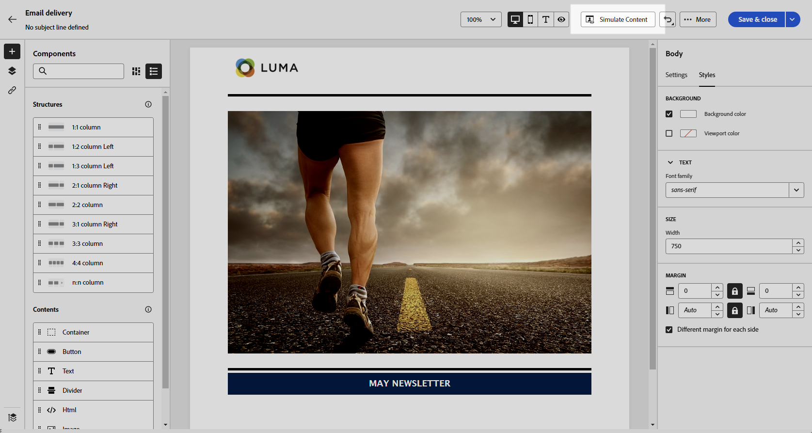

# Uw e-mailinhoud helemaal opnieuw starten {#create-email-content}

>[!CONTEXTUALHELP]
>id="ac_structure_components_email"
>title="Structuren toevoegen"
>abstract="Structuren bepalen de indeling van de e-mail. Sleep een **Structuur** op het canvas om uw e-mailinhoud te ontwerpen."

>[!CONTEXTUALHELP]
>id="ac_structure_components_landing_page"
>title="Structuren toevoegen"
>abstract="Structuren bepalen de lay-out van de landingspagina. Sleep een **Structuur** op het canvas om uw openingspagina te ontwerpen."

>[!CONTEXTUALHELP]
>id="ac_structure_components_fragment"
>title="Structuren toevoegen"
>abstract="Structuren bepalen de lay-out van het fragment. Sleep een **Structuur** op het canvas om uw fragmentinhoud te ontwerpen."

>[!CONTEXTUALHELP]
>id="ac_structure_components_template"
>title="Structuren toevoegen"
>abstract="Structuren definiëren de indeling van de sjabloon. Sleep een **Structuur** op het canvas om uw sjablooninhoud te ontwerpen."

>[!CONTEXTUALHELP]
>id="ac_edition_columns_email"
>title="E-mailkolommen definiëren"
>abstract="Met de E-mailontwerper kunt u de indeling van uw e-mail eenvoudig definiëren door de kolomstructuur te definiëren."

>[!CONTEXTUALHELP]
>id="ac_edition_columns_landing_page"
>title="Landingspaginakolommen definiëren"
>abstract="Met de e-mailontwerper kunt u de indeling van de bestemmingspagina eenvoudig definiëren door de kolomstructuur te definiëren."

>[!CONTEXTUALHELP]
>id="ac_edition_columns_fragment"
>title="Fragmentkolommen definiëren"
>abstract="Met de e-mailontwerper kunt u de indeling van het fragment eenvoudig definiëren door de kolomstructuur te definiëren."

>[!CONTEXTUALHELP]
>id="ac_edition_columns_template"
>title="Sjabloonkolommen definiëren"
>abstract="Met de E-mailontwerper kunt u de indeling van uw sjabloon eenvoudig definiëren door de kolomstructuur te definiëren."

Met de e-mailontwerper kunt u de structuur van uw e-mail eenvoudig definiëren. Door structuurelementen toe te voegen en te bewegen met eenvoudige belemmering-en-dalingsacties, kunt u het lichaam van uw e-mail binnen seconden ontwerpen.

Volg onderstaande stappen om uw e-mailinhoud te gaan samenstellen.

1. Van de [E-mailDesigner](get-started-email-designer.md#start-authoring) homepage, selecteer **[!UICONTROL Design from scratch]** -optie.

   

1. Begin met het ontwerpen van uw e-mailinhoud door te slepen en neer te zetten **[!UICONTROL Structures]** in het canvas om de lay-out van uw e-mail te definiëren.

   >[!NOTE]
   >
   >Kolommen stapelen is niet compatibel met alle e-mailprogramma&#39;s. Kolommen worden niet gestapeld als deze functie niet wordt ondersteund.

1. Zoveel toevoegen **[!UICONTROL Structures]** en bewerk de instellingen in het daarvoor bestemde venster aan de rechterkant.

   

1. U kunt de **[!UICONTROL n:n column]** om het aantal kolommen van uw keus (tussen 3 en 10) te bepalen. U kunt de breedte van elke kolom ook bepalen door de pijlen bij de bodem van elke kolom te bewegen.

   >[!NOTE]
   >
   >Elke kolomgrootte mag niet kleiner zijn dan 10% van de totale breedte van de structuurcomponent. U kunt geen kolom verwijderen die niet leeg is.

1. Van de **[!UICONTROL Components]** kunt u zoveel elementen naar een of meer structuren slepen. [Meer informatie over inhoudscomponenten](content-components.md)

1. Elke component kan verder worden aangepast met de **[!UICONTROL Settings]** of **[!UICONTROL Style]** aan de rechterkant. U kunt bijvoorbeeld de tekststijl, opvulling of marge van elke component wijzigen. [Meer informatie over uitlijning en opvulling](alignment-and-padding.md)

   

1. Voeg verpersoonlijkingsgebieden in om uw e-mailinhoud aan te passen die op profielgegevens wordt gebaseerd. [Meer informatie over content personalization](../personalization/personalize.md)

1. Voeg koppelingen toe aan uw inhoud.

   Klik op de knop **[!UICONTROL Links]** in het linkerdeelvenster om alle URL&#39;s weer te geven van de inhoud die wordt bijgehouden. U kunt de **[!UICONTROL Tracking Type]** of **[!UICONTROL Label]** en toevoegen **[!UICONTROL Categories]** indien nodig.

[Meer informatie over koppelingen en berichtregistratie](message-tracking.md)

   

1. Indien nodig kunt u uw e-mail verder aanpassen door op **[!UICONTROL Switch to code editor]** in het geavanceerde menu. Op deze manier kunt u de broncode van de e-mail bewerken, bijvoorbeeld door tags voor bijhouden of aangepaste HTML toe te voegen. [Meer informatie over de code-editor](code-content.md)

   >[!CAUTION]
   >
   >U kunt niet terugkeren naar de visuele ontwerper voor deze e-mail na het schakelen naar de coderedacteur.

1. Wanneer de inhoud gereed is, klikt u op **[!UICONTROL Simulate content]** om de rendering van uw e-mail te controleren. U kunt kiezen voor de weergave Computer of Mobiel. [Meer informatie over een voorbeeld van uw e-mail](../preview-test/preview-test.md)

   

1. Wanneer uw e-mail gereed is, klikt u op **[!UICONTROL Save]**.

