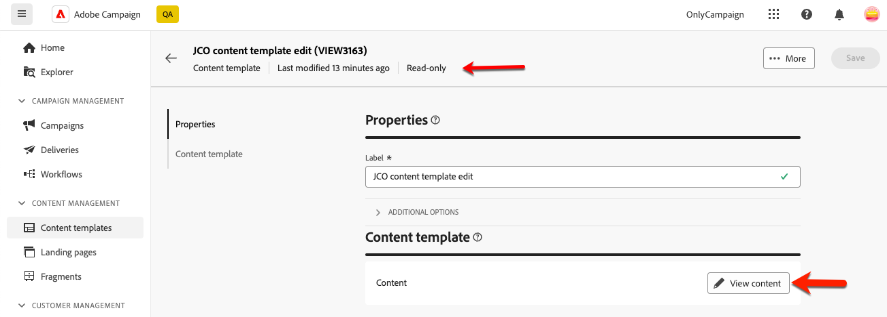
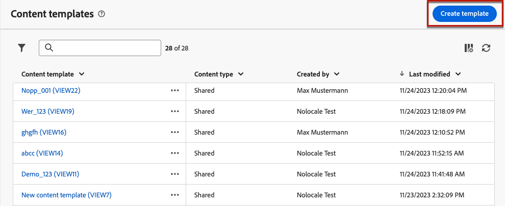

# Werken met inhoudssjablonen {#content-templates}

>[!CONTEXTUALHELP]
>id="acw_contenttemplate_menu"
>title="Contentsjablonen"
>abstract="Voor een versnelde en verbeterde ontwerpprocedure kunt u zelfstandige e-mailsjablonen maken om aangepaste inhoud eenvoudig te hergebruiken in Adobe Campaign. Deze inhoudssjablonen kunnen geheel nieuw worden ontworpen, op basis van ingebouwde of aangepaste sjablonen, op basis van bestaande inhoud of geïmporteerd in de inhoudssjablooneditor."

Voor een versneld en verbeterd ontwerpproces kunt u zelfstandige sjablonen maken om aangepaste inhoud in [!DNL Adobe Campaign] eenvoudig te hergebruiken. Deze inhoudssjablonen kunnen geheel nieuw worden ontworpen, op basis van ingebouwde of aangepaste sjablonen, op basis van bestaande inhoud of geïmporteerd in de inhoudssjablooneditor.

Met deze functionaliteit kunnen gebruikers die op inhoud zijn gericht, aan zelfstandige sjablonen werken, zodat marketinggebruikers deze opnieuw kunnen gebruiken en aanpassen in hun eigen e-mailcampagnes.

>[!NOTE]
>
>Momenteel, slechts **e-mail** inhoudsmalplaatjes worden gesteund.

## Sjablonen voor inhoud openen {#access-templates}

>[!CONTEXTUALHELP]
>id="acw_contenttemplate_edition"
>title="Sjablooninhoud bewerken"
>abstract="Klik **uitgeven inhoud** knoop om uw inhoud met E-mail Designer bij te werken."

Als u de lijst met inhoudssjablonen wilt openen, bladert u vanuit de linkertrack naar het menu **[!UICONTROL Content Management]** > **[!UICONTROL Content Templates]** .

{zoomable="yes"}

In dit dashboard worden alle beschikbare inhoudssjablonen als een lijst weergegeven. U kunt op een specifieke [ omslag ](../get-started/permissions.md#folders) filtreren gebruikend de drop-down lijst of regels toevoegen gebruikend de [ vraagmodelaar ](../query/query-modeler-overview.md).

{zoomable="yes"}

In de lijst kunt u bestaande inhoudssjablonen bewerken, dupliceren of verwijderen. Gebruik de knop in de bovenste sectie om een inhoudssjabloon te maken.

### Inhoudssjabloon in alleen-lezen modus {#template-readonly}

Toegangsrechten kunnen worden toegepast op inhoudssjablonen.

Als u geen het uitgeven toestemmingen voor een bepaald inhoudsmalplaatje hebt, wordt het inhoudsmalplaatje getoond in **read-only wijze**. In dit geval wordt de knop **[!UICONTROL Edit content]** vervangen door de knop **[!UICONTROL View content]** , zodat u de sjabloon kunt bekijken zonder wijzigingen aan te brengen.

{zoomable="yes"}

Zoals hieronder wordt getoond, worden alle eigenschapspictogrammen gedeactiveerd, die interactie beperken tot het bekijken slechts.

{zoomable="yes"}

## Inhoudssjablonen maken {#create-content-templates}

>[!CONTEXTUALHELP]
>id="acw_contenttemplate_design"
>title="Sjabloonontwerp voor inhoud"
>abstract="Ontwerp uw sjabloon voor e-mailinhoud."

>[!CONTEXTUALHELP]
>id="acw_contenttemplate_selection"
>title="Sjabloonselectie voor inhoud"
>abstract="Selecteer uw sjabloon voor e-mailinhoud."

De malplaatjes van de inhoud kunnen worden gecreeerd door [ het opslaan van een bestaande e-mail als malplaatje ](#save-as-template) of van de lijst van e-mailmalplaatjes, door **creeer inhoudsmalplaatje** knoop, [ zoals hieronder gedetailleerd ](#create-template-from-scratch).

Zodra bewaard, kunt u dit malplaatje gebruiken wanneer het bouwen van om het even welke [ e-mail ](../email/create-email.md) binnen [!DNL Adobe Campaign]. [ leer hoe ](use-email-templates.md)

>[!NOTE]
>
>* Wijzigingen die zijn aangebracht in inhoudssjablonen worden niet doorgegeven aan e-mails.
>
>* En als sjablonen worden gebruikt in een e-mailbericht, hebben wijzigingen die u aanbrengt in uw e-mailinhoud geen invloed op de eerder gebruikte inhoudssjabloon.

### Een nieuwe inhoudssjabloon maken {#create-template-from-scratch}

>[!CONTEXTUALHELP]
>id="acw_contenttemplate_properties"
>title="Sjablooneigenschappen definiëren"
>abstract="Definieer de sjablooneigenschappen voor e-mailinhoud om deze eenvoudig op te halen wanneer dat nodig is."

Ga als volgt te werk om een nieuwe inhoudssjabloon te maken van het dashboard voor inhoudssjablonen:

1. Blader naar de lijst met inhoudssjablonen in de linkertrack **[!UICONTROL Content Management]** > **[!UICONTROL Content templates]** .

1. Selecteer **[!UICONTROL Create template]**.

   {zoomable="yes"}

1. Voer het sjabloonlabel en de eigenschappen in. U kunt de map selecteren waarin u de sjabloon wilt opslaan. Standaard worden inhoudssjablonen opgeslagen in een specifieke map in de Adobe Campaign-hiërarchie: **[!UICONTROL Explorer]** > **[!UICONTROL Resources]** > **[!UICONTROL Templates]** > **[!UICONTROL Content templates]** . Leer meer over omslagen in [ deze pagina ](../get-started/permissions.md#folders)

   {zoomable="yes"}

1. Klik op **[!UICONTROL Create]** en kies uit de verschillende opties hoe u de sjabloon wilt ontwerpen:

   * [ Ontwerp uw inhoud van kras ](create-email-content.md) door de E-mailDesigner interface.
   * [ Code of exemplaar-kleef ruwe HTML ](code-content.md) direct in E-mailDesigner.
   * [ voer bestaande inhoud van HTML ](existing-content.md) van een dossier of een .zip omslag in.
   * Bestaande inhoud uit een lijst met ingebouwde of aangepaste sjablonen gebruiken. De stappen om een inhoudsmalplaatje in e-mail te gebruiken worden beschreven in [ deze sectie ](use-email-templates.md).

   {zoomable="yes"}

1. Het e-mailadres van de Designer wordt weergegeven. Bewerk de inhoud naar wens, net als voor alle e-mailberichten, afhankelijk van de optie die u hebt geselecteerd. Leer hoe te om E-mail Designer in [ te gebruiken deze sectie ](get-started-email-designer.md).

   <!--You can test your content if needed. [Learn how](#test-template)-->

1. Klik op **[!UICONTROL Save]** als de sjabloon gereed is.

   Klik zo nodig op de pijl naast de sjabloonnaam om terug te gaan naar het scherm **[!UICONTROL Details]** en de sjabloon te bewerken.

   {zoomable="yes"}

De sjabloon is beschikbaar in de lijst **[!UICONTROL Content templates]** . [Meer informatie](#access-templates)

U kunt deze sjabloon nu gebruiken om nieuwe inhoud samen te stellen. Deze is beschikbaar op het tabblad **[!UICONTROL Saved templates]** van de Designer-mailtoepassing. [ leer hoe ](use-email-templates.md)

### E-mailinhoud opslaan als sjabloon {#save-as-template}

Zodra u [ een e-mail ](create-email-content.md) ontwerpt, kunt u deze inhoud als malplaatje voor toekomstig hergebruik bewaren. Opgeslagen sjablonen zijn beschikbaar voor alle gebruikers van uw Adobe Campaign-omgeving.

Voer de onderstaande stappen uit om e-mailinhoud als sjabloon op te slaan:

1. Klik in de e-mailontwerper op de knop **[!UICONTROL More]** rechtsboven in het scherm.

1. Selecteer **[!UICONTROL Save as content template]** in de vervolgkeuzelijst.

   {zoomable="yes"}

1. Voer een naam in voor deze sjabloon en sla deze op.

   {zoomable="yes"} in

De sjabloon wordt opgeslagen en weergegeven in de lijst **[!UICONTROL Content templates]** . Het wordt een standalone inhoudsmalplaatje dat kan worden betreden, worden uitgegeven, en worden geschrapt zoals om het even welk ander punt op die lijst. [Meer informatie](#access-manage-templates)

U kunt deze sjabloon nu gebruiken om nieuwe inhoud samen te stellen. Deze is beschikbaar op het tabblad **[!UICONTROL Saved templates]** van de Designer-mailtoepassing. [ leer hoe ](use-email-templates.md)

{zoomable="yes"}

>[!NOTE]
>
>Om het even welke verandering in dat nieuwe malplaatje wordt niet verspreid aan e-mail het uit komt. Op dezelfde manier wordt de nieuwe sjabloon niet gewijzigd wanneer de oorspronkelijke inhoud in die e-mail wordt bewerkt.

<!--

Test your content template {#test-template}

You can test the rendering of any email content template, whether created from scratch or from an email. To do so, follow the steps below.

1. Access the content template list.

1. Click **[!UICONTROL Edit content]** from the **[!UICONTROL Template properties]**.

1. Click **[!UICONTROL Simulate Content]** and select a test profile to check your email rendering. You can choose the desktop or mobile view.

1. You can send a proof to test your content and have it approved by some internal users before using it. To do so, click the **[!UICONTROL Send proof]** button and follow the steps described in .

-->

## Een inhoudssjabloon wijzigen {#modify-delete}

Voer de volgende stappen uit om een bestaande inhoudssjabloon bij te werken:

1. Klik in de lijst met inhoudssjablonen op het label van de sjabloon om deze te wijzigen.

1. Klik de **[!UICONTROL Edit content]** knoop om uw inhoud met [ E-mail Designer ](get-started-email-designer.md) bij te werken.

{zoomable="yes"}

>[!NOTE]
>
>Wijzigingen die zijn aangebracht in inhoudssjablonen, worden niet doorgegeven aan e-mails met deze inhoudssjabloon.

## Een inhoudssjabloon verwijderen {#content-delete}

U kunt een inhoudssjabloon op twee manieren verwijderen:

* Van de lijst van inhoudsmalplaatjes, klik de elliptische knoop, dan uitgezochte **Schrapping**.

  {zoomable="yes"}

* Van het inhoudsmalplaatje zelf, klik **Meer** knoop, dan selecteren **Schrapping**.

>[!NOTE]
>
>Het verwijderen van een inhoudssjabloon heeft geen invloed op leveringen die zijn gemaakt met deze sjabloon.

## Een inhoudssjabloon dupliceren {#content-duplicate}

U kunt een inhoudssjabloon op twee manieren dupliceren:

* Van de lijst van inhoudsmalplaatjes, klik de ellipsknoop, dan selecteren **Dupliceert**.

* Van het inhoudsmalplaatje zelf, klik **Meer** knoop, dan selecteren **** Dupliceert.

In beide gevallen bevestigt u de duplicatie om de nieuwe inhoudssjabloon te maken. Het etiket van het nieuwe inhoudsmalplaatje is **Exemplaar van`<label of the initial campaign>`**. Blader naar de sjablooninstellingen om dit label bij te werken.