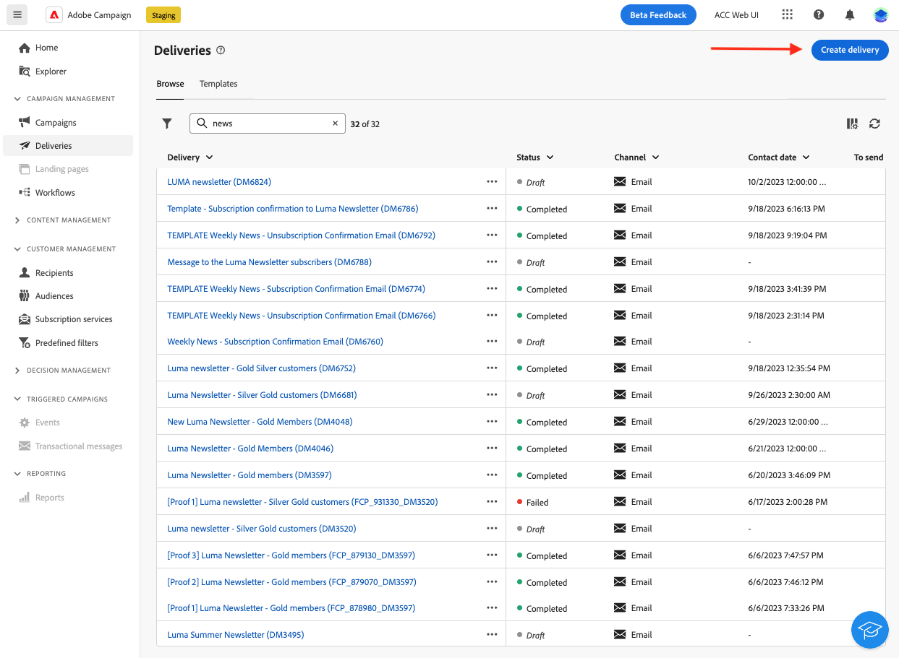
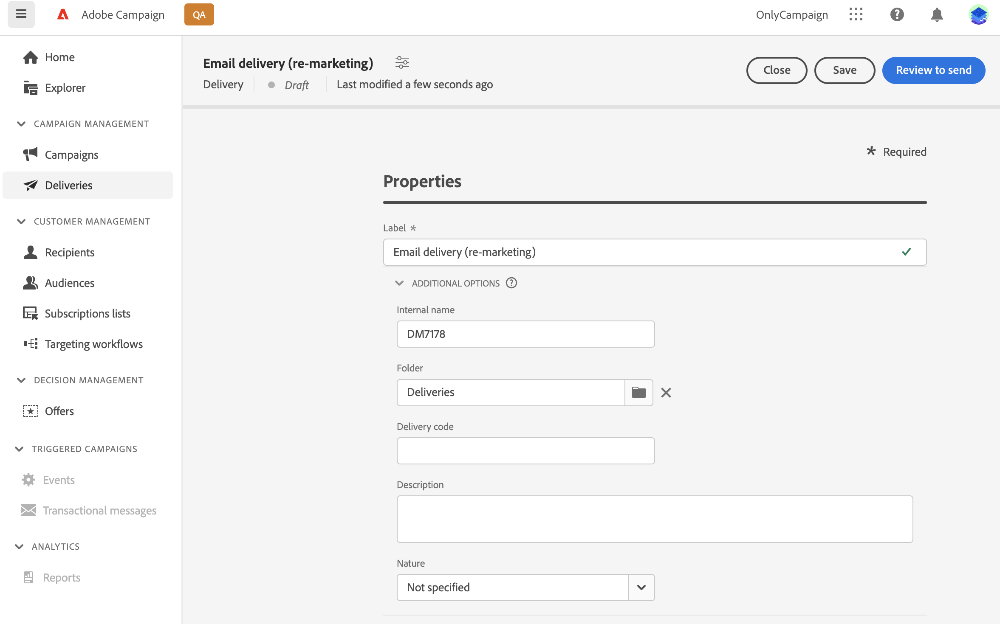
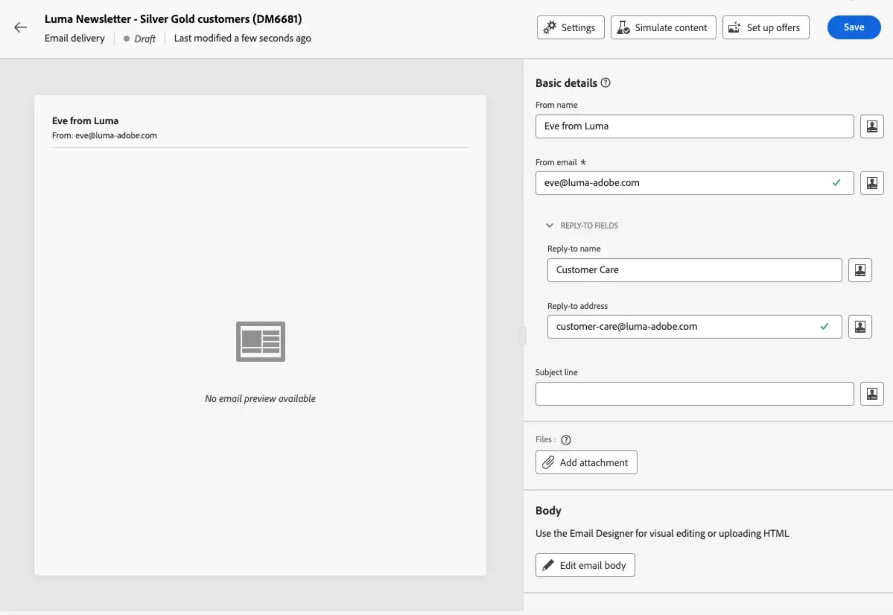
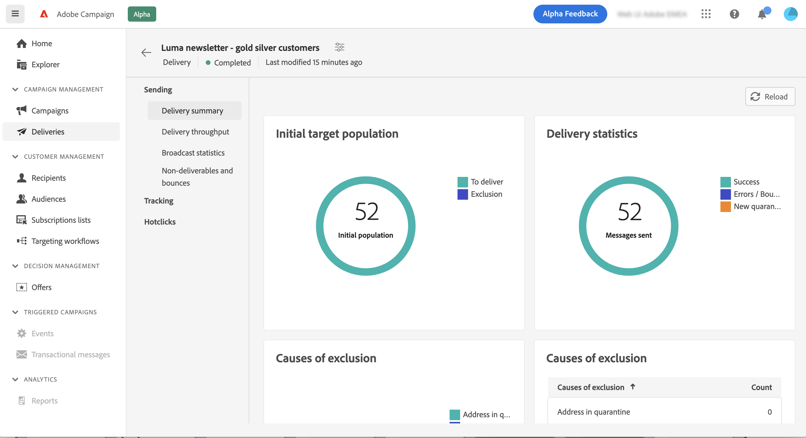

# Uw eerste e-mail maken {#first-email}

>[!CONTEXTUALHELP]
>id="acw_homepage_learning_card3"
>title="Aan de slag met e-mails"
>abstract="U kunt een zelfstandige e-maillevering maken of een e-mailbericht maken in de context van een campagneworkflow. Leer hoe u de levering maakt, het publiek selecteert en de e-mailinhoud ontwerpt."

Leer hoe u uw eerste e-mailadres maakt waarvoor u een e-mail wilt schrijven. In dit geval plant u het verzenden van een e-mail naar leden van Silver en Gold-loyaliteit op een bepaalde datum.

Gebaseerd op een vooraf bepaald [&#x200B; ontwerpmalplaatje &#x200B;](../content/create-email-templates.md), kenmerkt e-mail ook gepersonaliseerde inhoud die op de attributen van het klantenprofiel wordt gebaseerd.

➡️ [Ontdek deze functie in video](#video)

## E-maillevering maken {#create-email}

>[!CONTEXTUALHELP]
>id="acw_deliveries_email_template_selection"
>title="Een e-mailsjabloon selecteren"
>abstract="Een e-mailmalplaatje is een specifieke leveringsconfiguratie die vooraf bepaalde montages, zoals typologieregels, verpersoonlijking, of het verpletteren van parameters bevat. De malplaatjes worden bepaald in de de cliëntconsole van de Campagne."

>[!CONTEXTUALHELP]
>id="acw_deliveries_email_properties"
>title="Uw e-maileigenschappen definiëren"
>abstract="De eigenschappen zijn de gemeenschappelijke leveringsparameters die u helpen uw levering noemen en classificeren. De extra instellingen zijn optioneel. Als uw levering op een uitgebreid schema gebaseerd is dat in de Adobe Campaign v8 console wordt bepaald, zijn sommige specifieke **gebieden van de Opties van de Douane** beschikbaar."

U kunt een zelfstandige e-maillevering maken of een e-mailbericht maken in de context van een campagneworkflow. In de onderstaande stappen wordt de procedure beschreven voor een zelfstandige (one-shot) e-maillevering. Leer meer over de stappen van de leveringsverwezenlijking in Adobe Campaign in [&#x200B; deze pagina &#x200B;](../msg/gs-deliveries.md).

Volg onderstaande stappen om een nieuwe, zelfstandige e-maillevering te maken.

1. Blader naar het menu **[!UICONTROL Deliveries]** op de linkertrack en klik op de knop **[!UICONTROL Create delivery]** .

   

1. Selecteer **[!UICONTROL Email]** als kanaal en kies een sjabloon voor e-maillevering in de lijst.

   >[!NOTE]
   >
   >Sjablonen zijn vooraf geconfigureerde leveringsinstellingen die zijn opgeslagen voor toekomstig gebruik. [Meer informatie](../msg/delivery-template.md)

   {zoomable="yes"}

1. Klik op de knop **[!UICONTROL Create delivery]** ter bevestiging.
1. Voer een label voor de levering in en configureer aanvullende opties op basis van uw behoeften:

   * **[!UICONTROL Internal name]**: wijs een unieke id toe aan de levering.
   * **[!UICONTROL Folder]**: Sla de levering op in een specifieke map.
   * **[!UICONTROL Delivery code]**: gebruik dit veld om uw leveringen te ordenen op basis van uw eigen naamgevingsconventie.
   * **[!UICONTROL Description]**: geef een beschrijving op voor de levering.
   * **[!UICONTROL Nature]**: geef de aard van de e-mail op voor classificatiedoeleinden. <!--The content of the list is defined in the delivery template selected when creating the email.-->

   >[!NOTE]
   >
   >Als u uw schema met specifieke douanevelden hebt uitgebreid, kunt u tot hen in de **[!UICONTROL Custom options]** sectie toegang hebben.

   {zoomable="yes"}

1. Bovendien zijn geavanceerde instellingen, zoals typologische regels en doeltoewijzingen, toegankelijk via de knop **[!UICONTROL Settings]** rechtsboven in het scherm. Deze instellingen zijn vooraf geconfigureerd in de geselecteerde sjabloon, maar kunnen zo nodig worden bewerkt voor deze specifieke e-mail. [Meer informatie](../advanced-settings/delivery-settings.md)

## De doelgroep definiëren {#define-audience}

>[!CONTEXTUALHELP]
>id="acw_deliveries_email_audience"
>title="Selecteer een publiek voor uw levering"
>abstract="Selecteer het beste publiek voor uw marketingbericht. U kunt een bestaand publiek kiezen (al gedefinieerd in een Campagne v8-instantie of in Adobe Experience Platform), een nieuw publiek maken met de querymodelfunctie of een bestand uploaden dat uw publiek bevat. De groepen van de controle worden niet toegelaten voor **Uitgezocht van dossier** optie en vice versa."
>additional-url="https://experienceleague.adobe.com/docs/campaign-web/v8/audiences/target-audiences/add-audience.html?lang=nl-NL" text="Het grote publiek selecteren"
>additional-url="https://experienceleague.adobe.com/docs/campaign-web/v8/audiences/target-audiences/control-group.html?lang=nl-NL" text="Een controlegroep instellen"

In dit geval stuurt u de e-mail naar een bestaand publiek.

De extra instructies op hoe te met publiek te werken zijn beschikbaar in [&#x200B; deze sectie &#x200B;](../audience/about-recipients.md).

1. Als u het publiek voor de e-mail wilt selecteren, klikt u op de knop **[!UICONTROL Select audience]** en kiest u een bestaand publiek in de lijst.

   In dit voorbeeld willen we een bestaand publiek gebruiken dat zich richt op klanten die tot de niveaus van de Silver- en Gold-loyaliteitspunten behoren.

   {zoomable="yes"}

   >[!NOTE]
   >
   >Het publiek dat in de lijst beschikbaar is, komt uit uw Campagne v8-exemplaar of uit Adobe Experience Platform als de integratie tussen Doel en Source op uw exemplaar is geconfigureerd. Dankzij deze integratie kunt u Experience Platform-segmenten naar Adobe Campaign verzenden en Campagne leveren en logbestanden bijhouden naar Adobe Experience Platform. Leer hoe te met Campagne en Adobe Experience Platform in de [&#x200B; Campagne v8 (cliëntconsole) documentatie &#x200B;](https://experienceleague.adobe.com/docs/campaign/campaign-v8/connect/ac-aep/ac-aep.html?lang=nl-NL){target="_blank"} te werken.

1. Als het publiek is geselecteerd, kunt u het doel verder verfijnen door aanvullende regels toe te passen.

   {zoomable="yes"}

1. U kunt ook een controlegroep instellen om het gedrag van de e-mailontvangers te analyseren in vergelijking met degenen die niet als doelgroep werden gebruikt. [&#x200B; leer hoe te met controlegroepen &#x200B;](../audience/control-group.md) werken

## De e-mailcontent opgeven {#create-content}

Volg onderstaande stappen om uw e-mailinhoud te maken. In dit gebruiksgeval, gebruikt u een vooraf bepaalde e-mail [&#x200B; leveringsmalplaatje &#x200B;](../msg/delivery-template.md) om uw e-mail te ontwerpen.<!--TBC delivery template or email content template?-->

<!--Detailed instructions on how to configure the email content are available in [this section](../email/edit-content.md).-->

1. Klik op de knop **[!UICONTROL Edit content]** in het dashboard voor e-maillevering.

   {zoomable="yes"}

   Hiermee gaat u naar een speciale interface waar u de e-mailinhoud kunt configureren en toegang kunt krijgen tot de e-mailtoepassing van de Designer. [Meer informatie](edit-content.md)

   {zoomable="yes"}

1. Voer de onderwerpregel van uw e-mail in en pas deze aan met de Expressieeditor. [&#x200B; Leer hoe te om uw inhoud te personaliseren &#x200B;](../personalization/personalize.md)

   {zoomable="yes"}

1. Klik op de knop **[!UICONTROL Edit email body]** om de inhoud van de e-mail te ontwerpen.

   Kies de methode die u wilt gebruiken om uw e-mailinhoud te maken. In dit voorbeeld, gebruik a [&#x200B; vooraf bepaald inhoudsmalplaatje &#x200B;](../content/create-email-templates.md).

   {zoomable="yes"} toont

1. Zodra u het malplaatje hebt geselecteerd, wordt het getoond in [&#x200B; E-mail Designer &#x200B;](create-email-content.md), waar u om het even welke noodzakelijke uitgeeft kunt maken en verpersoonlijking toevoegen.

   Als u bijvoorbeeld personalisatie wilt toevoegen aan de e-mailtitel, selecteert u het componentblok en klikt u op **[!UICONTROL Add Personalization]** .

   {zoomable="yes"} tonen

1. Als u tevreden bent met de inhoud, slaat u het ontwerp op en sluit u het. Klik op **[!UICONTROL Save]** om terug te keren naar het scherm voor het maken van e-mail.

   {zoomable="yes"} tonen

## Het verzenden plannen {#schedule}

Wanneer een levering in de context van een werkschema wordt verzonden, moet u de **Planner** activiteit gebruiken. Leer meer in [&#x200B; deze pagina &#x200B;](../workflows/activities/scheduler.md). Onderstaande stappen zijn alleen van toepassing op zelfstandige leveringen.

1. Blader naar de sectie **[!UICONTROL Schedule]** van de leveringseigenschappen.

1. Activeer de schakeloptie **[!UICONTROL Enable scheduling]** .

1. Stel de gewenste datum en tijd in voor het verzenden.

   {zoomable="yes"} tonen

Zodra u de levering verzendt, begint de daadwerkelijke verzendende op de contactdatum u hebt bepaald.

Leer meer over levering het plannen in [&#x200B; deze sectie &#x200B;](../msg/gs-deliveries.md#schedule-the-delivery-sending).

## Een voorbeeld van een e-mail bekijken en proefdrukken verzenden {#preview-test}

Voordat u uw e-mail verzendt, kunt u een voorbeeld bekijken en testen of deze voldoet aan uw verwachtingen.

In dit geval bekijkt u een voorbeeld van de e-mail en verzendt u proefdrukken naar specifieke e-mailadressen terwijl u zich aan enkele van de beoogde profielen aanpast.

De extra informatie over hoe te voorproef e-mail en verzendt proef is beschikbaar in [&#x200B; deze sectie &#x200B;](../preview-test/preview-test.md).

1. Klik op **[!UICONTROL Review and send]** om uw e-mail te bekijken. Dit toont een voorproef van uw e-mail, samen met alle gevormde eigenschappen, publiek, en programma. U kunt al deze elementen bewerken door op de knop Wijzigen te klikken.

1. Klik op de knop **[!UICONTROL Simulate content]** om een voorbeeld van de e-mail te bekijken en proefdrukken te verzenden.

   {zoomable="yes"}

   >[!NOTE]
   >
   >De knop **[!UICONTROL Simulate content]** is in specifieke contexten uitgeschakeld. De beperkingen zijn gedetailleerd [&#x200B; in deze sectie &#x200B;](#content-simulation-limitations).

1. Selecteer links het profiel of de profielen die u wilt gebruiken voor een voorbeeld van het e-mailbericht.

   In het rechterdeelvenster ziet u een voorbeeld van de e-mail op basis van het geselecteerde profiel. Als u meerdere profielen hebt toegevoegd, kunt u tussen de profielen schakelen om een voorbeeld van de bijbehorende e-mail te bekijken.

   {zoomable="yes"} wordt gebaseerd

   <!--Additionally, the **[!UICONTROL Render email]** button allows you to preview the email using multiple devices or mail providers. Learn on how to preview email rendering
    -->

1. Als u proefdrukken wilt verzenden, klikt u op de knop **[!UICONTROL Send proofs]** en kiest u de gewenste modus.

   In dit voorbeeld gebruikt u de modus **[!UICONTROL Substitute from main target]** , waarin proefdrukken naar specifieke e-mailadressen worden verzonden en waarin enkele profielen worden nagemaakt waarop de e-mail betrekking heeft.

   {zoomable="yes"}

1. Klik op **[!UICONTROL Add address]** en geef het e-mailadres of de e-mailadressen op waar de proefdrukken worden gemaakt.

   Selecteer voor elk e-mailadres het profiel dat u wilt beleven. U kunt Adobe Campaign ook een willekeurig profiel van het doel laten selecteren.

   {zoomable="yes"}

1. Klik op **[!UICONTROL Send proof]** en bevestig het verzenden.

   De proef wordt verzonden naar de gespecificeerde e-mailadressen gebruikend het geselecteerde profiel met **[Proef x]** prefix.

   {zoomable="yes"} verzendt

   U kunt de status van de verzendende en de verzonden proefdrukken op elk gewenst moment controleren door op de knop **[!UICONTROL View proofs]** in het scherm Inhoud simuleren te klikken.

### Beperkingen op het simuleren van inhoud {#content-simulation-limitations}

>[!CONTEXTUALHELP]
>id="acw_simulation_limitation_multilingual"
>title="Inhoud simuleren wordt niet ondersteund"
>abstract="De **Simuleer inhoud** knoop is gehandicapt omdat de meertalige levering slechts één scène bevat."

>[!CONTEXTUALHELP]
>id="acw_simulation_limitation_reconcilied_deliveries"
>title="Inhoud simuleren wordt niet ondersteund"
>abstract="De **Simuleer inhoud** knoop is gehandicapt omdat het niet compatibel is met verzochte leveringen in deze fase."

>[!CONTEXTUALHELP]
>id="acw_simulation_limitation_ffda"
>title="Inhoud simuleren wordt niet ondersteund"
>abstract="De **Simuleer inhoud** knoop wordt onbruikbaar gemaakt omdat niet gesteund in de Volledige Verbond van de Onderneming van de Campagne wijze van de Toegang (FFDA)."

>[!CONTEXTUALHELP]
>id="acw_simulation_limitation_no_file"
>title="Inhoud simuleren wordt niet ondersteund"
>abstract="De **Simuleer inhoud** knoop is gehandicapt omdat geen inhoud is geupload."

In sommige gevallen kunt u geen inhoudsimulatie uitvoeren en is de knop **[!UICONTROL Simulate content]** uitgeschakeld.

In de volgende gevallen wordt de simulatie van inhoud niet ondersteund:

<!--* When a multilingual delivery contains only one locale,-->
* met onderling samenhangende leveringen,
* Wanneer uw de plaatsingsmodel van de Campagne [&#x200B; Volledige Federatieve Toegang van de Onderneming van Adobe Campaign (FFDA) &#x200B;](https://experienceleague.adobe.com/en/docs/campaign/campaign-v8/config/architecture/ffda/enterprise-deployment){target="_blank"} is
* Wanneer er geen bestand is geüpload.

## E-mail verzenden en controleren {#prepare-send}

Nadat u uw e-mail hebt bekeken en getest, kunt u de voorbereiding starten en verzenden.

1. Klik op **[!UICONTROL Prepare]** om het voorbereiden van de e-mail te starten. [&#x200B; Leer hoe te om een e-mail &#x200B;](../monitor/prepare-send.md) voor te bereiden

   {zoomable="yes"}

1. Als uw e-mail gereed is om te worden verzonden, klikt u op de knop **[!UICONTROL Send]** (of **[!UICONTROL Send as scheduled]** als u de verzending hebt gepland) en bevestigt u de verzending.

1. Tijdens het verzendende proces, kunt u zijn vooruitgang volgen en statistieken in real time direct in dit scherm bekijken.

   {zoomable="yes"}

   <!--
    {zoomable="yes"}-->

   U kunt ook gedetailleerde informatie over het verzenden bekijken door op de knop **[!UICONTROL Logs]** te klikken. [&#x200B; Leer hoe te om leveringslogboeken te controleren &#x200B;](../monitor/delivery-logs.md)

1. Nadat u het e-mailbericht hebt verzonden, kunt u specifieke rapporten openen voor verdere analyse door op de knop **[!UICONTROL Reporting]** te klikken.

{zoomable="yes"} tonen

## Hoe kan ik-video {#video}

Leer hoe u een volledig nieuwe e-maillevering maakt, het publiek definieert, de inhoud ontwerpt, voorvertoning simuleert en een proefdruk verzendt.

>[!VIDEO](https://video.tv.adobe.com/v/3454011/?captions=dut&quality=12)