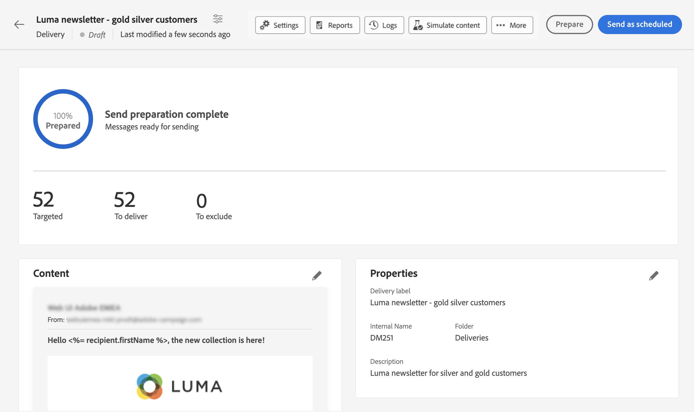

# Uw eerste e-mail verzenden {#first-email}

>[!CONTEXTUALHELP]
>id="acw_homepage_card2"
>title="Gen AI voor e-mailinhoud"
>abstract="Onze Gen AI-technologie maakt gebruik van geavanceerde algoritmen om bijzonder boeiende en gepersonaliseerde inhoud te genereren. U kunt hogere open snelheden, doorkliksnelheden en conversies aansturen met de intelligente productie van content van Gen AI. Blijf de wedstrijd voor en verhoog uw game voor e-mailmarketing met Gen AI op e-mailinhoud."

Leer hoe u uw eerste e-mailadres maakt waarvoor u een e-mail wilt schrijven. In dit geval plant u het verzenden van een e-mail naar leden van Silver en Gold-loyaliteit op een bepaalde datum.

Gebaseerd op een vooraf gedefinieerde [ontwerpsjabloon](../content/email-templates.md)Bovendien bevat de e-mail ook gepersonaliseerde inhoud op basis van de kenmerken van het klantprofiel.

## E-maillevering maken {#create-email}

>[!CONTEXTUALHELP]
>id="acw_deliveries_email_template_selection"
>title="Een e-mailsjabloon selecteren"
>abstract="Een e-mailmalplaatje is een specifieke leveringsconfiguratie die vooraf bepaalde montages, zoals typologieregels, verpersoonlijking of het verpletteren van parameters bevat. De malplaatjes worden bepaald in de de cliëntconsole van de Campagne."

>[!CONTEXTUALHELP]
>id="acw_deliveries_email_properties"
>title="Uw e-maileigenschappen definiëren"
>abstract="De eigenschappen zijn de gemeenschappelijke leveringsparameters die u helpen om uw levering te noemen en te classificeren. De extra instellingen zijn optioneel. Als uw levering is gebaseerd op een uitgebreid schema dat is gedefinieerd in de Adobe Campaign v8-console, zijn er enkele specifieke **Aangepaste opties** zijn beschikbaar."

U kunt een zelfstandige e-maillevering maken of een e-mailbericht maken in de context van een campagneworkflow. In de onderstaande stappen wordt de procedure beschreven voor een zelfstandige (one-shot) e-maillevering. Als u in de context van een campagnewerkstroom werkt, zijn de aanmaakstappen details in [deze sectie](../workflows/activities/channels.md#create-a-delivery-in-a-campaign-workflow).

Volg onderstaande stappen om een nieuwe, zelfstandige e-maillevering te maken.

1. Bladeren naar de **[!UICONTROL Deliveries]** op de linkerspoorstaaf en klik op  **[!UICONTROL Create delivery]** knop.

   

1. Selecteren **[!UICONTROL Email]** als het kanaal en kies een sjabloon voor e-maillevering in de lijst.

   >[!NOTE]
   >
   >Sjablonen zijn vooraf geconfigureerde leveringsinstellingen die zijn opgeslagen voor toekomstig gebruik. [Meer informatie](../msg/delivery-template.md)

   

1. Klik op de knop **[!UICONTROL Create delivery]** ter bevestiging.
1. Voer een label voor de levering in en configureer aanvullende opties op basis van uw behoeften:

   * **[!UICONTROL Internal name]**: wijs een unieke id toe aan de levering.
   * **[!UICONTROL Folder]**: sla de levering op in een specifieke map.
   * **[!UICONTROL Delivery code]**: gebruik dit veld om uw leveringen te ordenen op basis van uw eigen naamgevingsconventie.
   * **[!UICONTROL Description]**: geef een beschrijving voor de levering.
   * **[!UICONTROL Nature]**: specificeer de aard van de e-mail voor classificatiedoeleinden.<!--The content of the list is defined in the delivery template selected when creating the email.-->

   >[!NOTE]
   >
   >Als u uw schema met specifieke douanevelden hebt uitgebreid, kunt u tot hen in toegang hebben **[!UICONTROL Custom options]** sectie.

   

1. Bovendien zijn geavanceerde instellingen, zoals typologische regels en doeltoewijzingen, toegankelijk via de **[!UICONTROL Settings]** op de knop rechtsboven in het scherm. Deze instellingen zijn vooraf geconfigureerd in de geselecteerde sjabloon, maar kunnen zo nodig worden bewerkt voor deze specifieke e-mail. [Meer informatie](../advanced-settings/delivery-settings.md)

## De doelgroep definiëren {#define-audience}

>[!CONTEXTUALHELP]
>id="acw_deliveries_email_audience"
>title="Selecteer een publiek voor uw levering"
>abstract="Selecteer het beste publiek voor uw marketingbericht. U kunt een bestaand publiek kiezen (al gedefinieerd in een Campagne v8-instantie of in Adobe Experience Platform), een nieuw publiek maken met de functie voor het maken van regels of een bestand uploaden dat uw publiek bevat. Besturingsgroepen zijn niet ingeschakeld voor de **Selecteren uit bestand** en omgekeerd."
>additional-url="https://experienceleague.adobe.com/docs/campaign-web/v8/audiences/target-audiences/add-audience.html" text="Het grote publiek selecteren"
>additional-url="https://experienceleague.adobe.com/docs/campaign-web/v8/audiences/control-group.html" text="Een controlegroep instellen"

In dit geval stuurt u de e-mail naar een bestaand publiek.

Aanvullende instructies over het werken met het publiek zijn beschikbaar in [deze sectie](../audience/about-audiences.md).

1. Als u het publiek voor de e-mail wilt selecteren, klikt u op de knop **[!UICONTROL Select audience]** en kiest u een bestaand publiek in de lijst.

   In dit voorbeeld willen we een bestaand publiek gebruiken dat zich richt op klanten die behoren tot het niveau van de zilveren- en goudloyaliteitspunten.

   

   >[!NOTE]
   >
   >De soorten publiek die beschikbaar zijn in de lijst komen uit uw Campagne v8-instantie of uit Adobe Experience Platform als de integratie Doel/Bron op uw instantie is geconfigureerd. Dankzij deze integratie kunt u segmenten van het Experience Platform naar Adobe Campaign verzenden en de bezorging en het bijhouden van logbestanden van de campagne naar Adobe Experience Platform verzenden. Meer informatie over het werken met Campagne en Adobe Experience Platform in de [Campagne v8-documentatie (clientconsole)](https://experienceleague.adobe.com/docs/campaign/campaign-v8/connect/ac-aep/ac-aep.html){target="_blank"}.

1. Als het publiek is geselecteerd, kunt u het doel verder verfijnen door aanvullende regels toe te passen.

   

1. U kunt ook een controlegroep instellen om het gedrag van de e-mailontvangers te analyseren in vergelijking met degenen die niet als doelgroep werden gebruikt. [Leer hoe u met besturingsgroepen werkt](../audience/control-group.md)

## De e-mailcontent opgeven {#create-content}

Volg onderstaande stappen om uw e-mailinhoud te maken. In dit geval gebruikt u een vooraf gedefinieerde e-mail [leveringssjabloon](../msg/delivery-template.md) om uw e-mail te ontwerpen.<!--TBC delivery template or email content template?-->

<!--Detailed instructions on how to configure the email content are available in [this section](../content/edit-content.md).-->

1. Klik op het dashboard voor e-maillevering op de knop **[!UICONTROL Edit content]** knop.

   

   Hiermee gaat u naar een speciale interface waar u de e-mailinhoud kunt configureren en toegang kunt krijgen tot de e-mailontwerper. [Meer informatie](../content/edit-content.md)

   

1. Voer de onderwerpregel van uw e-mail in en pas deze aan met de Expressieeditor. [Leer hoe u uw inhoud kunt aanpassen](../personalization/personalize.md)

   

1. Als u de inhoud van de e-mail wilt ontwerpen, klikt u op de knop **[!UICONTROL Edit email body]** knop.

   Kies de methode die u wilt gebruiken om uw e-mailinhoud te maken. In dit voorbeeld gebruikt u een [vooraf gedefinieerde inhoudssjabloon](../msg/delivery-template.md).

   

1. Nadat u de sjabloon hebt geselecteerd, wordt deze weergegeven in het dialoogvenster [E-mailDesigner](../content/create-email-content.md), waar u eventueel noodzakelijke bewerkingen kunt uitvoeren en personalisatie kunt toevoegen.

   Als u bijvoorbeeld personalisatie wilt toevoegen aan de e-mailtitel, selecteert u het componentblok en klikt u op **[!UICONTROL Add Personalization]**.

   

1. Als u tevreden bent met de inhoud, slaat u het ontwerp op en sluit u het. Klikken **[!UICONTROL Save]** om terug te keren naar het scherm voor het maken van e-mail.

   

## Plan de verzending {#schedule}

Volg onderstaande stappen om het verzenden van de e-mail te plannen.

Aanvullende instructies voor het plannen van de verzending van de levering worden nader toegelicht in [deze sectie](../msg/gs-messages.md#gs-schedule).

1. Bladeren naar de **[!UICONTROL Schedule]** sectie.

1. Gebruik de **[!UICONTROL Enable scheduling]** schakelen om het te activeren.

1. Stel de gewenste datum en tijd in voor het verzenden.

   

Nadat u de levering hebt verzonden, begint de daadwerkelijke verzending op de door u gedefinieerde contactdatum.

## E-mail voorvertonen en testen {#preview-test}

Voordat u uw e-mail verzendt, kunt u een voorbeeld bekijken en testen of deze voldoet aan uw verwachtingen.

In dit geval bekijkt u een voorbeeld van de e-mail en verzendt u testversies naar specifieke e-mailadressen terwijl u zich aan enkele van de beoogde profielen aanpast.

Aanvullende informatie over het bekijken en testen van e-mails is beschikbaar in [deze sectie](../preview-test/preview-test.md).

1. Als u uw e-mail wilt bekijken, klikt u op **[!UICONTROL Review and send]**. Dit toont een voorproef van uw e-mail, samen met alle gevormde eigenschappen, publiek en programma. U kunt al deze elementen bewerken door op de knop Wijzigen te klikken.

1. Klik op de knop **[!UICONTROL Simulate content]** knop.

   

1. Selecteer links het profiel of de profielen die u wilt gebruiken voor een voorbeeld van het e-mailbericht.

   In het rechterdeelvenster ziet u een voorbeeld van de e-mail op basis van het geselecteerde profiel. Als u meerdere profielen hebt toegevoegd, kunt u tussen de profielen schakelen om een voorbeeld van de bijbehorende e-mail te bekijken.

   

   <!--Additionally, the **[!UICONTROL Render email]** button allows you to preview the email using mutiple devices or mail providers. Learn on how to preview email rendering
    -->

1. Als u testversies van uw e-mail wilt verzenden, klikt u op de knop **[!UICONTROL Test]** kiest u vervolgens de gewenste modus.

   In dit voorbeeld gebruikt u de opdracht **[!UICONTROL Substitute from main target]** -modus, die testversies naar specifieke e-mailadressen verzendt en tegelijkertijd enkele profielen nastreeft die in de e-mail worden genoemd.

   

1. Klikken **[!UICONTROL Add address]** en vermeld het e-mailadres of de e-mailadressen die de testversies ontvangen.

   Selecteer voor elk e-mailadres het profiel dat u wilt beleven. U kunt Adobe Campaign ook een willekeurig profiel van het doel laten selecteren.

   

1. Klikken **[!UICONTROL Send test email]** en de verzending bevestigen.

   Testversies worden naar de opgegeven e-mailadressen verzonden met behulp van het geselecteerde profiel met het **[Proef x]** voorvoegsel

   

   U kunt de status van de verzendende e-mail controleren en de verzonden teste-mails op elk gewenst moment openen door op de knop **[!UICONTROL View test email log]** in het scherm Inhoud simuleren.

## E-mail verzenden en controleren {#prepare-send}

Nadat u uw e-mail hebt bekeken en getest, kunt u de voorbereiding starten en verzenden.

1. Als u het voorbereiden van de e-mail wilt starten, klikt u op **[!UICONTROL Prepare]**. [Leer hoe u een e-mail voorbereidt](../monitor/prepare-send.md)

   

1. Als je e-mail klaar is om te worden verzonden, klik je op de knop **[!UICONTROL Send]** knop (of **[!UICONTROL Send as scheduled]** (als u de verzending hebt gepland) en bevestig de verzending.

1. Tijdens het verzendende proces, kunt u zijn vooruitgang volgen en statistieken in real time direct in dit scherm bekijken.

   

   U kunt gedetailleerde informatie over het verzenden ook toegang hebben door te klikken op **[!UICONTROL Logs]** knop. [Leer hoe u leveringslogboeken kunt controleren](../monitor/delivery-logs.md)

1. Nadat u het e-mailbericht hebt verzonden, kunt u specifieke rapporten voor verdere analyse openen door op de knop **[!UICONTROL Reporting]** knop.

