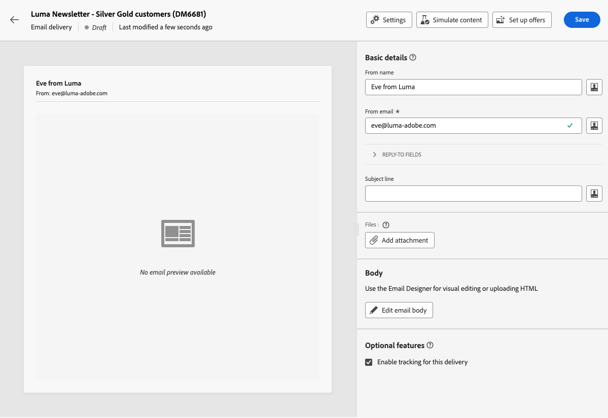

# E-mailinhoud configureren {#edit-content}

>[!CONTEXTUALHELP]
>id="acw_deliveries_email_content"
>title="De e-mailcontent opgeven"
>abstract="Het **geeft inhoud** scherm uit staat u toe om basiselementen van uw bericht, zoals het afzenderadres en onderwerpregel te bepalen, extra acties uit te voeren zoals toevoegend gehechtheid of aanbiedingen, en tot E-mail Designer toegang te hebben om uw bericht een gepolijst blik te geven."

>[!CONTEXTUALHELP]
>id="acw_deliveries_email_header"
>title="E-maileigenschappen instellen"
>abstract="De **Basisdetails** sectie staat u toe om het adres van de afzender en antwoord-aan adres bij te werken, en de onderwerpregel te bepalen gebruikend de Redacteur van de Uitdrukking."

>[!CONTEXTUALHELP]
>id="acw_deliveries_email_attachment"
>title="Bestanden bijvoegen bij uw e-mail"
>abstract="Selecteer een of meerdere bestanden die u in het bericht wilt invoegen. Om prestatieproblemen te voorkomen, wordt aanbevolen niet meer dan één bijlage per e-mail op te nemen."

>[!CONTEXTUALHELP]
>id="acw_deliveries_email_options"
>title="Tekstspatiëring bewerken"
>abstract="Door gebrek, wordt het volgen toegelaten voor de levering, die betekent alle verbindingen inbegrepen in de berichtinhoud worden gevolgd. U kunt deze optie hier uitschakelen."
>additional-url="https://experienceleague.adobe.com/en/docs/campaign-web/v8/content/email-design/design-content/message-tracking" text="Koppelingen toevoegen en berichten bijhouden"

Met het e-mailscherm **[!UICONTROL Edit content]** kunt u:

* Definieer de basiselementen van uw bericht, zoals het adres van de afzender en de onderwerpregel
* Extra handelingen uitvoeren, zoals bijlagen toevoegen of aanbiedingen instellen
* Heb toegang tot [ E-mail Designer ](get-started-email-designer.md#start-authoring) beginnen de juiste inhoud van uw e-mail te bouwen
* Voeg taalvarianten aan uw leveringen toe. [Meer informatie](../msg/multilingual.md)

>[!NOTE]
>
>Alle bewerkbare tekstvelden van dit scherm kunnen worden ingevuld met verpersoonlijkingsvelden. [ Leer hoe te om inhoud ](../personalization/personalize.md) te personaliseren

## De levering configureren

Volg onderstaande stappen om de inhoud van een e-mail te configureren of te bewerken.

1. Klik de **[!UICONTROL Edit content]** knoop van het [ e-mailleveringsdashboard ](../email/create-email.md) scherm.

   {zoomable="yes"}

1. Het e-mailinhoudsopgavescherm wordt geopend.

   {zoomable="yes"}

   >[!NOTE]
   >
   >Als u een nieuwe e-mail configureert, zijn de velden **[!UICONTROL From name]** en **[!UICONTROL From email]** al ingevuld.

1. Het veld **[!UICONTROL From name]** wordt gedefinieerd in de e-mailsjabloon. Als u deze wilt wijzigen, gebruikt u een naam die gemakkelijk kan worden herkend door de ontvangers, zoals de naam van uw merk, om de openingssnelheid van uw leveringen te verhogen.

   >[!NOTE]
   >
   >Als u de ervaring van de ontvanger verder wilt verbeteren, kunt u de naam van een persoon toevoegen, bijvoorbeeld &#39;Oefen van luminantie&#39;.

1. Het adresveld **[!UICONTROL From email]** wordt ook gedefinieerd in de e-mailsjabloon. Zorg ervoor dat het adresdomein overeenkomt met het subdomein dat u aan Adobe hebt gedelegeerd.

   >[!NOTE]
   >
   >U kunt het deel vóór &#39;@&#39; wijzigen, maar niet het domeinadres.

1. Vouw de sectie **[!UICONTROL Reply-to fields]** uit. De naam en het adres van de afzender worden door gebrek gebruikt voor antwoorden. Adobe raadt echter aan een bestaand reëel adres te gebruiken, zoals de klantenservice van uw merk. In dit geval, als een ontvanger een antwoord verzendt, zal het team van de klantenzorg het kunnen behandelen.

   {zoomable="yes"}

1. Geef de e-mail op **[!UICONTROL Subject line]** . Typ direct uw onderwerp in het specifieke gebied, of open de Redacteur van de Uitdrukking om [ verpersoonlijking ](../personalization/personalize.md) toe te voegen gebruikend diverse attributen, uitdrukkingsfragmenten, of aanbiedingen.

1. Als u een bestand bij de e-mail wilt voegen, klikt u op de knop **[!UICONTROL Add attachment]** en selecteert u een of meer bestanden.

   >[!NOTE]
   >
   >Om prestatieproblemen te voorkomen, wordt aanbevolen niet meer dan één bijlage per e-mail op te nemen.

   <!--limitation on size + number of files?-->

1. Als u aanbiedingen met uw e-mail wilt verzenden, selecteert u deze met de knop **[!UICONTROL Set up offers]** .

   Vervolgens kunt u deze bestanden in de e-mail invoegen met behulp van personalisatievelden. [ Leer hoe te om aanbiedingen te verzenden ](../msg/offers.md)

## De tekst van de e-mail bewerken

1. Klik de **[!UICONTROL Edit email body]** knoop om de inhoud van e-mail te structureren en te ontwerpen gebruikend [ E-mail Designer ](get-started-email-designer.md#start-authoring).

   >[!NOTE]
   >
   >U kunt de muisaanwijzer ook boven de voorvertoning van de e-mail plaatsen en **[!UICONTROL Open email designer]** selecteren.

   In deze secties vindt u aanvullende informatie over het ontwerpen van e-mailinhoud:

   * [E-mails van auteur helemaal opnieuw](create-email-content.md)
   * [Stijl uw inhoud](get-started-email-style.md)

1. Standaard is het bijhouden van gegevens ingeschakeld voor levering. U kunt deze optie uitschakelen in de sectie **[!UICONTROL Optional features]** . [ Leer hoe te om verbindingen toe te voegen en het volgen te beheren ](message-tracking.md)

1. Nadat de inhoud van uw e-mail is gedefinieerd, controleert u met de knop **[!UICONTROL Simulate content]** hoe het bericht wordt weergegeven voordat u het verzendt. [ Leer hoe te om uw e-mail ](../preview-test/preview-test.md) voor te vertonen en te testen.
