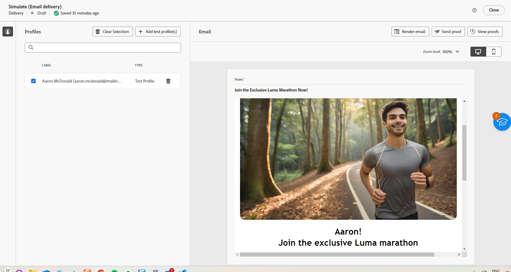

# E-mailgeneratie met AI Assistant {#generative-content}

>[!BEGINSHADEBOX]

**Inhoudsopgave**

* [Aan de slag met de AI Assistant](generative-gs.md)
* **[E-mailgeneratie met AI Assistant](generative-content.md)**
* [SMS genereren met de AI Assistant](generative-sms.md)
* [Pushmeldingen genereren met de AI Assistant](generative-push.md)

>[!ENDSHADEBOX]

Als u eenmaal uw e-mails hebt gemaakt en gepersonaliseerd, gebruikt u Journey Optimizer AI Assistant in Campagne, aangedreven door generatieve AI, om uw inhoud naar het volgende niveau te brengen.

De AI-assistent kan u helpen de impact van uw leveringen te optimaliseren door verschillende inhoud voor te stellen die waarschijnlijk beter op uw publiek zal reageren.

>[!NOTE]
>
>Lees de verwante bestanden voordat u deze functie gaat gebruiken [Afvoerkanalen en beperkingen](generative-gs.md#guardrails-and-limitations).

## Inhoud genereren met de AI Assistant {#generative-text}

Zo kunt u met uw AI-assistent aansprekende e-mails schrijven:

* **Samenvatten**: Met langdurige gegevens kunnen e-mailontvangers worden overbelast. Gebruik de AI-assistent om belangrijke punten samen te voegen tot heldere, beknopte samenvattingen die aandacht trekken en hen aanmoedigen om verder te lezen.

* **Uitwerken**: De AI-assistent kan u helpen bij het uitvouwen van specifieke onderwerpen en biedt extra informatie voor een beter begrip en betrokkenheid.

* **Taal vereenvoudigen**: Gebruik de AI-assistent om uw taal te vereenvoudigen, zodat een groter publiek helderheid en toegankelijkheid krijgt.

* **Herhalen**:De AI-assistent kan uw bericht op verschillende manieren herformuleren, zodat u steeds fris schrijft en aantrekkelijk wordt voor verschillende soorten publiek.

* **Kleur wijzigen**: De toon van uw e-mailbericht moet met uw publiek overeenkomen. Of u informatief wilt klinken, playful, of overtuigend, de Medewerker van AI kan het bericht dienovereenkomstig aanpassen.

In het volgende voorbeeld gebruiken we de AI-assistent om de inhoud van onze e-mailuitnodiging voor onze aanstaande gebeurtenis te verbeteren.

1. Nadat u de e-maillevering hebt gemaakt en geconfigureerd, klikt u op **[!UICONTROL Edit content]**.

   Voor meer informatie over hoe te om uw e-maillevering te vormen, verwijs naar [deze pagina](../email/create-email-content.md).

1. Pas uw e-mail naar wens aan en open de **[!UICONTROL AI Assistant]** -menu.

   U kunt ook een **[!UICONTROL Text component]** als u alleen een specifieke inhoud als doel wilt instellen.

   {zoomable=&quot;yes&quot;}

1. De optie **[!UICONTROL Use original content]** in dat geval past de AI Assistant de nieuwe inhoud aan op basis van uw levering, de naam van de levering en het geselecteerde publiek.

   >[!IMPORTANT]
   >
   > Uw vraag moet altijd aan een specifieke context worden gekoppeld door een merkmiddel te uploaden of het **[!UICONTROL Enhance current content]** -optie.

1. Perfectioneer de inhoud door te beschrijven wat u in wilt produceren **[!UICONTROL Prompt]** veld.

   Als u hulp bij het ontwerpen van uw herinnering zoekt, toegang tot **[!UICONTROL Prompt Library]** Dit biedt diverse snelle ideeën om uw leveringen te verbeteren.

   {zoomable=&quot;yes&quot;}

1. U kunt schakelen tussen **[!UICONTROL Subject line]** of **[!UICONTROL Preheader]** om ze op te nemen in de ontwikkeling van de variant.

   Dit is beschikbaar als u geen specifieke tekstcomponent hebt geselecteerd.

1. Klikken **[!UICONTROL Upload brand asset]** om merkelementen toe te voegen die inhoud bevatten die extra context kan bieden, gebruikt de AI Assistant.

   {zoomable=&quot;yes&quot;}

1. Volg uw vraag met de verschillende opties:

   * **[!UICONTROL Communication strategy]**: Selecteer de gewenste communicatieaanpak voor de gegenereerde tekst.
   * **[!UICONTROL Language]**: Kies de taal voor de inhoud van de variant.
   * **[!UICONTROL Tone]**: Zorg ervoor dat de tekst geschikt is voor uw publiek en doel.
   * **[!UICONTROL Lenght]**: Selecteer de lengte van de inhoud met de schuifregelaar voor het bereik. Deze optie is alleen beschikbaar als u een specifieke tekstcomponent hebt geselecteerd.

   {zoomable=&quot;yes&quot;}

1. Zodra uw herinnering klaar is, klik **[!UICONTROL Generate]**.

1. Door de gegenereerde **[!UICONTROL Variations]** en klik op **[!UICONTROL Preview]** om een versie van de geselecteerde variatie op het volledige scherm weer te geven.

1. Ga naar de **[!UICONTROL Refine]** in de **[!UICONTROL Preview]** voor toegang tot extra aanpassingsfuncties en om uw variatie af te stemmen op uw voorkeuren.

   Klikken **[!UICONTROL Select]** zodra u de juiste inhoud hebt gevonden.

   {zoomable=&quot;yes&quot;}

1. Voeg verpersoonlijkingsgebieden in om uw e-mailinhoud aan te passen die op profielgegevens wordt gebaseerd. Klik vervolgens op de knop **[!UICONTROL Simulate content]** om de rendering te beheren en personalisatie-instellingen te controleren met testprofielen. [Meer informatie](../preview-test/preview-content.md)

   {zoomable=&quot;yes&quot;}

Wanneer u uw inhoud, publiek en planning hebt gedefinieerd, kunt u uw e-maillevering voorbereiden. [Meer informatie](../monitor/prepare-send.md)

## Afbeeldingen genereren met de AI-assistent {#generative-image}

Gebruik de AI Assistant om verschillende en op maat gemaakte visuele elementen te genereren voor uw e-mailcampagnes. U kunt het bijvoorbeeld gebruiken om:

* **Genereren**: Genereer een uiteenlopende reeks aansprekende afbeeldingen die speciaal zijn ontworpen voor uw e-mailcampagnes. Met korrelige controle over instellingen zoals kleurenpalet, bliksemschicht en compositie kunt u resoneren met verschillende publiekssegmenten en uw unieke campagnedoelstellingen bereiken.

* **Vergelijkbaar genereren**: Gebruik de AI-assistent om afbeeldingen te genereren die vergelijkbaar zijn met een geselecteerde variant.

* **Merk**: Optimaliseer de selectie van afbeeldingen voor e-mailcampagnes door gebruik te maken van zowel interne merkmiddelen als externe bronnen, zoals Adobe Firefly.

In het onderstaande voorbeeld leert u hoe u de AI Assistant kunt gebruiken om uw inhoud te optimaliseren en te verbeteren, zodat u een gebruiksvriendelijker ervaring hebt. Voer de volgende stappen uit:

1. Nadat u de e-maillevering hebt gemaakt en geconfigureerd, klikt u op **[!UICONTROL Edit content]**.

   Voor meer informatie over hoe te om uw e-maillevering te vormen, verwijs naar [deze pagina](../email/create-email-content.md).

1. Vul de **[!UICONTROL Basic details]** voor levering. Klik op **[!UICONTROL Edit email content]**.

1. Selecteer het element dat u wilt wijzigen met de AI-assistent.

1. Selecteer in het rechtermenu de optie **[!UICONTROL AI Assistant]**.

   {zoomable=&quot;yes&quot;}

1. Perfectioneer de inhoud door te beschrijven wat u in wilt produceren **[!UICONTROL Prompt]** veld.

   Als u hulp bij het ontwerpen van uw herinnering zoekt, toegang tot **[!UICONTROL Prompt Library]** Dit biedt diverse snelle ideeën om uw leveringen te verbeteren.

   {zoomable=&quot;yes&quot;}

1. Klikken **[!UICONTROL Upload brand asset]** om merkelementen toe te voegen die inhoud bevatten die extra context kan bieden, gebruikt de AI Assistant.

   >[!IMPORTANT]
   >
   > Uw vraag moet altijd aan een specifieke context worden gebonden.

1. Volg uw vraag met de verschillende opties:

   * **[!UICONTROL Aspect ratio]**: Hiermee bepaalt u de breedte en hoogte van het element. U kunt kiezen uit veelgebruikte verhoudingen, zoals 16:9, 4:3, 3:2 of 1:1, of u kunt een aangepaste grootte invoeren.
   * **[!UICONTROL Color & tone]**: De algemene weergave van de kleuren in een afbeelding en de sfeer die of de sfeer die door de afbeelding wordt overgebracht.
   * **[!UICONTROL Content type]**: Hiermee categoriseert u de aard van het visuele element, waarbij onderscheid wordt gemaakt tussen verschillende vormen van visuele representatie, zoals foto&#39;s, afbeeldingen of illustraties.
   * **[!UICONTROL Lighting]**: Dit verwijst naar de bliksemschicht in een afbeelding, die de atmosfeer bepaalt en specifieke elementen markeert.
   * **[!UICONTROL Composition]**: Dit verwijst naar de rangschikking van elementen binnen het kader van een afbeelding

   {zoomable=&quot;yes&quot;}

1. Zodra u met uw snelle configuratie tevreden bent, klik **[!UICONTROL Generate]**.

1. Bladeren in het dialoogvenster **[!UICONTROL Variation suggestions]** om het gewenste element te zoeken.

   Klikken **[!UICONTROL Preview]** om een versie van de geselecteerde variatie op het volledige scherm weer te geven.

   {zoomable=&quot;yes&quot;}

1. Kies **[!UICONTROL Show Similar]** als u verwante afbeeldingen van deze variant wilt bekijken.

1. Klikken **[!UICONTROL Select]** zodra u de juiste inhoud hebt gevonden.

   {zoomable=&quot;yes&quot;}

1. Nadat u de inhoud van uw bericht hebt gedefinieerd, klikt u op de knop **[!UICONTROL Simulate content]** om de rendering te beheren en personalisatie-instellingen te controleren met testprofielen.  [Meer informatie](../preview-test/preview-content.md)

   {zoomable=&quot;yes&quot;}

1. Wanneer u uw inhoud, publiek en planning hebt gedefinieerd, kunt u uw e-maillevering voorbereiden. [Meer informatie](../monitor/prepare-send.md)
