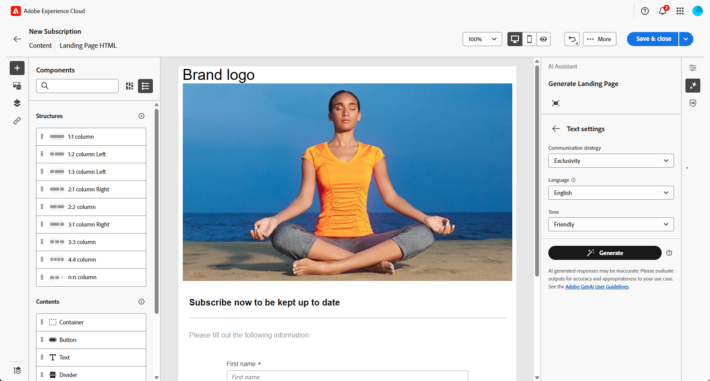

# Pagina&#39;s genereren met de AI Assistant{#generative-lp}

>[!CONTEXTUALHELP]
>id="acw_homepage_welcome_rn5"
>title="Landingspagina&#39;s genereren met AI"
>abstract="U kunt nu de AI Assistant gebruiken om uw openingspagina-items te maken, zodat u tekst, afbeeldingen of volledige paginalay-outs kunt genereren."
>additional-url="https://experienceleague.adobe.com/docs/campaign-web/v8/release-notes/release-notes.html" text="Zie opmerkingen bij releases"

>[!IMPORTANT]
>
>Alvorens te beginnen gebruikend dit vermogen, lees verwante [ Grafieken en Beperkingen ](generative-gs.md#generative-guardrails).
> 
>
>U moet met a [ gebruikersovereenkomst ](https://www.adobe.com/legal/licenses-terms/adobe-dx-gen-ai-user-guidelines.html) akkoord gaan alvorens u de Medewerker AI in het Web van Adobe Campaign kunt gebruiken. Neem voor meer informatie contact op met uw Adobe-vertegenwoordiger.

Transformeer uw landingspagina&#39;s met de AI Assistant in Adobe Campaign Web, aangedreven door generatieve AI.

Creëer moeiteloos impactvolle inhoud, waaronder complete pagina&#39;s, op maat gemaakte tekstfragmenten en aangepaste visuele voorbeelden die op uw publiek zijn afgestemd, waardoor uw betrokkenheid en interactie toenemen.

Bekijk de onderstaande tabbladen om te leren hoe u de AI Assistant in Adobe Campaign Web kunt gebruiken.

>[!BEGINTABS]

>[!TAB  Volledige het landen paginageneratie ]

In het volgende voorbeeld leert u hoe u de AI Assistant kunt gebruiken om een bestaande sjabloon voor een bestemmingspagina te verfijnen.

1. Klik op **[!UICONTROL Edit content]** nadat u de bestemmingspagina hebt gemaakt en geconfigureerd.

   Voor meer informatie over hoe te om uw het landen pagina te vormen, verwijs naar [ deze pagina ](../landing-pages/create-lp.md).

1. Pas de layout naar wens aan en open het menu **[!UICONTROL AI Assistant]** .

   {zoomable="yes"}

1. Schakel de optie **[!UICONTROL Use original content]** voor de AI-assistent in om nieuwe inhoud aan te passen op basis van de geselecteerde inhoud.

1. Stel de inhoud nauwkeurig af door te beschrijven wat u wilt genereren in het veld **[!UICONTROL Prompt]** .

   Als u hulp bij het maken van uw herinnering nodig hebt, toegang tot **[!UICONTROL Prompt Library]**, die een diverse waaier van snelle ideeën verstrekt om uw landende pagina te verbeteren.

   {zoomable="yes"}

1. Volg uw vraag met de optie **[!UICONTROL Text settings]** :

   * **[!UICONTROL Communication strategy]**: Kies de meest geschikte communicatiestijl voor de gegenereerde tekst.
   * **[!UICONTROL Tone]**: De tint van de bestemmingspagina moet op uw publiek reageren. Of u informatief wilt klinken, playful, of overtuigend, de Medewerker van AI kan het bericht dienovereenkomstig aanpassen.

   {zoomable="yes"}

1. Kies uw **[!UICONTROL Image settings]** :

   * **[!UICONTROL Content type]**: Categoriseer de aard van het visuele element, waarbij onderscheid wordt gemaakt tussen verschillende vormen van visuele representatie, zoals foto&#39;s, afbeeldingen of illustraties.
   * **[!UICONTROL Visual intensity]**: U kunt de invloed van de afbeelding bepalen door de intensiteit aan te passen. Bij een lagere instelling (2) wordt het uiterlijk zachter, terwijl bij een hogere instelling (10) de afbeelding levendiger wordt.
   * **[!UICONTROL Color & tone]**: pas de algemene weergave van de kleuren in een afbeelding en de stemming of atmosfeer die erin wordt weergegeven aan.
   * **[!UICONTROL Lighting]**: wijzig de belichting in een afbeelding om de atmosfeer te bepalen en specifieke elementen te markeren.
   * **[!UICONTROL Composition]** : Rangschik elementen in het kader van een afbeelding.

   {zoomable="yes"}

1. Klik in het menu **[!UICONTROL Brand assets]** op **[!UICONTROL Upload brand asset]** om merkelementen toe te voegen die aanvullende context bieden aan de AI-assistent, of selecteer een eerder geüpload element.

   Eerder geüploade bestanden zijn beschikbaar in de vervolgkeuzelijst **[!UICONTROL Uploaded brand assets]** . Schakel de elementen die u wilt opnemen in het genereren in of uit.

   {zoomable="yes"}

1. Klik op **[!UICONTROL Generate]** als de vraag gereed is.

1. Blader door de gegenereerde **[!UICONTROL Variations]** en klik op **[!UICONTROL Preview]** om een schermvullende versie van de geselecteerde variatie weer te geven.

1. Navigeer naar de optie **[!UICONTROL Refine]** in het **[!UICONTROL Preview]** -venster voor toegang tot extra aanpassingsfuncties:

   * **[!UICONTROL Rephrase]**: De AI-assistent kan uw bericht op verschillende manieren herformuleren, zodat u steeds fris schrijft en aantrekkelijk wordt voor verschillende soorten publiek.
   * **[!UICONTROL Use simpler language]**: Vereenvoudig uw taal voor meer duidelijkheid en toegankelijkheid voor een groter publiek.

   U kunt ook de **[!UICONTROL Tone]** en **[!UICONTROL Communication strategy]** van de tekst wijzigen.

   {zoomable="yes"}

1. Klik op **[!UICONTROL Select]** als u de juiste inhoud hebt gevonden.

1. Voeg verpersoonlijkingsgebieden in om uw het landen pagina inhoud aan te passen die op profielgegevens wordt gebaseerd. Klik vervolgens op de knop **[!UICONTROL Simulate content]** om de rendering te beheren en controleer de instellingen voor aanpassing met testprofielen. [Meer informatie](../landing-pages/create-lp.md#test-landing-page).

Wanneer de landingspagina gereed is, publiceert u deze om deze beschikbaar te maken voor gebruik in een bericht. [Meer informatie](../landing-pages/create-lp.md#publish-landing-page).

>[!TAB  Tekst slechts generatie ]

In het volgende voorbeeld leert u hoe u de AI Assistant kunt gebruiken om de inhoud van de landingspagina te verbeteren.

1. Klik op **[!UICONTROL Edit content]** nadat u de bestemmingspagina hebt gemaakt en geconfigureerd.

   Voor meer informatie over hoe te om uw het landen pagina te vormen, verwijs naar [ deze pagina ](../landing-pages/create-lp.md).

1. Selecteer een **[!UICONTROL Text component]** om specifieke inhoud als doel in te stellen en open het menu **[!UICONTROL AI Assistant]** .

   {zoomable="yes"}

1. Schakel de optie **[!UICONTROL Use original content]** voor de AI-assistent in om nieuwe inhoud aan te passen op basis van de geselecteerde inhoud.

1. Stel de inhoud nauwkeurig af door te beschrijven wat u wilt genereren in het veld **[!UICONTROL Prompt]** .

   Als u hulp bij het maken van uw herinnering nodig hebt, toegang tot **[!UICONTROL Prompt Library]**, die een diverse waaier van snelle ideeën verstrekt om uw landende pagina&#39;s te verbeteren.

   {zoomable="yes"}

1. Volg uw vraag met de optie **[!UICONTROL Text settings]** :

   * **[!UICONTROL Communication strategy]**: Kies de meest geschikte communicatiestijl voor de gegenereerde tekst.
   * **[!UICONTROL Tone]**: De tint van de bestemmingspagina moet op uw publiek reageren. Of u informatief wilt klinken, playful, of overtuigend, de Medewerker van AI kan het bericht dienovereenkomstig aanpassen.
   * **Lengte van de Tekst**: Gebruik de schuif om de gewenste lengte van uw tekst te selecteren.

   {zoomable="yes"}

1. Klik in het menu **[!UICONTROL Brand assets]** op **[!UICONTROL Upload brand asset]** om merkelementen toe te voegen die aanvullende context bieden aan de AI-assistent, of selecteer een eerder geüpload element.

   Eerder geüploade bestanden zijn beschikbaar in de vervolgkeuzelijst **[!UICONTROL Uploaded brand assets]** . Schakel de elementen die u wilt opnemen in het genereren in of uit.

   {zoomable="yes"}

1. Klik op **[!UICONTROL Generate]** als de vraag gereed is.

1. Blader door de gegenereerde **[!UICONTROL Variations]** en klik op **[!UICONTROL Preview]** om een schermvullende versie van de geselecteerde variatie weer te geven.

1. Navigeer naar de optie **[!UICONTROL Refine]** in het **[!UICONTROL Preview]** -venster voor toegang tot extra aanpassingsfuncties:

   * **[!UICONTROL Use as reference content]**: De gekozen variant zal als verwijzingsinhoud voor het produceren van andere resultaten dienen.
   * **[!UICONTROL Elaborate]**: ga verder met specifieke onderwerpen en geef meer details voor een beter begrip en betrokkenheid.
   * **[!UICONTROL Summarize]**: Beperk lange informatie tot heldere, beknopte samenvattingen die aandacht trekken en verdere lezen aanmoedigen.
   * **[!UICONTROL Rephrase]**: herhaal uw bericht op verschillende manieren, zodat u steeds fris schrijft en aantrekkelijk bent voor verschillende soorten publiek.
   * **[!UICONTROL Use simpler language]**: Vereenvoudig uw taal voor meer duidelijkheid en toegankelijkheid voor een groter publiek.

   U kunt ook de **[!UICONTROL Tone]** en **[!UICONTROL Communication strategy]** van de tekst wijzigen.

   {zoomable="yes"}

1. Klik op **[!UICONTROL Select]** als u de juiste inhoud hebt gevonden.

1. Voeg verpersoonlijkingsgebieden in om uw het landen pagina inhoud aan te passen die op profielgegevens wordt gebaseerd. Klik vervolgens op de knop **[!UICONTROL Simulate content]** om de rendering te beheren en controleer de instellingen voor aanpassing met testprofielen. [Meer informatie](../landing-pages/create-lp.md#test-landing-page).

Wanneer de landingspagina gereed is, publiceert u deze om deze beschikbaar te maken voor gebruik in een bericht. [Meer informatie](../landing-pages/create-lp.md#publish-landing-page).

>[!TAB  slechts generatie van het Beeld ]

In het onderstaande voorbeeld leert u hoe u de AI Assistant kunt gebruiken om uw middelen te optimaliseren en te verbeteren, zodat u een gebruiksvriendelijker ervaring hebt.

1. Klik op **[!UICONTROL Edit content]** nadat u de bestemmingspagina hebt gemaakt en geconfigureerd.

   Voor meer informatie over hoe te om uw het landen pagina te vormen, verwijs naar [ deze pagina ](../landing-pages/create-lp.md).

1. Selecteer het element dat u wilt wijzigen met de AI-assistent.

1. Selecteer **[!UICONTROL AI Assistant]** in het rechtermenu.

   {zoomable="yes"}

1. Schakel de optie **[!UICONTROL Reference style]** voor de AI-assistent in om nieuwe inhoud aan te passen op basis van de referentie-inhoud. U kunt ook een afbeelding uploaden om context aan uw variatie toe te voegen.

1. Stel de inhoud nauwkeurig af door te beschrijven wat u wilt genereren in het veld **[!UICONTROL Prompt]** .

   Als u hulp bij het maken van uw herinnering nodig hebt, toegang tot **[!UICONTROL Prompt Library]**, die een diverse waaier van snelle ideeën verstrekt om uw landende pagina&#39;s te verbeteren.

   {zoomable="yes"}

1. Volg uw vraag met de optie **[!UICONTROL Image settings]** :

   * **[!UICONTROL Aspect ratio]** - Bepaal de breedte en hoogte van het element. Kies een gebruikelijke verhouding, zoals 16:9, 4:3, 3:2 of 1:1, of voer een aangepaste grootte in.
   * **[!UICONTROL Content type]**: Categoriseer de aard van het visuele element, waarbij onderscheid wordt gemaakt tussen verschillende vormen van visuele representatie, zoals foto&#39;s, afbeeldingen of illustraties.
   * **[!UICONTROL Visual intensity]**: U kunt de invloed van de afbeelding bepalen door de intensiteit aan te passen. Bij een lagere instelling (2) wordt het uiterlijk zachter, terwijl bij een hogere instelling (10) de afbeelding levendiger wordt.
   * **[!UICONTROL Color & tone]**: pas de algemene weergave van de kleuren in een afbeelding en de stemming of atmosfeer die erin wordt weergegeven aan.
   * **[!UICONTROL Lighting]**: wijzig de belichting in een afbeelding om de atmosfeer te bepalen en specifieke elementen te markeren.
   * **[!UICONTROL Composition]** : Rangschik elementen in het kader van een afbeelding.

   {zoomable="yes"}

1. Klik in het menu **[!UICONTROL Brand assets]** op **[!UICONTROL Upload brand asset]** om merkelementen toe te voegen die aanvullende context bieden aan de AI-assistent, of selecteer een eerder geüpload element.

   Eerder geüploade bestanden zijn beschikbaar in de vervolgkeuzelijst **[!UICONTROL Uploaded brand assets]** . Schakel de elementen die u wilt opnemen in het genereren in of uit.

1. Als u tevreden bent met de snelle configuratie, klikt u op **[!UICONTROL Generate]** .

1. Blader in **[!UICONTROL Variation suggestions]** om het gewenste element te zoeken.

   Klik op **[!UICONTROL Preview]** om een schermvullende versie van de geselecteerde variant weer te geven.

1. Kies **[!UICONTROL Generate Similar]** als u verwante afbeeldingen met deze variant wilt weergeven.

   {zoomable="yes"}

1. Klik op **[!UICONTROL Select]** als u de juiste inhoud hebt gevonden.

1. Nadat u de inhoud van uw bericht hebt gedefinieerd, klikt u op de knop **[!UICONTROL Simulate content]** om de weergave te beheren en de instellingen voor aanpassing te controleren met testprofielen. [Meer informatie](../landing-pages/create-lp.md#test-landing-page).

Wanneer de landingspagina gereed is, publiceert u deze om deze beschikbaar te maken voor gebruik in een bericht. [Meer informatie](../landing-pages/create-lp.md#publish-landing-page).

>[!ENDTABS]