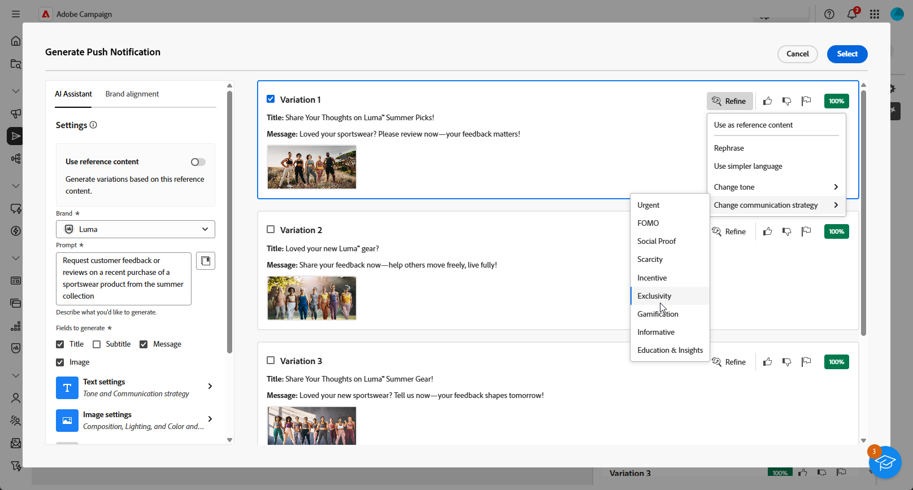

# Pushmeldingen genereren met de AI Assistant {#generative-push}

>[!BEGINSHADEBOX]

**Inhoudsopgave**

* [Aan de slag met de AI Assistant](generative-gs.md)
* [E-mailgeneratie met AI Assistant](generative-content.md)
* [SMS genereren met de AI Assistant](generative-sms.md)
* **[Pushmeldingen genereren met de AI Assistant](generative-push.md)**

>[!ENDSHADEBOX]

De AI-assistent kan u helpen de impact van uw leveringen te optimaliseren door verschillende inhoud voor te stellen die waarschijnlijk beter op uw publiek zal reageren.

>[!NOTE]
>
>Lees de verwante bestanden voordat u deze functie gaat gebruiken [Afvoerkanalen en beperkingen](generative-gs.md#guardrails-and-limitations).

In het volgende voorbeeld, zullen wij hefboomwerking de AI medewerker aan ambachtelijk dwingend overseinen om een aansprekender klantenervaring tot stand te brengen.

1. Nadat u de pushmelding hebt gemaakt en geconfigureerd, klikt u op **[!UICONTROL Edit content]**.

   Raadpleeg voor meer informatie over het configureren van de pushservice [deze pagina](../push/create-push.md).

1. Vul de **[!UICONTROL Basic details]** voor levering. Klik op **[!UICONTROL Edit content]**.

1. Pas uw pushmelding naar wens aan. [Meer informatie](../push/content-push.md)

1. Toegang krijgen tot de **[!UICONTROL Show AI Assistant]** -menu.

   {zoomable=&quot;yes&quot;}

1. De optie **[!UICONTROL Use original content]** in dat geval past de AI Assistant de nieuwe inhoud aan op basis van uw levering, de naam van de levering en het geselecteerde publiek.

   >[!IMPORTANT]
   >
   > Uw vraag moet altijd zijn gekoppeld aan uw huidige inhoud.

   {zoomable=&quot;yes&quot;}

1. Perfectioneer de inhoud door te beschrijven wat u in wilt produceren **[!UICONTROL Prompt]** veld.

   Als u hulp bij het ontwerpen van uw herinnering zoekt, toegang tot **[!UICONTROL Prompt Library]** Dit biedt diverse snelle ideeën om uw leveringen te verbeteren.

   {zoomable=&quot;yes&quot;}

1. Selecteren **[!UICONTROL Upload brand asset]** om merkelementen toe te voegen die inhoud bevatten die extra context kan bieden, gebruikt de AI Assistant.

1. Kies welk veld u wilt genereren: **[!UICONTROL Title]**, **[!UICONTROL Subtitle]** of **[!UICONTROL Message]**.

1. Volg uw vraag met de verschillende opties:

   * **[!UICONTROL Communication strategy]**: Kies de meest geschikte communicatiestijl voor de gegenereerde tekst.
   * **[!UICONTROL Language]**: Selecteer de taal waarin u de inhoud wilt genereren.
   * **[!UICONTROL Tone]**: De toon van uw e-mailbericht moet met uw publiek overeenkomen. Of u informatief wilt klinken, playful, of overtuigend, de Medewerker van AI kan het bericht dienovereenkomstig aanpassen.

   {zoomable=&quot;yes&quot;}

1. Zodra uw herinnering klaar is, klik **[!UICONTROL Generate]**.

1. Door de gegenereerde **[!UICONTROL Variations]** en klik op **[!UICONTROL Preview]** om een versie van de geselecteerde variatie op het volledige scherm weer te geven.

1. Ga naar de **[!UICONTROL Refine]** in de **[!UICONTROL Preview]** venster voor toegang tot extra aanpassingsfuncties:

   * **[!UICONTROL Use as reference content]**: De gekozen variant dient als referentie-inhoud voor het genereren van andere resultaten.

   * **[!UICONTROL Rephrase]**: De AI-assistent kan uw bericht op verschillende manieren herformuleren, zodat u steeds fris schrijft en aantrekkelijk wordt voor verschillende soorten publiek.

   * **[!UICONTROL Use simpler language]**: Gebruik de AI-assistent om uw taal te vereenvoudigen, zodat een groter publiek helderheid en toegankelijkheid krijgt.

   {zoomable=&quot;yes&quot;}

1. Klikken **[!UICONTROL Select]** zodra u de juiste inhoud hebt gevonden.

1. Voeg verpersoonlijkingsgebieden in om uw e-mailinhoud aan te passen die op profielgegevens wordt gebaseerd. Klik vervolgens op de knop **[!UICONTROL Simulate content]** om de rendering te beheren en personalisatie-instellingen te controleren met testprofielen. [Meer informatie](../preview-test/preview-content.md)

   {zoomable=&quot;yes&quot;}

Wanneer u de inhoud, het publiek en het programma hebt gedefinieerd, kunt u de levering voorbereiden. [Meer informatie](../monitor/prepare-send.md)

