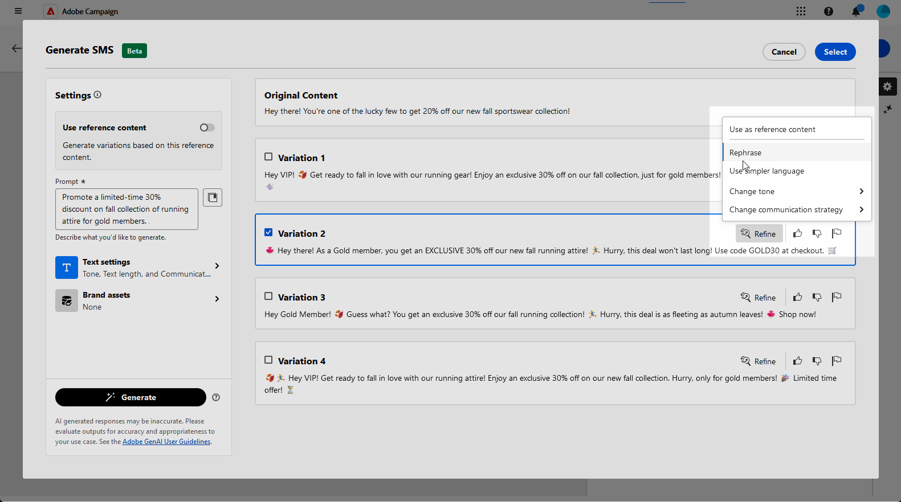

# SMS genereren met de AI Assistant Content Accelerator {#generative-sms}

>[!IMPORTANT]
>
>Alvorens te beginnen gebruikend dit vermogen, lees uit verwante [ Grafieken en Beperkingen ](generative-gs.md#generative-guardrails).
> 
>
>U moet met a [ gebruikersovereenkomst ](https://www.adobe.com/legal/licenses-terms/adobe-dx-gen-ai-user-guidelines.html) akkoord gaan alvorens u de AI HulpVersneller van de Inhoud in het Web van Adobe Campaign kunt gebruiken. Neem voor meer informatie contact op met uw Adobe-vertegenwoordiger.

Als u eenmaal uw SMS-berichten hebt gemaakt en gepersonaliseerd voor uw publiek, brengt u uw communicatie naar het volgende niveau met behulp van de AI Assistant Content Accelerator in Adobe Campaign Web, aangedreven door innovatieve AI-technologie.

Dit handige gereedschap biedt intelligente suggesties voor het verfijnen van uw inhoud, zodat uw berichten op een effectieve manier reageren en uw betrokkenheid maximaliseren.

>[!BEGINTABS]

>[!TAB  Volledige generatie van SMS ]

1. Klik op **[!UICONTROL Edit content]** nadat u de SMS-levering hebt gemaakt en geconfigureerd.

   Voor meer informatie over hoe te om uw levering van SMS te vormen, verwijs naar [ deze pagina ](../sms/create-sms.md).

1. Vul **[!UICONTROL Basic details]** in voor levering. Klik op **[!UICONTROL Edit content]** als u klaar bent.

1. Open het menu **[!UICONTROL Show AI Assistant]** .

   {zoomable="yes"}

1. Verfijn de inhoud door te beschrijven wat u wilt genereren in het veld **[!UICONTROL Prompt]** .

   Als u hulp bij het ontwerpen van uw herinnering zoekt, toegang **[!UICONTROL Prompt Library]** die een diverse waaier van snelle ideeën verstrekt om uw leveringen te verbeteren.

   {zoomable="yes"}

1. Volg uw vraag met de optie **[!UICONTROL Text settings]** :

   * **[!UICONTROL Communication strategy]**: Kies de meest geschikte communicatiestijl voor de gegenereerde tekst.
   * **[!UICONTROL Tone]**: De toon van uw e-mail zou met uw publiek moeten resoneren. Of u informatief wilt klinken, playful, of overtuigend, de Medewerker van AI kan het bericht dienovereenkomstig aanpassen.
   * **Lengte van de Tekst**: Gebruik de schuif om de gewenste lengte van uw tekst te selecteren.

   {zoomable="yes"}

1. Klik in het menu **[!UICONTROL Brand assets]** op **[!UICONTROL Upload brand asset]** om merkelementen toe te voegen die inhoud bevatten die aanvullende context voor de AI-assistent kan bieden of selecteer een eerder geüpload element.

   Eerder geüploade bestanden zijn beschikbaar in de vervolgkeuzelijst **[!UICONTROL Uploaded brand assets]** . Schakel eenvoudig de elementen in die u wilt opnemen in uw generatie.

1. Klik op **[!UICONTROL Generate]** als de vraag gereed is.

1. Blader door de gegenereerde **[!UICONTROL Variations]** tekst en klik op **[!UICONTROL Preview]** om een schermvullende versie van de geselecteerde variant weer te geven.

   {zoomable="yes"}

1. Navigeer naar de optie **[!UICONTROL Refine]** in het **[!UICONTROL Preview]** -venster voor toegang tot extra aanpassingsfuncties en perfectioneer uw variatie aan uw voorkeuren:

   * **[!UICONTROL Use as reference content]**: De gekozen variant zal als verwijzingsinhoud voor het produceren van andere resultaten dienen.

   * **[!UICONTROL Use simpler language]**: De AI-assistent helpt u duidelijke, beknopte berichten te schrijven die iedereen kan begrijpen.

   * **[!UICONTROL Rephrase]**: De AI-assistent hernoemt uw bericht om ervoor te zorgen dat alles aantrekkelijk blijft voor verschillende doelgroepen.

   U kunt ook de **[!UICONTROL Tone]** en **[!UICONTROL Communication strategy]** van de tekst wijzigen.

   {zoomable="yes"}

1. Klik op **[!UICONTROL Select]** zodra u de juiste inhoud hebt gevonden.

1. Voeg verpersoonlijkingsgebieden in om uw inhoud van SMS aan te passen die op profielgegevens wordt gebaseerd. [ Leer meer over inhoudstijdpersonalisatie ](../personalization/personalize.md)

   {zoomable="yes"}

1. Nadat u de inhoud van uw bericht hebt gedefinieerd, klikt u op de knop **[!UICONTROL Simulate content]** om de rendering te beheren en controleert u de instellingen voor de personalisatie met testprofielen. [Meer informatie](../preview-test/preview-content.md)

   {zoomable="yes"}

Wanneer u uw inhoud, publiek en planning hebt bepaald, bent u bereid om uw levering van SMS voor te bereiden. [Meer informatie](../monitor/prepare-send.md)

>[!TAB  Tekst slechts generatie ]

1. Klik op **[!UICONTROL Edit content]** nadat u de SMS-levering hebt gemaakt en geconfigureerd.

   Voor meer informatie over hoe te om uw levering van SMS te vormen, verwijs naar [ deze pagina ](../sms/create-sms.md).

1. Vul **[!UICONTROL Basic details]** in voor levering. Klik op **[!UICONTROL Edit content]** als u klaar bent.

1. Pas uw SMS-bericht naar wens aan. [Meer informatie](../sms/content-sms.md)

1. Open het menu **[!UICONTROL AI Assistant]** naast het veld **[!UICONTROL Message]** .

   {zoomable="yes"}

1. Schakel de optie **[!UICONTROL Use reference content]** voor de AI Assistant Content Accelerator in om nieuwe inhoud aan te passen op basis van de geselecteerde inhoud.

1. Verfijn de inhoud door te beschrijven wat u wilt genereren in het veld **[!UICONTROL Prompt]** .

   Als u hulp bij het ontwerpen van uw herinnering zoekt, toegang **[!UICONTROL Prompt Library]** die een diverse waaier van snelle ideeën verstrekt om uw campagnes te verbeteren.

   {zoomable="yes"}

1. Volg uw vraag met de optie **[!UICONTROL Text settings]** :

   * **[!UICONTROL Communication strategy]**: selecteer de gewenste communicatieaanpak voor de gegenereerde tekst.
   * **[!UICONTROL Language]**: Kies de taal voor de inhoud van de variant.
   * **[!UICONTROL Tone]**: zorg ervoor dat de tekst geschikt is voor uw publiek en doel.
   * **[!UICONTROL Length]**: selecteer de lengte van de inhoud met de schuifregelaar voor het bereik.

   {zoomable="yes"}

1. Klik in het menu **[!UICONTROL Brand assets]** op **[!UICONTROL Upload brand asset]** om merkelementen toe te voegen die inhoud bevatten die aanvullende context voor de AI-assistent kan bieden of selecteer een eerder geüpload element.

   Eerder geüploade bestanden zijn beschikbaar in de vervolgkeuzelijst **[!UICONTROL Uploaded brand assets]** . Schakel eenvoudig de elementen in die u wilt opnemen in uw generatie.

1. Klik op **[!UICONTROL Generate]** als de vraag gereed is.

1. Blader door de gegenereerde **[!UICONTROL Variations]** tekst en klik op **[!UICONTROL Preview]** om een schermvullende versie van de geselecteerde variant weer te geven.

1. Navigeer naar de optie **[!UICONTROL Refine]** in het **[!UICONTROL Preview]** -venster voor toegang tot extra aanpassingsfuncties en perfectioneer uw variatie aan uw voorkeuren:

   * **[!UICONTROL Use as reference content]**: De gekozen variant zal als verwijzingsinhoud voor het produceren van andere resultaten dienen.

   * **[!UICONTROL Rephrase]**:De AI-assistent kan uw bericht op verschillende manieren herformuleren, zodat u steeds fris schrijft en aantrekkelijk wordt voor verschillende soorten publiek.

   * **[!UICONTROL Use simpler language]**: Gebruik de AI Assistant om uw taal te vereenvoudigen, zodat een groter publiek helderheid en toegankelijkheid krijgt.

   U kunt ook de **[!UICONTROL Tone]** en **[!UICONTROL Communication strategy]** van de tekst wijzigen.

   {zoomable="yes"}

1. Klik op **[!UICONTROL Select]** zodra u de juiste inhoud hebt gevonden.

1. Voeg verpersoonlijkingsgebieden in om uw inhoud van SMS aan te passen die op profielgegevens wordt gebaseerd. [ Leer meer over inhoudstijdpersonalisatie ](../personalization/personalize.md)

1. Nadat u de inhoud van uw bericht hebt gedefinieerd, klikt u op de knop **[!UICONTROL Simulate content]** om de rendering te beheren en controleert u de instellingen voor de personalisatie met testprofielen. [Meer informatie](../preview-test/preview-content.md)

   {zoomable="yes"}

Wanneer u uw inhoud, publiek en planning hebt bepaald, bent u bereid om uw levering van SMS voor te bereiden. [Meer informatie](../monitor/prepare-send.md)

>[!ENDTABS]
