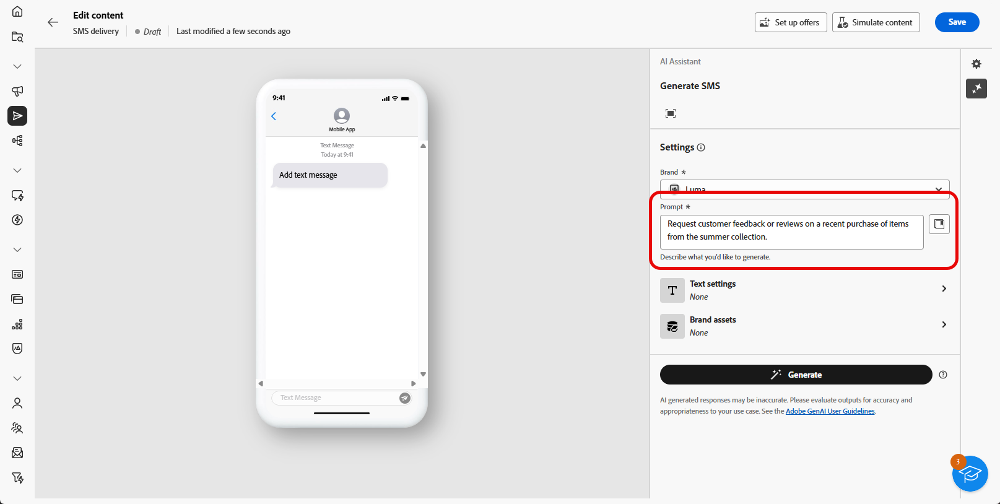

# SMS genereren met de AI Assistant {#generative-sms}

>[!BEGINSHADEBOX]

**Inhoudsopgave**

* [Aan de slag met de AI Assistant](generative-gs.md)
* [E-mailgeneratie met AI Assistant](generative-content.md)
* **[SMS genereren met de AI Assistant](generative-sms.md)**
* [Pushmeldingen genereren met de AI Assistant](generative-push.md)

>[!ENDSHADEBOX]

Zodra u uw SMS-berichten hebt gemaakt en gepersonaliseerd om uw publiek bij te komen, brengt u uw communicatie naar het volgende niveau met behulp van de AI Assistant in Campaign, aangedreven door innovatieve AI-technologie.

Dit handige gereedschap biedt intelligente suggesties voor het verfijnen van uw inhoud, zodat uw berichten op een effectieve manier reageren en uw betrokkenheid maximaliseren.

>[!NOTE]
>
>Lees de verwante bestanden voordat u deze functie gaat gebruiken [Afvoerkanalen en beperkingen](generative-gs.md#guardrails-and-limitations).

1. Nadat u de SMS-levering hebt gemaakt en geconfigureerd, klikt u op **[!UICONTROL Edit content]**.

   Voor meer informatie over hoe te om uw levering van SMS te vormen, verwijs naar [deze pagina](../sms/create-sms.md).

1. Vul de **[!UICONTROL Basic details]** voor levering. Klik op **[!UICONTROL Edit content]**.

1. Pas uw SMS-bericht naar wens aan. [Meer informatie](../sms/content-sms.md)

1. Toegang krijgen tot de **[!UICONTROL Show AI Assistant]** -menu.

   {zoomable=&quot;yes&quot;}

1. De optie **[!UICONTROL Use original content]** in dat geval past de AI Assistant de nieuwe inhoud aan op basis van uw levering, de naam van de levering en het geselecteerde publiek.

   >[!IMPORTANT]
   >
   > Uw vraag moet altijd aan een specifieke context worden gekoppeld door een merkmiddel te uploaden of het **[!UICONTROL Enhance current content]** -optie.

1. Perfectioneer de inhoud door te beschrijven wat u in wilt produceren **[!UICONTROL Prompt]** veld.

   Als u hulp bij het ontwerpen van uw herinnering zoekt, toegang tot **[!UICONTROL Prompt Library]** Dit biedt diverse snelle ideeën om uw leveringen te verbeteren.

   {zoomable=&quot;yes&quot;}

1. Selecteren **[!UICONTROL Upload brand asset]** om merkelementen toe te voegen die inhoud bevatten die extra context kan bieden, gebruikt de AI Assistant.

1. Volg uw vraag met de verschillende opties:

   * **[!UICONTROL Communication strategy]**: Selecteer de gewenste communicatieaanpak voor de gegenereerde tekst.
   * **[!UICONTROL Language]**: Kies de taal voor de inhoud van de variant.
   * **[!UICONTROL Tone]**: Zorg ervoor dat de tekst geschikt is voor uw publiek en doel.
   * **[!UICONTROL Length]**: Selecteer de lengte van de inhoud met de schuifregelaar voor het bereik.

   {zoomable=&quot;yes&quot;}

1. Zodra uw herinnering klaar is, klik **[!UICONTROL Generate]**.

1. Door de gegenereerde **[!UICONTROL Variations]** en klik op **[!UICONTROL Preview]** om een versie van de geselecteerde variatie op het volledige scherm weer te geven.

1. Ga naar de **[!UICONTROL Refine]** in de **[!UICONTROL Preview]** voor toegang tot extra aanpassingsfuncties en om uw variatie af te stemmen op uw voorkeuren:

   * **Taal vereenvoudigen**: De AI-assistent helpt u duidelijke, beknopte berichten te schrijven die iedereen kan begrijpen.

   * **Herhalen**: De AI-assistent hernoemt uw bericht om ervoor te zorgen dat de zaken aantrekkelijk blijven voor verschillende doelgroepen.

   {zoomable=&quot;yes&quot;}

1. Klikken **[!UICONTROL Select]** zodra u de juiste inhoud hebt gevonden.

1. Voeg verpersoonlijkingsgebieden in om uw inhoud van SMS aan te passen die op profielgegevens wordt gebaseerd. [Meer informatie over content personalization](../personalization/personalize.md)

   {zoomable=&quot;yes&quot;}

1. Nadat u de inhoud van uw bericht hebt gedefinieerd, klikt u op de knop **[!UICONTROL Simulate content]** om de rendering te beheren en personalisatie-instellingen te controleren met testprofielen. [Meer informatie](../preview-test/preview-content.md)

   {zoomable=&quot;yes&quot;}

Wanneer u uw inhoud, publiek en planning hebt bepaald, bent u bereid om uw levering van SMS voor te bereiden. [Meer informatie](../monitor/prepare-send.md)
