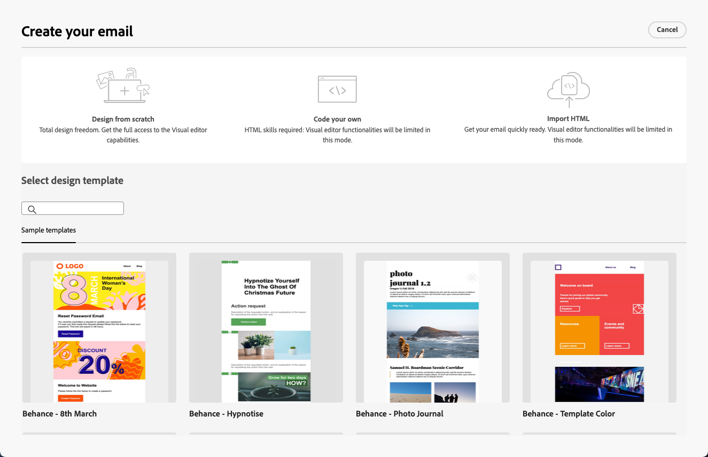

# Aan de slag met Email Designer {#get-started-email-designer}

>[!CONTEXTUALHELP]
>id="acw_homepage_welcome_rn3"
>title="Nieuwe e-mailontwerper"
>abstract="Met Campagne-e-mailontwerper kunt u fascinerende, individueel aangepaste e-mails maken via een intuïtieve interface voor slepen en neerzetten. Of u nu op een lege site begint, bestaande inhoud importeert of bestaande sjablonen gebruikt, ontwerpt en verfijnen alle inhoud voor elke e-mail!"
>additional-url="https://experienceleague.adobe.com/docs/campaign-web/v8/whats-new.html" text="Zie opmerkingen bij releases"

<!--TO REMOVE BELOW-->
>[!CONTEXTUALHELP]
>id="acw_homepage_rn3"
>title="Nieuwe e-mailontwerper"
>abstract="Met Campagne-e-mailontwerper kunt u fascinerende, individueel aangepaste e-mails maken via een intuïtieve interface voor slepen en neerzetten. Of u nu op een lege site begint, bestaande inhoud importeert of bestaande sjablonen gebruikt, ontwerpt en verfijnen alle inhoud voor elke e-mail!"
>additional-url="https://experienceleague.adobe.com/docs/campaign-web/v8/whats-new.html" text="Zie opmerkingen bij releases"

<!--TO REMOVE ABOVE-->

Nadat u in Adobe Campaign een e-mailbericht hebt gemaakt, moet u de content definiëren.

Met de e-mailontwerper kunt u fascinerende, individueel aangepaste e-mails maken via een intuïtieve interface voor slepen en neerzetten. Of u nu op een lege site begint, bestaande inhoud importeert of bestaande sjablonen gebruikt, u ontwerpt en verfijnen alle inhoud voor elke e-mail, of het nu gaat om speciale acties of transacties.

<!--Built to deliver HTML optimized for responsive design, the Email Designer allows you to easily define and apply visibility conditions and dynamic content to an email, template, or fragment directly through the user interface. You can seamlessly switch between the drag and drop interface and HTML code at the click of a button.

The Email Designer allows you to create email content and email content templates. It is compatible with simple emails, transactional emails, A/B test emails, multilingual emails, and recurring emails.-->

* Gebruiken [!DNL Campaign] e-mailontwerpmogelijkheden om responsieve e-mails te maken. [Meer informatie](create-email-content.md)

* Verbeter de ervaring van klanten door personaliseerd te creëren op basis van hun profielkenmerken. [Meer informatie](../personalization/personalize.md)

* Configureer voorwaardelijke inhoudsvelden om een dynamische personalisatie te maken op basis van het profiel van de ontvanger. [Meer informatie](../personalization/conditions.md)

## Aanbevolen werkwijzen voor e-mailontwerp {#best-practices}

Bij het verzenden van e-mails is het belangrijk om te bedenken dat ontvangers de berichten kunnen doorsturen, wat soms problemen kan veroorzaken met de weergave van de e-mail. Dit geldt met name wanneer u CSS-klassen gebruikt die mogelijk niet worden ondersteund door de e-mailprovider die wordt gebruikt voor het doorsturen, bijvoorbeeld wanneer u de CSS-klasse &#39;is-desktop-hidden&#39; gebruikt om een afbeelding op mobiele apparaten te verbergen.

Om deze weergaveproblemen tot een minimum te beperken, raden we u aan de structuur van uw e-mailontwerp zo eenvoudig mogelijk te houden. Probeer één ontwerp te gebruiken dat goed werkt voor zowel mobiele als desktopapparaten en gebruik geen complexe CSS-klassen of andere ontwerpelementen die mogelijk niet volledig door alle e-mailclients worden ondersteund. Door deze beste praktijken te volgen, kunt u helpen ervoor zorgen dat uw e-mails constant correct worden teruggegeven, ongeacht hoe zij door ontvangers worden bekeken of door:sturen.

## Beginnen met het ontwerpen van uw inhoud {#start-authoring}

Ga vanaf het dashboard voor e-maillevering door de [Inhoud bewerken](edit-content.md) scherm om de startpagina van E-mailontwerper te openen. Kies in dit venster hoe u uw e-mail wilt ontwerpen uit de volgende opties:

* **Ontwerp uw e-mail helemaal zelf** via de interface van de e-mailontwerper. Leer hoe u uw e-mailinhoud ontwerpt in [deze sectie](create-email-content.md).

* **Code of paste raw HTML** rechtstreeks in de e-mailontwerper. Leer hoe u uw eigen inhoud codeert in [deze sectie](code-content.md).

* **Bestaande HTML-inhoud importeren** uit een bestand of een ZIP-map. Leer hoe u e-mailinhoud importeert in [deze sectie](existing-content.md).

* **Bestaande inhoud selecteren** uit een lijst met ingebouwde of aangepaste sjablonen. Leer hoe u met e-mailsjablonen werkt [deze sectie](create-email-templates.md).

  
