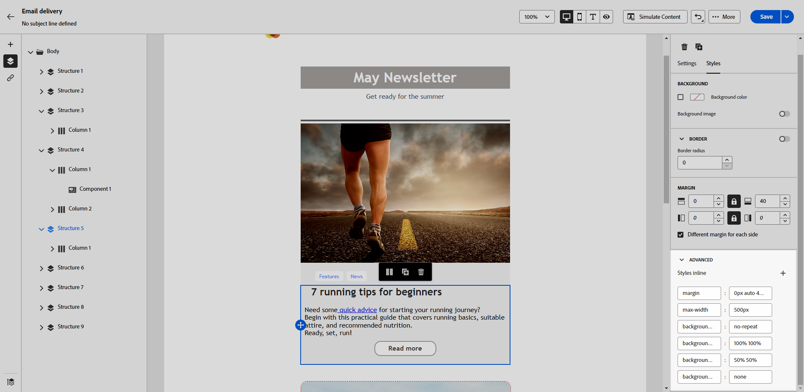

# Inline-opmaakkenmerken toevoegen {#adding-inline-styling-attributes}

Wanneer u in de interface E-mail-Designer een element selecteert en de bijbehorende instellingen in het rechterdeelvenster weergeeft, kunt u de inline-kenmerken en de bijbehorende waarde voor dat specifieke element aanpassen.

1. Selecteer een component rechtstreeks in de inhoud of gebruik de **[!UICONTROL Navigation tree]** -component die beschikbaar is in het linkerdeelvenster.

1. Klik op het tabblad **[!UICONTROL Styles]** op de vervolgkeuzelijst **[!UICONTROL Advanced]** .

   {zoomable="yes"}

1. Wijzig de waarden van de bestaande kenmerken.

1. U kunt nieuwe eigenschappen toevoegen gebruikend **+** knoop. U kunt alle kenmerken en waarden toevoegen die CSS-compatibel zijn.

   {zoomable="yes"}

De opmaak wordt toegepast op het geselecteerde element.

>[!NOTE]
>
>Als voor de onderliggende elementen geen specifieke stijlkenmerken zijn gedefinieerd, wordt de opmaak van het bovenliggende element overgeërfd.

