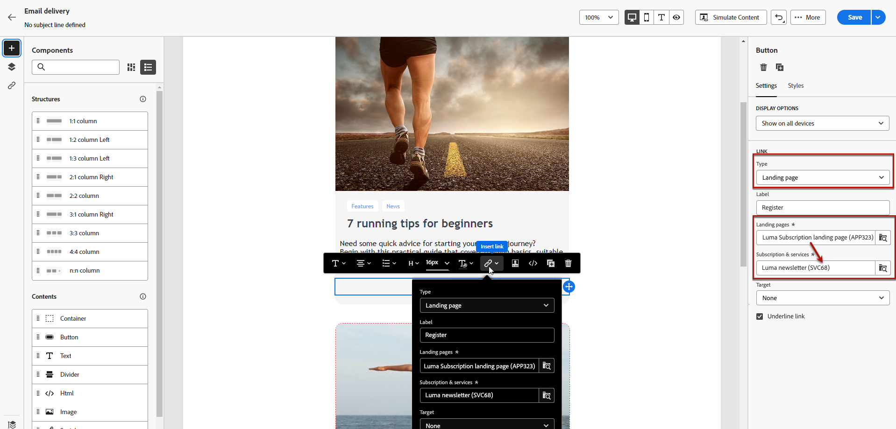
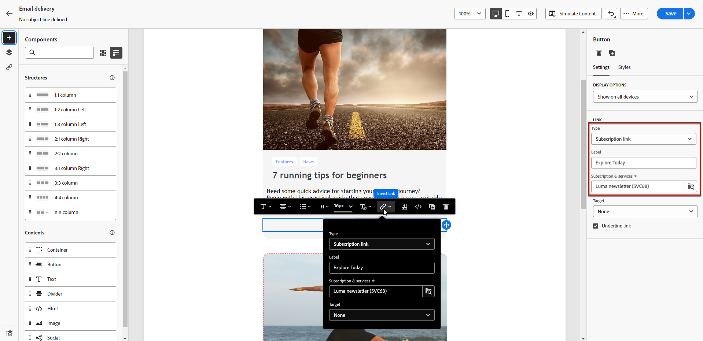

# Koppelingen toevoegen en berichten bijhouden {#tracking}

Gebruik de E-mail Designer om koppelingen naar uw inhoud toe te voegen en de verzonden berichten bij te houden, zodat u het gedrag van de ontvangers kunt controleren.

## Koppelingen invoegen {#insert-links}

Bij het ontwerpen van een bericht kunt u koppelingen naar uw inhoud toevoegen.

>[!NOTE]
>
>Wanneer het volgen wordt toegelaten, worden alle verbindingen inbegrepen in de berichtinhoud gevolgd.

Ga als volgt te werk om koppelingen in te voegen in uw e-mailinhoud:

1. Selecteer een element en klik op **[!UICONTROL Insert link]** op de contextuele werkbalk.

1. Kies het type koppeling dat u wilt maken:

   {zoomable="yes"}

   * **[!UICONTROL External link]**: voeg een koppeling in naar een externe URL.

   * **[!UICONTROL Landing page]**: voeg een koppeling in naar een bestemmingspagina. Als u een dynamische openingspagina selecteert (met de optie **[!UICONTROL Service from URL]** geselecteerd), kunt u om het even welke dienst van de lijst selecteren. [Meer informatie](../landing-pages/create-lp.md#define-actions-on-form-submission)

     {zoomable="yes"} tonen

   * **[!UICONTROL Subscription link]**: voeg een koppeling in naar een abonnementenservice. Wanneer gebruikers op de koppeling klikken, worden ze naar de bestemmingspagina van het abonnement verwezen in de geselecteerde service. [Meer informatie](../audience/manage-services.md#create-service)

     {zoomable="yes"}

   * **[!UICONTROL Unsubscription link]**: voeg een koppeling in naar een service zonder abonnement. Wanneer abonnees op de koppeling klikken, worden ze naar de bestemmingspagina geleid waarnaar in de geselecteerde service wordt verwezen. [Meer informatie](../audience/manage-services.md#create-service)

   <!--* **[!UICONTROL Mirror page]**: Add a link to display the email content in a web browser. [Learn more]-->

1. Voer de gewenste URL in het desbetreffende veld in of selecteer een openingspagina of een service en definieer de koppelingsinstellingen en -stijlen.

1. Voeg een **[!UICONTROL Label]** en een **[!UICONTROL Link]** toe.

1. Sla uw wijzigingen op.

1. Nadat u de koppeling hebt gemaakt, wijzigt u deze indien nodig via het tabblad **[!UICONTROL Settings]** .

   * Bewerk de koppeling en wijzig de **[!UICONTROL Target]** ervan.
   * Kies of u de koppeling wilt onderstrepen door de bijbehorende optie in te schakelen.

   {zoomable="yes"}

>[!NOTE]
>
>E-mailberichten van het type Marketing moeten een opt-out-koppeling bevatten, die niet vereist is voor transactiemeldingen. De berichtcategorie (**[!UICONTROL Marketing]** of **[!UICONTROL Transactional]**) wordt bepaald op het niveau van de kanaaloppervlakte en wanneer het creëren van het bericht.

Neem een specifieke koppeling naar de spiegel op in al uw e-mailberichten. Leer meer over de spiegelpagina in [&#x200B; deze sectie &#x200B;](mirror-page.md).

## Beheer van bijhouden {#manage-tracking}

[&#x200B; E-mail Designer &#x200B;](create-email-content.md) staat u toe om gevolgde URLs, zoals het uitgeven van het volgende type voor elke verbinding te beheren.

1. Klik op het pictogram **[!UICONTROL Links]** in het linkerdeelvenster om de lijst weer te geven met alle URL&#39;s in de inhoud die u wilt bijhouden.

   Deze lijst biedt een gecentraliseerde weergave en helpt u elke URL te vinden in de e-mailinhoud.

1. Als u een koppeling wilt bewerken, klikt u op het bijbehorende potloodpictogram.

   {zoomable="yes"}

1. Wijzig **[!UICONTROL Tracking Type]** indien nodig:

   {zoomable="yes"}

   Stel voor elke bijgehouden URL een van de volgende waarden in voor de modus Tekstspatiëring:

   * **[!UICONTROL Tracked]**: activeert tracering voor deze URL.
   * **[!UICONTROL Opt out]**: markeert deze URL als een opt-out- of niet-abonnements-URL.
   * **[!UICONTROL Mirror page]**: markeert deze URL als een URL van de spiegelpagina.
   * **[!UICONTROL Never]**: hiermee voorkomt u dat deze URL wordt bijgehouden. <!--This information is saved: if the URL appears again in a future message, its tracking is automatically deactivated.-->

1. Voeg een **[!UICONTROL Category]** aan uw koppeling toe om bijgehouden koppelingen te groeperen en klik op **[!UICONTROL Save]** .

   {zoomable="yes"} tonen

1. Na het verzenden van de levering hebt u toegang tot uw leveringsrapport. In het menu **[!UICONTROL Tracking]** geeft het rapport **[!UICONTROL URLs and click streams]** aan welke URL&#39;s van uw levering het meest zijn bezocht. [Meer informatie](../reporting/gs-reports.md)