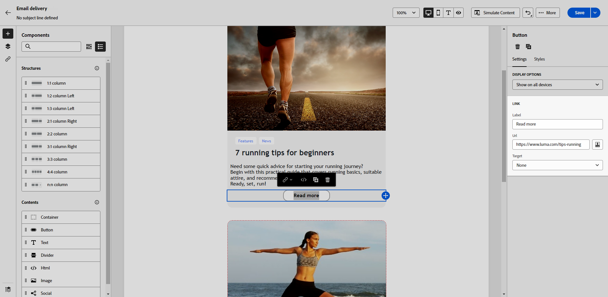

# Koppelingen toevoegen en berichten bijhouden {#tracking}

Gebruik de e-mailontwerper om koppelingen naar uw inhoud toe te voegen en de verzonden berichten bij te houden om het gedrag van de ontvangers te controleren.

## Koppelingen invoegen {#insert-links}

Bij het ontwerpen van een bericht kunt u koppelingen naar uw inhoud toevoegen.

>[!NOTE]
>
>Wanneer het volgen wordt toegelaten, worden alle verbindingen inbegrepen in de berichtinhoud gevolgd.

Volg onderstaande stappen om koppelingen in te voegen in uw e-mailinhoud:

1. Selecteer een element en klik op **[!UICONTROL Insert link]** in de contextuele werkbalk.

   {zoomable=&quot;yes&quot;}

1. Voeg een **[!UICONTROL Label]** en **[!UICONTROL Link]**.

1. Sla uw wijzigingen op.

1. Als de koppeling eenmaal is gemaakt, kunt u deze nog steeds wijzigen in het menu **[!UICONTROL Settings]** tab.

   * U kunt de koppeling bewerken en de koppeling wijzigen **[!UICONTROL Target]**.
   * U kunt de koppeling onderstrepen of niet door de bijbehorende optie in te schakelen.

   {zoomable=&quot;yes&quot;}

>[!NOTE]
>
>E-mailberichten van het type Marketing moeten een opt-out-koppeling bevatten, die niet vereist is voor transactiemeldingen. De berichtcategorie (**[!UICONTROL Marketing]** of **[!UICONTROL Transactional]**) wordt gedefinieerd op het niveau van het kanaaloppervlak (d.w.z. de berichtvoorinstelling) en bij het maken van het bericht.

In al uw e-mailberichten moet een specifieke koppeling naar de spiegel worden toegevoegd. Meer informatie over de spiegelpagina vindt u in [deze sectie](mirror-page.md).

## Beheer van bijhouden {#manage-tracking}

De [E-mailDesigner](create-email-content.md) Hiermee kunt u de bijgehouden URL&#39;s beheren, zoals het bewerken van het trackingtype voor elke koppeling.

1. Klik op de knop **[!UICONTROL Links]** in het linkerdeelvenster om de lijst weer te geven met alle URL&#39;s van de inhoud die u wilt bijhouden.

   In deze lijst kunt u een gecentraliseerde weergave gebruiken en elke URL in de e-mailinhoud opzoeken.

1. Als u een koppeling wilt bewerken, klikt u op het bijbehorende potloodpictogram.

   {zoomable=&quot;yes&quot;}

1. U kunt de **[!UICONTROL Tracking Type]** indien nodig:

   {zoomable=&quot;yes&quot;}

   Voor elke bijgehouden URL kunt u de modus Tekstspatiëring instellen op een van de volgende waarden:

   * **[!UICONTROL Tracked]**: activeert tracering op deze URL.
   * **[!UICONTROL Opt out]**: beschouwt deze URL als een opt-out- of niet-abonnements-URL.
   * **[!UICONTROL Mirror page]**: beschouwt deze URL als een URL van een spiegelpagina.
   * **[!UICONTROL Never]**: activeert het bijhouden van deze URL nooit. <!--This information is saved: if the URL appears again in a future message, its tracking is automatically deactivated.-->

1. Voeg een **[!UICONTROL Category]** naar uw koppeling om bijgehouden koppelingen te groeperen en klik op **[!UICONTROL Save]**.

   {zoomable=&quot;yes&quot;}

1. Na het verzenden van de levering hebt u toegang tot uw leveringsrapport. Onder de **[!UICONTROL Tracking]** in het menu **[!UICONTROL URLs and click streams]** het rapport toont welke URLs van uw levering het meest bezochte is. [Meer informatie](../reporting/gs-reports.md)
