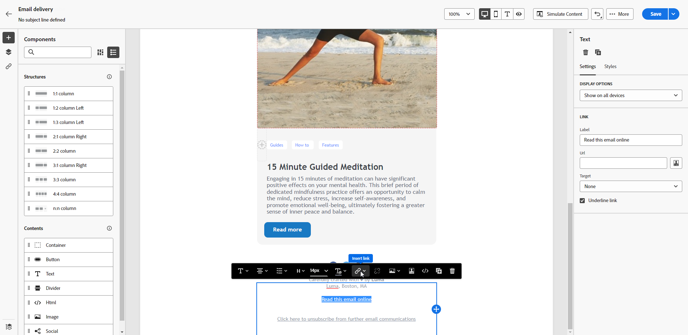

# Pagina spiegelen {#mirror-page}

De spiegelpagina is een online versie van uw e-mail. Het toevoegen van een koppeling naar de spiegel is een goede praktijk bij het in de handel brengen van e-mail. Gebruikers kunnen bijvoorbeeld toegang krijgen tot de spiegelpagina van een e-mailbericht als ze problemen ondervinden met het renderen of als ze de pagina in hun postvak bekijken. Het aanbieden van een onlineversie wordt ook aanbevolen om toegankelijkheidsredenen of om sociaal delen aan te moedigen.

De spiegelpagina die door Adobe Campaign wordt gegenereerd, bevat alle aanpassingsgegevens.

{width="600" align="left"}

## Een koppeling toevoegen aan de spiegelpagina {#link-to-mirror-page}

In Adobe Campaign, neem een verbinding aan de spiegelpagina in de e-mailinhoud op gebruikend het specifieke **verpersoonlijkingsblok**. De ingebouwde **Verbinding aan spiegelpagina** verpersoonlijkingsblok neemt de volgende code in uw e-mailinhoud op: `<%@ include view='MirrorPage' %>`.

Ga als volgt te werk als u een koppeling wilt toevoegen aan een spiegel in uw e-mail:

1. Selecteer een element (tekst of afbeelding) en klik op **[!UICONTROL Insert link]** op de contextafhankelijke werkbalk.

   {zoomable="yes"}

1. Selecteer het pictogram **[!UICONTROL Add personalization]** voor toegang tot het menu voor aanpassing.

   {zoomable="yes"}

1. Selecteer **[!UICONTROL Mirror page URL]** in het menu **[!UICONTROL Fragments]** en klik op **[!UICONTROL Add]** . [ Leer hoe te om uitdrukkingsfragmenten ](../content/use-expression-fragments.md) te gebruiken

   {zoomable="yes"}

De spiegelpagina wordt automatisch gemaakt.

Wanneer het e-mailbericht wordt verzonden, zien ontvangers die op de koppeling naar de spiegelpagina klikken de e-mailinhoud die in hun standaardwebbrowser wordt weergegeven.

Door gebrek, is de behoudperiode voor een spiegelpagina **60 dagen**. Na deze periode is de spiegelpagina niet meer beschikbaar.

>[!CAUTION]
>
>* Koppelingen naar spiegelpagina&#39;s worden automatisch gegenereerd en kunnen niet worden bewerkt. Ze bevatten alle gecodeerde, gepersonaliseerde gegevens die nodig zijn om de oorspronkelijke e-mail te renderen. Door gepersonaliseerde kenmerken met grote waarden te gebruiken, kunnen er lange spiegelpagina-URL&#39;s ontstaan, waardoor de koppeling niet kan werken in webbrowsers met een maximale URL-lengte.
>
>* In de proefdruk die naar testprofielen wordt verzonden, is de verbinding aan de spiegelpagina niet actief. Deze is alleen actief in de laatste berichten.

## Pagina genereren spiegelen {#mirror-page-generation}

Standaard genereert Adobe Campaign automatisch de spiegelpagina als de e-mailinhoud niet leeg is en een koppeling naar de spiegelpagina bevat (ook wel een Mirror-koppeling genoemd).

Bepaal de generatiemodus van de e-mailspiegelpagina door opties beschikbaar in de leveringseigenschappen. [Meer informatie](../advanced-settings/delivery-settings.md#mirror)