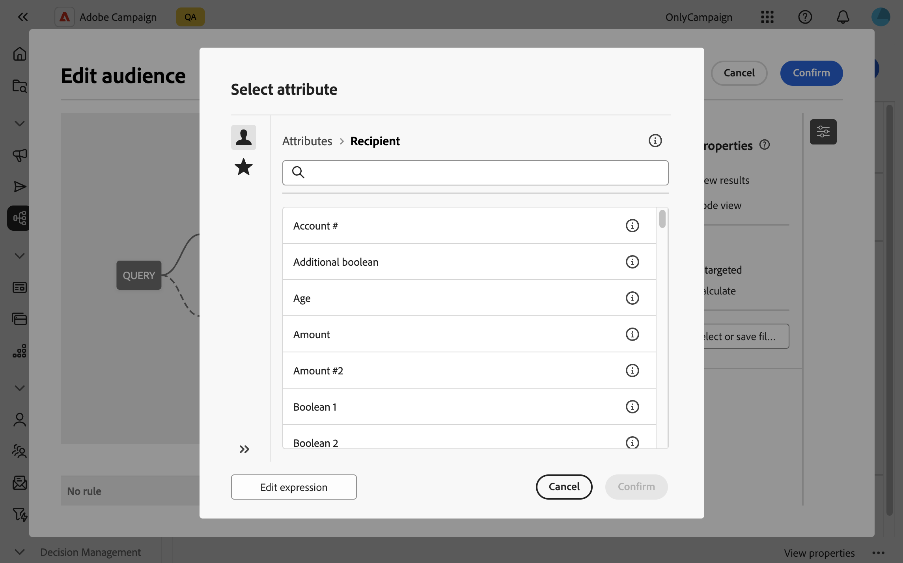

# Kenmerken selecteren en toevoegen aan favorieten {#folders}

De het gebruikersinterface van het Web van de Campagne staat gebruikers toe om attributen van het gegevensbestand bij diverse plaatsen te selecteren, afhankelijk van de actie die wordt uitgevoerd. Kenmerken kunnen bijvoorbeeld worden geselecteerd bij het definiëren van uitvoerkolommen voor direct mail of voor het uitpakken van een bestand. Op dezelfde manier kunnen de attributen worden geselecteerd wanneer het gebruiken van vraagmodeler om regels tot stand te brengen, filters, of publiek te bouwen.

Als u kenmerken die vaak worden gebruikt snel wilt hergebruiken, voegt u ze toe aan favorieten. Hierdoor zijn ze gemakkelijk toegankelijk voor toekomstige taken. Naast favorieten kunnen gebruikers ook de laatst geselecteerde kenmerken weergeven en gebruiken.

De interface verstrekt ook een distributie van waardesinstrument, dat u toestaat om de distributie van de waarden van een attribuut binnen een lijst visualiseren. Dit hulpmiddel helpt de waaier en de frequentie van waarden identificeren, die gegevensconsistentie verzekeren wanneer het creëren van vragen of uitdrukkingen.

## Favorieten en recente kenmerken {#favorites}

>[!CONTEXTUALHELP]
>id="acw_attribute_picker_favorites_recents"
>title="Favorieten en opmerkingen"
>abstract="Het menu **[!UICONTROL Favorites & Recents]** in de kenmerkkiezer biedt een geordende weergave van kenmerken die u aan favorieten hebt toegevoegd, samen met een lijst met onlangs gebruikte kenmerken. De favoriete attributen verschijnen eerst, gevolgd door onlangs gebruikte degenen, die het gemakkelijk maken om van de attributen de plaats te bepalen u wenst."

Het menu **[!UICONTROL Favorites & Recents]** in de kenmerkenkiezer biedt een geordende weergave van kenmerken die aan favorieten zijn toegevoegd, samen met een lijst met onlangs gebruikte kenmerken. Favoriete kenmerken worden als eerste weergegeven, gevolgd door recent gebruikte kenmerken, zodat u gemakkelijk de vereiste kenmerken kunt vinden.

Als u een kenmerk aan favorieten wilt toevoegen, klikt u op de knop Uitvouwen en selecteert u **[!UICONTROL Add to favorites]** . Het kenmerk wordt vervolgens automatisch toegevoegd aan de lijst met favorieten. Als u een kenmerk uit de favorieten wilt verwijderen, selecteert u het sterpictogram opnieuw.

Gebruikers kunnen maximaal 20 kenmerken toevoegen aan favorieten. Favoriete en recente kenmerken zijn gekoppeld aan elke gebruiker binnen een organisatie, zodat de toegankelijkheid op verschillende computers gegarandeerd is en een naadloze ervaring op alle apparaten mogelijk is.

## De verdeling van waarden binnen een tabel identificeren {#distribution}

De **Distributie van Waarden** knoop, beschikbaar wanneer het klikken van de uitvouwknop naast de attributen, staat gebruikers toe om de distributie van waarden voor die attributen binnen de lijst te analyseren. Deze functie is handig voor het begrijpen van de beschikbare waarden, hun aantallen en percentages. Het helpt ook problemen zoals inconsistente hoofdlettergebruik of spelling te voorkomen bij het maken van query&#39;s of het maken van expressies.

Voor kenmerken met een groot aantal waarden wordt alleen de eerste twintig weergegeven. In dergelijke gevallen lijkt een **[!UICONTROL Partial load]** -melding deze beperking aan te geven. Geavanceerde filters toepassen om de weergegeven resultaten te verfijnen en de focus op specifieke waarden of subsets van gegevens te richten. De gedetailleerde begeleiding bij het gebruiken van filters is beschikbaar [ hier ](../get-started/work-with-folders.md#filter-the-values).

Raadpleeg de volgende secties voor meer informatie over het gebruik van het gereedschap Waarden in verschillende contexten:

* [Verdeling van waarden in een map](../get-started/work-with-folders.md##distribution-values-folder)
* [Verdeling van waarden in een query](../query/build-query.md#distribution-values-query)