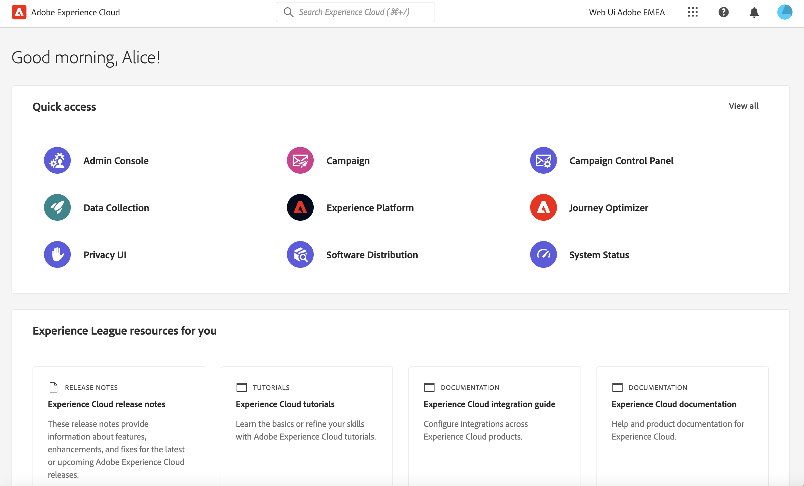
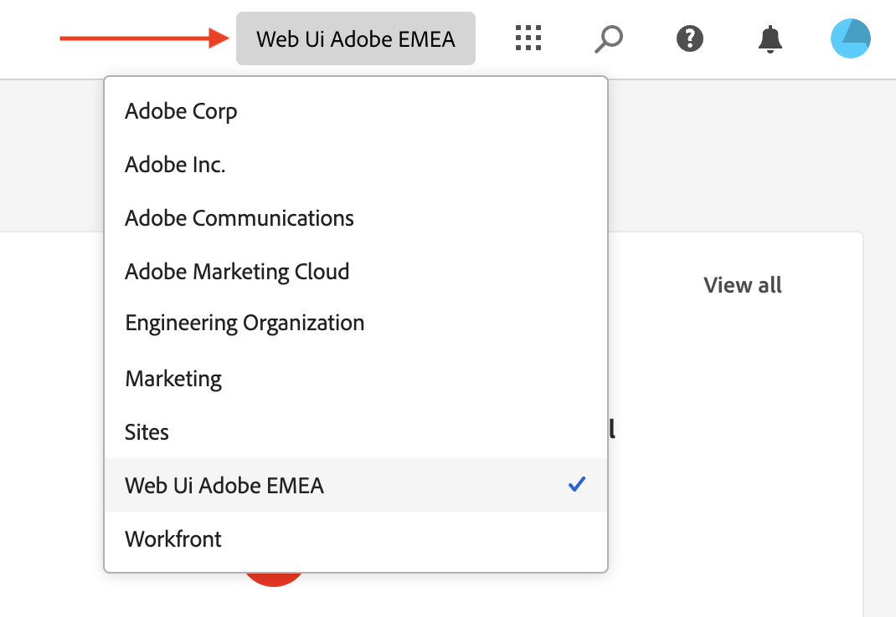
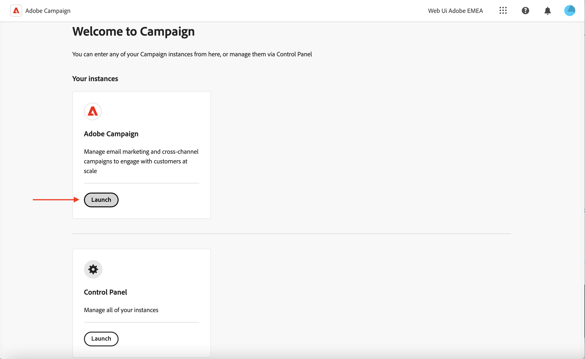

# Verbinding maken met Adobe Campaign {#connect-to-campaign}

Experience Cloud is een geïntegreerde Adobe-reeks met digitale marketingtoepassingen, producten en services. Via de intuïtieve interface hebt u snel toegang tot uw cloudtoepassingen, productfuncties en services. Leer hoe u verbinding maakt met Adobe Experience Cloud en de Adobe Campaign Web-interface opent op deze pagina.

## Aanmelden bij Adobe Experience Cloud {#sign-in-to-exc}

U kunt Single Sign-On (SSO) alleen gebruiken om verbinding te maken met Campaign. Experience Cloud-beheerders verlenen doorgaans toegang tot toepassingen en services. Voer de stappen in uw e-mailuitnodiging voor de Experience Cloud uit.

Voer de volgende eenvoudige stappen uit om u aan te melden bij Adobe Experience Cloud:

1. Blader naar [ Adobe Experience Cloud ](https://experience.adobe.com/){target="_blank"}.

1. Meld u aan met uw Adobe ID of Enterprise ID. Leer meer over identiteitstypes bij Adobe in [ dit artikel ](https://helpx.adobe.com/nl/enterprise/using/identity.html){target="_blank"}.

   Nadat u zich hebt aangemeld bij Experience Cloud, hebt u snel toegang tot al uw oplossingen en toepassingen.

   {zoomable="yes"}

1. Controleer of u zich in de juiste organisatie bevindt.

   {zoomable="yes"}{width="50%" align="left"}

   Leer meer over organisaties in Adobe Experience Cloud in [ dit artikel ](https://experienceleague.adobe.com/docs/core-services/interface/administration/organizations.html?lang=nl){target="_blank"}.

## Toegang tot Adobe Campaign {#access-to-campaign}

Om tot uw milieu van de Campagne toegang te hebben, selecteer **Campagne** van de **Snelle sectie van de Toegang** van de homepage van Adobe Experience Cloud.

Als u al bent verbonden met een andere Adobe Experience Cloud-oplossing, bladert u vanuit de oplossingsschakelaar rechtsboven in het scherm naar de omgeving van uw campagne.

{zoomable="yes"} tonen

Als u toegang tot veelvoudige milieu&#39;s, met inbegrip van het Controlebord van de Campagne hebt, klik de **1&rbrace; knoop van de Lancering &lbrace;voor de correcte instantie.**

{zoomable="yes"}

U bent nu verbonden met Campagne. Leer hoe te beginnen het gebruikersinterface in [ te gebruiken deze pagina ](user-interface.md).

### Toegangsbeheer {#access-control}

>[!CONTEXTUALHELP]
>id="acw_explorer_permissions_create"
>title="Machtiging vereist"
>abstract="Uw beheerder moet u toestemming verlenen alvorens u dit voorwerp kunt tot stand brengen."

>[!CONTEXTUALHELP]
>id="acw_audiences_read_only"
>title="Dit publiek is alleen-lezen"
>abstract="U hebt geen machtigingen om dit publiek te bewerken. Indien nodig, contacteer uw beheerder om u toegang te verlenen."

>[!CONTEXTUALHELP]
>id="acw_subscription_services_read_only"
>title="Deze service is alleen-lezen"
>abstract="U hebt geen machtigingen om deze service te bewerken. Indien nodig, contacteer uw beheerder om u toegang te verlenen."

>[!CONTEXTUALHELP]
>id="acw_recipients_readonlyprofile"
>title="Ontvangers lezen alleen-profiel"
>abstract="U hebt geen machtigingen om dit profiel te bewerken. Indien nodig, contacteer uw beheerder om u toegang te verlenen."

>[!CONTEXTUALHELP]
>id="acw_campaign_read_only"
>title="Deze campagne is alleen-lezen"
>abstract="U hebt geen machtigingen om deze campagne te bewerken. Indien nodig, contacteer uw beheerder om u toegang te verlenen."

>[!CONTEXTUALHELP]
>id="acw_deliveries_read_only"
>title="Deze levering is alleen-lezen"
>abstract="U hebt geen machtigingen om deze levering te bewerken. Indien nodig, contacteer uw beheerder om u toegang te verlenen."

>[!CONTEXTUALHELP]
>id="acw_wf_read_only"
>title="Deze workflow is alleen-lezen"
>abstract="U hebt geen machtigingen om deze workflow te bewerken. Indien nodig, contacteer uw beheerder om u toegang te verlenen."

Toegangsbeheer beperkt toegang tot objecten en gegevens uit hoofdlijsten, zoals leveringen, ontvangers of workflows. Deze beperkingen zijn ook van toepassing in de boomstructuur van de Explorer. Daarnaast hebt u machtigingen nodig om objecten te maken, verwijderen, dupliceren en bewerken vanuit de gebruikersinterface.

Alle toestemmingen in het Web van de Campagne synchroniseren met de toestemmingen van de Console van de Cliënt van de Campagne. Alleen campagnebeheerders kunnen gebruikersmachtigingen definiëren en wijzigen.

Wanneer u door de gebruikersinterface van het Web Campagne bladert, hebt u afhankelijk van uw machtigingen toegang tot gegevens, objecten en mogelijkheden. Als u bijvoorbeeld geen toegangsmachtigingen hebt voor een map, kunt u deze niet zien. Uw machtigingen zijn ook van toepassing op objecten en gegevensbeheer. Zonder Schrijfmachtigingen voor een specifieke map kunt u geen levering in die map maken, zelfs niet als u deze kunt zien in de gebruikersinterface.

U kunt leren hoe te [ bekijken en toestemmingen hier beheren ](permissions.md).

## Bovenste Adobe Experience Cloud-navigatie {#top-bar}

Blader naar de bovenste balk van de interface:

* Deel feedback over de gebruikersinterface van Campagne Web.
* Schakel tussen uw organisaties.
* Schakel tussen uw Adobe Experience Cloud-oplossingen en -toepassingen.
* Zoek naar hulp op [ de Liga van de Ervaring van Adobe ](https://experienceleague.adobe.com/docs/?lang=nl-NL){target="_blank"}.
* Controleer de productmeldingen.
* Bewerk uw profiel van Adobe en beheer montages, zoals [ werk uw favoriete taal ](#language-pref) of [ schakelaar aan licht/donker thema ](#dark-theme) bij.

{zoomable="yes"}{width="50%" align="left"}

## Ondersteunde browsers {#browsers}

Adobe Campaign Web is ontworpen om optimaal te werken in de nieuwste versie van Google Chrome, Safari en Microsoft Edge. Er kunnen problemen optreden met bepaalde functies in oudere versies of andere browsers.

## Taalvoorkeuren {#language-pref}

Adobe Campaign Web is momenteel beschikbaar in de volgende talen:

* Engels (VS) - EN-US
* Frans - FR
* Duits - DE
* Italiaans - IT
* Spaans - ES
* Portugees (Braziliaans) - PTBR
* Japans - JP
* Koreaans - KR
* Vereenvoudigd Chinees - CHS
* Traditioneel Chinees - CHT

Bovendien kan landspecifieke opmaak (zoals datums, tijden, kalenders, getallen) ook beschikbaar zijn in verschillende talen die worden ondersteund door de gebruikersinterface:

* Engels (Israël)
* Engels (Verenigd Koninkrijk)
* Spaans (Mexico)
* Spaans (Latijns Amerika)
* Frans (Canada)

Uw standaardtaal voor het Web van de Campagne wordt bepaald door de aangewezen taal die in uw gebruikersprofiel wordt gespecificeerd. Het heeft geen betrekking op de taal van uw Campagneserver en cliëntconsole.

De taal wijzigen:

1. Klik op uw profielpictogram, op het hoogste recht, dan uitgezochte **Voorkeur**.
1. Klik op de taalkoppeling die onder uw e-mailadres wordt weergegeven.
1. Selecteer uw aangewezen taal en klik **sparen**. U kunt een tweede taal selecteren als de component die u gebruikt niet in uw eerste taal is gelokaliseerd.

## Donkere en lichte thema&#39;s {#dark-theme}

Adobe Campaign is beschikbaar in lichte en donkere thema&#39;s. Standaard is de gebruikersinterface ingeschakeld in licht thema. Om op het donkere thema over te schakelen, klik op uw profielpictogram, en gebruik **Donkere thema** knevel om het toe te laten of onbruikbaar te maken.

De het profielmontages en de rekeningsvoorkeur van de gebruiker zijn gedetailleerd in [ deze sectie ](https://experienceleague.adobe.com/docs/core-services/interface/experience-cloud.html?lang=nl-NL#preferences){target="_blank"}.

Leer meer over de Componenten van de Interface van Experience Cloud Centrale in [ deze documentatie ](https://experienceleague.adobe.com/docs/core-services/interface/experience-cloud.html?lang=nl-NL){target="_blank"}.