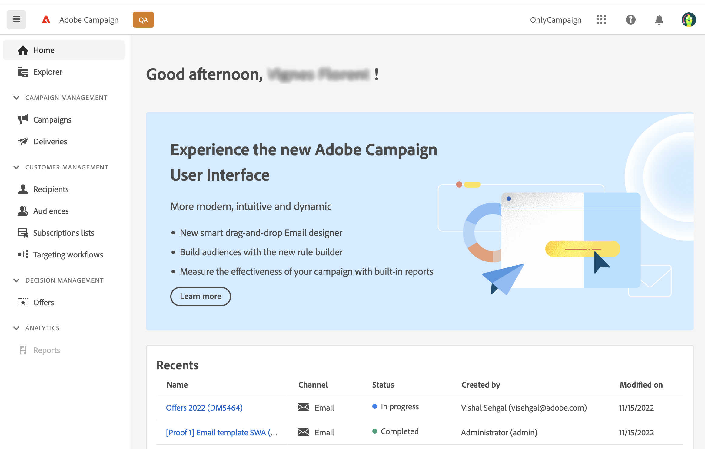

# Aan de slag met het web van campagnes {#get-started}

Adobe Campaign biedt een platform voor het ontwerpen van de ervaringen van klanten over meerdere kanalen en een omgeving voor visuele campagneorchestratie, real-time interactiebeheer en uitvoering via meerdere kanalen.

Aanvankelijk slechts beschikbaar door rijk [clientconsole](#ac-client), biedt Campagne nu een nieuwe webgebruikersinterface (UI) met verbeterde bruikbaarheid, toegankelijkheid en een nieuw ontwerp waarmee u uw gebruikerservaring aanzienlijk kunt verbeteren. Deze nieuwe, moderne gebruikersinterface vereenvoudigt het ontwerp en de levering van marketingcampagnes en zorgt voor consistentie, samen met andere oplossingen voor Adoben, waaronder Adobe Experience Platform.

Deze nieuwe interface voldoet eerst aan de behoeften van de **beroepsbeoefenaar** - alle typische beheertaken zijn niet beschikbaar in deze eerste versie, maar worden in latere versies behandeld. Merk op dat niet elke enkele functionaliteit of optie beschikbaar in de cliëntconsole voor nu in nieuwe UI beschikbaar is. Nieuwe gebruiksgevallen, opties en functies zijn beschikbaar in toekomstige versies.

Als u toegang moet krijgen tot de mogelijkheden van Campagne v8 die niet beschikbaar zijn in de webinterface, kunt u de opdracht [clientconsole](#ac-client).

>[!NOTE]
>
>Campagne v8 Web bevindt zich momenteel in bètaversie. De toegang wordt beperkt tot een kleine reeks klanten van Beta. Houd er rekening mee dat de interface, mogelijkheden en gebruiksstromen van het product zonder kennisgeving kunnen veranderen.

## Verbinding maken met Campaign

Ga als volgt te werk om verbinding te maken met het Adobe Campaign-web:

1. Bladeren naar [Adobe Experience Cloud](https://experience.adobe.com){target="_blank"}.
1. Meld u aan met uw Adobe.
1. In de **Snelle toegang** sectie, klikken **Campagne**.

   

1. Klik op de volgende pagina op de knop **Starten** van uw instantie Campagne.

   U bent nu verbonden met Campagne. Leer hoe u de gebruikersinterface kunt gebruiken in [deze pagina](user-interface.md).

Als u al bent verbonden met een andere Adobe Experience Cloud-oplossing, kunt u ook vanuit de oplossingsschakelaar rechtsboven in het scherm naar de Campagne-omgeving bladeren.

## Info over Campagne-clientconsole {#ac-client}

De de cliëntconsole van de Campagne is een browser-gebaseerde toepassing die op uw systeem geïnstalleerd is. De webservices-API wordt gebruikt om verbinding te maken met uw Campagnetoepassingsserver.

Campagnegegevens worden opgeslagen in de toepassingsserver. Gegevens zijn zowel beschikbaar via de clientconsole als via de webinterface. Als u bijvoorbeeld een leveringssjabloon maakt met de clientconsole, is deze ook beschikbaar in de webinterface. En als u een e-maillevering maakt in de webinterface, is deze levering ook toegankelijk vanaf de clientconsole.

Sommige objecten kunnen alleen in de clientconsole worden gemaakt en beheerd. Zij kunnen zichtbaar zijn en in het Web UI van de Campagne worden gebruikt, maar kunnen niet van dit milieu worden gecreeerd of worden gewijzigd. Alle Campagneobjecten en -componenten zijn beschikbaar in de Explorer-weergave, beschikbaar in de linkernavigatie.

Voor meer informatie over het gebruik van Campagne v8 raadpleegt u [Campagne v8-documentatie (clientconsole)](https://experienceleague.adobe.com/docs/campaign/campaign-v8/campaign-home.html?lang=nl){target="_blank"}.
