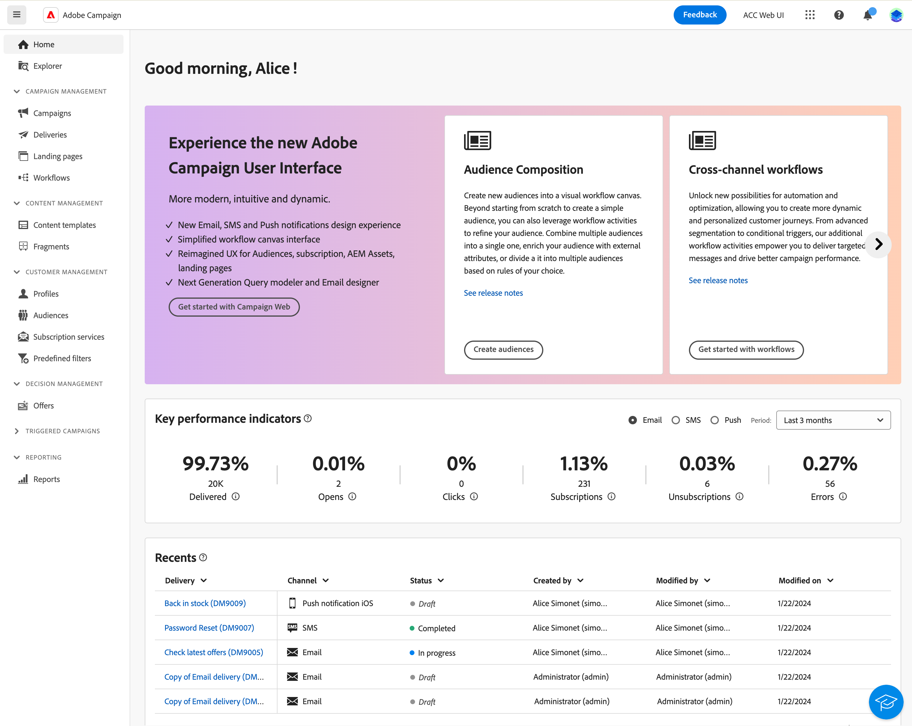

# Aan de slag met Adobe Campaign Web {#get-started}

>[!CONTEXTUALHELP]
>id="acw_homepage_welcome_learnmore"
>title="Aan de slag"
>abstract="De nieuwe Adobe Campaign-webinterface biedt een geïntegreerde, intuïtieve en consistente gebruikerservaring."

>[!CONTEXTUALHELP]
>id="acw_homepage_learning_learnmore"
>title="Aan de slag"
>abstract="De nieuwe Adobe Campaign-webinterface biedt een geïntegreerde, intuïtieve en consistente gebruikerservaring."

>[!CONTEXTUALHELP]
>id="acw_homepage_learnmore"
>title="Aan de slag"
>abstract="De nieuwe Adobe Campaign-webinterface biedt een geïntegreerde, intuïtieve en consistente gebruikerservaring."

Adobe Campaign biedt een platform voor het ontwerpen van de ervaringen van klanten over meerdere kanalen en een omgeving voor visuele campagneorchestratie, real-time interactiebeheer en uitvoering via meerdere kanalen.

Adobe Campaign v8 is het volgende-gen campagnehulpmiddel dat voor diverse marketing kanalen zoals e-mail, dupberichten, SMS, en directe post wordt gebouwd. Het biedt robuuste ETL- en gegevensbeheermogelijkheden om de perfecte campagne te helpen kweken en beheren. De orkestmotor van het netwerk voorziet in rijke multi-touchmarketingprogramma&#39;s met een centrale focus op batchgeoriënteerde reizen. Het komt ook met een scalable Real-Time overseinenserver wordt geparseerd die marketing teams toelaat om vooraf bepaalde berichten te verzenden die op een alle-inclusieve lading van om het even welk systeem van IT voor mededelingen zoals wachtwoordterugstellen, orderbevestiging, e-kwitantie en veel meer worden gebaseerd.

Campagne gebruiken om:

* **Drive** personalisatie en betrokkenheid via één toegankelijke weergave van de klant
* **Integreren** e-mail, mobiel, online en offline kanalen aan de reis van de klant
* **Automatisch** de levering van zinvolle en tijdige berichten en aanbiedingen

## Campagne Web-gebruikersinterface ontdekken {#web}

Aanvankelijk slechts beschikbaar door rijk [clientconsole](#ac-client), biedt Campagne nu een nieuwe webgebruikersinterface (UI) met verbeterde bruikbaarheid, toegankelijkheid en een nieuw ontwerp waarmee u uw gebruikerservaring aanzienlijk kunt verbeteren. Deze nieuwe, moderne gebruikersinterface vereenvoudigt het ontwerp en de levering van marketingcampagnes en zorgt voor consistentie, samen met andere oplossingen voor Adoben, waaronder Adobe Experience Platform.

{zoomable=&quot;yes&quot;}

Deze nieuwe gebruikersinterface van het Web dient eerst de behoeften van **beroepsbeoefenaar** - alle typische beheertaken zijn niet beschikbaar in deze eerste versie, maar worden in latere versies behandeld. Merk op dat niet elke enkele functionaliteit of optie beschikbaar in de cliëntconsole voor nu in nieuwe UI beschikbaar is. Nieuwe gebruiksgevallen, opties en functies zijn beschikbaar in toekomstige versies.

Als beheerder of deskundige gebruiker, als u tot de mogelijkheden van de Campagne v8 moet toegang hebben die niet beschikbaar in het gebruikersinterface van het Web van de Campagne zijn, kunt u met [clientconsole](#ac-client).

Leer hoe u verbinding maakt met Adobe Campaign Web in [deze pagina](connect-to-campaign.md).

➡️ [Video over het ontdekken van een campagne op het web](#video)

## Info over Campagne-clientconsole {#ac-client}

De de cliëntconsole van de Campagne is een browser-gebaseerde toepassing die op uw systeem geïnstalleerd is. De webservices-API wordt gebruikt om verbinding te maken met uw Campagnetoepassingsserver.

Campagnegegevens worden opgeslagen in de toepassingsserver. De gegevens zijn beschikbaar zowel bij de cliëntconsole als van het gebruikersinterface van het Web van de Campagne. Bijvoorbeeld, als u een leveringsmalplaatje gebruikend de cliëntconsole creeert, is het ook beschikbaar in het gebruikersinterface van het Web van de Campagne. En als u een e-maillevering in het gebruikersinterface van het Web van de Campagne creeert, is deze levering ook toegankelijk van de cliëntconsole.

Sommige objecten kunnen alleen in de clientconsole worden gemaakt en beheerd. Zij kunnen zichtbaar zijn en in het gebruikersinterface van het Web van de Campagne worden gebruikt, maar kunnen niet van dit milieu worden gecreeerd of worden gewijzigd. Alle Campagneobjecten en -componenten zijn beschikbaar in de Explorer-weergave, beschikbaar in de linkernavigatie.

Raadpleeg voor meer informatie over het gebruik van Campagne v8 met de clientconsole [Campagne v8-documentatie (clientconsole)](https://experienceleague.adobe.com/docs/campaign/campaign-v8/campaign-home.html?lang=nl){target="_blank"}.

## Hoe kan ik-video {#video}

Leer hoe te om tot het de gebruikersinterface van het Web van de Campagne toegang te hebben en te navigeren en hoe te om de inventarislijsten aan te passen. Ontdek de door AI aangedreven Knowledge Assistant.

>[!VIDEO](https://video.tv.adobe.com/v/3427278?quality=12)
