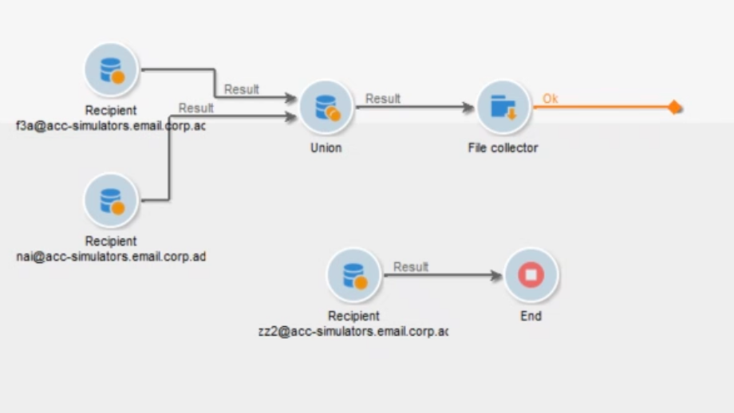
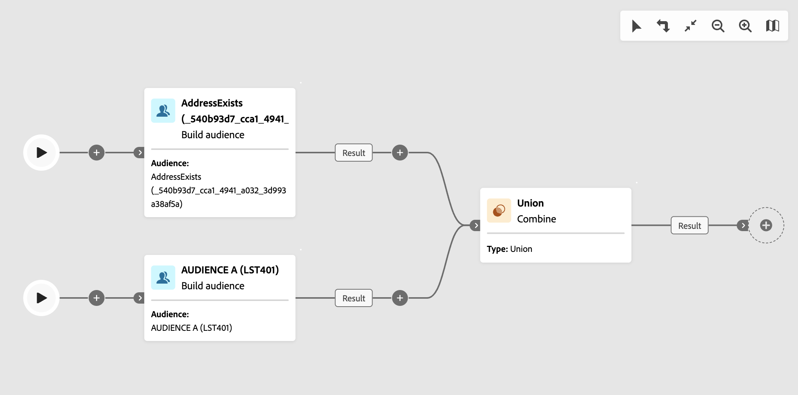

# Afvoerkanalen en beperkingen {#guardrails-limitations}

Wanneer u in de interface van het campagneweb werkt met componenten die zijn gemaakt of gewijzigd in de clientconsole van Campagne, zijn de onderstaande instructies en beperkingen van toepassing.

## Workflows {#wf-guardrails-limitations}

### Activiteiten

Workflowactiviteiten die nog niet worden ondersteund in de webinterface, zijn alleen-lezen en worden weergegeven als incompatibele activiteiten. U kunt de workflow nog steeds uitvoeren, berichten verzenden, de logbestanden controleren, enz. De activiteiten van het werkschema die zowel in WebUI als de cliëntconsole beschikbaar zijn zijn editable.

| Console | Webinterface |
| --- | --- |
| {width="800px" align="left" zoomable="yes"} | {width="800px" align="left" zoomable="yes"} |

Workflowactiviteitinstellingen die nog niet worden ondersteund in de webinterface, worden niet weergegeven. Wanneer de werkstroom echter wordt uitgevoerd, zijn deze instellingen van toepassing.

| Console | Webinterface |
| --- | --- |
| {width="800px" align="left" zoomable="yes"} | {width="800px" align="left" zoomable="yes"} |

In de console, **Verrijking** deze activiteit kan zowel verzoening als verrijking tot stand brengen . In het Web UI, zijn de aanpassingsmogelijkheden nog niet beschikbaar. Als u, in de console hebt bepaald, verzoeningsmontages in **Verrijking** activiteit, wordt deze weergegeven als een niet-compatibele alleen-lezen activiteit in de webinterface.

| Console | Webinterface |
| --- | --- |
| {width="800px" align="left" zoomable="yes"} | {width="800px" align="left" zoomable="yes"} |

### Canvas

Wanneer u een nieuwe workflow maakt in de webinterface, ondersteunt het canvas slechts één ingangspunt. Nochtans, als u een werkstroom in de console met veelvoudige ingangspunten creeerde, kunt u het in Web UI openen en uitgeven.

| Console | Webinterface |
| --- | --- |
| {width="800px" align="left" zoomable="yes"} | {width="800px" align="left" zoomable="yes"} |

Lussen zijn nog niet beschikbaar in de webinterface. Als u een werkstroom met een lijn gebruikend de console creeerde, kunt u tot het niet van Web UI toegang hebben. Er wordt een foutbericht weergegeven.

| Console | Webinterface |
| --- | --- |
| {width="800px" align="left" zoomable="yes"} | {width="800px" align="left" zoomable="yes"} |

De positionering van de knooppunten wordt elke keer dat een activiteit wordt toegevoegd of verwijderd, vernieuwd. Als u een werkstroom in de console creeert, wijzig het gebruikend het Web UI en open het in de console opnieuw, kunt u sommige minder belangrijke plaatsen onvolkomenheden opmerken. Dit heeft geen invloed op de

| Beginworkflow | Positiewijziging |
| --- | --- |
| {width="800px" align="left" zoomable="yes"} | {width="800px" align="left" zoomable="yes"} |

## Vooraf gedefinieerde filters {#filters-guardrails-limitations}

Wanneer het selecteren van het publiek van een levering, of wanneer het bouwen van een publiek in een werkschema, zijn sommige vooraf bepaalde filters niet beschikbaar in het gebruikersinterface, in die versie van het product.

Er wordt een specifiek foutbericht weergegeven. Zelfs als u niet de grafische vertegenwoordiging van de vraag in de regelbouwer kunt bekijken, en niet de filter kunt uitgeven, kunt u het nog gebruiken, en de het filtreren voorwaarden, en de resultaten zien. U kunt de SQL-query ook openen om de exacte instellingen te controleren.

{width="70%" align="left"}

Merk op dat als u een filter in de interface van het Web bouwt en het in de console met niet gestaafde attributen wijzigt, de grafische vertegenwoordiging niet meer in de interface van het Web beschikbaar kan zijn. In elk geval kunt u het filter nog steeds gebruiken.

Niet-ondersteunde kenmerken worden hieronder weergegeven.

### Niet-ondersteunde gegevenstypen {#unsupported-data-type}

De volgende gegevenstypes beschikbaar in de cliëntconsole worden niet gesteund wanneer het tonen van een filter of een regel in de interface van het Web:

* datetime
* tijd
* timespan
* double
* zweven

### Niet-ondersteunde filtermogelijkheden {#unsupported-filtering-capabilities}

Wanneer een filter met complexe uitdrukkingen en functies in de cliëntconsole wordt gebouwd, kan het niet in de interface van het Web worden uitgegeven.

Bovendien worden de volgende operatoren niet ondersteund:

* Numerieke tekst
   * is opgenomen in
   * geen in

* Het type String
   * groter dan
   * minder dan
   * groter dan of gelijk aan
   * kleiner dan of gelijk aan
   * leuk
   * niet leuk

* Het type Date
   * op of na
   * op of voor
   * niet gelijk aan
   * is leeg
   * is niet leeg
   * is opgenomen in
   * niet in
   * laatste

* 1-N koppelingen
   * COUNT, SUM, AVG, MIN, MAX