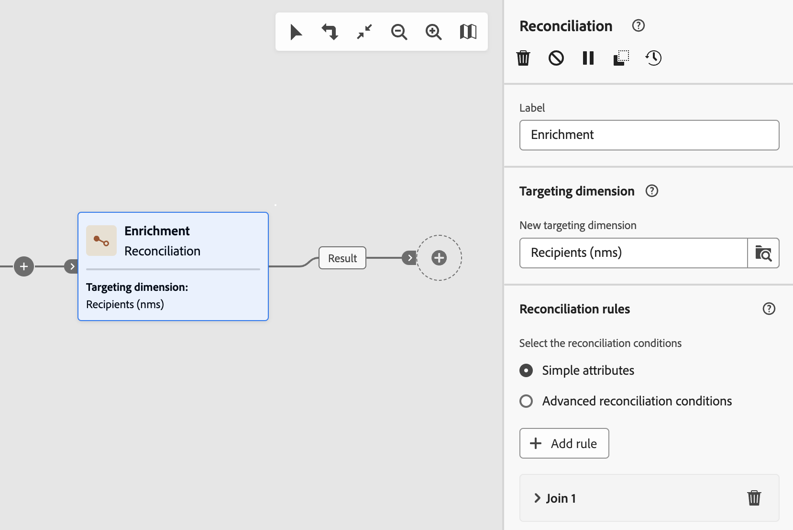

# Afvoerkanalen en beperkingen {#guardrails-limitations}

Wanneer het werken in het gebruikersinterface van het Web van de Campagne met werkschema&#39;s die in de cliëntconsole van de Campagne worden gecreeerd of worden gewijzigd, zijn de hieronder vermelde gidsen en beperkingen van toepassing.

Houd er rekening mee dat op deze pagina belangrijke overwegingen worden vermeld wanneer u werkt met workflows in de console en de webgebruikersinterface, maar dat deze pagina niet alle mogelijke oncompatibiliteit tussen de twee interfaces omvat.

## Workflowactiviteiten {#wkf-activities}

De activiteiten van het werkschema die nog niet in het Web van de Campagne worden gesteund zijn read-only en getoond als onverenigbare activiteiten. U kunt de workflow nog steeds uitvoeren, berichten verzenden, de logbestanden controleren, enz. De activiteiten van het werkschema die zowel in het Web van de Campagne als de cliëntconsole beschikbaar zijn zijn editable.

De activiteiten van het werkschema die nog niet in het gebruikersinterface van het Web van de Campagne worden gesteund zijn read-only en getoond als onverenigbare activiteiten. U kunt de workflow nog steeds uitvoeren, berichten verzenden, de logbestanden controleren, enz. De activiteiten van het werkschema die zowel in het gebruikersinterface van het Web van de Campagne als de de cliëntconsole van de Campagne beschikbaar zijn zijn editable.

| Console | Web |
| --- | --- |
| {zoomable=&quot;yes&quot;}{width="800px" align="left" zoomable="yes"} | {zoomable=&quot;yes&quot;}{width="800px" align="left" zoomable="yes"} |

Wanneer een **Query** of een **Verrijking** De activiteit wordt gevormd met extra gegevens in de console, wordt de verrijkingsgegevens in het Web van de Campagne in aanmerking genomen en overgegaan in de uitgaande overgang, maar het kan niet worden uitgegeven.

| Console | Web |
| --- | --- |
| {zoomable=&quot;yes&quot;}{width="800px" align="left" zoomable="yes"} | {zoomable=&quot;yes&quot;}{width="800px" align="left" zoomable="yes"} |

In de console, **Verrijking** deze activiteit kan zowel verzoening als verrijking tot stand brengen . Als u, in de cliëntconsole hebt bepaald, verzoeningsmontages in **Verrijking** activiteit, wordt deze weergegeven als een **Verzoening** activiteit in de gebruikersinterface van het Web van de Campagne.

| Console | Web |
| --- | --- |
| {zoomable=&quot;yes&quot;}{width="800px" align="left" zoomable="yes"} | {zoomable=&quot;yes&quot;}{width="800px" align="left" zoomable="yes"} |

## Workflowcanvas {#wkf-canvas}

Wanneer het creëren van een nieuw werkschema in het gebruikersinterface van het Web van de Campagne, steunt het canvas slechts één ingangspunt. Nochtans, als u een werkstroom in de console met veelvoudige ingangspunten creeerde, kunt u het in het gebruikersinterface van het Web van de Campagne openen en uitgeven.

| Console | Web |
| --- | --- |
| {zoomable=&quot;yes&quot;}{width="800px" align="left" zoomable="yes"} | {zoomable=&quot;yes&quot;}{width="800px" align="left" zoomable="yes"} |

De positionering van de knooppunten wordt elke keer dat een activiteit wordt toegevoegd of verwijderd, vernieuwd. Als u een werkschema in de console creeert, wijzig het gebruikend het gebruikersinterface van het Web van de Campagne en open het in de console opnieuw, kunt u sommige minder belangrijke plaatsende onvolkomenheden opmerken. Dit heeft geen invloed op de processen en taken van de workflow.

| Beginworkflow | Positiewijziging |
| --- | --- |
| {zoomable=&quot;yes&quot;}{width="800px" align="left" zoomable="yes"} | {zoomable=&quot;yes&quot;}{width="800px" align="left" zoomable="yes"} |
