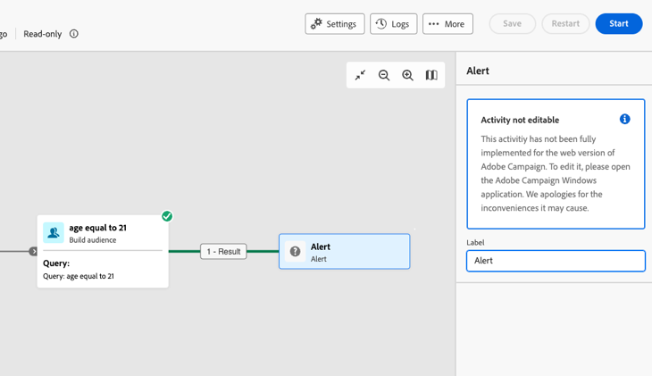
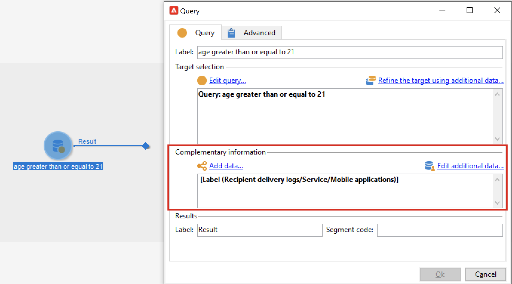

# Afbeeldingen en beperkingen voor workflows {#guardrails-limitations}

Wanneer het werken in het gebruikersinterface van het Web van de Campagne met werkschema&#39;s die in de cliëntconsole van de Campagne worden gecreeerd of worden gewijzigd, zijn de hieronder vermelde gidsen en beperkingen van toepassing.

Houd er rekening mee dat op deze pagina belangrijke overwegingen worden vermeld wanneer u werkt met workflows in de console en de webgebruikersinterface, maar dat deze pagina niet alle mogelijke oncompatibiliteit tussen de twee interfaces omvat.

## Workflowactiviteiten {#wkf-activities}

>[!CONTEXTUALHELP]
>id="acw_orchestration_query_enrichment_noneditable"
>title="Activiteit niet bewerkbaar"
>abstract="Wanneer de a **Vraag** of een **Verrijking** activiteit met extra gegevens in de console wordt gevormd, wordt het verrijkingsgegeven in het Web van de Campagne in de uitgaande overgang genomen en overgegaan, maar het kan niet worden uitgegeven."

De activiteiten van het werkschema die nog niet in het gebruikersinterface van het Web van de Campagne worden gesteund zijn read-only en getoond als onverenigbare activiteiten. U kunt de workflow nog steeds uitvoeren, berichten verzenden, de logbestanden controleren en andere taken uitvoeren. De activiteiten van het werkschema die zowel in het gebruikersinterface van het Web van de Campagne als de de cliëntconsole van de Campagne beschikbaar zijn zijn editable.

| Console | Web |
| --- | --- |
| {zoomable="yes"}{width="800px" align="left" zoomable="yes"} | {zoomable="yes"}{width="800px" align="left" zoomable="yes"} |

Wanneer de a **Vraag** of een **Verrijking** activiteit met extra gegevens in de console wordt gevormd, wordt het verrijkingsgegeven in het Web van de Campagne in de uitgaande overgang genomen en overgegaan, maar het kan niet worden uitgegeven.

| Console | Web |
| --- | --- |
| {zoomable="yes"}{width="800px" align="left" zoomable="yes"} | {zoomable="yes"}{width="800px" align="left" zoomable="yes"} |

In de console, kan de **Verrijking** activiteit zowel verzoening als verrijking uitvoeren. Als u verzoeningsmontages in de **Verrijking** activiteit in de cliëntconsole hebt bepaald, zal het als a **Verzoening** activiteit in het gebruikersinterface van het Web van de Campagne worden getoond.

| Console | Web |
| --- | --- |
| {zoomable="yes"}{width="800px" align="left" zoomable="yes"} | {zoomable="yes"}{width="800px" align="left" zoomable="yes"} |

## Workflowcanvas {#wkf-canvas}

Wanneer het creëren van een nieuw werkschema in het gebruikersinterface van het Web van de Campagne, steunt het canvas slechts één ingangspunt. Nochtans, als u een werkschema in de console met veelvoudige ingangspunten creeerde, kunt u het in het gebruikersinterface van het Web van de Campagne openen en uitgeven.

| Console | Web |
| --- | --- |
| {zoomable="yes"}{width="800px" align="left" zoomable="yes"} | {zoomable="yes"}{width="800px" align="left" zoomable="yes"} |

De positionering van de knooppunten wordt telkens vernieuwd wanneer een activiteit wordt toegevoegd of verwijderd. Als u een werkschema in de console creeert, het wijzigt gebruikend het de gebruikersinterface van het Web van de Campagne, en het in de console heropent, kunt u sommige minder belangrijke plaatsende onvolkomenheden opmerken. Dit heeft geen invloed op de processen en taken van de workflow.

| Beginworkflow | Positiewijziging |
| --- | --- |
| {zoomable="yes"}{width="800px" align="left" zoomable="yes"} | {zoomable="yes"}{width="800px" align="left" zoomable="yes"} |