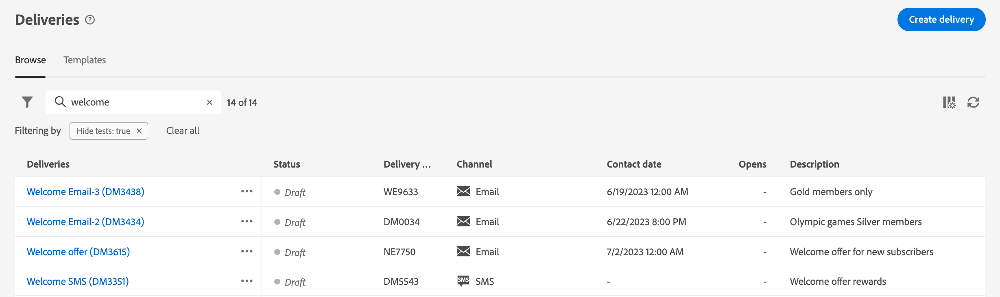
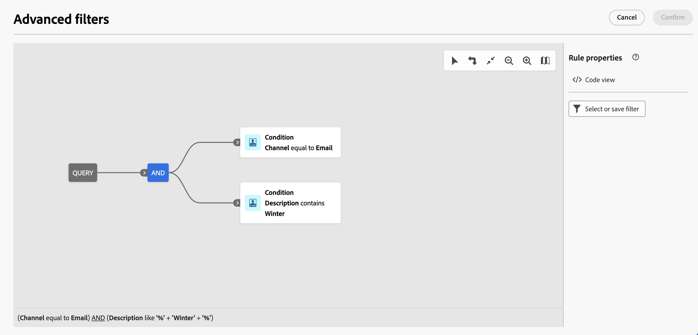

# Bladeren, zoeken en filteren {#list-screens}

De meeste koppelingen in het linkernavigatiemenu bevatten lijsten met objecten, zoals de lijst met **Leveringen** of **Campagnes**. Sommige lijstschermen zijn alleen-lezen. U kunt de lijstweergave aanpassen en deze lijsten filteren, zoals hieronder wordt beschreven.

Als u een filter wilt verwijderen, klikt u op de knop **Alles wissen** knop.

## Lijstschermen aanpassen {#custom-lists}

De lijsten worden weergegeven in kolommen. U kunt extra informatie tonen door de kolomconfiguratie te veranderen. Om dit te doen, klik **Kolom voor een aangepaste indeling configureren** in de rechterbovenhoek van de lijst.

{width="70%" align="left" zoomable="yes"}

In de **Kolommen configureren** , kolommen toevoegen of verwijderen en de volgorde wijzigen waarin ze worden weergegeven.

Voor bijvoorbeeld deze instellingen:

{width="70%" align="left" zoomable="yes"}

In de lijst worden de volgende kolommen weergegeven:

{width="70%" align="left" zoomable="yes"}

Gebruik de **Geavanceerde kenmerken weergeven** schakelt u om alle kenmerken voor de huidige lijst weer te geven. [Meer informatie](#adv-attributes)

## Gegevens sorteren {#sort-lists}

U kunt de items in de lijst ook sorteren door op een kolomkop te klikken. Er wordt een pijl weergegeven (omhoog of omlaag) die aangeeft dat de lijst in die kolom wordt gesorteerd.

Voor numerieke kolommen of datumkolommen geldt het **Omhoog** De pijl geeft aan dat de lijst oplopend wordt gesorteerd terwijl de **Omlaag** geeft een aflopende volgorde aan. Voor tekenreeks- of alfanumerieke kolommen worden waarden in alfabetische volgorde weergegeven.

## Ingebouwde filters {#list-built-in-filters}

Als u items sneller wilt zoeken, gebruikt u de zoekbalk of filtert u de lijst op basis van contextuele criteria.

{width="70%" align="left" zoomable="yes"}

U kunt leveringen bijvoorbeeld filteren op de status, het kanaal, de contactdatum of de map. U kunt tests ook verbergen.

## Aangepaste filters{#list-custom-filters}

Als u aangepaste filters voor gegevens wilt maken, bladert u naar de onderkant van de filters en klikt u op de knop **Regels toevoegen** knop.

Sleep kenmerken om uw filtercriteria op te bouwen in het dialoogvenster **Geavanceerde filters** scherm.

{width="70%" align="left" zoomable="yes"}

Gebruik de **Geavanceerde kenmerken weergeven** schakelt u om alle kenmerken voor de huidige lijst weer te geven. [Meer informatie](#adv-attributes)

## Geavanceerde kenmerken gebruiken {#adv-attributes}

>[!CONTEXTUALHELP]
>id="acw_attributepicker_advancedfields"
>title="Geavanceerde kenmerken weergeven"
>abstract="Alleen de meest voorkomende kenmerken worden standaard weergegeven in de lijst met kenmerken. Met deze schakeloptie kunt u een filter met geavanceerde kenmerken maken."

Alleen de meest voorkomende kenmerken worden standaard weergegeven in de lijst met kenmerken en de filterconfiguratieschermen. Kenmerken die zijn ingesteld als `advanced` kenmerken in het gegevensschema worden verborgen in de configuratievensters.

De **Geavanceerde kenmerken weergeven** schakelt u om alle beschikbare kenmerken voor de huidige lijst weer te geven: De kenmerkenlijst wordt onmiddellijk bijgewerkt.

{width="70%" align="left" zoomable="yes"}
