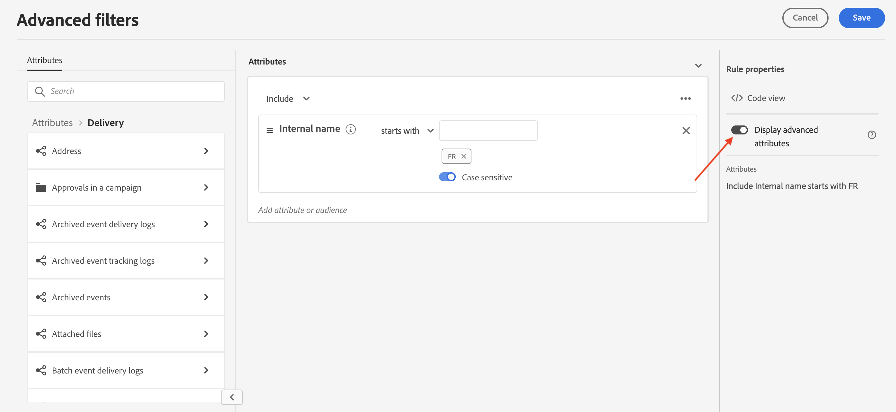

# Bladeren en lijsten filteren {#list-screens}

De meeste koppelingen in het linkernavigatiemenu bevatten lijsten met objecten, zoals de lijst met **Leveringen** of **Campagnes**. Sommige lijstschermen zijn alleen-lezen. U kunt de lijstweergave aanpassen en deze lijsten filteren, zoals hieronder wordt beschreven.

## Lijstschermen aanpassen {#custom-lists}

De lijsten worden weergegeven in kolommen. U kunt extra informatie tonen door de kolomconfiguratie te veranderen. Om dit te doen, klik **Kolom voor een aangepaste indeling configureren** in de rechterbovenhoek van de lijst.

{width="70%" align="left" zoomable="yes"}

In de **Kolommen configureren** , kolommen toevoegen of verwijderen en de volgorde wijzigen waarin ze worden weergegeven.

Voor bijvoorbeeld deze instellingen:

{width="70%" align="left" zoomable="yes"}

In de lijst worden de volgende kolommen weergegeven:

{width="70%" align="left" zoomable="yes"}

## Gegevens sorteren {#sort-lists}

U kunt de items in de lijst ook sorteren door op een kolomkop te klikken. Er wordt een pijl weergegeven (omhoog of omlaag) die aangeeft dat de lijst in die kolom wordt gesorteerd.

Voor numerieke kolommen of datumkolommen geldt het **Omhoog** De pijl geeft aan dat de lijst oplopend wordt gesorteerd terwijl de **Omlaag** geeft een aflopende volgorde aan. Voor tekenreeks- of alfanumerieke kolommen worden waarden in alfabetische volgorde weergegeven.

## Filters {#list-built-in-filters}

Als u sneller naar items wilt zoeken, kunt u de zoekbalk of ingebouwde en aangepaste filters gebruiken om de lijst aan te passen op basis van contextuele criteria.

{width="70%" align="left" zoomable="yes"}

Gedetailleerde informatie over het gebruik van filters en het maken van uw eigen aangepaste filters is beschikbaar in [deze sectie](../query/filter.md).

<!--
## Use advanced attributes {#adv-attributes}

>[!CONTEXTUALHELP]
>id="acw_attributepicker_advancedfields"
>title="Display advanced attributes"
>abstract="Only the most common attributes are displayed by default in the attribute list. Activate the **Display advanced attributes** toggle to see all available attributes for the current list in the left palette of the rule builder, such as nodes, groupings, 1-1 links, 1-N links."

>[!CONTEXTUALHELP]
>id="acw_rulebuilder_advancedfields"
>title="Rule builder advanced fields"
>abstract="Only the most common attributes are displayed by default in the attribute list. Activate the **Display advanced attributes** toggle to see all available attributes for the current list in the left palette of the rule builder, such as nodes, groupings, 1-1 links, 1-N links."

>[!CONTEXTUALHELP]
>id="acw_rulebuilder_properties_advanced"
>title="Rule builder advanced attributes"
>abstract="Only the most common attributes are displayed by default in the attribute list. Activate the **Display advanced attributes** toggle to see all available attributes for the current list in the left palette of the rule builder, such as nodes, groupings, 1-1 links, 1-N links."

Only most common attributes are displayed by default in the attribute list and filter configuration screens. Attributes which were set as `advanced` attributes in the data schema are hidden from the configuration screens. 

Activate the **Display advanced attributes** toggle to see all available attributes for the current list in the left palette of the rule builder, such as nodes, groupings, 1-1 links, 1-N links. The attribute list is updated instantly.

{width="70%" align="left" zoomable="yes"}
-->