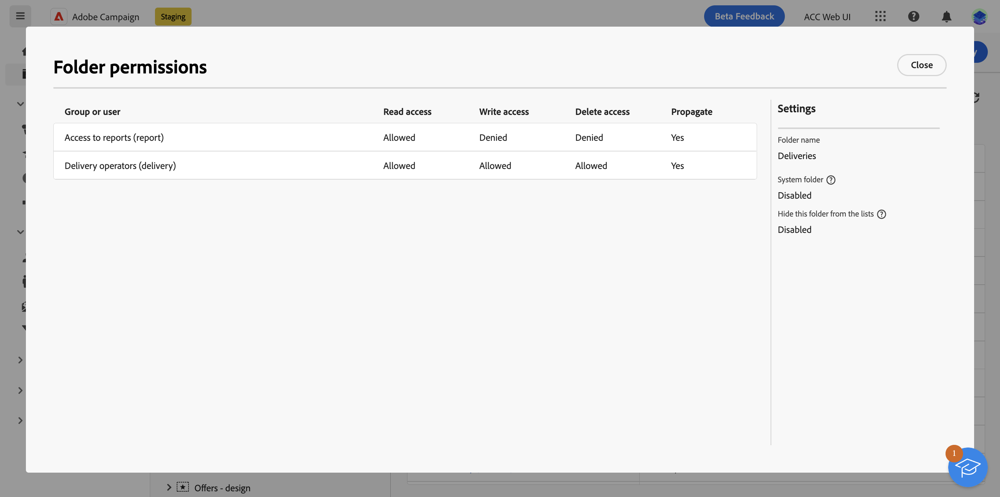
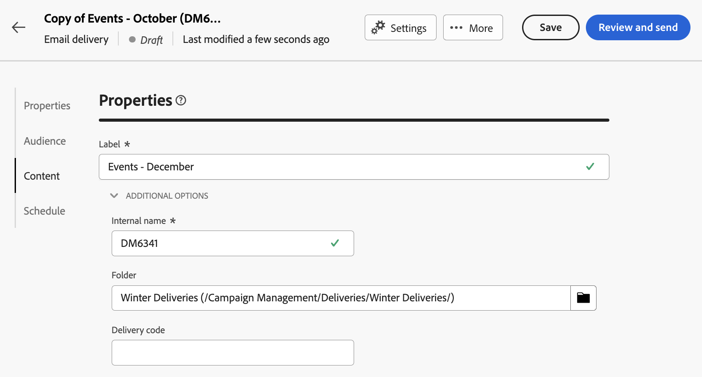

# Toegang en machtigingen {#access-and-permissions}

>[!CONTEXTUALHELP]
>id="acw_explorer_permissions_create"
>title="Machtiging vereist"
>abstract="Uw beheerder moet u toestemming verlenen alvorens u dit voorwerp kunt tot stand brengen."

>[!CONTEXTUALHELP]
>id="acw_audiences_read_only"
>title="Dit publiek is alleen-lezen"
>abstract="U hebt geen machtigingen om dit publiek te bewerken. Indien nodig, contacteer uw beheerder om u toegang te verlenen."

>[!CONTEXTUALHELP]
>id="acw_subscription_services_read_only"
>title="Deze service is alleen-lezen"
>abstract="U hebt geen machtigingen om deze service te bewerken. Indien nodig, contacteer uw beheerder om u toegang te verlenen."

>[!CONTEXTUALHELP]
>id="acw_campaign_read_only"
>title="Deze campagne is alleen-lezen"
>abstract="U hebt geen machtigingen om deze campagne te bewerken. Indien nodig, contacteer uw beheerder om u toegang te verlenen."

>[!CONTEXTUALHELP]
>id="acw_deliveries_read_only"
>title="Deze levering is alleen-lezen"
>abstract="U hebt geen machtigingen om deze levering te bewerken. Indien nodig, contacteer uw beheerder om u toegang te verlenen."

>[!CONTEXTUALHELP]
>id="acw_wf_read_only"
>title="Deze workflow is alleen-lezen"
>abstract="U hebt geen machtigingen om deze workflow te bewerken. Indien nodig, contacteer uw beheerder om u toegang te verlenen."

>[!CONTEXTUALHELP]
>id="acw_wf_read_only_canvas"
>title="Deze workflow is alleen-lezen"
>abstract="U kunt deze workflow niet bewerken vanwege niet-ondersteund of incompatibel canvas."

Met toegangsbeheer kunt u de toegang tot objecten en gegevens uit hoofdlijsten beperken, zoals leveringen, ontvangers of workflows. Deze beperkingen gelden ook voor de **Verkenner** navigatieboom. Daarnaast hebt u machtigingen nodig om objecten te maken, verwijderen, dupliceren en bewerken vanuit de gebruikersinterface.

Het toegangsbeheer wordt beheerd in de Console van de Cliënt van de Campagne. Alle toestemmingen in het Web van de Campagne worden gesynchroniseerd omhoog met de toestemmingen van de Console van de Cliënt van de Campagne. Alleen campagnebeheerders kunnen gebruikersmachtigingen definiëren en wijzigen. Meer informatie over gebruikersmachtigingen vindt u in [Campagne v8-documentatie (clientconsole)](https://experienceleague.adobe.com/docs/campaign/campaign-v8/admin/permissions/gs-permissions.html){target="_blank"}.

Terwijl u door de gebruikersinterface van het Web van de Campagne bladert, kunt u tot gegevens, tot voorwerpen en tot mogelijkheden afhankelijk van uw toestemmingen toegang hebben. Als u bijvoorbeeld geen toegangsmachtigingen hebt voor een map, kunt u deze niet zien. Uw machtigingen zijn ook van toepassing op objecten en gegevensbeheer. Zonder Schrijfmachtigingen voor een specifieke map kunt u geen levering in die map maken, zelfs niet als u deze kunt zien in de gebruikersinterface.

## Machtigingen weergeven {#view-permissions}

Van de **Verkenner** kunt u machtigingen voor elke map bladeren. Deze toestemmingen worden geplaatst in de cliëntconsole, en worden gebruikt om toegang tot de gegevens van de Campagne te organiseren en te controleren.

Voer de volgende stappen uit om machtigingen voor een map weer te geven:

1. Van de **Verkenner** Selecteer een map in het linkermenu nav.
1. Klik op de drie stippen in de rechterbovenhoek en selecteer **Mapmachtigingen**.

   {width="70%" align="left" zoomable="yes"}

1. Controleer de details in het scherm, zoals hieronder:

   {width="70%" align="left" zoomable="yes"}

   Een groep of een operator kan beschikken over de machtiging Lezen, Schrijven en/of Verwijderen voor gegevens die in de geselecteerde map zijn opgeslagen.

   Als de **Doorgeven** is ingeschakeld, worden alle machtigingen die voor een map zijn gedefinieerd, toegepast op alle submappen. Deze machtigingen kunnen voor elke submap worden overgeladen.

   Als de **Systeemmap** wordt toegelaten, wordt de toegang toegestaan aan alle exploitanten, ongeacht hun toestemmingen.

Meer informatie over mapmachtigingen vindt u in [Campagne v8-documentatie (clientconsole)](https://experienceleague.adobe.com/docs/campaign/campaign-v8/admin/permissions/folder-permissions.html){target="_blank"}.

## Werken met mappen {#folders}

U kunt mappen maken, hernoemen, opnieuw ordenen en verplaatsen om uw componenten en gegevens te ordenen. U kunt ook mappen uit hetzelfde menu verwijderen.

>[!CAUTION]
>
>Wanneer u een map verwijdert, worden ook alle in de map opgeslagen gegevens verwijderd.

Ga als volgt te werk om een map te maken:

1. Van de **Verkenner** Selecteer een map in het linkermenu nav.
1. Klik op de drie stippen in de rechterbovenhoek en kies **Nieuwe submap maken**.
1. Voer de naam van de map in en sla deze op.

   {width="70%" align="left" zoomable="yes"}

   De map wordt toegevoegd als een submap van de huidige map. Blader naar die nieuwe map om er direct componenten in te maken. U kunt ook een component maken vanuit elke gewenste map en deze opslaan in die nieuwe map, vanuit de **Aanvullende opties** sectie van de eigenschappen, zoals hieronder voor een levering getoond:

   {width="70%" align="left" zoomable="yes"}

