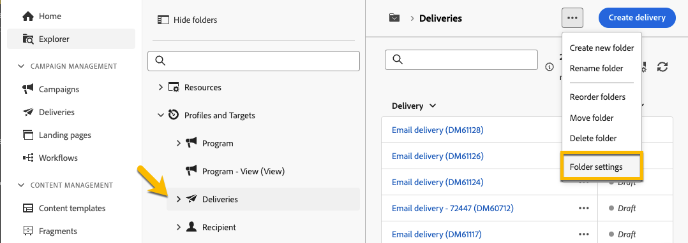

# Machtigingen {#permissions}

Elke gebruiker in Adobe Campaign heeft specifieke machtigingen en beperkingen in de toepassing. De gebruiker kan tot een operatorgroep behoren en de toestemmingen van de groep erven.

Op basis van hun machtigingen kan een operator:

* Toegang tot bepaalde mogelijkheden
* Toegang tot bepaalde gegevens
* Toegang tot bepaalde handelingen (maken, wijzigen, verwijderen)

Een gedetailleerde procedure voor vestiging toestemmingen in Adobe Campaign is beschikbaar in [&#x200B; Adobe Campaign v8 (console) documentatie &#x200B;](https://experienceleague.adobe.com/nl/docs/campaign/campaign-v8/admin/permissions/gs-permissions){target="_blank"}.

## Machtigingen voor mappen {#folder-permissions}

Op basis van uw rechten kunt u machtigingen voor mappen weergeven en beheren in de **[!UICONTROL Folder settings]** .

Hieronder ziet u een voorbeeld van een leveringsmap:

{zoomable="yes"}

In de sectie **[!UICONTROL Security]** van **[!UICONTROL Folder settings]** kunt u operatoren of groepen weergeven en beheren (toevoegen of verwijderen) die toegang hebben tot de map.

{zoomable="yes"}

U kunt rechtstreeks op de machtigingen klikken en deze wijzigen in **[!UICONTROL Allowed]** of **[!UICONTROL Denied]** .

{zoomable="yes"}

>[!NOTE]
>
>U mag geen object maken waarvoor u niet ten minste één map met schrijfrechten hebt.
>
>U hoeft geen beheerder te zijn om fragmenten te maken, maar u moet schrijfrechten hebben voor ten minste één map voor visueel fragment &quot;Inhoud&quot;. Anders kunt u geen visueel fragment maken.

Als de optie **[!UICONTROL Propagate]** is ingeschakeld, zijn alle machtigingen die voor een map zijn gedefinieerd, van toepassing op alle submappen. Deze machtigingen kunnen voor elke submap worden overschreven.

Als de optie **[!UICONTROL System folder]** is geselecteerd, hebben alle operatoren toegang, ongeacht hun machtigingen.

U kunt ook [&#x200B; de toestemmingen op omslagen in de console van Adobe Campaign &#x200B;](https://experienceleague.adobe.com/nl/docs/campaign/campaign-v8/admin/permissions/folder-permissions){target="_blank"} beheren.

Alle toestemmingen in het gebruikersinterface van het Web van de Campagne synchroniseren met de toestemmingen van de Console van de Cliënt van de Campagne.