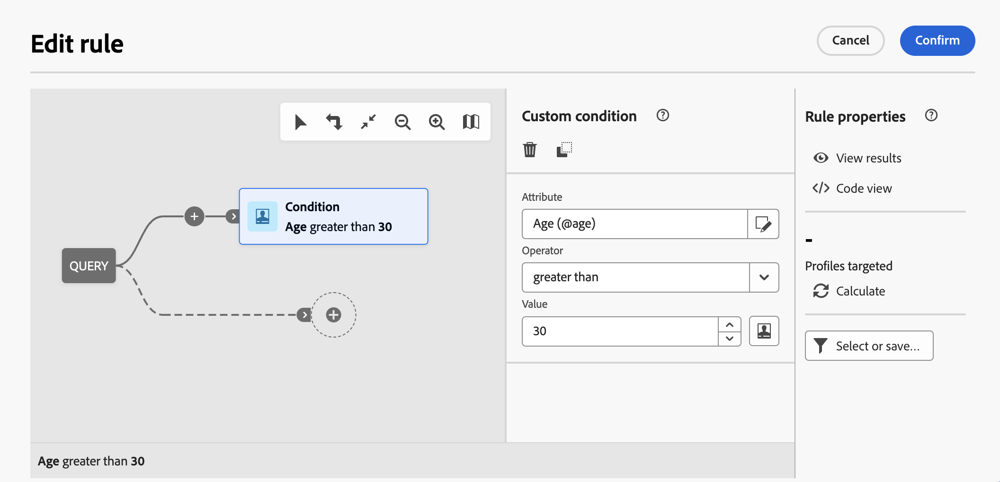
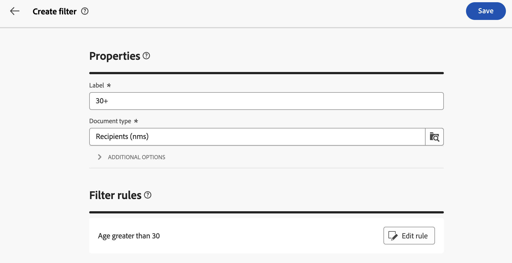
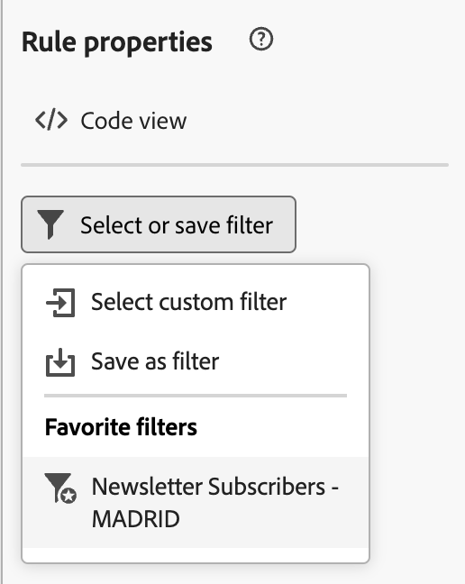
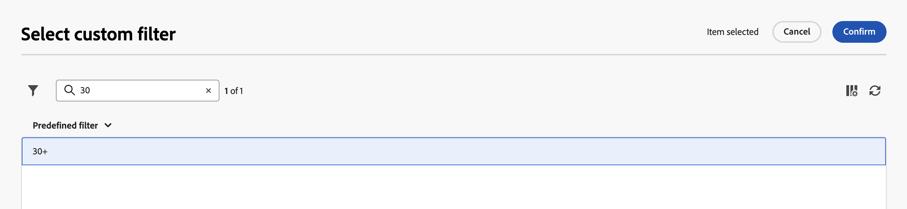
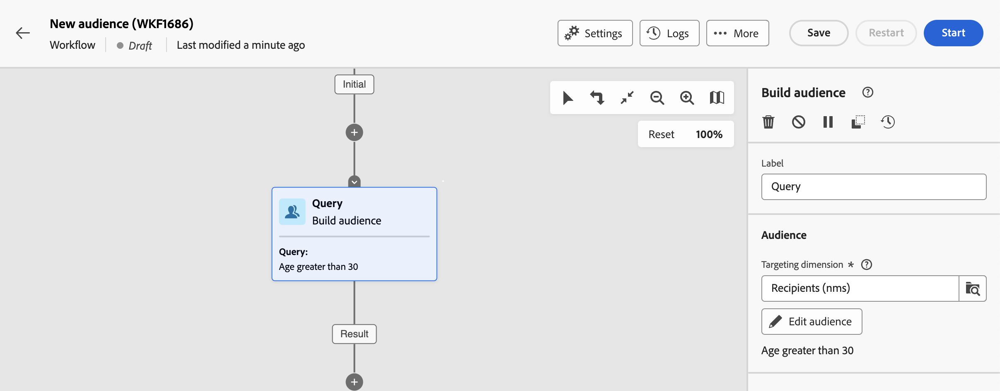
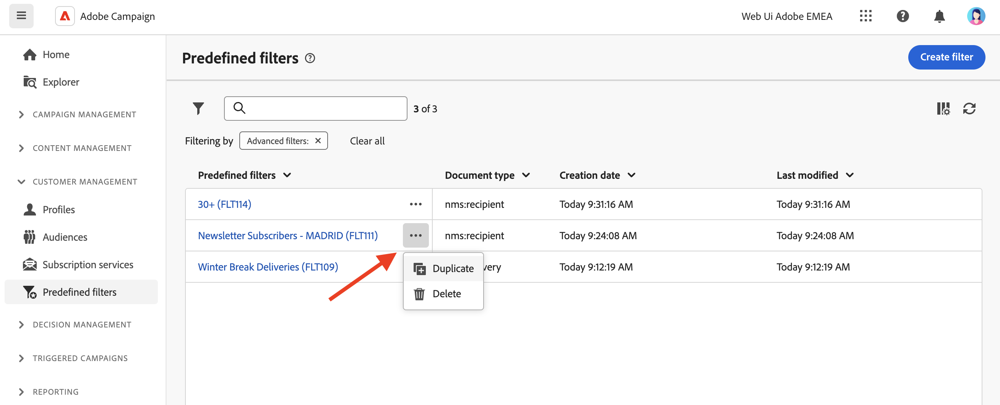

# Werken met vooraf gedefinieerde filters {#predefined-filters}

>[!CONTEXTUALHELP]
>id="acw_homepage_learning_card4"
>title="Vooraf gedefinieerd filterbeheer"
>abstract="De gebruikersinterface van het Web van de campagne biedt een gebruikersvriendelijke interface aan moeiteloos beheren en vooraf bepaalde filters aanpassen om aan uw specifieke behoeften te voldoen. Maak één keer en sla dit op voor toekomstig gebruik."

>[!CONTEXTUALHELP]
>id="acw_predefined-filters-dashboard"
>title="Vooraf gedefinieerde filters"
>abstract="De gebruikersinterface van het Web van de campagne biedt u een gebruikersvriendelijke interface aan moeiteloos beheer en aanpassingen vooraf bepaalde filters om aan uw specifieke behoeften te voldoen. Maak één keer en sla dit op voor toekomstig gebruik."

Vooraf gedefinieerde filters zijn aangepaste filters die worden gemaakt en opgeslagen om in de toekomst beschikbaar te zijn. Zij kunnen als kortere weg tijdens om het even welke het filtreren verrichtingen met de vraagmodeller, bijvoorbeeld worden gebruikt wanneer het filtreren van een lijst van gegevens, of het creëren van het publiek van een levering.

U kunt bestaande ingebouwde filters gebruiken om toegang te krijgen tot een specifieke subset van uw gegevens, of uw eigen vooraf gedefinieerde filters maken en deze opslaan.

## Een vooraf gedefinieerd filter maken {#create-predefined-filter}

>[!CONTEXTUALHELP]
>id="acw_predefined-filters-creation"
>title="Een vooraf gedefinieerd filter maken"
>abstract="Voer een label in voor het vooraf gedefinieerde filter en selecteer de tabel waarop het van toepassing is. Open de aanvullende opties om een beschrijving toe te voegen en stel dit filter in als favoriet. Vervolgens gebruikt u de knop &#39;Regel maken&#39; om de filtervoorwaarden te definiëren."

>[!CONTEXTUALHELP]
>id="acw_predefined-filters-rules"
>title="Vooraf gedefinieerde filterregels maken"
>abstract="Als u de filtervoorwaarden van het aangepaste filter wilt definiëren, klikt u op de knop Regel maken."

### Een filter maken op basis van de querymodelfunctie {#create-from-rule-builder}

U kunt een douanefilter van de [ vraagmodelaar ](../query/query-modeler-overview.md) bewaren om het voor toekomstig gebruik beschikbaar te hebben. Voer de volgende stappen uit:

1. Open de vraagmodeler en bepaal uw het filtreren voorwaarden. In het onderstaande voorbeeld filtert u ontvangers die in Madrid wonen en zich op een nieuwsbrief hebben geabonneerd.
1. Klik **Uitgezocht of sparen filter** knoop, en uitgezocht **sparen als filter**.

   

1. Selecteer **creeer een nieuwe filter**, en ga een naam en een beschrijving voor die filter in.

   

   U kunt het filter indien nodig opslaan als favoriet. Lees meer in [deze sectie](#fav-filter).

1. Klik **bevestigen** om uw veranderingen te bewaren.

Uw douanefilter is nu beschikbaar in de **Vooraf bepaalde lijst van Filters** en toegankelijk voor alle gebruikers van de Campagne.

### Een filter maken in de filterlijst {#create-filter-from-list}

U kunt een filter van de **Vooraf bepaalde filters** ingang in het linkermenu tot stand brengen. Volg onderstaande stappen om dit te doen:

1. Blader de **Vooraf bepaalde filters** ingang in het linkermenu.
1. Klik **creeer filterknoop**.
1. Ga de filternaam in en, van het **type van Document** gebied, selecteer het schema het op van toepassing is. Het standaardschema is `Recipients(nms)` .

1. Definieer de regel voor het filter. Profielen die ouder zijn dan 30.

   

1. Sla uw wijzigingen op.

   

Het filter wordt toegevoegd aan de vooraf gedefinieerde filterlijst. U kunt het filter indien nodig opslaan als favoriet. Lees meer in [deze sectie](#fav-filter).

## Filter opslaan als favoriet {#fav-filter}

Wanneer het creëren van een vooraf bepaald filter, kunt u **toelaten sparen als favoriete** optie als u dit vooraf bepaalde filter in uw favorieten wilt zien.

Wanneer een filter als favoriet wordt bewaard, is het beschikbaar aan alle gebruikers in de **favoriete filters** sectie van de lijst van de filterverwezenlijking, zoals hieronder getoond:

## Een vooraf gedefinieerd filter gebruiken {#use-predefined-filter}

Vooraf gedefinieerde filters zijn beschikbaar wanneer u regeleigenschappen definieert. Om tot vooraf bepaalde filters toegang te hebben, verkies de **Uitgezochte optie van de douanefilter** in het drop-down van de vraagmodelleur.

U kunt tot de volledige lijst van vooraf bepaalde filters toegang hebben beschikbaar voor de huidige context, en gebruik kortere weg beschikbaar in de **Favoriete filters** sectie van drop-down. Leer meer over favorieten in [ deze sectie ](#fav-filter).

Als u bijvoorbeeld een publiek wilt maken op basis van een vooraf gedefinieerd filter, voert u de volgende stappen uit:

1. Blader aan de **ingang van het Soorten publiek** in het linkermenu en klik **creëren de knoop van het Publiek** in de upper-left hoek van de lijst van soorten publiek.
1. Ga de publieksnaam in, en klik **creëren de knoop van het Publiek**.
1. Selecteer de **activiteit van de Vraag**, en, van de juiste ruit, klik **creëren publiek** knoop.

   

1. Van **Uitgezocht of sparen filter** knoop, kies de **Uitgezochte optie van de douanefilter**.

   

1. Blader naar het vooraf gedefinieerde filter dat u wilt gebruiken om het publiek te maken, selecteer het en bevestig het.

   

1. Controleer de regeleigenschappen voor dit filter en bevestig.

   Het filter wordt nu gebruikt als vraag in de **activiteit van de Vraag**.

   

1. Sparen uw veranderingen en klik de **knoop van het Begin** om het publiek te bouwen en het beschikbaar te maken in de publiekslijst.

## Uw vooraf gedefinieerde filters beheren {#manage-predefined-filter}

Alle vooraf gedefinieerde filters worden gegroepeerd in de specifieke vermelding van het navigatiemenu links.

In deze lijst kunt u een nieuw filter maken zoals hierboven beschreven en de onderstaande handelingen uitvoeren:

* Bewerk een bestaand filter en wijzig de regels en eigenschappen ervan.
* Een vooraf gedefinieerd filter dupliceren.
* Verwijder een vooraf gedefinieerd filter.

U kunt ook een vooraf gedefinieerd filter toevoegen als een favoriet voor snelle toegang bij het maken van uw publiek. Lees meer in [deze sectie](#fav-filter).

<!--
## Built-in predefined filters {#ootb-predefined-filter}

Campaign comes with a set of predefined filters, built from the client console. These filters can be used to define your audiences, and rules. They must not be modified.
-->
