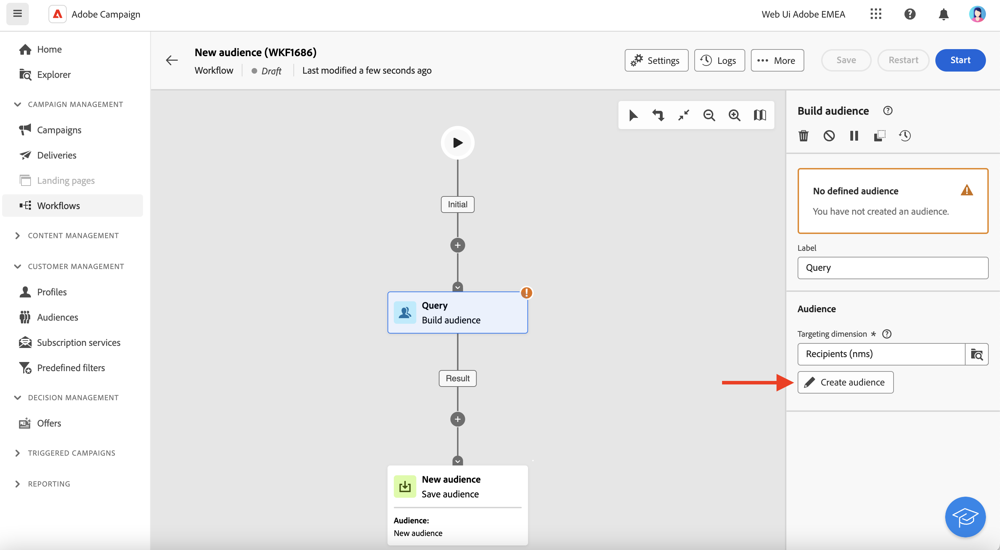
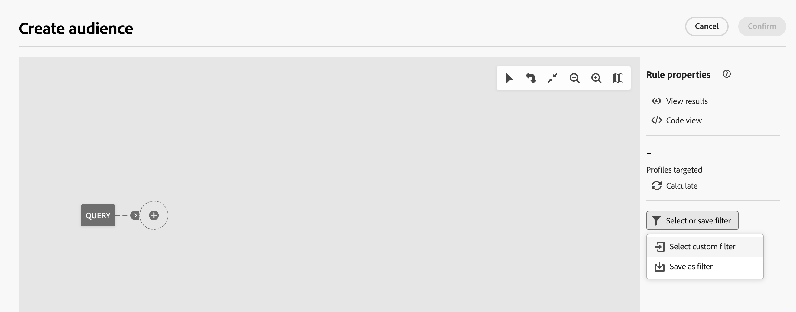

# Werken met vooraf gedefinieerde filters {#predefined-filters}

>[!CONTEXTUALHELP]
>id="acw_homepage_card3"
>title="Vooraf gedefinieerd filterbeheer"
>abstract="Campagne Web biedt u nu een gebruikersvriendelijke interface om vooraf gedefinieerde filters moeiteloos te beheren en aan te passen aan uw specifieke behoeften. Maak één keer en sla dit op voor toekomstig gebruik."

>[!CONTEXTUALHELP]
>id="acw_predefined-filters-dashboard"
>title="Vooraf gedefinieerde filters"
>abstract="Campagne Web biedt u nu een gebruikersvriendelijke interface om vooraf gedefinieerde filters moeiteloos te beheren en aan te passen aan uw specifieke behoeften. Maak één keer en sla dit op voor toekomstig gebruik."

Vooraf gedefinieerde filters zijn aangepaste filters die worden gemaakt en opgeslagen om in de toekomst beschikbaar te zijn. Zij kunnen als kortere weg tijdens om het even welke het filtreren verrichtingen met de regelbouwer, bijvoorbeeld worden gebruikt wanneer het filtreren van een lijst van gegevens, of het creëren van het publiek van een levering.

U kunt bestaande ingebouwde filters gebruiken om toegang te krijgen tot een specifieke subset van uw gegevens, of uw eigen vooraf gedefinieerde filters maken en deze opslaan.

## Een vooraf gedefinieerd filter maken {#create-predefined-filter}

>[!CONTEXTUALHELP]
>id="acw_predefined-filters-creation"
>title="Een vooraf gedefinieerd filter maken"
>abstract="Voer een label in voor het vooraf gedefinieerde filter en selecteer de tabel waarop het van toepassing is. Open de aanvullende opties om een beschrijving toe te voegen en stel dit filter in als favoriet. Vervolgens gebruikt u de knop &#39;Regel maken&#39; om de filtervoorwaarden te definiëren."

>[!CONTEXTUALHELP]
>id="acw_predefined-filters-rules"
>title="Vooraf gedefinieerde filterregels maken"
>abstract="Als u de filtervoorwaarden van het aangepaste filter wilt definiëren, klikt u op de knop Regel maken."

### Creeer een filter van de regelbouwer {#create-from-rule-builder}

U kunt een douanefilter van de regelbouwer bewaren om het voor toekomstig gebruik beschikbaar te hebben. Voer de volgende stappen uit:

1. Open de regelbouwer en bepaal uw het filtreren voorwaarden. In het onderstaande voorbeeld filtert u ontvangers die in Madrid wonen.
1. Klik op de knop **Filter selecteren of opslaan** en selecteert u **Opslaan als filter**.

   

1. Selecteren **Een nieuw filter maken** en voert u een naam en een beschrijving voor dat filter in.

   

   U kunt het filter indien nodig opslaan als favoriet. Meer informatie in [deze sectie](#fav-filter).

1. Klikken **Bevestigen** om uw wijzigingen op te slaan.

Uw aangepaste filter is nu beschikbaar in het dialoogvenster **Vooraf gedefinieerde filters** en toegankelijk voor alle campagnegebruikers.

### Een filter maken in de filterlijst {#create-filter-from-list}

U kunt een filter maken op basis van het **Vooraf gedefinieerde filters** in het linkermenu. Volg onderstaande stappen om dit te doen:

1. Bladeren in het dialoogvenster **Vooraf gedefinieerde filters** in het linkermenu.
1. Klik op de knop **Filter maken** knop.
1. Voer de filternaam in en typ **Documenttype** selecteert u het schema waarop het van toepassing is. Het standaardschema is `Recipients(nms)`.

   U kunt het filter indien nodig opslaan als favoriet. Meer informatie in [deze sectie](#fav-filter).

1. Definieer de regel voor het filter. Profielen die ouder zijn dan 30.

   

1. Sla uw wijzigingen op. Het filter wordt toegevoegd aan de vooraf gedefinieerde filterlijst.

## Filter opslaan als favoriet {#fav-filter}

Wanneer u een vooraf gedefinieerd filter maakt, kunt u **Opslaan als favoriet** als u dit vooraf gedefinieerde filter wilt zien in uw favorieten.

Wanneer een filter als favoriet wordt opgeslagen, is het beschikbaar voor alle gebruikers in **Favoriete filters** sectie van de lijst van de filterverwezenlijking, zoals hieronder getoond:

## Een vooraf gedefinieerd filter gebruiken {#use-predefined-filter}

Vooraf gedefinieerde filters zijn beschikbaar wanneer u regeleigenschappen definieert. Als u toegang wilt tot vooraf gedefinieerde filters, kiest u **Aangepast filter selecteren** in de drop-down van de regelbouwer.

Vervolgens hebt u toegang tot de volledige lijst met vooraf gedefinieerde filters die beschikbaar zijn voor de huidige context.

U kunt ook de filtersneltoetsen gebruiken die beschikbaar zijn in het dialoogvenster **Favoriete filters** van de vervolgkeuzelijst. Meer informatie over favorieten vindt u in [deze sectie](#fav-filter).

Als u bijvoorbeeld een publiek wilt maken op basis van een vooraf gedefinieerd filter, voert u de volgende stappen uit:

1. Bladeren in het dialoogvenster **Soorten publiek** in het linkermenu.
1. Klik op de knop **Publiek maken** knop.
1. Voer de naam van het publiek in en klik op **Publiek maken** knop.
1. Selecteer de **Query** activiteit, en, van de juiste ruit, klik **publiek maken** knop.

   

1. Van de **Filterknop selecteren of opslaan**, kiest u de **Aangepast filter selecteren** -optie.

   

1. Blader naar het vooraf gedefinieerde filter dat u wilt gebruiken om het publiek te maken, selecteer het en bevestig het.

   

1. Controleer de regeleigenschappen voor dit filter en bevestig.

   

   Het filter wordt nu gebruikt als een query in het dialoogvenster **Query** activiteit.

   

1. Sla uw wijzigingen op en klik op de knop **Start** om het publiek te maken en beschikbaar te maken in de lijst met doelgroepen.

## Uw vooraf gedefinieerde filters beheren {#manage-predefined-filter}

Vooraf gedefinieerde filters worden allemaal gegroepeerd in de toegewezen vermelding van het navigatiemenu links.

In deze lijst kunt u een nieuw filter maken, zoals hierboven beschreven, en:

* een bestaand filter bewerken en de regels en eigenschappen ervan wijzigen
* Een vooraf gedefinieerd filter dupliceren
* een vooraf gedefinieerd filter verwijderen

U kunt een vooraf gedefinieerd filter als favoriet voor een snelle toegang toevoegen wanneer het bouwen van uw regels. Meer informatie in [deze sectie](#fav-filter).

## Geïntegreerde voorgedefinieerde filters {#ootb-predefined-filter}

De campagne komt met een reeks vooraf bepaalde filters, die van de cliëntconsole worden gebouwd. Deze filters kunnen worden gebruikt om uw publiek, en regels te bepalen. Ze mogen niet worden gewijzigd.
