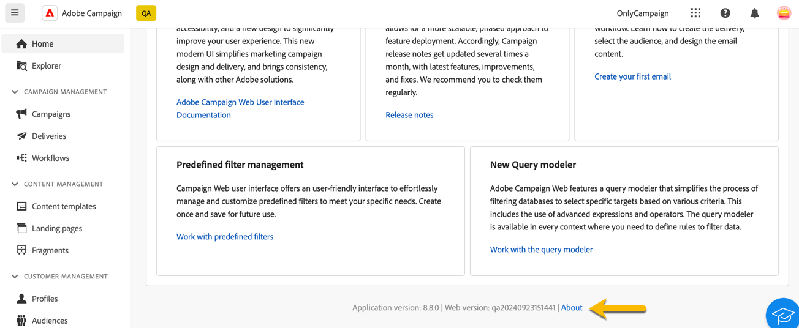
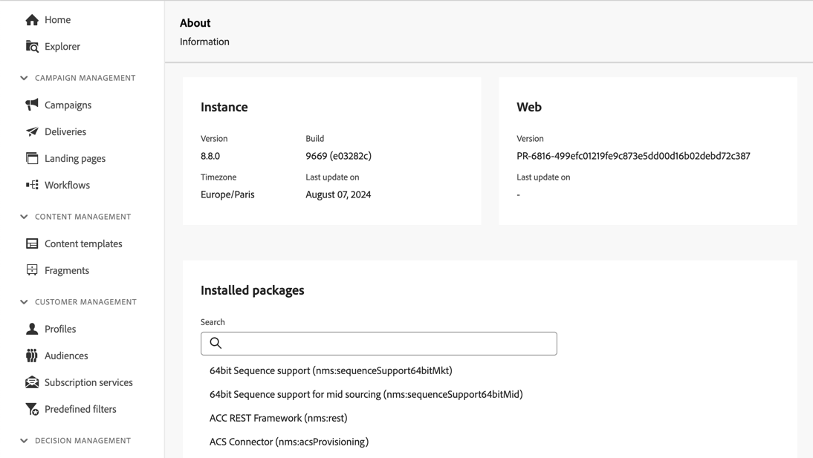

# De interface detecteren {#user-interface}

De nieuwe Adobe Campaign-webinterface biedt een moderne en intuïtieve gebruikerservaring om het ontwerp en de levering van marketingcampagnes te vereenvoudigen. Deze interface kan worden geïntegreerd met Adobe Experience Cloud-apps en -oplossingen.

Leer hoe te met Adobe Campaign te verbinden en de navigatiestandaarden van Experience Cloud [&#x200B; in dit artikel &#x200B;](connect-to-campaign.md) te onderzoeken.

>[!NOTE]
>
>Deze documentatie wordt regelmatig bijgewerkt om de laatste wijzigingen in de gebruikersinterface van het product weer te geven. Sommige schermafbeeldingen kunnen echter enigszins afwijken van uw gebruikersinterface.

## Startpagina campagne {#user-interface-home}

>[!CONTEXTUALHELP]
>id="acw_homepage_recent"
>title="Recenten"
>abstract="De **lijst van Recenten** verstrekt kortere weg aan onlangs gecreeerde en gewijzigde leveringen. In deze lijst staan de datum van het kanaal, de status, de eigenaar, het maken en de wijziging van de datums."

De homepage van de Campagne staat u toe om zeer belangrijke middelen, indicatoren, en componenten snel en gemakkelijk te doorbladeren.

In het bovenste gedeelte van de startpagina vindt u informatie over de nieuwste updates en nieuwe mogelijkheden die beschikbaar zijn in het product, met koppelingen naar Opmerkingen bij de release en gedetailleerde documentatie. Gebruik de linkerpijl om door eigenschapkaarten te scrollen.

{zoomable="yes"}

De **Zeer belangrijke prestatiesindicatoren** sectie laat u de doeltreffendheid van uw platform door gemeenschappelijke KPIs controleren. Leer meer over deze KPIs in [&#x200B; deze pagina &#x200B;](../reporting/kpis.md).

De **lijst van Recenten** verstrekt kortere weg aan onlangs gecreeerde en gewijzigde leveringen. In deze lijst staan de datum van het kanaal, de status, de eigenaar, het maken en de wijzigingen. Klik **tonen meer** verbinding om extra leveringen te laden.

Bovendien, kunt u tot de belangrijkste de hulppagina&#39;s van het Web van Adobe Campaign van de **het Leren** sectie van de pagina toegang hebben.

### Over koppeling {#user-interface-about}

>[!CONTEXTUALHELP]
>id="acw_about"
>title="Pagina"
>abstract="Op de pagina Info vindt u meer informatie over uw Adobe Campaign-exemplaar."

>[!CONTEXTUALHELP]
>id="acw_about_instance"
>title="Informatie over instantie"
>abstract="De sectie van de Instantie verstrekt zeer belangrijke informatie over uw consolecliënt, met inbegrip van zowel de versie als het bijbehorende bouwstijlaantal."

>[!CONTEXTUALHELP]
>id="acw_about_web"
>title="Info over Web"
>abstract="De sectie van het Web toont de versie van uw gebruikersinterface van het Web van de Campagne, met de laatste updatedatum van het, als beschikbaar."

>[!CONTEXTUALHELP]
>id="acw_about_packages"
>title="Informatie over geïnstalleerde pakketten"
>abstract="In de sectie Geïnstalleerde pakketten staan alle modules, functies en integratie in uw exemplaar."

Onder aan de pagina vindt u de koppeling **[!UICONTROL About]** met informatie over uw Adobe Campaign-exemplaar. Deze details worden alleen-lezen weergegeven.

{zoomable="yes"}

De **sectie van de Instantie** verstrekt zeer belangrijke informatie over uw consolecliënt, met inbegrip van zowel de **versie** en het bijbehorende **bouwt** aantal.

* De **versie** verwijst naar de officiële versie u gebruikt.
* **bouwt** verwijst naar een specifieke herhaling van die versie.

Zowel versie als bouwstijlaantallen zijn essentieel voor het oplossen van problemen, aangezien zij helpen de eigenschappen en de moeilijke situaties bepalen huidig in uw milieu.

De **sectie van het Web** &lbrace;toont de versie van uw gebruikersinterface van het Web van de Campagne, samen met de laatste updatedatum, als beschikbaar. Dit helpt veranderingen of verbeteringen volgen die aan het de gebruikersinterface van het Web van de Campagne worden aangebracht.

De **Geïnstalleerde pakketten** sectie maakt een lijst van alle modules, eigenschappen, en integratie die op uw instantie aanwezig zijn. Deze pakketten breiden de Adobe Campaign-functionaliteit uit, waardoor gespecialiseerde taken mogelijk zijn, zoals integratie met andere Adobe-oplossingen of ondersteuning voor specifieke workflows. Gezien het grote aantal pakketten, kunt u binnen deze sectie zoeken om snel te controleren of een bepaalde module op uw instantie geïnstalleerd is.

{zoomable="yes"}

## Linkernavigatiemenu {#user-interface-left-nav}

Blader links naar de links om toegang te krijgen tot Adobe Campaign Web-mogelijkheden. Verschillende koppelingen bevatten lijsten met objecten die kunnen worden gesorteerd en gefilterd. U kunt kolommen ook vormen om alle informatie te tonen u wenst. Zie deze [&#x200B; sectie &#x200B;](#list-screens). Sommige lijstschermen zijn alleen-lezen. Welke items in het navigatiemenu links en in de lijsten worden weergegeven, is afhankelijk van uw gebruikersmachtigingen. Leer meer over toestemmingen in [&#x200B; deze sectie &#x200B;](permissions.md).

### Verkenner {#user-interface-explorer}

>[!CONTEXTUALHELP]
>id="acw_explorer"
>title="Verkenner"
>abstract="Het **menu van de Ontdekkingsreiziger** toont alle componenten en voorwerpen van de Campagne met de zelfde omslaghiërarchie zoals in de cliëntconsole. Blader door al uw componenten, mappen en schema&#39;s van Campagne v8, controleer de bijbehorende machtigingen en maak mappen en submappen vanuit dit menu."

Het **menu van de Ontdekkingsreiziger** toont alle middelen en voorwerpen van de Campagne met de zelfde omslaghiërarchie zoals in de cliëntconsole. Blader door al uw componenten, mappen en schema&#39;s van Campagne v8 en maak leveringen, workflows en campagnes.

De punten die in **worden getoond Verkenner** hangen van uw gebruikerstoestemmingen af. U kunt ook mappen en submappen toevoegen als u de juiste rechten hebt. Leer meer over toestemmingen in [&#x200B; deze sectie &#x200B;](permissions.md).

U kunt kolommen vormen om de vertoning aan te passen om alle informatie te bekijken u wenst. Zie deze [&#x200B; sectie &#x200B;](#list-screens). U kunt omslagen en sub-omslagen, zoals die in [&#x200B; worden gedetailleerd ook toevoegen deze sectie &#x200B;](permissions.md#folders).

Voor meer informatie over de ontdekkingsreiziger van de Campagne, omslaghiërarchie, en middelen, verwijs naar deze [&#x200B; Campagne v8 (console) documentatie &#x200B;](https://experienceleague.adobe.com/docs/campaign/campaign-v8/new/campaign-ui.html#ac-explorer-ui){target="_blank"}.

### Campagnebeheer {#user-interface-campaign-management}

In de **sectie van het beheer van de Campagne 0&rbrace; &lbrace;, kunt u tot marketing campagnes, leveringen, en werkschema&#39;s toegang hebben.**

* **Campagnes** - dit is de lijst van uw campagnes en campagnemalplaatjes. Standaard kunt u voor elke campagne de begin-, eind-, aanmaak- en laatste wijzigingsdatums, de huidige status en de naam weergeven van de Campagneoperator die deze heeft gemaakt. U kunt de lijst filteren op status, begin-/einddatums, map of een geavanceerd filter maken om uw eigen filtercriteria te definiëren. Leer meer over campagnes [&#x200B; in deze sectie &#x200B;](../campaigns/gs-campaigns.md).

* **Leveringen** - doorblader door uw lijst van leveringen. Standaard kunt u hun status, laatste wijzigingsdatum en sleutel-KPI&#39;s weergeven. U kunt de lijst filteren op status, contactdatum of kanaal. Klik op een e-maillevering om het dashboard te openen voor een overzicht van de leveringsgegevens. Leveringen op andere kanalen zijn alleen-lezen. Leer meer over leveringen [&#x200B; in deze sectie &#x200B;](../msg/gs-messages.md).

  Gebruik **Meer acties** knoop om een levering te schrappen of te dupliceren.

  {zoomable="yes"}{width="70%" align="left"} [ Schermafbeelding die de Meer actieknop met opties toont om een levering te schrappen of te dupliceren.]

* **Werkschema&#39;s** - in dit scherm, kunt u tot de volledige lijst van werkschema&#39;s en werkschemamalplaatjes toegang hebben. U kunt hun status, de laatste/volgende uitvoeringsdata controleren en een nieuwe werkstroom of een nieuw werkschemamalplaatje creëren. U kunt de lijst filteren met dezelfde criteria als voor andere objecten. Bovendien kunt u workflows filteren die wel of niet tot een campagne behoren. Leer meer over werkschema&#39;s [&#x200B; in deze sectie &#x200B;](../workflows/gs-workflows.md).

### Contentmanagement {#user-interface-content-management}

In de **sectie van het beheer van de Inhoud**, kunt u uw inhoudsmalplaatjes en fragmenten bekijken.

* **malplaatjes van de Inhoud** - voor een versneld en verbeterd ontwerpproces, kunt u standalone malplaatjes tot stand brengen om douaneinhoud over [!DNL Adobe Campaign] gemakkelijk te hergebruiken. Alleen beschikbaar voor e-mails. Met deze functionaliteit kunnen gebruikers die op inhoud zijn gericht, aan zelfstandige sjablonen werken, zodat marketinggebruikers deze opnieuw kunnen gebruiken en aanpassen in hun eigen e-mailcampagnes. Lees meer in [deze sectie](../content/create-email-templates.md).

* **Fragmenten** - een fragment is een herbruikbare component die in één of meerdere leveringen over campagnes kan worden van verwijzingen voorzien. Wanneer u een fragment wijzigt, wordt alle inhoud die het fragment gebruikt, bijgewerkt. [&#x200B; Leer hoe te met fragmenten &#x200B;](../content/fragments.md) te werken.

Met deze functionaliteit kunt u meerdere blokken aangepaste inhoud vooraf samenstellen die marketinggebruikers kunnen gebruiken om snel e-mailinhoud samen te stellen in een verbeterd ontwerpproces.

### Klantenbeheer {#user-interface-customer-management}

In de **het beheersings** sectie van de Klant, kunt u uw profielen, publiek, en abonnementen bekijken. Deze lijsten zijn alleen-lezen.

* **Profielen** - creeer en beheer profielen, en toegang tot uw ontvankelijk gegevensbestand. Standaard kunt u hun e-mailadres, voornaam en achternaam weergeven. Leer meer over profielen in [&#x200B; deze sectie &#x200B;](../audience/about-recipients.md).
* **Soorten publiek** - dit is uw lijst van publiek. Standaard kunt u het type, de oorsprong, het maken, de laatste wijzigingsdatums en het label weergeven. U kunt de lijst filteren op oorsprong. Leer meer over publiek en lijsten in [&#x200B; deze sectie &#x200B;](../audience/about-recipients.md).
* **de diensten van het Abonnement** - doorblader door uw abonnementenlijsten. Standaard kunt u het type, de modus en het label ervan bekijken. Leer hoe te om abonnementen en abonnementen in [&#x200B; Adobe Campaign v8 (console) documentatie &#x200B;](https://experienceleague.adobe.com/docs/campaign/campaign-v8/campaigns/send/subscriptions.html){target="_blank"} te beheren.
* **Vooraf bepaalde filters** - de Vooraf bepaalde filters zijn douanefilters die worden gecreeerd en worden bewaard om voor toekomstig gebruik beschikbaar te zijn. Zij kunnen als kortere weg tijdens om het even welke het filtreren verrichtingen met de vraagmodelleeraar, bijvoorbeeld, worden gebruikt wanneer het filtreren van een lijst van gegevens of het creëren van het publiek van een levering. Lees meer in [deze sectie](predefined-filters.md).

### Beslissingsbeheer {#decision-management}

>[!CONTEXTUALHELP]
>id="acw_offers_list"
>title="Aanbiedingen"
>abstract="Blader door de lijsten van aanbiedingen en aanbiedingsmalplaatjes die in de console gebruikend de **module van de Interactie** zijn gecreeerd. Deze lijsten zijn alleen-lezen."
>additional-url="https://experienceleague.adobe.com/en/docs/campaign-web/v8/start/offers" text="Aanbiedingen toevoegen aan een levering"

In de **sectie van het Beheer van het Besluit**, kunt u de aanbiedingen bekijken en malplaatjes aanbieden. Deze lijsten zijn alleen-lezen.

* **Aanbiedingen** - doorblader door de lijst van aanbiedingen en aanbiedingsmalplaatjes die in de console worden gecreeerd gebruikend de **3&rbrace; module van de Interactie &lbrace;.** Standaard kunt u hun status, begin- en einddatum en omgeving weergeven. U kunt de lijst filteren op status en begin- en einddatum. Aanbiedingssjablonen zijn ook beschikbaar.

Leer om aanbiedingen in e-mail en SMS in [&#x200B; tot stand te brengen en te verzenden deze sectie &#x200B;](../msg/offers.md).

### Rapportage {#left-nav-reporting}

* **Rapporten** - de **ingang van het Rapport** biedt een geconsolideerde algemene samenvatting van verkeer en betrokkenheidsmetriek voor elk kanaal binnen uw milieu van de Campagne aan. Deze rapporten bestaan uit verschillende widgets, die elk een duidelijk perspectief bieden op uw campagne of leveringsprestaties. Lees meer in [deze sectie](../reporting/global-reports.md).

### Beheer {#left-nav-admin}

* **spoor van de Controle** - de **spoor van de Controle** ingang voorziet gebruikers van volledige zicht in alle wijzigingen die aan belangrijke entiteiten binnen uw instantie worden aangebracht, typisch die die beduidend de vlotte verrichting van de instantie beïnvloeden. [Meer informatie](../reporting/audit-trail.md).

* **Externe rekeningen** - creeer nieuwe externe rekeningen gebruikend het Gebruikersinterface van het Web om aan uw specifieke behoeften te voldoen en naadloze gegevensoverdrachten te verzekeren. [Meer informatie](../administration/external-account.md).

* **Schema&#39;s** - de gebieden van de Douane zijn extra attributen die aan uit-van-de-doosschema&#39;s door de console van Adobe Campaign worden toegevoegd. [Meer informatie](../administration/custom-fields.md).

<!--* **Delivery Alerting** - Delivery Alerting is an alert management system that enables groups of users to automatically receive email notifications with information on their delivery executions. [Learn more](../msg/delivery-alerting.md).-->

## Meer informatie {#learn-more}

Leer hoe te, onderzoek, en filterlijsten te doorbladeren beschikbaar in uw milieu van de Campagne [&#x200B; in deze pagina &#x200B;](list-filters.md).

<!--CONTEXTUAL HELP TO DISPATCH IN DOCS ONCE FEATURE LIVE-->

>[!CONTEXTUALHELP]
>id="acw_orchestration_notification"
>title="Doorlopende levering"
>abstract="Doorlopende levering"
