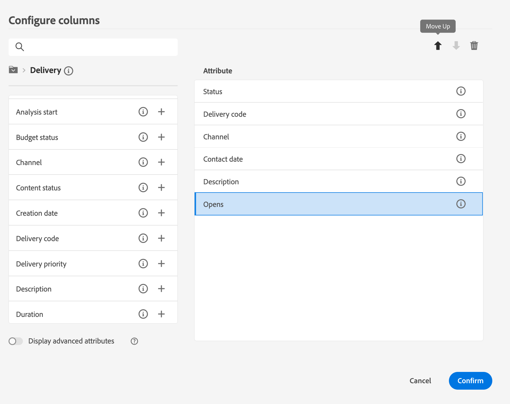

# De interface detecteren {#user-interface}

>[!CONTEXTUALHELP]
>id="acw_homepage_learnmore"
>title="De interface detecteren"
>abstract="De nieuwe Campagne v8 Web interface biedt een geïntegreerde, intuïtieve en consistente gebruikerservaring."

De nieuwe Campagne v8 Web interface biedt een moderne en intuïtieve gebruikerservaring om het ontwerpen en leveren van marketingcampagnes te vereenvoudigen. Deze nieuwe interface is geïntegreerd met Adobe Experience Platform.

<!--
Key concepts when browsing the user interface are common with Adobe Experience Platform. Refer to [Adobe Experience Platform documentation](https://experienceleague.adobe.com/docs/experience-platform/landing/platform-ui/ui-guide.html#adobe-experience-platform-ui-guide) for more details.
-->

>[!NOTE]
>
>Deze documentatie wordt vaak bijgewerkt om de laatste wijzigingen in de gebruikersinterface van het product te weerspiegelen. Sommige schermafbeeldingen kunnen echter enigszins afwijken van uw gebruikersinterface.

<!--
* console + web interface (overview, why use each of them)
* web UI made up of read-only lists that can be configured, show how to add columns
-->

## Linkernavigatiemenu

Blader links naar de koppelingen voor toegang tot de webmogelijkheden van Campagne v8. Met verschillende koppelingen worden lijsten weergegeven met objecten die kunnen worden gesorteerd en gefilterd. U kunt kolommen ook vormen om alle informatie te tonen u wenst. Zie dit [sectie](#list-screens). Alle lijstschermen zijn alleen-lezen, behalve de lijst met e-mailbezorgingen. Klik op een lijstitem voor editie/weergave is niet beschikbaar in Alfa. Alle lijsten kunnen in toekomstige versies worden bewerkt. Welke items in het navigatiemenu links worden weergegeven, is afhankelijk van uw gebruikersmachtigingen.

### Home

Dit scherm bevat belangrijke koppelingen en bronnen voor snelle toegang tot de belangrijkste functies van het Web van Campagne v8. De **Recenten** lijst bevat snelkoppelingen naar de onlangs gemaakte en gewijzigde leveringen. In deze lijst staan de datum en status van het maken en wijzigen van de bestanden.

<!--
* Banner
* KPIs on email channel (cross-deliveries): open rate, delivery rate, etc
* Recent items
* Learning cards
-->

Toegang tot Help-pagina&#39;s voor Campagne v8 Web key vanaf de onderste sectie van de startpagina.

<!--
show global KPIs, recent items + left menu to access features)
CONTROL PANEL not alpha
Global report not alpha
-->

### Verkenner

>[!CONTEXTUALHELP]
>id="acw_explorer"
>title="Verkenner"
>abstract="De **Verkenner** wordt dezelfde maphiërarchie weergegeven als in de clientconsole. Blader door al uw componenten, mappen en schema&#39;s van Campagne v8. Alle lijstschermen zijn alleen-lezen, behalve de lijst met e-mailbezorgingen."

De **Verkenner** wordt dezelfde maphiërarchie weergegeven als in de clientconsole. Blader door al uw componenten, mappen en schema&#39;s van Campagne v8. Alle lijstschermen zijn alleen-lezen, behalve de lijst met e-mailbezorgingen.

De items die in de Verkenner worden weergegeven, zijn afhankelijk van uw gebruikersmachtigingen.

Zoals in om het even welk lijstscherm, kunt u kolommen vormen om de vertoning te personaliseren om alle informatie te bekijken u wenst. Zie dit [sectie](#list-screens).

Raadpleeg voor meer informatie over de Campagneverkenner deze [documentatie](https://experienceleague.adobe.com/docs/campaign/campaign-v8/new/ac-ui/campaign-ui.html#ac-explorer-ui){target="_blank"}.
<!--
Explorer' menu in web UI to navigate through console content: console navtree second view in addition to the left menu lists with filters. The Explorer gives the real folder hierarchy from the console. Make sure you find your deliveries in sub-folders. All lists can be accessed in read-only. No Create/Edit. You can configure lists (colums). All schema fields, linked tables are available. 

If you need to view your lists of recipients (age, gender), transactions or live transactional messages. To view each/edit -> console.

Navtree view depends on permissions (same as console).
-->

### Campaign Management

>[!CONTEXTUALHELP]
>id="acw_campaigns_list"
>title="Campagnes"
>abstract="Dit is de lijst van uw campagnes. U kunt nuttige informatie zoals hun begin/eind/laatste wijzigingsdata, evenals hun status bekijken. U kunt de lijst filteren op status of begin-/einddatum. De sjablonen voor campagnes zijn ook beschikbaar. Deze lijsten zijn alleen-lezen."

>[!CONTEXTUALHELP]
>id="acw_deliveries_list"
>title="Leveringen"
>abstract="Blader door de lijst met leveringen. U kunt hun staat, laatste wijzigingsdatum evenals zeer belangrijke KPIs bekijken. U kunt de lijst filteren op status, contactdatum of kanaal. Klik op een e-maillevering om het dashboard te openen. Andere items zijn alleen-lezen. Leveringssjablonen zijn ook beschikbaar."

* **Campagnes** - Dit is de lijst met uw campagnes. Standaard kunt u de begin- en einddatum en de laatste wijzigingsdatum en de status van de datums weergeven. U kunt de lijst filteren op status of begin-/einddatum. De sjablonen voor campagnes zijn ook beschikbaar. Deze lijsten zijn alleen-lezen.

* **Leveringen** - Blader door de lijst met leveringen. Door gebrek, kunt u hun staat, laatste wijzigingsdatum evenals zeer belangrijke KPIs bekijken. U kunt de lijst filteren op status, contactdatum of kanaal. Klik op een e-maillevering om het dashboard te openen voor een overzicht van de leveringsgegevens. Leveringen op andere kanalen zijn alleen-lezen. De leveringsmalplaatjes zijn ook beschikbaar in read-only wijze. U kunt de clientconsole gebruiken om ze te bewerken. Zie dit [documentatie](https://experienceleague.adobe.com/docs/campaign/campaign-v8/campaigns/send/create-templates.html){target="_blank"}.

   Gebruik de **Meer handelingen** om een levering te verwijderen of te dupliceren.

   {width="70%" align="left"}

### Klantenbeheer

>[!CONTEXTUALHELP]
>id="acw_recipients_list"
>title="Ontvangers"
>abstract="Open de ontvangende database. U kunt nuttige informatie zoals hun e-mailadres, voornaam en achternaam bekijken. Deze lijst is alleen-lezen."

>[!CONTEXTUALHELP]
>id="acw_audiences_list"
>title="Doelgroepen"
>abstract="Dit is uw lijst van publiek. U kunt het type, de oorsprong, de datum en het label van de aanmaak/laatste wijziging bekijken. U kunt de lijst filteren op oorsprong. Deze lijst is alleen-lezen."

>[!CONTEXTUALHELP]
>id="acw_subscriptions_list"
>title="Abonnementenlijsten"
>abstract="Blader door uw abonnementenlijsten. U kunt het type, de modus en het label weergeven. Deze lijst is alleen-lezen."

* **Ontvangers** - Open de ontvangende database. Standaard kunt u hun e-mailadres, voornaam en achternaam weergeven. Deze lijst is alleen-lezen.
* **Soorten publiek** - Dit is uw lijst met doelgroepen. Standaard kunt u het type, de oorsprong, de datum en het label van de wijziging bekijken. U kunt de lijst filteren op oorsprong. Deze lijst is alleen-lezen.
* **Abonnementenlijsten** - Blader door uw abonnementenlijsten. Standaard kunt u het type, de modus en het label ervan bekijken. Deze lijst is alleen-lezen.
* **Workflows voorbereiden** - Ga naar uw lijst met campagneworkflows. Standaard kunt u de status, de laatste/volgende verwerkingsdatum en de omgeving van de datums bekijken. U kunt de lijst filteren op status, datum van laatste verwerking en type workflow. Workflowsjablonen zijn ook beschikbaar. Deze lijsten zijn alleen-lezen.

### Beslissingsbeheer

>[!CONTEXTUALHELP]
>id="acw_offers_list"
>title="Aanbiedingen"
>abstract="Blader door de lijst met interactievoorstellen. Standaard kunt u hun status, begin- en einddatum en omgeving bekijken. U kunt de lijst filteren op status en begin- en einddatum. Aanbiedingssjablonen zijn ook beschikbaar. Deze lijsten zijn alleen-lezen."

* **Aanbiedingen** - Blader door de lijst met interactievoorstellen. Standaard kunt u hun status, begin- en einddatum en omgeving bekijken. U kunt de lijst filteren op status en begin- en einddatum. Aanbiedingssjablonen zijn ook beschikbaar. Deze lijsten zijn alleen-lezen.

## Bovenste balk

De hoogste bar van de interface staat u toe:

* Uw feedback delen als een alfakanaal
* schakelen tussen organisaties en instanties
* schakelen tussen Adobe Experience Cloud-toepassingen
* toegang tot Help-pagina&#39;s, contact opnemen met ondersteuning en feedback delen. U kunt Help-artikelen en video&#39;s zoeken in het zoekveld.

{width="70%" align="left"}
<!--
Org / Sub-org switcher to switch between instances. Only one for Alpha. Later: intermerdiate screen with Control Panel (beta). if v8 + ACS with one card per ACS instance. Maybe quickly explain the menu for Alpha?
-->

## Lijstschermen configureren {#list-screens}

Verscheidene verbindingen van het linkernavigatiemenu, bijvoorbeeld **Leveringen** of **Campagnes**, weergaveoverzichten van objecten. Deze lijstschermen zijn alleen-lezen, behalve de lijst met e-mailbezorgingen.

Als u items sneller wilt zoeken, gebruikt u de zoekbalk of filtert u de lijst op basis van contextuele criteria.

{width="70%" align="left"}

De lijsten worden weergegeven in kolommen. U kunt extra informatie tonen door de kolomconfiguratie te veranderen. Klik hiertoe op het pictogram in de rechterbovenhoek van de lijst. U kunt kolommen toevoegen of verwijderen en de volgorde wijzigen waarin ze worden weergegeven.

{width="70%" align="left"}

U kunt items in de lijst sorteren door op een kolomkop te klikken. Er wordt een pijl weergegeven (omhoog of omlaag) die aangeeft dat de lijst in die kolom wordt gesorteerd. Voor numerieke kolommen of datumkolommen geeft de pijl-omhoog aan dat de lijst in oplopende volgorde wordt gesorteerd en de pijl-omlaag een aflopende volgorde aangeeft. Voor tekenreeks- of alfanumerieke kolommen worden waarden in alfabetische volgorde weergegeven.

## Contextafhankelijke hulp en handleiding bij het instappen

De interface bevat een contextafhankelijke Help. Klik op de knop **?** pictogram om Help-informatie en verwante documentatiekoppelingen weer te geven.

{width="70%" align="left"}

Er is ook een gids voor on-boarding beschikbaar om u te helpen aan de slag te gaan met Campagne v8 Web. Klik op het pictogram in de rechterbenedenhoek, kies een van de beschikbare stapsgewijze scenario&#39;s en volg de instructies.

{width="70%" align="left"}

## Ondersteunde browsers {#browsers}

Campagne v8 Web is ontworpen om optimaal te werken in de nieuwste versie van Google Chrome, Safari en Microsoft Edge. Mogelijk kunt u problemen ondervinden bij het gebruik van bepaalde functies in oudere versies of andere browsers.

## Taalvoorkeuren {#language-pref}

Campagne v8 Web is momenteel beschikbaar in de volgende talen:

<table>
<tr>
<td>

Engels (VS) - EN-US

Frans - FR

Duits - DE

Italiaans - IT

</td>
<td>

Spaans - ES

Portugees (Braziliaans) - PTBR

Japans - JP

</td>
<td>

Koreaans - KR

Vereenvoudigd Chinees - CHS

Traditioneel Chinees - CHT

</td>
</tr>
</table>

Uw standaardinterfacetaal wordt bepaald door de aangewezen taal die in uw gebruikersprofiel wordt gespecificeerd.

De taal wijzigen:

1. Klik op het profielpictogram, rechtsboven, en selecteer **Voorkeuren**.

   {width="70%" align="left"}

1. Klik vervolgens op de taal die onder uw e-mailadres wordt weergegeven.

   

1. Selecteer uw voorkeurstaal en klik op **Opslaan**. U kunt een tweede taal selecteren als de component die u gebruikt niet in uw eerste taal is gelokaliseerd.

   

<!--
## Supported browsers {#browsers}

Adobe Campaign interface is designed to work optimally in the latest version of Google Chrome. You might have trouble using certain features on older versions or other browsers.
-->

<!--
######## This part stores the contextualHelp definition for WebUI BETA ###########
######## These blocks should be dispatched in the appropriate pages when available ###########
######## PLEASE DO NOT DELETE ###########
REFER TO 
https://wiki.corp.adobe.com/pages/viewpage.action?spaceKey=neolane&title=v8+WebUI+Contextual+Help+%3CALPHA%3E-+Official+list
-->

>[!CONTEXTUALHELP]
>id="acw_sms_report_overview"
>title="Overzicht van SMS-rapporten"
>abstract="Ontdek de rapportgegevens voor je SMS-levering."

>[!CONTEXTUALHELP]
>id="acw_push_report_overview"
>title="Overzicht van pushrapport"
>abstract="Ontdek de rapportgegevens voor uw pushbestelling."

>[!CONTEXTUALHELP]
>id="acw_push_notification_template"
>title="Sjabloon voor pushmelding"
>abstract="TBD"

>[!CONTEXTUALHELP]
>id="acw_rulebuilder_properties_advanced"
>title="Geavanceerde kenmerken van Rule Builder"
>abstract="Gebruik geavanceerde attributen om uw regel te bepalen."

>[!CONTEXTUALHELP]
>id="acw_deliveries_email_metrics_sent"
>title="Verzonden cijfers"
>abstract="Aantal geleverde e-mailberichten."

>[!CONTEXTUALHELP]
>id="acw_deliveries_email_metrics_errors"
>title="Metrische fouten"
>abstract="Aantal e-mails met de foutstatus."

>[!CONTEXTUALHELP]
>id="acw_deliveries_push_android_content"
>title="Android-inhoud induwen"
>abstract="Definieer de inhoud van de push-Android."

>[!CONTEXTUALHELP]
>id="acw_deliveries_push_ios_content"
>title="iOS-inhoud doordrukken"
>abstract="Definieer de push-iOS-inhoud."

>[!CONTEXTUALHELP]
>id="acw_deliveries_sms_content"
>title="SMS-inhoud"
>abstract="Definieer de content van de sms."

>[!CONTEXTUALHELP]
>id="acw_sms_preview_option_app_target"
>title="App-abonnees"
>abstract="Geef een voorvertoning van het bericht weer en test het bericht door abonnees van de app aan het hoofddoel toe te voegen. "

>[!CONTEXTUALHELP]
>id="acw_email_preview_option_test_target"
>title="Testpopulatie"
>abstract="Selecteer een testpopulatiemodus."

>[!CONTEXTUALHELP]
>id="acw_email_preview_mode"
>title="Voorvertoningsmodus"
>abstract="Geef een voorvertoning van het bericht weer en test het bericht door de testpopulatie op te nemen in het hoofddoel."

>[!CONTEXTUALHELP]
>id="acw_targetdata_personalization_enrichmentdata"
>title="Verrijkingsgegevens"
>abstract="TBD"

>[!CONTEXTUALHELP]
>id="acw_targetdata_personalization_dashboard"
>title="Personalisatie"
>abstract="TBD"

>[!CONTEXTUALHELP]
>id="acw_audience_fromfile_select"
>title="Bestandselectie"
>abstract="TBD"

>[!CONTEXTUALHELP]
>id="acw_audience_fromfile_columns"
>title="Kolomdefinitie"
>abstract="Selecteer de kolommen die u uit het bestand wilt invoegen."

>[!CONTEXTUALHELP]
>id="acw_audience_fromfile_formatting"
>title="Parameters opmaken"
>abstract="Definieer de opmaakparameters voor het bestand."

>[!CONTEXTUALHELP]
>id="acw_campaign_reporting_sending"
>title="Rapportage verzenden"
>abstract="Raadpleeg de verzendende indicatoren voor de campagnerapportage."

>[!CONTEXTUALHELP]
>id="acw_campaign_reporting_tracking"
>title="Rapportage bijhouden"
>abstract="Raadpleeg de traceringsindicatoren voor de campagnerapportage."

>[!CONTEXTUALHELP]
>id="acw_campaign_reporting_deliveries_overview"
>title="Overzicht van rapportage"
>abstract="Belangrijke cijfers voor de levering."

>[!CONTEXTUALHELP]
>id="acw_campaign_reporting_deliveries_target"
>title="Rapportage van doelstatistieken"
>abstract="In deze sectie worden specifieke maatstaven weergegeven op basis van het publiek."

>[!CONTEXTUALHELP]
>id="acw_campaign_reporting_deliveries_selection"
>title="Geaggregeerde rapportage voor leveringen"
>abstract="Selecteer ten minste twee leveringen voor de weergave van een samengevoegd gegevensrapport."

>[!CONTEXTUALHELP]
>id="acw_campaign_creation_workflow"
>title="Werkstroomlijst"
>abstract="Lijst met workflows die beschikbaar zijn voor uw campagne."

>[!CONTEXTUALHELP]
>id="acw_orchestration_deduplication_fields"
>title="Deduplicatievelden"
>abstract="TBD"

>[!CONTEXTUALHELP]
>id="acw_orchestration_deduplication_settings"
>title="Instellingen voor deduplicatie"
>abstract="TBD"

>[!CONTEXTUALHELP]
>id="acw_orchestration_deduplication_complement"
>title="Deduplicatiefunctie"
>abstract="TBD"

>[!CONTEXTUALHELP]
>id="acw_orchestration_dimension_complement"
>title="Dimension"
>abstract="TBD"

>[!CONTEXTUALHELP]
>id="acw_push_permission_for_segment"
>title="Machtiging vereist"
>abstract="Uw beheerder moet u toestemming verlenen alvorens u een segment kunt tot stand brengen."

>[!CONTEXTUALHELP]
>id="acw_push_overview_edit"
>title="Machtiging vereist"
>abstract="Uw beheerder moet u toestemming verlenen alvorens u een segment kunt tot stand brengen."

>[!CONTEXTUALHELP]
>id="acw_attributepicker_advancedfields"
>title="Geavanceerde velden kenmerkkiezer"
>abstract="Kolommen met geavanceerde velden configureren."

>[!CONTEXTUALHELP]
>id="acw_rulebuilder_advancedfields"
>title="Geavanceerde velden voor regelbuilder"
>abstract="Kolommen met geavanceerde velden configureren."

>[!CONTEXTUALHELP]
>id="acw_deliveries_sms_properties"
>title="Eigenschappen van SMS-berichten"
>abstract="De eigenschappen voor SMS-levering beheren."

>[!CONTEXTUALHELP]
>id="acw_deliveries_push_properties"
>title="Eigenschappen voor punaise"
>abstract="Beheer de eigenschappen voor de levering van de push."

>[!CONTEXTUALHELP]
>id="acw_deliveries_metrics_newquarantines"
>title="Nieuwe metrische quarantines"
>abstract="Nieuwe quarantaine-meting."

>[!CONTEXTUALHELP]
>id="acw_deliveries_sms_template_selection"
>title="Sjabloonselectie via SMS"
>abstract="Selecteer een vooraf gedefinieerde sjabloon om de SMS-levering te starten."
