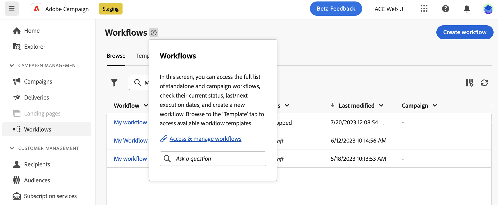

# De door AI aangedreven kennisassistent gebruiken {#using-ai}

U krijgt snelle, door AI gegenereerde antwoorden op basis van de productdocumentatie en uw huidige productcontext, met de door AI aangedreven knowkedge-assistent beschikbaar in de contextafhankelijke Help-vakken voor producten.

De **Medewerker kennis met Gen AI** ingebed in contextuele hulp revolutioneert documentatie het zoeken en het antwoorden van hoe te vragen met moeiteloze sifting door grote documentatiebewaarplaatsen, onmiddellijk het bepalen van de nauwkeurige informatie u nodig hebt.

Dankzij de mogelijkheden van CampagneGen AI transformeert deze assistent uw ervaring, waardoor informatie wordt opgehaald en problemen worden opgelost. Of u nu op zoek bent naar begeleiding in een complexe taak of door uitgebreide documenten navigeert, onze Knowledge Assistant met Gen AI is uw ultieme partner, die bij elke interactie een ongekende efficiëntie en nauwkeurigheid biedt.

## Toestemming {#consent-ai}

De hulp van de kennis van de campagne ingebed in de contextafhankelijke hulpvakjes gebruikt AI. Uw gebruik van deze mogelijkheid betekent dat u ermee instemt dat de informatie die u in uw sessie opgeeft, door de Adobe wordt verzameld, gebruikt, openbaar gemaakt en bewaard in overeenstemming met de voorwaarden van het feedbackprogramma voor klanten van de Adobe. Gelieve te verstrekken geen persoonlijke informatie over zich of andere partijen (met inbegrip van uw naam of contactinformatie) in de kennismedewerker.

## Privacy {#privacy-ai}

Uw gegevens worden gecodeerd en privé volgens onze standaardprocedures voor gegevensbescherming. Meer informatie over [Privacybeleid Adobe](https://www.adobe.com/nl/privacy/policy.html){target="_blank"}.

De AI-functie van de kennisassistent maakt geen gebruik van uw gegevens om onze modellen op te leiden. Wij staan geen partners of derden toe uw gegevens te gebruiken voor het trainen van hun modellen of enig ander doel.

Voor informatie specifiek voor Adobe AI beleid in Experience Cloud apps en oplossingen, verwijs naar [deze pagina](https://business.adobe.com/products/sensei/adobe-sensei.html){target="_blank"}.

## Antwoorden {#answers-ai}

Antwoorden kunnen onjuist of misleidend zijn. Dientengevolge, kan de Adobe kennisassistent onjuiste informatie uitvoeren. Controleer de productdocumentatie die in elk Help-vak is gekoppeld.

Kunstmatige intelligentie en modellen voor machinaal leren verbeteren in de loop der tijd om specifieke gebruiksgevallen beter aan te pakken. De komende maanden zal de door AI aangedreven kennisassistent beter worden. We raden u ten zeerste aan de ? ??? knopen op om het even welk ogenblik u een anker leest, om het even welke ongepaste reacties aan onze ingenieurs te vlaggen.

## Aanbevelingen  {#recommendations-ai}

Wanneer u een vraag stelt in de contextuele Help, wordt rekening gehouden met de huidige productcontext.

Om het beste van de medewerker te krijgen, wanneer het stellen van een vraag, adviseren wij u om:

* Wees zo nauwkeurig en specifiek mogelijk en vermijd dubbelzinnigheid. Het antwoord zal nauwkeuriger en nuttiger zijn.
* Om de kennisassistent te helpen de correcte informatie vinden, voeg zoveel mogelijk details over wat toe u probeert te leren.
* Verfijn en verfris uw vragen om betere antwoorden te krijgen. Als het antwoord niet nauwkeurig of nuttig is, probeert u verschillende benaderingen en voegt u context toe voor betere resultaten.
* Gebruik de juiste termen en bewoordingen, met een neutrale toon.
* Beoordeel de antwoorden en geef feedback zodat onze technici van uw ervaring kunnen leren en de resultaten kunnen verbeteren.

