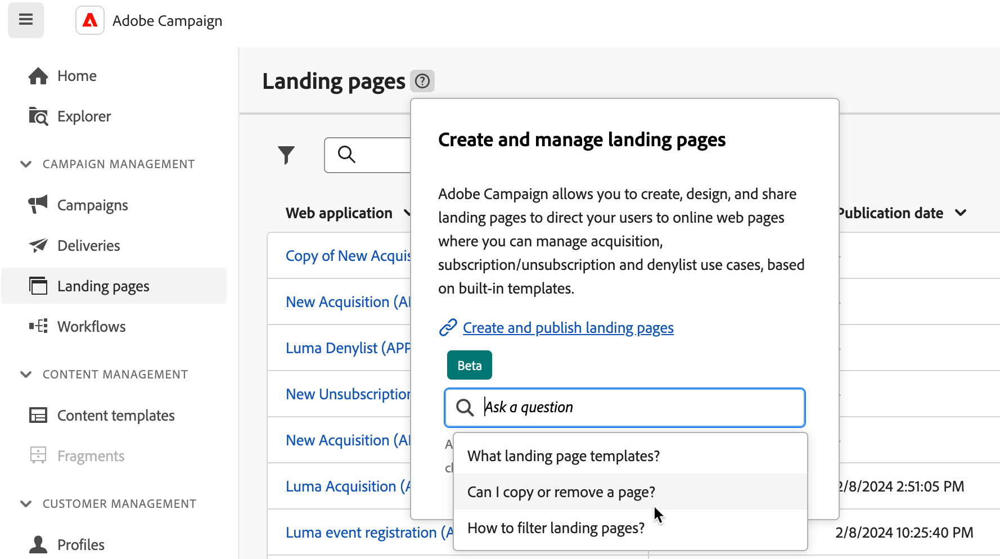

# Contextafhankelijke Help voor AI {#using-ai}

U krijgt snelle, door AI gegenereerde antwoorden op basis van de productdocumentatie en uw huidige productcontext, met de contextuele Help voor vragen en antwoorden van AI beschikbaar in de productcontextafhankelijke Help-vakken.

De **Contextuele hulp met Gen AI** ingebed in contextuele hulp revolutioneert documentatie het zoeken en het antwoorden van hoe te vragen met moeiteloze sifting door grote documentatiebewaarplaatsen, onmiddellijk het bepalen van de nauwkeurige informatie u nodig hebt.

Dankzij de mogelijkheden van CampagneGen AI transformeert deze component uw ervaring, waardoor informatie wordt opgehaald en problemen worden opgelost. Of u nu hulp zoekt bij een complexe taak of door uitgebreide documenten navigeert, de door AI aangedreven Contextual Help is de ultieme partner die bij elke interactie een ongeëvenaarde efficiëntie en nauwkeurigheid biedt.

>[!AVAILABILITY]
>
>Contextafhankelijke Help op basis van AI is beschikbaar in de bètaversie en kan zonder voorafgaande kennisgeving worden gewijzigd.
>
>Deze functie is alleen beschikbaar in **Engels**. Andere talen worden niet ondersteund in deze versie. Daarom moet u ervoor zorgen dat [uw voorkeurstaal](connect-to-campaign.md#language-pref) wordt ingesteld op Engels voordat deze mogelijkheid wordt gebruikt.
>
>Contextafhankelijke Help voor AI is momenteel niet beschikbaar in Campagne-e-mailDesigner.

<!--
## Consent {#consent-ai}

Campaign knowledge assistant embeeded in the contextual help boxes uses AI. Your use of this capability constitutes consent that the information you provide in your session will be collected, used, disclosed, and retained by Adobe in accordance with the terms of Adobe's Customer Feedback Program. Please do not provide any personal information about yourself or other parties (including your name or contact information) in the knowledge assistant.

## Privacy {#privacy-ai}

Your data is encrypted and private following our standard data protection practices. Learn more about [Adobe Privacy Policies](https://www.adobe.com/privacy/policy.html){target="_blank"}.

The knowledge assistant AI capability does not use your data to train our models. We do not allow any partners or 3rd parties to use your data for training their models or any other purpose.

For information specific to Adobe AI policies in Experience Cloud apps and solutions, refer to [this page](https://business.adobe.com/products/sensei/adobe-sensei.html){target="_blank"}.
-->

## Voorgestelde vragen {#questions-ai}

Vanuit het invoerveld stelt Adobe Campaign AI-powered Contextual Help drie vragen. Deze vragen zijn door AI gegenereerd en hebben betrekking op het Help-vak en de huidige productcontext. Selecteer een vraag om het antwoord te krijgen.

{width="600" align="left"}{zoomable="yes"}

## Antwoorden {#answers-ai}

Contextuele Help van Adobe Campaign AI biedt ondersteuning, maar u moet de feiten controleren. Het kan onjuiste informatie, onjuiste of misleidende antwoorden uitvoeren. Controleer de productdocumentatie die in elk Help-vak is gekoppeld.

U kunt een antwoord naar het klembord kopiëren met de opdracht **Kopiëren** onder aan het pop-upmenu Help.

{width="600" align="left"}{zoomable="yes"}

## Feedback {#feedback-ai}

Kunstmatige intelligentie en modellen voor machinaal leren verbeteren in de loop der tijd om specifieke gebruiksgevallen beter aan te pakken. De komende maanden zal de door AI aangedreven Contextuele Hulp beter blijven worden. We raden u ten zeerste aan de  op elk moment dat u een browser leest, kunt u eventuele onjuiste antwoorden markeren voor onze technici.

## Aanbevelingen  {#recommendations-ai}

Wanneer u een vraag stelt in de contextafhankelijke Help van AI, wordt rekening gehouden met de huidige productcontext, dat wil zeggen het scherm waarin u zich bevindt en de inhoud van het huidige Help-vak.

Het is daarom aan te raden vragen te stellen over de context van de gebruikersinterface. Als u bijvoorbeeld wilt leren hoe u een pushbericht in een workflow kunt verzenden, bladert u naar de **Workflow** en gebruik een contextueel Help-vak in die specifieke context. Als u meer wilt weten over het rapporteren van metriek, bladert u naar de campagne- of leveringsrapporten en begint u van daaruit.

Bovendien adviseren wij u om, voor het beste van AI-aangedreven Contextuele Hulp, wanneer het stellen van een vraag, om:

* Wees zo nauwkeurig en specifiek mogelijk en vermijd dubbelzinnigheid. Het antwoord zal nauwkeuriger en nuttiger zijn.
* Om de op AI-Gebaseerde Contextuele Hulp te helpen de correcte informatie vinden, voeg zoveel mogelijk details over wat toe u probeert te leren.
* Verfijn en verfris uw vragen om betere antwoorden te krijgen. Als het antwoord niet nauwkeurig of nuttig is, probeert u verschillende benaderingen en voegt u context toe voor betere resultaten.
* Gebruik de juiste termen en bewoordingen, met een neutrale toon.
* Beoordeel de antwoorden en geef feedback zodat onze technici van uw ervaring kunnen leren en de resultaten kunnen verbeteren.
