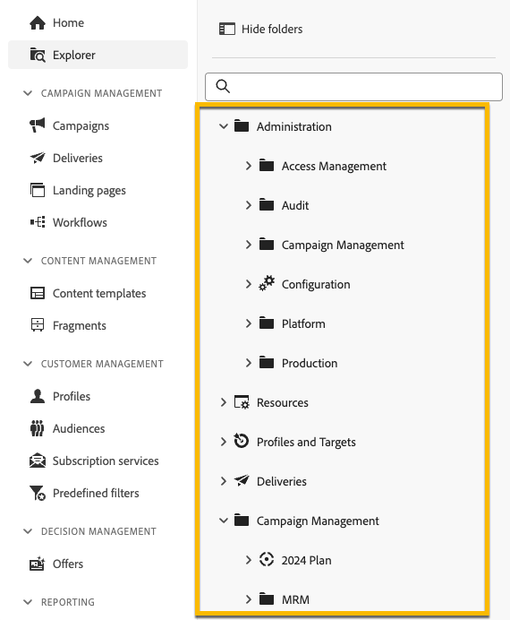

# Werken met mappen {#folders}

>[!CONTEXTUALHELP]
>id="acw_folder_properties"
>title="Eigenschappen van map"
>abstract="Eigenschappen van map"

>[!CONTEXTUALHELP]
>id="acw_folder_security"
>title="Mapbeveiliging"
>abstract="Mapbeveiliging"

>[!CONTEXTUALHELP]
>id="acw_folder_schedule"
>title="Mapschema"
>abstract="Mapschema"

## Mappen {#about-folders}

Mappen zijn objecten in Adobe Campaign waarmee u uw componenten en gegevens kunt ordenen.

U kunt mappen in de navigatiestructuur maken, hernoemen, opnieuw ordenen en verplaatsen. U kunt deze ook verwijderen op basis van uw rechten.

{zoomable="yes"} tonen

U kunt een maptype instellen. Bijvoorbeeld een map met leveringen. Het mappictogram verandert afhankelijk van het type.

>[!CONTEXTUALHELP]
>id="acw_folder_restrictions"
>title="Mapbeperkingen"
>abstract="De mappen Objecten die automatisch worden gemaakt en Technische workflows zijn beperkt en kunnen niet worden weergegeven in het linkerdeelvenster."

>[!IMPORTANT]
>
>De mappen **[!UICONTROL Objects created automatically]** en **[!UICONTROL Technical workflows]** zijn beperkt en kunnen niet worden weergegeven in het linkerdeelvenster.

## Nieuwe map maken {#create-a-folder}

Ga als volgt te werk om een nieuwe map te maken in de gebruikersinterface van Adobe Campaign:

1. Ga in **[!UICONTROL Explorer]** naar de map waarin u de nieuwe map wilt maken. Selecteer **[!UICONTROL ...]** onder het menu **[!UICONTROL Create new folder]** .

{zoomable="yes"}

Wanneer u een nieuwe map maakt, wordt het maptype standaard ingesteld op het type bovenliggende map. In dit voorbeeld wordt een map gemaakt in de map **[!UICONTROL Deliveries]** .

{zoomable="yes"}

1. Wijzig het maptype door indien nodig op het pictogram voor het maptype te klikken en selecteer het gewenste type in de weergegeven lijst, zoals hieronder wordt getoond:

{zoomable="yes"}

Stel het maptype in door op de knop **[!UICONTROL Confirm]** te klikken.

Als u een map zonder specifiek type wilt maken, selecteert u het type **[!UICONTROL Generic Folder]** .

U kunt ook [ omslagen in de console van Adobe Campaign ](https://experienceleague.adobe.com/en/docs/campaign/campaign-v8/config/configuration/folders-and-views) tot stand brengen en leiden.

## Mappen opnieuw ordenen {#reorder-folders}

U kunt de mappen naar wens opnieuw ordenen. Klik hiertoe op **[!UICONTROL Reorder folders]**, zoals hieronder wordt weergegeven.

In dit voorbeeld, bevat de **Leveringen** omslag vier subfolders.

{zoomable="yes"}

U kunt de orde van omslagen veranderen of door **belemmering en daling** of door **op en neer pijlen** te gebruiken.

{zoomable="yes"} opnieuw rangschikt

### Favoriete mappen {#favorite-folders}

>[!CONTEXTUALHELP]
>id="acw_folder_favorites"
>title="Favorieten"
>abstract="Uw favoriete mappen worden boven aan het linkertabblad weergegeven."

De mappen die als Favoriet zijn gemarkeerd, worden altijd boven aan het linkertabblad weergegeven.

U kunt mappen als favoriet toevoegen door in de rechterbovenhoek op de sterknop te klikken wanneer u een map weergeeft.

{zoomable="yes"}

## Een map verwijderen {#delete-a-folder}

>[!CAUTION]
>
>Wanneer u een map verwijdert, worden ook alle in de map opgeslagen gegevens verwijderd.

Als u een map wilt verwijderen, selecteert u deze in de **[!UICONTROL Explorer]** -structuur en klikt u op het menu **[!UICONTROL ...]** . Kies **[!UICONTROL Delete folder]** .

{zoomable="yes"}

## Verdeling van waarden in een map {#distribution-values-folder}

De verdeling van waarden helpt u het percentage van een waarde in een kolom binnen een lijst begrijpen.

Ga als volgt te werk om de verdeling van waarden in een map weer te geven.

Bijvoorbeeld, onder de leveringen, kunt u de distributie van waarden in de **kolom van het Kanaal** willen kennen.

Ga naar de map **[!UICONTROL Deliveries]** en klik op het pictogram **[!UICONTROL Configure columns]** om deze informatie op te halen.

Klik in het venster **[!UICONTROL Configure columns]** op het pictogram **[!UICONTROL Information]** dat betrekking heeft op de kolom die u wilt analyseren. Klik vervolgens op de knop **[!UICONTROL Distribution of values]** .

{zoomable="yes"}

Het percentage waarden wordt weergegeven in de kolom **[!UICONTROL Channel]** .

{zoomable="yes"}

>[!NOTE]
>
>Voor kolommen met veel waarden worden alleen de eerste 20 waarden weergegeven. U ontvangt een waarschuwing **[!UICONTROL Partial load]** .

U kunt ook de verdeling van waarden voor een koppeling weergeven.

Klik in de lijst met kenmerken op de knop **+** naast de gewenste koppeling, zoals hieronder wordt weergegeven. Hiermee voegt u de koppeling toe aan **[!UICONTROL Output columns]** . U hebt nu toegang tot het pictogram **[!UICONTROL Information]** , zodat u de verdeling van de waarden kunt bekijken. Klik op de knop **[!UICONTROL Output columns]** als u de koppeling niet in **[!UICONTROL Cancel]** wilt behouden.

{zoomable="yes"}

Het is ook mogelijk om de distributie van waarden in een vraagmodeler te bekijken. [ leer hier meer ](../query/build-query.md#distribution-of-values-in-a-query).

### De waarden filteren {#filter-values}

Door **[!UICONTROL Advanced filters]** in de distributie van waardenvenster te gebruiken, kunt u resultaten filtreren die op gespecificeerde voorwaarden worden gebaseerd.

In het voorbeeld van de leveringslijst hierboven, die de distributie per kanaal toont, kunt u het filtreren om slechts leveringen met een status van **te tonen beëindigde**.

{zoomable="yes"}