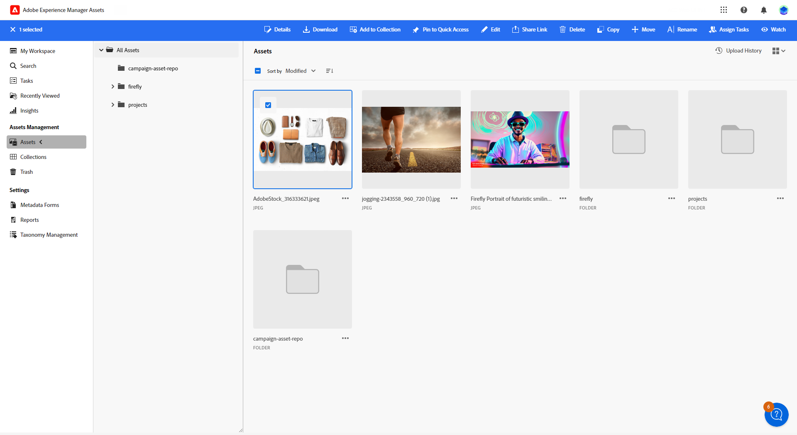

# Elementen beheren met [!DNL Adobe Experience Manager Assets as a Cloud Service]{#aem-assets}

## Aan de slag met [!DNL Adobe Experience Manager Assets as a Cloud Service] {#get-started-assets-essentials}

[!DNL Adobe Experience Manager Assets as a Cloud Service] is een geïntegreerd platform voor samenwerking dat is ontworpen om uw creatieve workflow te stroomlijnen en digitale middelen te centraliseren voor een naadloze weergave van ervaringen. Het vereenvoudigt de organisatie, het etiketteren, en het terugwinnen van goedgekeurde productiemiddelen, die merkconsistentie tussen teams verzekeren. Met de gebruikersvriendelijke interface van [!DNL Assets as Cloud Service] hebt u direct toegang tot en kunt u elementen delen in uw Adobe Creative- en Experience Cloud-toepassingen.

Leer meer in [&#x200B; documentatie van as a Cloud Service van Adobe Experience Manager Assets &#x200B;](https://experienceleague.adobe.com/docs/experience-manager-cloud-service/content/assets/home.html?lang=nl-NL){target="_blank"}.

## Elementen uploaden en invoegen{#add-asset}

Als u bestanden wilt importeren naar [!DNL Assets as Cloud Service] , bladert u naar de map waarin de bestanden worden opgeslagen of maakt u deze. Voeg ze vervolgens in uw e-mailinhoud in.

Voor meer informatie over hoe te om activa te uploaden, verwijs naar [&#x200B; documentatie van as a Cloud Service van Adobe Experience Manager Assets &#x200B;](https://experienceleague.adobe.com/docs/experience-manager-cloud-service/content/assets/assets-view/add-delete-assets-view.html?lang=nl-NL){target="_blank"}.

1. Open vanaf uw startpagina het geavanceerde menu en selecteer [!DNL Experience Manager Assets] .

   {zoomable="yes"} toont

1. Onder **Beheer van Assets**, klik **Assets**, en kies de bewaarplaats voor uw activa in Adobe Campaign.

1. Klik op een map in de centrale sectie of in de structuurweergave om deze te openen.

   U kunt ook op **[!UICONTROL Create folder]** klikken om een nieuwe map te maken.

1. Klik eenmaal in de geselecteerde of gemaakte map op **[!UICONTROL Add Assets]** om een nieuw element te uploaden naar uw map.

   {zoomable="yes"}

1. Klik in het menu **[!UICONTROL Upload files]** op **[!UICONTROL Browse]** en kies of **[!UICONTROL Browse files]** of **[!UICONTROL Browse folders]** .

1. Selecteer het bestand dat u wilt uploaden. Klik op **[!UICONTROL Upload]** als u klaar bent.

   {zoomable="yes"}

1. Selecteer het element dat u net hebt geüpload om het menu voor geavanceerd middelenbeheer te openen.

   Meer leren over het beheren van uw activa, verwijs naar deze [&#x200B; pagina &#x200B;](https://experienceleague.adobe.com/docs/experience-manager-cloud-service/content/assets/assets-view/manage-organize-assets-view.html?lang=nl-NL).

   {zoomable="yes"} tonen

1. Als u uw elementen verder wilt bewerken met Adobe Photoshop Express, dubbelklikt u op het element. Selecteer vervolgens in het rechtermenu het pictogram **[!UICONTROL Edit mode]** . [Meer informatie](https://experienceleague.adobe.com/docs/experience-manager-cloud-service/content/assets/assets-view/edit-images-assets-view.html?lang=nl-NL#edit-using-express){target="_blank"}.

1. Selecteer in [!DNL Adobe Campaign] het menu **[!UICONTROL Asset picker]** in het linkerdeelvenster van de e-mailontwerper.

   {zoomable="yes"}

1. Selecteer de eerder gemaakte **[!UICONTROL Assets]** map. U kunt ook zoeken naar uw middel of map in de zoekbalk.

   Klik indien nodig op **[!UICONTROL Manage assets]** om rechtstreeks toegang te krijgen tot de [!DNL Adobe Experience Manager Assets] -werkruimte.

1. Sleep uw middel naar uw e-mailinhoud.

   {zoomable="yes"}

1. Pas uw elementen verder aan met de tabbladen **[!UICONTROL Settings]** en **[!UICONTROL Styles]** , zoals het toevoegen van een externe koppeling of tekst. [&#x200B; leer meer over componentenmontages &#x200B;](../email/content-components.md).

   {zoomable="yes"}