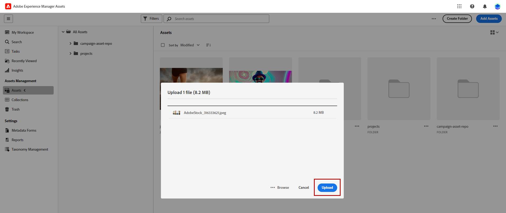

# Elementen beheren met [!DNL Adobe Experience Manager Assets as a Cloud Service]{#aem-assets}

## Aan de slag met [!DNL Adobe Experience Manager Assets as a Cloud Service] {#get-started-assets-essentials}

[!DNL Adobe Experience Manager Assets as a Cloud Service] is een geïntegreerd platform voor samenwerking dat is ontworpen om uw creatieve workflow te stroomlijnen en digitale middelen te centraliseren voor een naadloze weergave van ervaringen. Het vereenvoudigt de organisatie, het etiketteren, en het terugwinnen van goedgekeurde productiemiddelen, die merkconsistentie tussen teams verzekeren. Dankzij de gebruikersvriendelijke interface van [!DNL Assets as Cloud Service] hebt u direct toegang tot elementen in Creative Cloud- en Experience Cloud-toepassingen voor Adoben en kunt u deze delen.

Leer meer in [ as a Cloud Service documentatie van Adobe Experience Manager Assets ](https://experienceleague.adobe.com/docs/experience-manager-cloud-service/content/assets/home.html) {target="_blank"}.

## Elementen uploaden en invoegen{#add-asset}

Als u bestanden wilt importeren naar [!DNL Assets as Cloud Service] , moet u eerst bladeren naar de map waarin de bestanden worden opgeslagen of deze maken. U kunt deze vervolgens invoegen in uw e-mailinhoud.

Voor meer informatie over hoe te om activa te uploaden, verwijs naar [ as a Cloud Service documentatie van Adobe Experience Manager Assets ](https://experienceleague.adobe.com/docs/experience-manager-cloud-service/content/assets/assets-view/add-delete-assets-view.html) {target="_blank"}.

1. Open vanaf uw startpagina het geavanceerde menu en selecteer [!DNL Experience Manager Assets] .

   {zoomable="yes"}

1. Onder **Beheer van Assets**, klik **Assets** en kies de bewaarplaats voor uw Assets in Adobe Campaign.

1. Klik op een map in de centrale sectie of in de structuurweergave om deze te openen.

   U kunt ook op **[!UICONTROL Create folder]** klikken om een nieuwe map te maken.

1. Klik eenmaal in de geselecteerde of gemaakte map op **[!UICONTROL Add Assets]** om nieuw element te uploaden naar uw map.

   {zoomable="yes"}

1. Klik in het vak **[!UICONTROL Upload files]** op **[!UICONTROL Browse]** en kies of u **[!UICONTROL Browse files]** of **[!UICONTROL Browse folders]** wilt gebruiken.

1. Selecteer het bestand dat u wilt uploaden. Klik op **[!UICONTROL Upload]** als u klaar bent.

   {zoomable="yes"}

1. Selecteer het element dat u net hebt geüpload om het menu voor geavanceerd middelenbeheer te openen.

   Meer leren op hoe te om uw activa te beheren, verwijs naar deze [ pagina ](https://experienceleague.adobe.com/docs/experience-manager-cloud-service/content/assets/assets-view/manage-organize-assets-view.html).

   {zoomable="yes"}

1. Dubbelklik op de elementen om uw elementen verder te bewerken met Adobe Photoshop Express. Selecteer vervolgens in het rechtermenu het pictogram **[!UICONTROL Edit mode]** . [Meer informatie](https://experienceleague.adobe.com/docs/experience-manager-cloud-service/content/assets/assets-view/edit-images-assets-view.html#edit-using-express){target="_blank"}.

1. Selecteer in [!DNL Adobe Campaign] het menu **[!UICONTROL Asset picker]** in het linkerdeelvenster van de e-mailontwerper.

   {zoomable="yes"}

1. Selecteer de eerder gemaakte **[!UICONTROL Assets]** map. U kunt ook op de zoekbalk zoeken naar uw middelen of map.

   Klik indien nodig op **[!UICONTROL Manage assets]** om rechtstreeks toegang te krijgen tot de [!DNL Adobe Experience Manager Assets] -werkruimte.

1. Sleep uw middel naar uw e-mailinhoud en zet het neer.

   {zoomable="yes"}

1. U kunt uw elementen verder aanpassen, zoals het toevoegen van een externe koppeling of een tekst met de tabbladen **[!UICONTROL Settings]** en **[!UICONTROL Styles]** . [ leer meer over componentenmontages ](../email/content-components.md)

   {zoomable="yes"}
