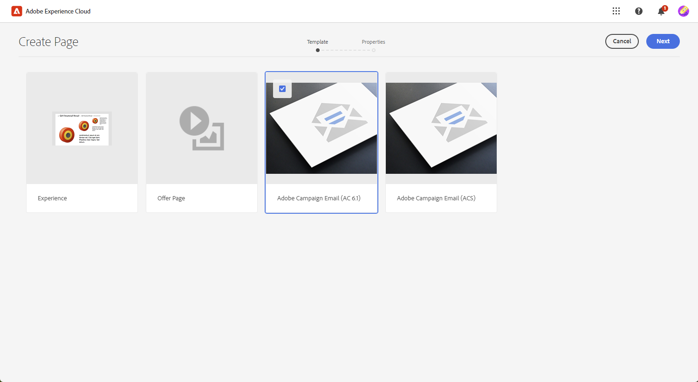

# Sjablonen beheren met [!DNL Adobe Experience Manager as a Cloud Service]{#aem-assets}

## Aan de slag met [!DNL Adobe Experience Manager as a Cloud Service]{#create-aem}

De integratie van de Adobe Campaign Web-interface met Adobe Experience Manager vergemakkelijkt het gestroomlijnde beheer van inhoud en formulieren voor e-maillevering direct binnen het Adobe Experience Manager-platform.

[Meer informatie over Adobe Experience Manager as a Cloud Service](https://experienceleague.adobe.com/docs/experience-manager-cloud-service/content/sites/authoring/getting-started/quick-start.html?lang=en)

## Een sjabloon maken in [!DNL Adobe Experience Manager as a Cloud Service]{#create-aem-template}

1. Ga naar uw [!DNL Adobe Experience Manager] auteur en klik op Adobe Experience in de linkerbovenhoek van de pagina. Kies **[!UICONTROL Sites]** in het menu.

1. Toegang **[!UICONTROL Campaigns > Name of your brand > Main Area > Name of your page]**.

1. Klikken **[!UICONTROL Create]** en selecteert u **[!UICONTROL Page]** in het vervolgkeuzemenu.

   

1. Selecteer de **[!UICONTROL Adobe Campaign Email]** sjabloon en naam van nieuwsbrief.

   

1. Pas uw e-mailinhoud aan door componenten toe te voegen, zoals personalisatievelden van Adobe Campaign. [Meer informatie](https://experienceleague.adobe.com/docs/experience-manager-65/content/sites/authoring/aem-adobe-campaign/campaign.html?lang=en#editing-email-content)

1. Als uw e-mail gereed is, navigeert u naar de **[!UICONTROL Page information]** menu en klik op **[!UICONTROL Start workflow]**.

   

1. Selecteer in de eerste vervolgkeuzelijst de optie **[!UICONTROL Approve Adobe Campaign]** als workflowmodel en klik op **[!UICONTROL Start workflow]**.

1. Boven aan de pagina wordt een disclaimer weergegeven die aangeeft: `This page is subject to the workflow Approve for Adobe Campaign`. Klikken **[!UICONTROL Complete]** naast de disclaimer om de revisie te bevestigen en klik op **[!UICONTROL Ok]**.

   

1. Klikken **[!UICONTROL Complete]** nogmaals en selecteert u **[!UICONTROL Newsletter approval]** in de **[!UICONTROL Next Step]** vervolgkeuzelijst.

Uw nieuwsbrief is nu klaar en gesynchroniseerd in Adobe Campaign.

## Een Adobe Experience Manager as a Cloud Service-sjabloon importeren{#aem-templates-perso}

Zodra het malplaatje van de Experience Manager in het Web van Adobe Campaign als inhoudsmalplaatje beschikbaar is, kunt u de noodzakelijke inhoud voor e-mail, met inbegrip van verpersoonlijking identificeren en opnemen.

1. In Campagne Web, van **[!UICONTROL Deliveries]** menu, klikt u op **[!UICONTROL Create delivery]**.

1. Selecteer de ingebouwde **[!UICONTROL Email delivery with AEM content]** sjabloon.

   

1. Voer een **[!UICONTROL Label]** voor de levering en vorm extra opties die op uw behoeften worden gebaseerd:

   * **[!UICONTROL Internal name]**: wijs een unieke id toe aan de levering.

   * **[!UICONTROL Folder]**: sla de levering op in een specifieke map.

   * **[!UICONTROL Delivery code]**: gebruik dit veld om uw leveringen te ordenen op basis van uw eigen naamgevingsconventie.

   * **[!UICONTROL Description]**: geef een beschrijving voor de levering.

   * **[!UICONTROL Nature]**: specificeer de aard van de e-mail voor classificatiedoeleinden.

1. Een **[!UICONTROL Audience]** naar uw e-mail. [Meer informatie](../email/create-email.md#define-audience)

1. Klik op **[!UICONTROL Edit content]**.

1. Van de **[!UICONTROL Edit content]** menu, klikt u op **[!UICONTROL Select AEM content]**.

   

1. Blader door de AEM sjabloon en selecteer de sjabloon die u wilt importeren in Campagne Web.

   

1. Inhoud wordt niet automatisch gesynchroniseerd. Als je je templates rechtstreeks in Adobe Experience Manager wijzigt, kun je gewoon **[!UICONTROL Refresh AEM content]** om de laatste versie van de sjabloon te hebben.

1. Om verbinding tussen Experience Manager en Campagne te verwijderen of uw malplaatje van de Experience Manager in de E-mailontwerper verder te personaliseren, klik **[!UICONTROL Unlink AEM content]**.

   

1. Als u gepersonaliseerde inhoud aan uw malplaatje van de Experience Manager hebt toegevoegd, klik **[!UICONTROL Simulate Content]** aan voorproef hoe het in het bericht zal verschijnen gebruikend testprofielen.

[Meer informatie over voorvertoningen en testprofielen](../preview-test/preview-content.md)

1. Wanneer u de voorvertoning van het bericht weergeeft, worden alle gepersonaliseerde elementen automatisch vervangen door de bijbehorende gegevens uit het geselecteerde testprofiel.

   Indien nodig kunnen aanvullende testprofielen via de **[!UICONTROL Manage test profiles]** knop.

Je levering is nu klaar om te worden verzonden.
