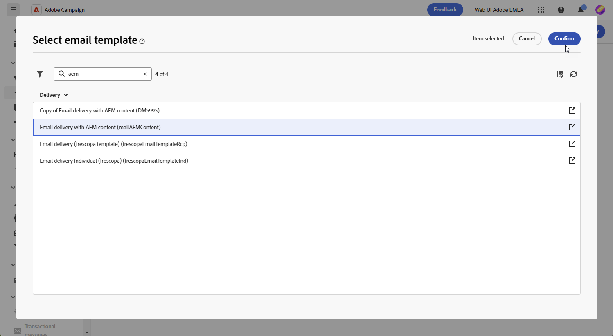

# Sjablonen beheren met [!DNL Adobe Experience Manager as a Cloud Service]{#aem-assets}

## Aan de slag met [!DNL Adobe Experience Manager as a Cloud Service]{#create-aem}

De integratie van de Adobe Campaign Web-interface met Adobe Experience Manager vergemakkelijkt het gestroomlijnde beheer van inhoud en formulieren voor e-maillevering direct binnen het Adobe Experience Manager-platform.

[ Leer meer op Adobe Experience Manager as a Cloud Service ](https://experienceleague.adobe.com/docs/experience-manager-cloud-service/content/sites/authoring/getting-started/quick-start.html?lang=en)

## Een sjabloon maken in [!DNL Adobe Experience Manager as a Cloud Service]{#create-aem-template}

1. Navigeer naar de auteurinstantie van [!DNL Adobe Experience Manager] en klik op Adobe Experience in de linkerbovenhoek van de pagina. Kies **[!UICONTROL Sites]** in het menu.

1. Toegang **[!UICONTROL Campaigns > Name of your brand > Main Area > Name of your page]**.

1. Klik op **[!UICONTROL Create]** en selecteer **[!UICONTROL Page]** in het vervolgkeuzemenu.

   

1. Selecteer de sjabloon **[!UICONTROL Adobe Campaign Email]** en geef de nieuwsbrief een naam.

   

1. Pas uw e-mailinhoud aan door componenten toe te voegen, zoals personalisatievelden van Adobe Campaign. [Meer informatie](https://experienceleague.adobe.com/docs/experience-manager-65/content/sites/authoring/aem-adobe-campaign/campaign.html?lang=en#editing-email-content)

1. Wanneer uw e-mail gereed is, navigeert u naar het menu **[!UICONTROL Page information]** en klikt u op **[!UICONTROL Start workflow]** .

   

1. Selecteer in de eerste vervolgkeuzelijst **[!UICONTROL Approve Adobe Campaign]** als workflowmodel en klik op **[!UICONTROL Start workflow]** .

1. Boven aan de pagina wordt een disclaimer weergegeven met de tekst `This page is subject to the workflow Approve for Adobe Campaign` . Klik op **[!UICONTROL Complete]** naast de disclaimer om de revisie te bevestigen en klik op **[!UICONTROL Ok]** .

   

1. Klik nogmaals op **[!UICONTROL Complete]** en selecteer **[!UICONTROL Newsletter approval]** in de vervolgkeuzelijst **[!UICONTROL Next Step]** .

Uw nieuwsbrief is nu klaar en gesynchroniseerd in Adobe Campaign.

## Een Adobe Experience Manager as a Cloud Service-sjabloon importeren{#aem-templates-perso}

Zodra het malplaatje van de Experience Manager in het Web van Adobe Campaign als inhoudsmalplaatje beschikbaar is, kunt u de noodzakelijke inhoud voor e-mail, met inbegrip van verpersoonlijking identificeren en opnemen.

1. Klik in het menu **[!UICONTROL Deliveries]** van Campagne Web op **[!UICONTROL Create delivery]** .

1. Selecteer de ingebouwde sjabloon **[!UICONTROL Email delivery with AEM content]** in het venster E-mailsjabloon.

   

1. Voer een **[!UICONTROL Label]** in voor de levering en configureer aanvullende opties op basis van uw behoeften:

   * **[!UICONTROL Internal name]**: wijs een unieke id toe aan de levering.

   * **[!UICONTROL Folder]**: sla de levering op in een specifieke map.

   * **[!UICONTROL Delivery code]**: gebruik dit veld om uw leveringen te ordenen op basis van uw eigen naamgevingsconventie.

   * **[!UICONTROL Description]** : geef een beschrijving op voor de levering.

   * **[!UICONTROL Nature]** : geef de aard van de e-mail op voor classificatiedoeleinden.

1. Definieer een **[!UICONTROL Audience]** naar uw e-mail. [Meer informatie](../email/create-email.md#define-audience)

1. Klik op **[!UICONTROL Edit content]**.

1. Klik in het menu **[!UICONTROL Edit content]** op **[!UICONTROL Select AEM content]** .

   

1. Blader door de AEM sjabloon en selecteer de sjabloon die u wilt importeren in Campagne Web.

   

1. Inhoud wordt niet automatisch gesynchroniseerd. Als je templates direct in Adobe Experience Manager worden gewijzigd, selecteer je **[!UICONTROL Refresh AEM content]** als je de meest recente versie van je template wilt hebben.

1. Als u de koppeling tussen Experience Manager en Campagne wilt verwijderen of de sjabloon voor uw Experience Manager in de e-mailontwerper verder wilt aanpassen, klikt u op **[!UICONTROL Unlink AEM content]** .

   

1. Als u persoonlijke inhoud hebt toegevoegd aan de sjabloon Experience Manager, klikt u op **[!UICONTROL Simulate Content]** om een voorvertoning weer te geven van de inhoud die met testprofielen in het bericht wordt weergegeven.

[Meer informatie over voorvertoningen en testprofielen](../preview-test/preview-content.md)

1. Wanneer u de voorvertoning van het bericht weergeeft, worden alle gepersonaliseerde elementen automatisch vervangen door de bijbehorende gegevens uit het geselecteerde testprofiel.

   Zo nodig kunt u via de knop **[!UICONTROL Manage test profiles]** aanvullende testprofielen toevoegen.

Je levering is nu klaar om te worden verzonden.
