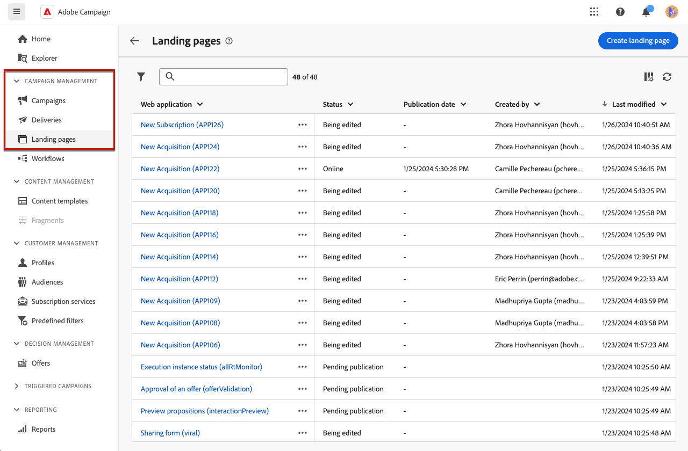
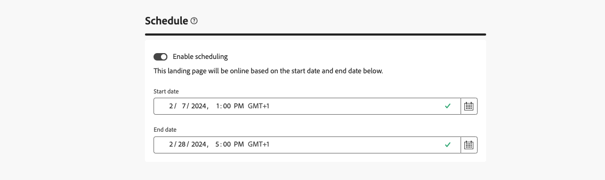

# bestemmingspagina&#39;s maken en publiceren {#create-lp}

>[!CONTEXTUALHELP]
>id="acw_landingpages_menu"
>title="Landingspagina&#39;s maken en beheren"
>abstract="Met Adobe Campaign kunt u landingspagina&#39;s maken, ontwerpen en delen en uw gebruikers naar online webpagina&#39;s sturen waar u aanschafgevallen, abonnementen en abonnementen en gebruiksgevallen voor lijsten van gewezen personen kunt beheren op basis van ingebouwde sjablonen."

In de gebruikersinterface van het Web Campagne kunt u bestemmingspagina&#39;s maken, ontwerpen en publiceren. Na publicatie kunt u een koppeling naar het formulier invoegen in een levering. Wanneer ontvangers op die koppeling klikken, worden ze naar de bijbehorende bestemmingspagina geleid.

[!DNL Adobe Campaign] komt met vier malplaatjes om de volgende gebruiksgevallen te beheren: **verwerving**, **abonnement**, **unsubscription**, en **lijst van gewezen personen**. [Meer informatie](lp-use-cases.md)

## Openingspagina&#39;s openen {#access-landing-pages}

Als u de lijst met openingspagina&#39;s wilt openen, selecteert u **[!UICONTROL Content management]** > **[!UICONTROL Landing pages]** in het linkermenu.

{zoomable="yes"}

In de **[!UICONTROL Landing pages]** -voorraad worden alle gemaakte items weergegeven. U kunt ze filteren met de knop **[!UICONTROL Show filters]** .

* U kunt de items filteren die u hebt gemaakt of gewijzigd.
* U kunt de resultaten tot een specifieke [ omslag ](../get-started/permissions.md#folders) beperken gebruikend de drop-down lijst of regels toevoegen gebruikend de [ vraagmodelaar ](../query/query-modeler-overview.md).

{zoomable="yes"}

<!--From this list, you can access the [landing page Live report](../reports/lp-report-live.md) or [landing page Global report](../reports/lp-report-global.md) for published items.-->

>[!CAUTION]
>
>U kunt bestemmingspagina&#39;s niet tonen of uitgeven die van de cliëntconsole (Webformulieren) in het gebruikersinterface van het Web van de Campagne worden gecreeerd. Leer meer in de [ documentatie van de de consoleconsole van de Campagne ](https://experienceleague.adobe.com/docs/campaign/campaign-v8/content/webapps.html){target="_blank"}.

<!--If you unpublish a landing page which is referenced in a message, the link to the landing page will be broken and an error page will be displayed. You cannot delete a published landing page. To delete it, you must first unpublish it.-->

U kunt een openingspagina dupliceren of verwijderen. Klik op de ellips naast een landingspagina om de gewenste actie te selecteren.

## Een landingspagina maken {#create-landing-page}

>[!CONTEXTUALHELP]
>id="acw_landingpages_properties"
>title="De eigenschappen van de openingspagina definiëren"
>abstract="Vul de eigenschappenvelden zoals het label in en wijzig indien nodig het schema. Bovendien kunt u de interne naam bewerken, de map wijzigen waarin de bestemmingspagina is opgeslagen en een beschrijving opgeven."

>[!CONTEXTUALHELP]
>id="acw_landingpages_pages_list"
>title="De inhoud van elke pagina definiëren"
>abstract="Pas de inhoud aan van elke pagina die deel uitmaakt van deze openingspagina, zoals het formulier zelf, de bevestigingspagina die wordt weergegeven bij het verzenden van het formulier, of de pagina waarnaar gebruikers worden geleid als er een fout optreedt."

>[!CONTEXTUALHELP]
>id="acw_landingpages_schedule"
>title="De landingspagina plannen"
>abstract="Definieer een begindatum en een einddatum voor de landingspagina. Wanneer de pagina het einde van de geldigheidsperiode bereikt, is het formulier niet meer beschikbaar. In plaats daarvan wordt de **pagina van de Verlooptijd** getoond."

>[!CONTEXTUALHELP]
>id="acw_landingpages_preload"
>title="Opties voor vooraf laden definiëren"
>abstract="Wanneer **met de gegevens die in de vorm** worden van verwijzingen voorzien optie vooraf wordt geselecteerd, als de bezoeker van de het landen pagina een profiel van het gegevensbestand aanpast, wordt de informatie van het profiel automatisch voorgeladen in de vorm. Met **machtigt afwezigheid van identiteitskaart** geselecteerde optie, kan om het even welke bezoeker, met inbegrip van anonieme gebruikers, tot de het landen pagina toegang hebben."

<!--With the **Skip preloading if no ID** option selected, each profile entered will be added to the database after approval of the form."-->

>[!CONTEXTUALHELP]
>id="acw_landingpages_storage"
>title="Opslagopties definiëren"
>abstract="In het gedeelte Voorladen kunt u aangeven hoe u de record kunt vinden die in de database moet worden bijgewerkt."

<!--The main steps to create landing pages are as follows:

{zoomable="yes"}-->

Ga als volgt te werk om een bestemmingspagina te maken:

1. Klik in de **[!UICONTROL Landing pages]** -voorraad op **[!UICONTROL Create landing page]** .

   {zoomable="yes"}

1. Selecteer een sjabloon:
   * **[!UICONTROL Acquisition]**: dit is de standaardsjabloon voor het landen van pagina&#39;s, waarmee u profielgegevens kunt vastleggen en bijwerken.
   * **[!UICONTROL Subscription]**: Gebruik dit malplaatje om gebruikers toe te laten om aan de specifieke [ dienst ](../audience/manage-services.md) in te tekenen.
   * **[!UICONTROL Unsubscription]**: Dit malplaatje kan in een levering worden gebruikt die naar de abonnees van de dienst wordt verzonden om hen toe te staan om van deze [ dienst ](../audience/manage-services.md) af te melden.
   * **[!UICONTROL Denylist]**: Deze sjabloon moet worden gebruikt wanneer een profiel op een opt-out-koppeling in een levering klikt en er geen contact meer met wil worden opgenomen.

   {zoomable="yes"}

   >[!NOTE]
   >
   >Leer hoe te om de verschillende gebruiksgevallen uit te voeren die aan elk malplaatje in [ beantwoorden deze pagina ](lp-use-cases.md).

1. Klik op **[!UICONTROL Create]**.

1. Vul de velden **[!UICONTROL Properties]** in, zoals het label.

   Standaard worden bestemmingspagina&#39;s opgeslagen in de map **[!UICONTROL Web applications]** . U kunt dit wijzigen door naar de gewenste locatie te bladeren in de **[!UICONTROL Additional options]** . [ Leer hoe te met omslagen ](../get-started/permissions.md#folders) te werken.

   U kunt de Captcha ook instellen om de bestemmingspagina te beveiligen. [ leer hier meer ](#captcha).

   {zoomable="yes"}

1. In de sectie **[!UICONTROL Data preload]** zijn de volgende opties beschikbaar:

   * Als de optie **[!UICONTROL Pre-fill with the data referenced in the form]** is geselecteerd en de bezoeker van de bestemmingspagina een profiel uit de database heeft, worden de profielgegevens automatisch in het formulier voorgeladen. De gebruiker hoeft alleen de ontbrekende velden in te vullen en de bestaande waarden bij te werken. Hierdoor kunnen gegevens voor bestaande profielen worden samengevoegd in plaats van dat duplicaten worden gemaakt.

     >[!NOTE]
     >
     >Deze optie is standaard geselecteerd voor alle sjablonen van de bestemmingspagina.

   * Met de optie **[!UICONTROL Authorize absence of ID]** heeft een bezoeker toegang tot de openingspagina. Als u deze optie uitschakelt, voorkomt u dat anonieme bezoekers het formulier gebruiken. Dit houdt in dat alleen geïdentificeerde gebruikers het formulier kunnen openen en verzenden.

     >[!AVAILABILITY]
     >
     >Dit vermogen is in Beperkte Beschikbaarheid (LA). Het is beperkt tot klanten die **van Adobe Campaign Standard aan Adobe Campaign v8** migreren, en kan niet op een ander milieu worden opgesteld.

     Voor de sjablonen **[!UICONTROL Acquisition]** en **[!UICONTROL Subscription]** is deze optie standaard geselecteerd. Voor de sjablonen **[!UICONTROL Unsubscription]** en **[!UICONTROL Denylist]** is deze optie standaard uitgeschakeld en kan deze niet worden gewijzigd.

1. Een openingspagina kan volgende pagina&#39;s hebben. Als u pagina&#39;s wilt toevoegen, bladert u door de sectie **[!UICONTROL Pages]** en klikt u op de knop **[!UICONTROL Edit content]** voor elke pagina die u voor deze openingspagina wilt ontwerpen. De inhoud van elke pagina is al vooraf ingevuld. Bewerk deze indien nodig. [Meer informatie](lp-content.md).

   {zoomable="yes"}

1. In de sectie **[!UICONTROL Storage]** is de optie **[!UICONTROL Update the preloaded record]** standaard geselecteerd. Hiermee kunnen de profielen die in de database zijn opgeslagen, worden bijgewerkt via de bestemmingspagina. In het vak Voorladen kunt u aangeven hoe de record moet worden gevonden die in de database moet worden bijgewerkt.

   U kunt ook kiezen uit de velden in de huidige context van de bestemmingspagina, de velden die worden gebruikt om het bijbehorende profiel in de database te vinden. U doet dit door de optie **[!UICONTROL Update the preloaded record]** uit te schakelen en de gewenste velden onder **[!UICONTROL Reconciliation options]** te selecteren.

   {zoomable="yes"}

1. Maak **[!UICONTROL Additional data]** om interne gegevens op te slaan wanneer de landingspagina wordt verzonden. Deze gegevens zijn niet zichtbaar voor gebruikers die de pagina bezoeken. Alleen constante waarden worden in aanmerking genomen.

   >[!AVAILABILITY]
   >
   >Dit vermogen is in Beperkte Beschikbaarheid (LA). Het is beperkt tot klanten die **van Adobe Campaign Standard aan Adobe Campaign v8** migreren, en kan niet op een ander milieu worden opgesteld.

   {zoomable="yes"}

1. U kunt een begindatum en een einddatum voor uw landingspagina bepalen. Selecteer **[!UICONTROL Enable scheduling]** en stel de datums in.

   {zoomable="yes"}

   * De landingspagina wordt automatisch gepubliceerd op de opgegeven begindatum/tijd.

     >[!NOTE]
     >
     >Als er geen begindatum is gedefinieerd, wordt de landingspagina actief zodra deze wordt gepubliceerd.

   * Wanneer de pagina de einddatum bereikt, is het formulier niet meer beschikbaar. In plaats daarvan wordt de pagina **[!UICONTROL Expiration]** weergegeven.

     >[!NOTE]
     >
     >Om veiligheidsredenen en voor de prestaties van het platform raadt Adobe u aan een einddatum in te stellen.

1. Klik op **[!UICONTROL Review and publish]**.

Zodra u alle montages en [ ontwerp ](lp-content.md) alle pagina&#39;s bepaalt, kunt u [ testen ](#test-landing-page) en [ publiceren ](#publish-landing-page) uw het landen pagina zoals hieronder gedetailleerd.

## Beveilig uw landingspagina met een captcha {#captcha}

>[!AVAILABILITY]
>
>Dit vermogen is in Beperkte Beschikbaarheid (LA). Het is beperkt tot klanten die **Adobe Campaign v8.7.2 bevorderen met de laatste fixversie** gebruiken, en kan niet op een ander milieu worden opgesteld.

Als u een Captcha instelt, kunt u uw landingspagina beschermen tegen spam en misbruik.

Ga naar de **[!UICONTROL Properties]** van de bestemmingspagina als u deze wilt gebruiken.
In de lus **[!UICONTROL Additional options]** ook. Activeer de schakeloptie **[!UICONTROL Additional Enable captcha solution]** .

{zoomable="yes"}

Klik op de knop **[!UICONTROL Review and publish]** en **[!UICONTROL Simulate content]** om de instellingen voor captcha te controleren. Als u het formulier verzendt, ziet u dat de widget Captcha werkt tijdens de validatie hieronder.

{zoomable="yes"}

>[!NOTE]
>
>De widget captcha in Adobe Campaign v8 werkt in de zwevende modus. Deze wordt tijdens de validatie weergegeven en verdwijnt zodra het proces is voltooid.

## De openingspagina testen {#test-landing-page}

>[!CONTEXTUALHELP]
>id="acw_landingpages_simulate"
>title="De openingspagina simuleren"
>abstract="U kunt een voorproef van uw het landen pagina in het gebruikersinterface van het Web van de Campagne zien of het openen in een nieuw Web browser tabel."

>[!CONTEXTUALHELP]
>id="ac_preview_lp_profiles"
>title="De openingspagina voorvertonen en testen"
>abstract="Nadat u de instellingen en inhoud van de bestemmingspagina hebt gedefinieerd, kunt u testprofielen gebruiken om een voorvertoning weer te geven."

Nadat de instellingen en inhoud van de bestemmingspagina zijn gedefinieerd, kunt u testprofielen gebruiken om een voorvertoning weer te geven. Als u [ gepersonaliseerde inhoud ](../personalization/gs-personalization.md) opnam, zult u kunnen controleren hoe deze inhoud in de het landen pagina wordt getoond, gebruikend de gegevens van het testprofiel.

>[!CAUTION]
>
>U moet testprofielen beschikbaar hebben om een voorbeeld van uw berichten te kunnen bekijken en proefdrukken te kunnen verzenden. [ leer meer over testprofielen ](../audience/test-profiles.md)

Voer de volgende stappen uit om de bestemmingspagina te testen:

1. Nadat u op **[!UICONTROL Review and publish]** hebt geklikt, selecteert u de knop **[!UICONTROL Simulate content]** in het dashboard voor de bestemmingspagina om toegang te krijgen tot de selectie van het testprofiel.

   {zoomable="yes"}

1. Selecteer een of meer testprofielen in het scherm **[!UICONTROL Simulate]** .

   De stappen om testprofielen te selecteren zijn het zelfde als wanneer het testen van een bericht. Zij zijn gedetailleerd in de [ Voorproef en test ](../preview-test/preview-test.md) sectie.

1. Wanneer het testen van een dynamische het landen pagina (met de **[!UICONTROL Service from URL]** geselecteerde optie - [ leer meer ](../landing-pages/create-lp.md#define-actions-on-form-submission)

1. Selecteer **[!UICONTROL Open preview]** om de openingspagina te testen.

   {zoomable="yes"}

1. De voorvertoning van de bestemmingspagina wordt in een nieuw tabblad geopend. De gepersonaliseerde elementen worden vervangen door de geselecteerde gegevens van het testprofiel.

   Als u de optie **[!UICONTROL Pre-fill with the data referenced in the form]** hebt geselecteerd in de instellingen voor de bestemmingspagina, worden de formuliervelden automatisch vooraf ingevuld met de bijbehorende testprofielgegevens. <!--TBC-->

   {zoomable="yes"}

1. Selecteer andere testprofielen om de rendering voor elke variant van de landingspagina te bekijken.

<!--Can you preview Confirmation/Error/Expiration pages?-->

## De openingspagina publiceren {#publish-landing-page}

Wanneer de landingspagina gereed en gevalideerd is, publiceert u deze om te kunnen worden gebruikt in een levering met de bijbehorende knop.

Na publicatie:

* De landingspagina wordt met de status **[!UICONTROL Published]** toegevoegd aan de lijst met landingspagina. Het is nu live en klaar om in de inhoud te worden genoemd.

* U kunt de **[!UICONTROL Landing page URL]** die boven op de pagina wordt weergegeven, kopiëren en plakken in een webbrowser om een voorvertoning van de bestemmingspagina weer te geven.

>[!CAUTION]
>
>Als u de landingspagina volledig wilt testen of er gebruik van wilt maken, kunt u deze koppeling niet rechtstreeks in een webbrowser of in uw leveringen kopiëren en plakken. In plaats daarvan, gebruik de [ Simuleer inhoud ](#test-landing-page) functie om het te testen, en de stappen te volgen die in [ worden beschreven deze sectie ](lp-use-cases.md) om behoorlijk gebruik van uw het landen pagina te maken.

{zoomable="yes"} toont

U kunt uw het landen paginagevolgen door logboeken <!--and specific reports--> controleren. Klik op de knop **[!UICONTROL Logs]**.