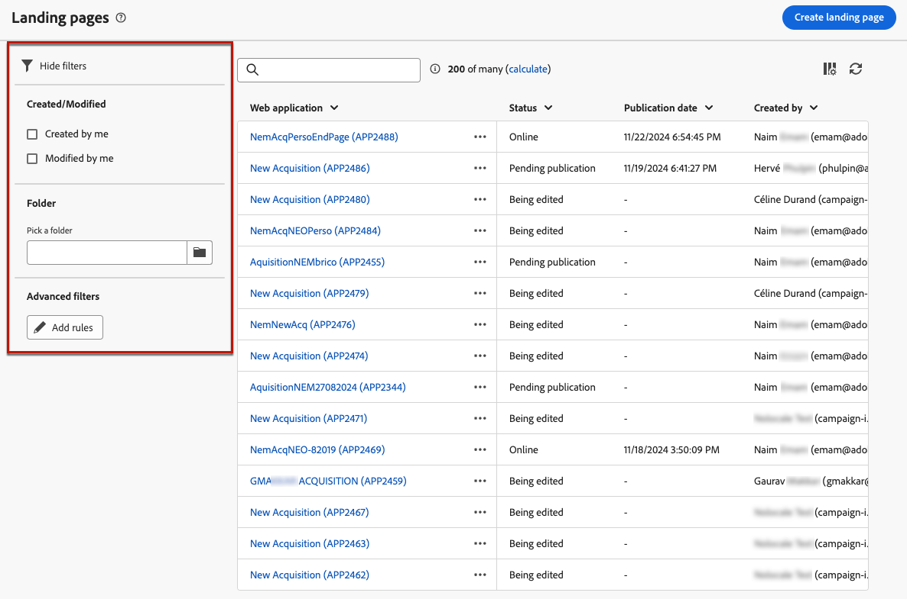

# bestemmingspagina&#39;s maken en publiceren {#create-lp}

>[!CONTEXTUALHELP]
>id="acw_landingpages_menu"
>title="Landingspagina&#39;s maken en beheren"
>abstract="Met Adobe Campaign kunt u landingspagina&#39;s maken, ontwerpen en delen, zodat uw gebruikers naar online webpagina&#39;s kunnen gaan waar u aanschaf, abonnementen/abonnementen en gebruiksgevallen voor lijsten van gewezen personen kunt beheren op basis van ingebouwde sjablonen."

Met Adobe Campaign kunt u landingspagina&#39;s maken, ontwerpen en delen, zodat uw gebruikers naar online webpagina&#39;s kunnen gaan waar u aanschaf, abonnementen/abonnementen en gebruiksgevallen voor lijsten van gewezen personen kunt beheren op basis van ingebouwde sjablonen.

## Openingspagina&#39;s openen {#access-landing-pages}

Als u de lijst met bestemmingspagina wilt openen, selecteert u **[!UICONTROL Campaign management]** > **[!UICONTROL Landing pages]** in het linkermenu.

De **[!UICONTROL Landing pages]** Alle gemaakte items worden in de voorraad weergegeven. U kunt ze filteren met de **Filters tonen** knop. U kunt de resultaten beperken tot een specifieke [map](../get-started/permissions.md#folders) het gebruiken van de drop-down lijst, of voegt regels toe gebruikend [querymodel](../query/query-modeler-overview.md).

<!--From this list, you can access the [landing page Live report](../reports/lp-report-live.md) or [landing page Global report](../reports/lp-report-global.md) for published items.-->

>[!CAUTION]
>
>U kunt landingspagina&#39;s niet tonen of uitgeven die van de cliëntconsole in het Web van de Campagne worden gecreeerd. Meer informatie in het dialoogvenster [Documentatie over de campagnecollecommissie](https://experienceleague.adobe.com/docs/campaign/campaign-v8/content/webapps.html){target="_blank"}.

<!--If you unpublish a landing page which is referenced in a message, the link to the landing page will be broken and an error page will be displayed. You cannot delete a published landing page. To delete it, you must first unpublish it.-->

U kunt een openingspagina dupliceren of verwijderen. Klik op de drie stippen naast een openingspagina om de gewenste actie te selecteren.

## Een landingspagina maken {#create-landing-page}

>[!CONTEXTUALHELP]
>id="acw_landingpages_properties"
>title="De eigenschappen van de openingspagina definiëren"
>abstract="Vul de eigenschappenvelden zoals het label in en wijzig indien nodig het schema. Bovendien kunt u de interne naam bewerken, de map wijzigen waarin de bestemmingspagina is opgeslagen en een beschrijving opgeven."

>[!CONTEXTUALHELP]
>id="acw_landingpages_pages_list"
>title="De inhoud van de pagina&#39;s definiëren"
>abstract="Bewerk de inhoud van elke pagina die deel uitmaakt van deze openingspagina."

>[!CONTEXTUALHELP]
>id="acw_landingpages_schedule"
>title="De landingspagina plannen"
>abstract="U kunt een begindatum en een einddatum voor uw landingspagina bepalen. Wanneer de pagina is verlopen, **Verlopen** wordt weergegeven."

>[!CONTEXTUALHELP]
>id="acw_landingpages_primarypage"
>title="De primaire pagina-instellingen definiëren"
>abstract="De primaire pagina wordt direct aan de gebruikers getoond nadat zij de verbinding aan uw landende pagina, zoals van een e-mail of een website klikken."

>[!CONTEXTUALHELP]
>id="acw_landingpages_subscription"
>title="De bestemmingspagina van uw abonnement instellen"
>abstract="Met een abonnementspagina kunnen uw klanten zich abonneren op een service."

<!--The main steps to create landing pages are as follows:

-->

1. Van de **[!UICONTROL Landing pages]** voorraad, klik **[!UICONTROL Create landing page]**.

   

1. Selecteer een sjabloon:
   * **[!UICONTROL Acquisition]**: Dit is de standaardsjabloon voor het landen van pagina&#39;s, waarmee u profielgegevens kunt vastleggen en bijwerken.
   * **[!UICONTROL Subscription]**: Gebruik deze sjabloon om abonnementen op een service aan te bieden.
   * **[!UICONTROL Unsubscription]**: Deze sjabloon kan worden gekoppeld vanuit een e-mail die naar abonnees is verzonden naar een service, zodat zij zich niet meer kunnen abonneren op deze service.
   * **[!UICONTROL Denylist]**: Deze sjabloon moet worden gebruikt wanneer een profiel niet langer via Campagne kan worden benaderd. Meer informatie over beheer van lijst van gewezen personen

   

1. Klik op **[!UICONTROL Create]**.

1. Vul de eigenschappen velden zoals het label in. Standaard worden bestemmingspagina&#39;s opgeslagen in de **[!UICONTROL Web applications]** map. U kunt dit wijzigen door naar de gewenste locatie te bladeren in het dialoogvenster **[!UICONTROL Additional options]**. [Leer hoe u met mappen werkt](../get-started/permissions.md#folders)

   

1. In de **[!UICONTROL Data preload]** de twee onderstaande opties zijn standaard geselecteerd:

   * De **[!UICONTROL Pre-fill with the data referenced in the form]** Met deze optie kunt u automatisch de gegevens laden die overeenkomen met de invoer- en samenvoegvelden in het formulier.

   * De **[!UICONTROL Skip preloading if no ID]** Selecteer deze optie als u geen profielen wilt bijwerken. In dat geval wordt elk ingevoerde profiel na goedkeuring van het formulier toegevoegd aan de database. Deze optie wordt bijvoorbeeld gebruikt wanneer het formulier op een website wordt geplaatst.

1. In de **[!UICONTROL Pages]** klikt u op de **[!UICONTROL Edit content]** voor elke pagina die u voor deze openingspagina wilt ontwerpen. De inhoud van elke pagina is al vooraf ingevuld. Bewerk deze indien nodig. [Meer informatie](lp-content.md)

   

1. De **[!UICONTROL Update the preloaded record]** is standaard geselecteerd. Als u de profielen wilt bijwerken die in de database zijn opgeslagen via de bestemmingspagina, kunt u een voorlaadvenster gebruiken. In het vak Voorladen kunt u aangeven hoe de record moet worden gevonden die in de database moet worden bijgewerkt. U kunt ook kiezen uit de velden in de huidige context van de bestemmingspagina, de velden die worden gebruikt om het bijbehorende profiel in de database te vinden.

   

1. U kunt een begindatum en een einddatum voor uw landingspagina bepalen. Selecteren **[!UICONTROL Enable scheduling]** en stelt de datums in. Wanneer de pagina is verlopen, **[!UICONTROL Expiration]** wordt weergegeven.

1. Klik op **[!UICONTROL Review and publish]**.

Nadat u alle pagina&#39;s hebt geconfigureerd en ontworpen, kunt u [test](#test-landing-page) en [publish](#publish-landing-page) uw openingspagina.

## De openingspagina testen {#test-landing-page}

>[!CONTEXTUALHELP]
>id="acw_landingpages_simulate"
>title="De openingspagina simuleren"
>abstract="U kunt een voorproef van uw het landen pagina in het gebruikersinterface van het Web van de Campagne zien of het openen in een nieuw Web browser tabel."

>[!CONTEXTUALHELP]
>id="ac_preview_lp_profiles"
>title="De openingspagina voorvertonen en testen"
>abstract="Nadat u de instellingen en inhoud van de bestemmingspagina hebt gedefinieerd, kunt u testprofielen gebruiken om een voorvertoning weer te geven."

Nadat de instellingen en inhoud van de bestemmingspagina zijn gedefinieerd, kunt u testprofielen gebruiken om een voorvertoning weer te geven. Als u [persoonlijke inhoud](../personalization/gs-personalization.md)kunt u met testprofielgegevens controleren hoe deze inhoud op de bestemmingspagina wordt weergegeven.

>[!CAUTION]
>
>U moet testprofielen beschikbaar hebben om een voorbeeld van uw berichten te kunnen bekijken en proefdrukken te kunnen verzenden. Leer hoe u [testprofielen maken](../audience/test-profiles.md).

1. Klik in de interface van de bestemmingspagina op de knop **[!UICONTROL Simulate content]** om de selectie van het testprofiel te openen.

   

1. Van de **[!UICONTROL Simulate]** selecteert u een of meer testprofielen.

   De stappen om testprofielen te selecteren zijn het zelfde als wanneer het testen van een bericht. Zij worden in het [Voorvertonen en testen](../preview-test/preview-test.md) sectie.

1. Selecteren **[!UICONTROL Open preview]** om de openingspagina te testen.

   

1. De voorvertoning van de bestemmingspagina wordt in een nieuw tabblad geopend. De gepersonaliseerde elementen worden vervangen door de geselecteerde gegevens van het testprofiel.

   

1. Selecteer andere testprofielen om de rendering voor elke variant van de landingspagina te bekijken.

<!--Can you preview Confirmation/Error/Expiration pages?-->

## De openingspagina publiceren {#publish-landing-page}

Als de landingspagina gereed is, kunt u deze publiceren en in een bericht gebruiken.

Wanneer de landingspagina is gepubliceerd, wordt deze aan de lijst met landingspagina&#39;s toegevoegd met de opdracht **[!UICONTROL Published]** status. Het is nu live en klaar om te worden gebruikt.

Na publicatie kunt u de **[!UICONTROL Landing page URL]** die boven op de pagina in een webbrowser wordt weergegeven.

U kunt de gevolgen van de bestemmingspagina controleren door logboeken en specifieke rapporten.
