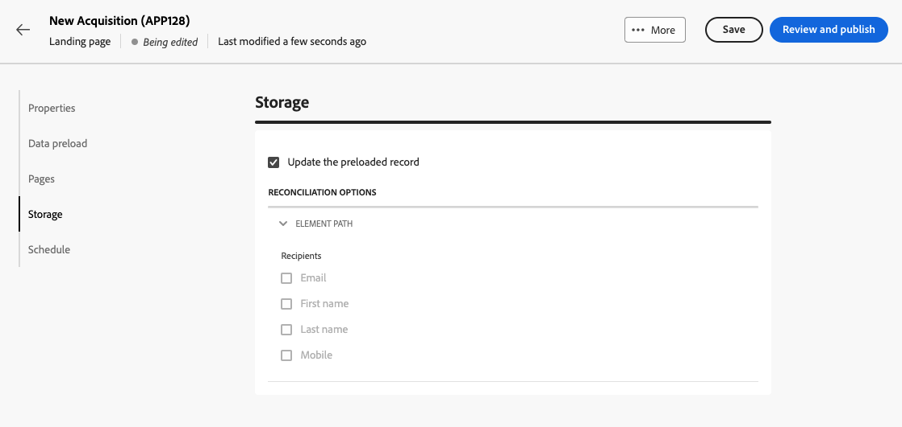

# bestemmingspagina&#39;s maken en publiceren {#create-lp}

>[!CONTEXTUALHELP]
>id="acw_landingpages_menu"
>title="Landingspagina&#39;s maken en beheren"
>abstract="Met Adobe Campaign kunt u landingspagina&#39;s maken, ontwerpen en delen en uw gebruikers naar online webpagina&#39;s sturen waar u aanschafgevallen, abonnementen en abonnementen en gebruiksgevallen voor lijsten van gewezen personen kunt beheren op basis van ingebouwde sjablonen."

In de gebruikersinterface van het Web Campagne kunt u bestemmingspagina&#39;s maken, ontwerpen en publiceren. Na publicatie kunt u een koppeling naar het formulier invoegen in een levering. Nadat de ontvangers op die koppeling klikken, worden ze naar de bijbehorende bestemmingspagina geleid.

[!DNL Adobe Campaign] wordt geleverd met vier sjablonen voor het beheren van de volgende gebruiksgevallen: **verwerving**, **abonnement**, **abonnement opzeggen**, en **lijst van gewezen personen**. [Meer informatie](lp-use-cases.md)

## Openingspagina&#39;s openen {#access-landing-pages}

Als u de lijst met bestemmingspagina wilt openen, selecteert u **[!UICONTROL Campaign management]** > **[!UICONTROL Landing pages]** in het linkermenu.

{zoomable=&quot;yes&quot;}

De **[!UICONTROL Landing pages]** Alle gemaakte items worden in de voorraad weergegeven. U kunt ze filteren met de **Filters tonen** knop. U kunt de resultaten beperken tot een specifieke [map](../get-started/permissions.md#folders) het gebruiken van de drop-down lijst, of voegt regels toe gebruikend [querymodel](../query/query-modeler-overview.md).

{zoomable=&quot;yes&quot;}

<!--From this list, you can access the [landing page Live report](../reports/lp-report-live.md) or [landing page Global report](../reports/lp-report-global.md) for published items.-->

>[!CAUTION]
>
>U kunt bestemmingspagina&#39;s niet tonen of uitgeven die van de cliëntconsole (Webformulieren) in het gebruikersinterface van het Web van de Campagne worden gecreeerd. Meer informatie in het dialoogvenster [Documentatie over de campagnecollecommissie](https://experienceleague.adobe.com/docs/campaign/campaign-v8/content/webapps.html){target="_blank"}.

<!--If you unpublish a landing page which is referenced in a message, the link to the landing page will be broken and an error page will be displayed. You cannot delete a published landing page. To delete it, you must first unpublish it.-->

U kunt een openingspagina dupliceren of verwijderen. Klik op de ellips naast een landingspagina om de gewenste actie te selecteren.

## Een landingspagina maken {#create-landing-page}

>[!CONTEXTUALHELP]
>id="acw_landingpages_properties"
>title="De eigenschappen van de openingspagina definiëren"
>abstract="Vul de eigenschappenvelden zoals het label in en wijzig indien nodig het schema. Bovendien kunt u de interne naam bewerken, de map wijzigen waarin de bestemmingspagina is opgeslagen en een beschrijving opgeven."

>[!CONTEXTUALHELP]
>id="acw_landingpages_pages_list"
>title="De inhoud van elke pagina definiëren"
>abstract="Pas de inhoud aan van elke pagina die deel uitmaakt van deze openingspagina, zoals het formulier zelf, de bevestigingspagina die wordt weergegeven bij het verzenden van het formulier, of de pagina waarnaar gebruikers worden geleid als er een fout optreedt."

>[!CONTEXTUALHELP]
>id="acw_landingpages_schedule"
>title="De landingspagina plannen"
>abstract="U kunt een begindatum en een einddatum voor uw landingspagina bepalen. Wanneer de pagina het einde van de geldigheidsperiode bereikt, is het formulier niet meer beschikbaar. De **Verlopen** wordt weergegeven."

>[!CONTEXTUALHELP]
>id="acw_landingpages_preload"
>title="Opties voor vooraf laden definiëren"
>abstract="Wanneer de **Vooraf invullen met de gegevens waarnaar in het formulier wordt verwezen** is geselecteerd, als de bezoeker van de landingspagina een profiel uit de database aanpast, wordt de profielinformatie automatisch vooraf in het formulier geladen. Met de **Voorladen overslaan als geen id** als deze optie is geselecteerd, wordt elk ingevoerde profiel na goedkeuring van het formulier toegevoegd aan de database."

>[!CONTEXTUALHELP]
>id="acw_landingpages_storage"
>title="Opslagopties definiëren"
>abstract="In het gedeelte Voorladen kunt u aangeven hoe u de record kunt vinden die in de database moet worden bijgewerkt."

<!--The main steps to create landing pages are as follows:

{zoomable="yes"}-->

Ga als volgt te werk om een bestemmingspagina te maken:

1. Van de **[!UICONTROL Landing pages]** voorraad, klik **[!UICONTROL Create landing page]**.

   {zoomable=&quot;yes&quot;}

1. Selecteer een sjabloon:
   * **[!UICONTROL Acquisition]**: Dit is de standaardsjabloon voor het landen van pagina&#39;s, waarmee u profielgegevens kunt vastleggen en bijwerken.
   * **[!UICONTROL Subscription]**: Gebruik deze sjabloon om gebruikers in staat te stellen zich op een specifieke sjabloon te abonneren [service](../audience/manage-services.md).
   * **[!UICONTROL Unsubscription]**: Deze sjabloon kan worden gebruikt in een levering die naar de abonnees van een service wordt verzonden, zodat zij zich van deze service kunnen afmelden [service](../audience/manage-services.md).
   * **[!UICONTROL Denylist]**: Deze sjabloon moet worden gebruikt wanneer een profiel op een opt-out-koppeling in een levering klikt en er geen contact meer mee wenst te worden opgenomen.

   {zoomable=&quot;yes&quot;}

   >[!NOTE]
   >
   >Leer hoe u de verschillende gebruiksgevallen implementeert die overeenkomen met elke sjabloon in [deze pagina](lp-use-cases.md).

1. Klik op **[!UICONTROL Create]**.

1. Vul de **[!UICONTROL Properties]** velden zoals het label.

   Standaard worden bestemmingspagina&#39;s opgeslagen in de **[!UICONTROL Web applications]** map. U kunt dit wijzigen door naar de gewenste locatie te bladeren in het dialoogvenster **[!UICONTROL Additional options]**. [Leer hoe u met mappen werkt](../get-started/permissions.md#folders)

   {zoomable=&quot;yes&quot;}

1. In de **[!UICONTROL Data preload]** de twee onderstaande opties zijn standaard geselecteerd:

   * Wanneer de **[!UICONTROL Pre-fill with the data referenced in the form]** is geselecteerd, als de bezoeker van de landingspagina een profiel uit de database aanpast, wordt de profielinformatie automatisch vooraf in het formulier geladen. De gebruiker hoeft alleen de ontbrekende velden in te vullen en de bestaande waarden indien nodig bij te werken. Hiermee kunt u gegevens voor bestaande profielen samenvoegen in plaats van duplicaten te maken.

   * De **[!UICONTROL Skip preloading if no ID]** Selecteer deze optie als u geen profielen wilt bijwerken. In dat geval wordt elk ingevoerde profiel na goedkeuring van het formulier toegevoegd aan de database. Deze optie wordt bijvoorbeeld gebruikt wanneer het formulier op een website wordt geplaatst.

1. Een openingspagina kan volgende pagina&#39;s hebben. Blader door de **[!UICONTROL Pages]** en klikt u op de **[!UICONTROL Edit content]** voor elke pagina die u voor deze openingspagina wilt ontwerpen. De inhoud van elke pagina is al vooraf ingevuld. Bewerk deze indien nodig. [Meer informatie](lp-content.md)

   {zoomable=&quot;yes&quot;}

1. De **[!UICONTROL Update the preloaded record]** is standaard geselecteerd. Hiermee kunt u de profielen die in de database zijn opgeslagen, bijwerken via de bestemmingspagina. In het vak Voorladen kunt u aangeven hoe de record moet worden gevonden die in de database moet worden bijgewerkt.

   U kunt ook kiezen uit de velden in de huidige context van de bestemmingspagina, de velden die worden gebruikt om het bijbehorende profiel in de database te vinden. U doet dit door de selectie van de optie **[!UICONTROL Update the preloaded record]** en controleer de gewenste velden onder **[!UICONTROL Reconciliation options]**.

   {zoomable=&quot;yes&quot;}

1. U kunt een begindatum en een einddatum voor uw landingspagina bepalen. Selecteren **[!UICONTROL Enable scheduling]** en stelt de datums in.

   {zoomable=&quot;yes&quot;}

   * De landingspagina wordt automatisch gepubliceerd op de opgegeven begindatum/tijd.

     >[!NOTE]
     >
     >Als er geen begindatum is gedefinieerd, wordt de landingspagina actief zodra deze wordt gepubliceerd.

   * Wanneer de pagina de einddatum bereikt, <!--the landing page is automatically unpublished and -->het formulier is niet meer beschikbaar. De **[!UICONTROL Expiration]** wordt weergegeven.

     >[!NOTE]
     >
     >Om beveiligingsredenen en voor prestaties van het platform, raadt de Adobe u aan een einddatum in te stellen.

1. Klik op **[!UICONTROL Review and publish]**.

Nadat u alle instellingen en [ontworpen](lp-content.md) alle pagina&#39;s [test](#test-landing-page) en [publish](#publish-landing-page) de openingspagina, zoals hieronder wordt beschreven.

## De openingspagina testen {#test-landing-page}

>[!CONTEXTUALHELP]
>id="acw_landingpages_simulate"
>title="De openingspagina simuleren"
>abstract="U kunt een voorproef van uw het landen pagina in het gebruikersinterface van het Web van de Campagne zien of het openen in een nieuw Web browser tabel."

>[!CONTEXTUALHELP]
>id="ac_preview_lp_profiles"
>title="De openingspagina voorvertonen en testen"
>abstract="Nadat u de instellingen en inhoud van de bestemmingspagina hebt gedefinieerd, kunt u testprofielen gebruiken om een voorvertoning weer te geven."

Nadat de instellingen en inhoud van de bestemmingspagina zijn gedefinieerd, kunt u testprofielen gebruiken om een voorvertoning weer te geven. Als u [persoonlijke inhoud](../personalization/gs-personalization.md)kunt u met testprofielgegevens controleren hoe deze inhoud op de bestemmingspagina wordt weergegeven.

>[!CAUTION]
>
>U moet testprofielen beschikbaar hebben om een voorbeeld van uw berichten te kunnen bekijken en proefdrukken te kunnen verzenden. [Meer informatie over testprofielen](../audience/test-profiles.md)

Voer de volgende stappen uit om de bestemmingspagina te testen:

1. Nadat u op **[!UICONTROL Review and publish]**, selecteert u de **[!UICONTROL Simulate content]** vanaf het dashboard van de bestemmingspagina om toegang te krijgen tot de selectie van het testprofiel.

   {zoomable=&quot;yes&quot;}

1. Van de **[!UICONTROL Simulate]** selecteert u een of meer testprofielen.

   De stappen om testprofielen te selecteren zijn het zelfde als wanneer het testen van een bericht. Zij worden in het [Voorvertonen en testen](../preview-test/preview-test.md) sectie.

1. Selecteren **[!UICONTROL Open preview]** om de openingspagina te testen.

   {zoomable=&quot;yes&quot;}

1. De voorvertoning van de bestemmingspagina wordt in een nieuw tabblad geopend. De gepersonaliseerde elementen worden vervangen door de geselecteerde gegevens van het testprofiel.

   Als u **[!UICONTROL Pre-fill with the data referenced in the form]** in de instellingen voor de bestemmingspagina worden de formuliervelden automatisch vooraf ingevuld met de bijbehorende testprofielgegevens.<!--TBC-->

   {zoomable=&quot;yes&quot;}

1. Selecteer andere testprofielen om de rendering voor elke variant van de landingspagina te bekijken.

<!--Can you preview Confirmation/Error/Expiration pages?-->

## De openingspagina publiceren {#publish-landing-page}

Wanneer de landingspagina gereed en gevalideerd is, publiceert u deze om te kunnen worden gebruikt in een levering met de bijbehorende knop.

Na publicatie:

* De landingspagina wordt met de **[!UICONTROL Published]** status. Het is nu live en klaar om in de inhoud te worden genoemd.

* U kunt de **[!UICONTROL Landing page URL]** die boven op de pagina in een webbrowser wordt weergegeven om een voorvertoning van de bestemmingspagina weer te geven.

>[!CAUTION]
>
>Als u de landingspagina volledig wilt testen of er gebruik van wilt maken, kunt u deze koppeling niet rechtstreeks in een webbrowser of in uw leveringen kopiëren en plakken. Gebruik in plaats daarvan de opdracht [Inhoud simuleren](#test-landing-page) functie om het te testen en de stappen te volgen die in [deze sectie](lp-use-cases.md) om uw landingspagina correct te gebruiken.

{zoomable=&quot;yes&quot;}

U kunt de gevolgen van de landingspagina controleren via logboeken<!--and specific reports-->. Klik op de knop **[!UICONTROL Logs]**.
