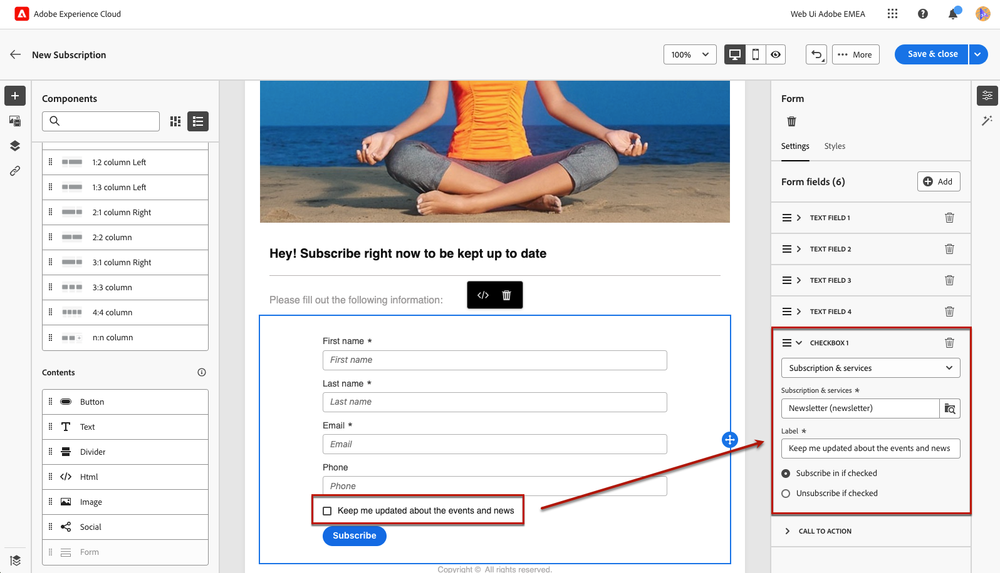
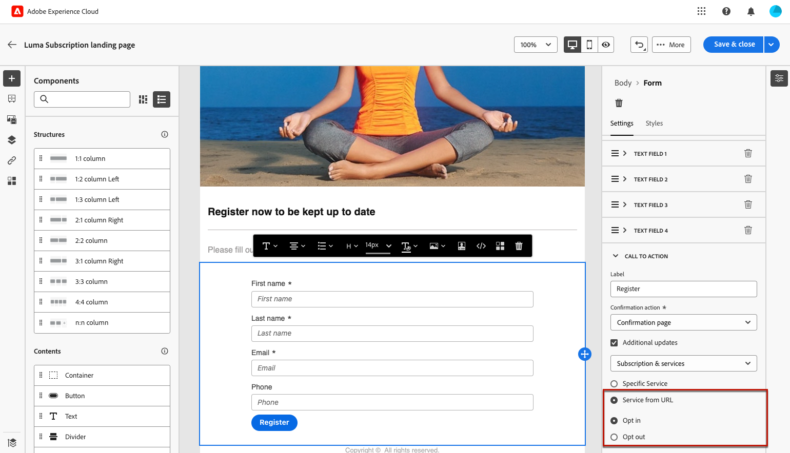
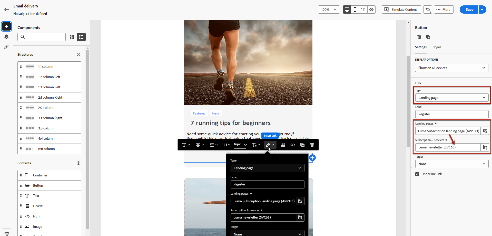

# Paginaspecifieke inhoud definiëren {#lp-content}

>[!CONTEXTUALHELP]
>id="ac_lp_components"
>title="Inhoudscomponenten gebruiken"
>abstract="Inhoudscomponenten zijn lege plaatsaanduidingen voor inhoud die u kunt gebruiken om de lay-out van een bestemmingspagina te maken. Gebruik de formuliercomponent om specifieke inhoud te definiëren waarmee gebruikers hun keuzes kunnen selecteren en verzenden."

>[!CONTEXTUALHELP]
>id="acw_landingpages_primarypage"
>title="De primaire pagina-instellingen definiëren"
>abstract="De primaire pagina wordt onmiddellijk aan gebruikers getoond nadat zij de verbinding aan uw landende pagina, zoals van een e-mail of een website klikken."

U kunt de inhoud van elke pagina van de bestemmingspagina bewerken.

De eerste pagina, die onmiddellijk aan gebruikers wordt getoond nadat zij de verbinding aan uw het landen pagina klikken, is reeds voorgevuld met [ landend pagina-specifieke vormcomponent ](#use-form-component) voor het geselecteerde malplaatje <!-- to enable users to select and submit their choices-->.

De inhoud van de pagina&#39;s **[!UICONTROL Confirmation]**, **[!UICONTROL Error]** en **[!UICONTROL Expiration]** wordt ook vooraf ingevuld. Bewerk deze indien nodig.

U kunt [ stijlen voor uw het landen pagina ](#lp-form-styles) ook bepalen.

De inhoud van de bestemmingspagina verder ontwerpen:

* Gebruik dezelfde componenten als de componenten die worden gebruikt om een e-mailbericht te ontwerpen. [Meer informatie](../email/content-components.md#add-content-components)

* Voeg voorwaardelijke inhoud op dezelfde manier toe aan uw bestemmingspagina&#39;s als voor een e-mail. [Meer informatie](../personalization/conditions.md#condition-condition-builder)

  >[!AVAILABILITY]
  >
  >Dit vermogen is in Beperkte Beschikbaarheid (LA). Het is beperkt tot klanten die **van Adobe Campaign Standard aan Adobe Campaign v8** migreren, en kan niet op een ander milieu worden opgesteld.

## De formuliercomponent gebruiken {#use-form-component}

>[!CONTEXTUALHELP]
>id="ac_lp_formfield"
>title="De velden voor formuliercomponenten instellen"
>abstract="Bepaal hoe de ontvangers hun keuzes vanaf de bestemmingspagina zien en verzenden."

>[!CONTEXTUALHELP]
>id="acw_landingpages_calltoaction"
>title="Wat gebeurt er als u op de knop klikt"
>abstract="Bepaal wat er gebeurt wanneer gebruikers het formulier voor de landingspagina indienen."

Als u specifieke inhoud wilt definiëren waarmee gebruikers hun keuzes vanaf de bestemmingspagina kunnen selecteren en verzenden, bewerkt u de component **[!UICONTROL Form]** . Voer de onderstaande stappen uit.

1. De landende pagina-specifieke **[!UICONTROL Form]** component wordt reeds getoond in het canvas voor het geselecteerde malplaatje.

   >[!NOTE]
   >
   >De component **[!UICONTROL Form]** kan slechts eenmaal op dezelfde pagina worden gebruikt.

1. Selecteer het. Het tabblad **[!UICONTROL Form content]** wordt weergegeven in het rechterpalet, zodat u de verschillende velden van het formulier kunt bewerken.

   {zoomable="yes"} wordt getoond

   >[!NOTE]
   >
   >Schakel op elk gewenst moment over naar het tabblad **[!UICONTROL Styles]** om de stijlen van de inhoud van de formuliercomponent te bewerken. [Meer informatie](#lp-form-styles)

1. Vouw het eerste tekstveld, indien aanwezig, uit of voeg een veld toe met de knop **[!UICONTROL Add]** . Bewerk in de sectie **[!UICONTROL Text field 1]** het veldtype, het databaseveld dat moet worden bijgewerkt, het label en de tekst die in het veld wordt weergegeven voordat gebruikers een waarde invoeren.

   {zoomable="yes"}

1. Schakel indien nodig de optie **[!UICONTROL Make form field mandatory]** in. In dat geval kan de landingspagina alleen worden verzonden als de gebruiker dit veld heeft ingevuld.

   >[!NOTE]
   >
   >Als een verplicht veld niet is ingevuld, wordt een foutbericht weergegeven wanneer de gebruiker de pagina verzendt.

1. Vouw het eventuele selectievakje uit of voeg er een toe met de knop **[!UICONTROL Add]** . Selecteer deze optie als u een service of een veld uit de database wilt bijwerken.

   {zoomable="yes"}

   Als u **[!UICONTROL Subscription & services]** selecteert, selecteer de dienst van a [&#128279;](../audience/manage-services.md) van de lijst, en kies tussen de twee hieronder opties:

   * **[!UICONTROL Subscribe in if checked]**: gebruikers moeten het selectievakje voor toestemming (opt-in) inschakelen.
   * **[!UICONTROL Unsubscribe if checked]**: gebruikers moeten het selectievakje inschakelen om hun toestemming (opt-out) te verwijderen.

   Als u **[!UICONTROL Field]** selecteert, selecteer een gebied van de [ lijst van attributen ](../get-started/attributes.md), en kies tussen de twee hieronder opties:

   * **[!UICONTROL Yes if checked]**.
   * **[!UICONTROL No if checked]**.

1. U kunt zo veel velden verwijderen en toevoegen (zoals tekstvelden, keuzerondjes, selectievakjes, vervolgkeuzelijsten enz.) als u wilt.

1. Als alle velden zijn toegevoegd of bijgewerkt, klikt u op **[!UICONTROL Call to action]** om de bijbehorende sectie uit te vouwen. Hiermee kunt u het gedrag van de knop in de component **[!UICONTROL Form]** definiëren. [ leer hoe ](#define-actions-on-form-submission)

   {zoomable="yes"}

1. Sparen uw inhoud om terug naar de [ het landen paginaeigenschappen ](create-lp.md#create-landing-page) te gaan.

### Handelingen definiëren voor het verzenden van formulieren {#define-actions-on-form-submission}

1. Bepaal wat er gebeurt wanneer u op de knop klikt:

   * **[!UICONTROL Confirmation page]**: De gebruiker wordt standaard omgeleid naar de paginaset **[!UICONTROL Confirmation]** voor de huidige openingspagina.

   * **[!UICONTROL Redirect URL]**: voer de URL in van de pagina waarnaar de gebruikers zijn omgeleid.

   * **[!UICONTROL Landing page]**: selecteer een andere bestemmingspagina waarnaar gebruikers moeten worden omgeleid. Controleer of u de geselecteerde bestemmingspagina dienovereenkomstig configureert.

1. Als u aanvullende updates wilt uitvoeren wanneer u het formulier verzendt, selecteert u **[!UICONTROL Additional updates]** en selecteert u het item dat u wilt bijwerken:
   * De dienst van het abonnement [&#128279;](../audience/manage-services.md) - bepaalt als u binnen of opt uit gebruikers bij het voorleggen van de vorm wilt kiezen. Als u bij het ontwerpen van een e-mailbericht een koppeling van het type **[!UICONTROL Landing page]** naar deze bestemmingspagina definieert, wordt automatisch de geselecteerde service gebruikt. [ leer meer over het opnemen van verbindingen ](../email/message-tracking.md)

     >[!NOTE]
     >
     >Als u verschillende services wilt gebruiken met deze openingspagina, gebruikt u de optie **[!UICONTROL Service from URL]** die hieronder wordt beschreven.

   * Het kanaal - het e-mailadres dat wordt gebruikt bij het invullen van het formulier.
   * Alle kanalen - bij het verzenden van het formulier worden gebruikers op alle kanalen in- of uitgeschakeld (afhankelijk van de geselecteerde sjabloon) naar/van alle communicatie van uw merk.
   * Een veld in de database - selecteer een veld in de lijst met kenmerken en bepaal of het bij het verzenden van het formulier moet worden ingesteld op Waar of Onwaar.

   {zoomable="yes"}

1. Selecteer de optie **[!UICONTROL Service from URL]** als u wilt dat de bestemmingspagina kan worden gebruikt voor meerdere services, waardoor deze dynamisch wordt. Definieer of u gebruikers wilt aanmelden of afmelden bij het verzenden van het formulier.

   >[!AVAILABILITY]
   >
   >Dit vermogen is in Beperkte Beschikbaarheid (LA). Het is beperkt tot klanten die **van Adobe Campaign Standard aan Adobe Campaign v8** migreren, en kan niet op een ander milieu worden opgesteld.

   {zoomable="yes"}

   Als u tijdens het ontwerpen van een e-mailbericht een koppeling van het type **[!UICONTROL Landing page]** naar deze bestemmingspagina definieert, kunt u een willekeurige service in de lijst selecteren. Vervolgens kunt u andere services selecteren wanneer u andere koppelingen naar deze bestemmingspagina definieert. [ leer meer over het opnemen van verbindingen ](../email/message-tracking.md)

   {zoomable="yes"}

1. Verzend een bericht op de verzending van de bestemmingspagina. [ leer meer hier ](#lp-message)

### Een bericht verzenden na verzending {#lp-message}

>[!AVAILABILITY]
>
>Dit vermogen is in Beperkte Beschikbaarheid (LA). Het is beperkt tot klanten die **van Adobe Campaign Standard aan Adobe Campaign v8** migreren, en kan niet op een ander milieu worden opgesteld.

Voer de volgende stappen uit als u automatisch een bevestigingsbericht wilt verzenden nadat u een landingspagina hebt verzonden:

1. Schakel in de sectie **[!UICONTROL CALL TO ACTION]** de optie **[!UICONTROL Send confirmation email]** in.

1. In de bijbehorende drop-down lijst, kies het transactionele berichtmalplaatje dat moet worden verzonden.

{zoomable="yes"}

## Landingspagina-formulierstijlen definiëren {#lp-form-styles}

1. Als u de stijlen van de inhoud van een formuliercomponent wilt wijzigen, schakelt u op elk gewenst moment over naar het tabblad **[!UICONTROL Styles]** .

1. De sectie **[!UICONTROL Text field]** wordt standaard uitgevouwen. Hiermee kunt u de weergave van de tekstvelden bewerken, zoals het lettertype van het label, de positie van het label, de achtergrondkleur van het veld of de veldrand.

   {zoomable="yes"}

1. Vouw de sectie **[!UICONTROL Checkbox]** uit om de weergave van de selectievakjes en de bijbehorende tekst te definiëren. Pas bijvoorbeeld de lettertypefamilie en -grootte of de randkleur van het selectievakje aan.

   {zoomable="yes"}

1. Vouw alle andere secties die overeenkomen met andere velden die u aan het formulier hebt toegevoegd (keuzerondje, vervolgkeuzelijst, datum en tijd, enz.) uit en bewerk deze.

1. Vouw de sectie **[!UICONTROL Call to action]** uit om de weergave van de knop in het deelformulier te wijzigen. Wijzig bijvoorbeeld het lettertype, voeg een rand toe, bewerk de labelkleur als u de cursor plaatst of pas de uitlijning van de knop aan.

   {zoomable="yes"}

   Gebruik de knop **[!UICONTROL Simulate content]** om een voorbeeld van uw instellingen weer te geven, zoals de kleur van knoplabels bij aanwijzen. [Meer informatie](create-lp.md#test-landing-page)

1. Sla uw wijzigingen op.