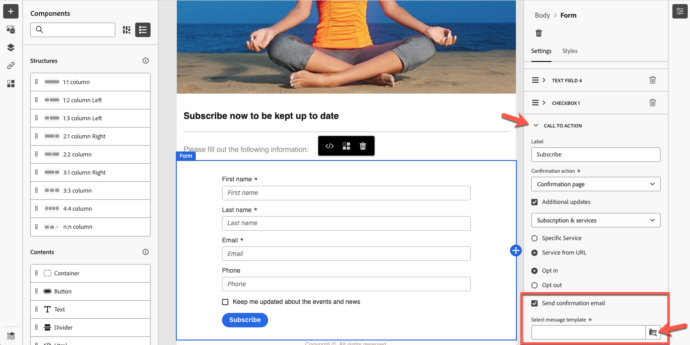

# Paginaspecifieke inhoud definiëren {#lp-content}

>[!CONTEXTUALHELP]
>id="ac_lp_components"
>title="Inhoudscomponenten gebruiken"
>abstract="Inhoudscomponenten zijn lege plaatsaanduidingen voor inhoud die u kunt gebruiken om de lay-out van een bestemmingspagina te maken. Gebruik de formuliercomponent om specifieke inhoud te definiëren waarmee gebruikers hun keuzes kunnen selecteren en verzenden."

>[!CONTEXTUALHELP]
>id="acw_landingpages_primarypage"
>title="De primaire pagina-instellingen definiëren"
>abstract="De primaire pagina wordt direct aan de gebruikers getoond nadat zij de verbinding aan uw landende pagina, zoals van een e-mail of een website klikken."

U kunt de inhoud van elke pagina van de bestemmingspagina bewerken.

De eerste pagina, die onmiddellijk aan de gebruikers wordt getoond nadat zij de verbinding aan uw het landen pagina klikken, is reeds voorgevuld met [ landend pagina-specifieke vormcomponent ](#use-form-component) voor het geselecteerde malplaatje <!-- to enable users to select and submit their choices-->.

De inhoud van de pagina&#39;s **[!UICONTROL Confirmation]**, **[!UICONTROL Error]** en **[!UICONTROL Expiration]** wordt ook vooraf ingevuld. Bewerk deze indien nodig.

U kunt [ stijlen voor uw het landen pagina ](#lp-form-styles) ook bepalen.

De inhoud van de bestemmingspagina verder ontwerpen:

* U kunt dezelfde componenten gebruiken als de componenten waarmee een e-mailbericht is gemaakt. [Meer informatie](../email/content-components.md#add-content-components)

* U kunt voorwaardelijke inhoud toevoegen aan uw bestemmingspagina&#39;s, op dezelfde manier als voor een e-mail. [Meer informatie](../personalization/conditions.md#condition-condition-builder)

  >[!AVAILABILITY]
  >
  >Dit vermogen is in Beperkte Beschikbaarheid (LA). Het is beperkt tot klanten die **van Adobe Campaign Standard aan Adobe Campaign v8** migreren, en kan niet op een ander milieu worden opgesteld.

## De formuliercomponent gebruiken {#use-form-component}

>[!CONTEXTUALHELP]
>id="ac_lp_formfield"
>title="De velden voor formuliercomponenten instellen"
>abstract="Bepaal hoe de ontvangers hun keuzes vanaf de bestemmingspagina zien en verzenden."

>[!CONTEXTUALHELP]
>id="acw_landingpages_calltoaction"
>title="Wat gebeurt er als u op de knop klikt"
>abstract="Bepaal wat er gebeurt wanneer gebruikers het formulier voor de landingspagina indienen."

Als u specifieke inhoud wilt definiëren waarmee gebruikers hun keuzes vanaf de bestemmingspagina kunnen selecteren en verzenden, bewerkt u de component **[!UICONTROL Form]** . Volg de onderstaande stappen om dit te doen.

1. De landende pagina-specifieke **[!UICONTROL Form]** component wordt reeds getoond in het canvas voor het geselecteerde malplaatje.

   >[!NOTE]
   >
   >De component **[!UICONTROL Form]** kan slechts eenmaal op dezelfde pagina worden gebruikt.

1. Selecteer het. Het tabblad **[!UICONTROL Form content]** wordt weergegeven in het rechterpalet, zodat u de verschillende velden van het formulier kunt bewerken.

   {zoomable="yes"}

   >[!NOTE]
   >
   >Schakel op elk gewenst moment over naar het tabblad **[!UICONTROL Styles]** om de stijlen van de inhoud van de formuliercomponent te bewerken. [Meer informatie](#lp-form-styles)

1. Vouw het eerste tekstveld, indien aanwezig, uit of voeg een veld toe met de knop **[!UICONTROL Add]** . Vanuit de sectie **[!UICONTROL Text field 1]** kunt u het veldtype, het databaseveld dat moet worden bijgewerkt, het label en de tekst bewerken die in het veld wordt weergegeven voordat gebruikers een waarde invoeren.

   {zoomable="yes"}

1. Schakel indien nodig de optie **[!UICONTROL Make form field mandatory]** in. In dat geval kan de landingspagina alleen worden verzonden als de gebruiker dit veld heeft ingevuld.

   >[!NOTE]
   >
   >Als een verplicht veld niet is ingevuld, wordt een foutbericht weergegeven wanneer de gebruiker de pagina verzendt.

1. Vouw het eventuele selectievakje uit of voeg er een toe met de knop **[!UICONTROL Add]** . Selecteer deze optie als u een service of een veld uit de database wilt bijwerken.

   {zoomable="yes"}

   Als u **[!UICONTROL Subscription & services]** selecteert, selecteer de dienst van a  van de lijst, en kies tussen de twee hieronder opties:

   * **[!UICONTROL Subscribe in if checked]**: gebruikers moeten het selectievakje voor toestemming (opt-in) inschakelen.
   * **[!UICONTROL Unsubscribe if checked]**: gebruikers moeten het selectievakje inschakelen om hun toestemming (opt-out) te verwijderen.

   Als u **[!UICONTROL Field]** selecteert, selecteert u een veld in de lijst met kenmerken en kiest u een van de twee onderstaande opties:

   * **[!UICONTROL Yes if checked]**.<!--TBC-->

   * **[!UICONTROL No if checked]**.<!--TBC-->

1. U kunt zoveel velden verwijderen en toevoegen (zoals tekstvelden, keuzerondjes, selectievakjes, vervolgkeuzelijst, enzovoort) indien nodig.

1. Als alle velden zijn toegevoegd of bijgewerkt, klikt u op **[!UICONTROL Call to action]** om de bijbehorende sectie uit te vouwen. Hiermee kunt u het gedrag van de knop in de component **[!UICONTROL Form]** definiëren. [ leer hoe ](#define-actions-on-form-submission)

   {zoomable="yes"}

1. Sparen uw inhoud om terug naar de [ het landen paginaeigenschappen ](create-lp.md#create-landing-page) te gaan.

### Handelingen definiëren voor het verzenden van formulieren {#define-actions-on-form-submission}

1. Bepaal wat er gebeurt wanneer u op de knop klikt:

   * **[!UICONTROL Confirmation page]**: De gebruiker wordt standaard omgeleid naar de paginaset **[!UICONTROL Confirmation]** voor de huidige openingspagina.

   * **[!UICONTROL Redirect URL]**: voer de URL in van de pagina waarnaar de gebruikers worden omgeleid.

   * **[!UICONTROL Landing page]**: U kunt een andere bestemmingspagina selecteren waarnaar gebruikers moeten worden omgeleid. Controleer of u de geselecteerde bestemmingspagina dienovereenkomstig configureert.

1. Als u aanvullende updates wilt uitvoeren wanneer u het formulier verzendt, selecteert u **[!UICONTROL Additional updates]** en selecteert u het item dat u wilt bijwerken:
   * De dienst van het abonnement  - in dat geval, bepaal als u binnen of opt uit gebruikers bij het voorleggen van de vorm wilt kiezen. Als u bij het ontwerpen van een e-mailbericht een koppeling van het type **[!UICONTROL Landing page]** naar deze bestemmingspagina definieert, wordt de geselecteerde service automatisch gebruikt. [ leer meer bij het opnemen van verbindingen ](../email/message-tracking.md)

     >[!NOTE]
     >
     >Als u verschillende services wilt gebruiken met deze openingspagina, gebruikt u de optie **[!UICONTROL Service from URL]** die hieronder wordt beschreven.

   * Het kanaal - het e-mailadres dat wordt gebruikt bij het invullen van het formulier.
   * Alle kanalen - bij het verzenden van het formulier worden gebruikers (afhankelijk van de geselecteerde sjabloon) in- of uitgeschakeld voor alle communicatie van uw merk op alle kanalen.
   * Een veld in de database - selecteer een veld in de lijst met kenmerken en bepaal of het bij het verzenden van het formulier moet worden ingesteld op Waar of Onwaar.

   {zoomable="yes"}

1. Selecteer de optie **[!UICONTROL Service from URL]** als u wilt dat de bestemmingspagina kan worden gebruikt voor meerdere services, waardoor deze dynamisch wordt. Definieer of u gebruikers wilt aanmelden of afmelden bij het verzenden van het formulier.

   >[!AVAILABILITY]
   >
   >Dit vermogen is in Beperkte Beschikbaarheid (LA). Het is beperkt tot klanten die **van Adobe Campaign Standard aan Adobe Campaign v8** migreren, en kan niet op een ander milieu worden opgesteld.

   {zoomable="yes"}

   Als u tijdens het ontwerpen van een e-mailbericht een koppeling van het type **[!UICONTROL Landing page]** naar deze bestemmingspagina definieert, kunt u een willekeurige service in de lijst selecteren. Vervolgens kunt u andere services selecteren wanneer u andere koppelingen naar deze bestemmingspagina definieert. [ leer meer bij het opnemen van verbindingen ](../email/message-tracking.md)

   {zoomable="yes"}

1. U kunt een bericht verzenden bij het verzenden van de bestemmingspagina. [ leer meer hier ](#lp-message)

### Een bericht verzenden na verzending {#lp-message}

>[!AVAILABILITY]
>
>Dit vermogen is in Beperkte Beschikbaarheid (LA). Het is beperkt tot klanten die **van Adobe Campaign Standard aan Adobe Campaign v8** migreren, en kan niet op een ander milieu worden opgesteld.

Voer de volgende stappen uit als u automatisch een bevestigingsbericht wilt verzenden nadat u een landingspagina hebt verzonden:

1. Schakel in de sectie **[!UICONTROL CALL TO ACTION]** de optie **[!UICONTROL Send confirmation email]** in.

1. In de bijbehorende drop-down lijst, kies het transactionele berichtmalplaatje dat moet worden verzonden.

{zoomable="yes"}

## Landingspagina-formulierstijlen definiëren {#lp-form-styles}

1. Als u de stijlen van de inhoud van een formuliercomponent wilt wijzigen, schakelt u op elk gewenst moment over naar het tabblad **[!UICONTROL Styles]** .

1. De sectie **[!UICONTROL Text field]** wordt standaard uitgevouwen. Hiermee kunt u de weergave van de tekstvelden bewerken, zoals het lettertype van het label, de positie van het label, de achtergrondkleur van het veld of de veldrand.

   {zoomable="yes"}

1. Vouw de sectie **[!UICONTROL Checkbox]** uit om de weergave van de selectievakjes en de bijbehorende tekst te definiëren. U kunt bijvoorbeeld de lettertypefamilie en -grootte of de randkleur van het selectievakje aanpassen.

   {zoomable="yes"}

1. Andere secties uitbreiden en bewerken die overeenkomen met andere velden die u hebt toegevoegd (keuzerondje, vervolgkeuzelijst, datum en tijd, enz.) naar uw formulier.

1. Vouw de sectie **[!UICONTROL Call to action]** uit om de weergave van de knop in het deelformulier te wijzigen. U kunt bijvoorbeeld het lettertype wijzigen, een rand toevoegen, de labelkleur bewerken op de muisaanwijzer of de uitlijning van de knop aanpassen.

   {zoomable="yes"}

   Met de knop **[!UICONTROL Simulate content]** kunt u een voorbeeld van uw instellingen bekijken, zoals de kleur van knoplabels op de muisaanwijzer. [Meer informatie](create-lp.md#test-landing-page)

1. Sla uw wijzigingen op.
