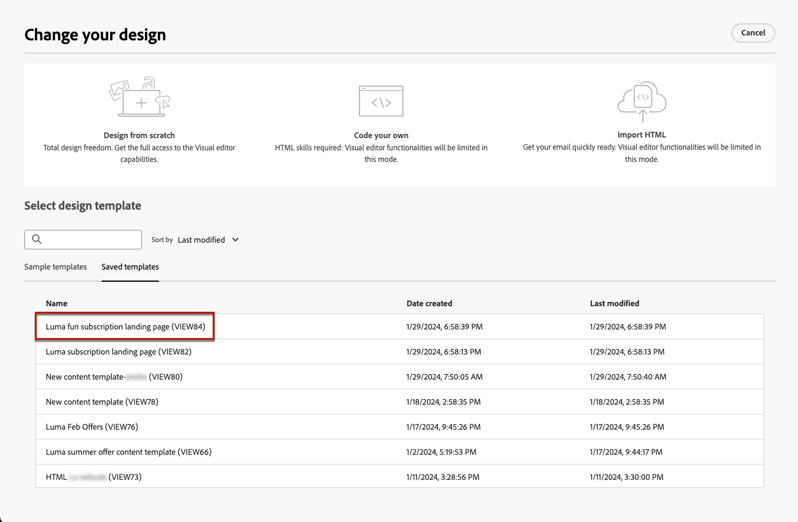

# Werken met sjablonen voor het plaatsen van pagina-inhoud {#work-with-templates}

## Een pagina opslaan als sjabloon {#save-as-template}

Zodra u uw [&#x200B; het landen pagina inhoud &#x200B;](lp-content.md) ontwerpt, kunt u het voor toekomstig hergebruik bewaren. Volg onderstaande stappen om een pagina als sjabloon op te slaan.

1. Klik op de knop **[!UICONTROL More]** rechtsboven in het scherm.

1. Selecteer **[!UICONTROL Save as content template]** in de vervolgkeuzelijst.

   {zoomable="yes"}

1. Voeg een naam voor deze sjabloon toe.

1. Klik op **[!UICONTROL Save]**.

U kunt deze sjabloon gebruiken om uw inhoud samen te stellen wanneer u de volgende keer een bestemmingspagina maakt. Leer hoe in de [&#x200B; sectie &#x200B;](#use-saved-template) hieronder.

{zoomable="yes"}

## Een opgeslagen sjabloon gebruiken {#use-saved-template}

<!--Not for GA?-->

1. Wanneer u de inhoud van de openingspagina bewerkt, klikt u op de knop **[!UICONTROL More]** en selecteert u **[!UICONTROL Change your design]** .

   {zoomable="yes"}

1. Bevestig uw keuze.

   >[!NOTE]
   >
   >Met deze actie verwijdert en vervangt u de huidige inhoud door de inhoud van de nieuwe sjabloon.

1. De lijst met alle eerder opgeslagen sjablonen wordt weergegeven op het tabblad **[!UICONTROL Saved templates]** . U kunt ze **[!UICONTROL By name]** , **[!UICONTROL Last modified]** en **[!UICONTROL Last created]** sorteren.

   {zoomable="yes"}

1. Selecteer de gewenste sjabloon in de lijst. Als deze optie is geselecteerd, navigeert u tussen alle opgeslagen sjablonen met de rechter- en linkerpijltoets.

   {zoomable="yes"}

1. Klik op **[!UICONTROL Use this template]**.

1. Bewerk de inhoud naar wens met de ontwerper van de bestemmingspagina.

<!--Primary page templates and subpage templates are managed separately, meaning that you cannot use a primary page template to create a subpage, and vice versa. TBC in Web user interface-->